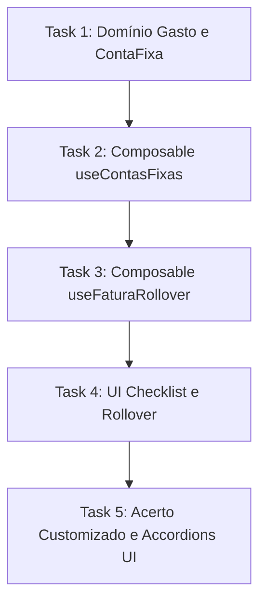

# DIVI Versão Sênior v18 (Fases 2-5) Implementation Plan

> **For agentic workers:** REQUIRED SUB-SKILL: Use superpowers:subagent-driven-development (recommended) or superpowers:executing-plans to implement this plan task-by-task. Steps use checkbox (`- [ ]`) syntax for tracking.

**Goal:** Implement the checklist of monthly recurring bills, month locking with transactional rollover, custom settlements (PIX, cash, mutual), and UI accordion lists with projection of future installments.

**Architecture:** Extend the `Gasto` domain model with nullable foreign keys and metadata fields. Build reactive composables (`useContasFixas`, `useFaturaRollover`) using LocalStorage for persistence. Apply TDD via Vitest before crafting high-fidelity Vue 3 components matching the design system.

**Tech Stack:** Vue 3, Composition API, TypeScript, Vitest, Tailwind/Vanilla CSS tokens.

---

## Task Map



---

### Task 1: Extensões do Domínio `Gasto` e Criação de `ContaFixa`

**Files:**
- Modify: `src/modules/ledger/core/domain/Gasto.ts`
- Modify: `src/modules/ledger/core/domain/Gasto.test.ts`
- Create: `src/modules/ledger/core/domain/ContaFixa.ts`

- [ ] **Step 1: Escrever teste falho em `Gasto.test.ts`**
  Adicione o teste no final do arquivo `src/modules/ledger/core/domain/Gasto.test.ts`:
  ```typescript
  it('deve aceitar e preservar os novos campos sênior v18', () => {
    const total = Dinheiro.deCentavos(10000)
    const divisoes = [new DivisaoDeGasto('m1', Dinheiro.deCentavos(10000))]
    const gasto = new Gasto({
      id: 'g_senior',
      faturaId: 'f1',
      descricao: 'Talão: Aluguel',
      valorTotal: total,
      compradorId: 'm1',
      divisoes,
      recurringBillId: 'aluguel',
      isSettlement: true,
      settlementDetails: {
        fromMemberId: 'm2',
        toMemberId: 'm1',
        method: 'pix'
      }
    })
    expect(gasto.recurringBillId).toBe('aluguel')
    expect(gasto.isSettlement).toBe(true)
    expect(gasto.settlementDetails).toEqual({
      fromMemberId: 'm2',
      toMemberId: 'm1',
      method: 'pix'
    })
  })
  ```

- [ ] **Step 2: Executar teste e verificar falha**
  Execute: `npx vitest run src/modules/ledger/core/domain/Gasto.test.ts`
  Esperado: Falha de compilação/tipo porque os campos não existem em `GastoProps` ou `Gasto`.

- [ ] **Step 3: Implementar as extensões no Domínio**
  Modifique `src/modules/ledger/core/domain/Gasto.ts` para adicionar os campos em `GastoProps` e na classe `Gasto`:
  ```typescript
  export interface GastoProps {
    id: string
    faturaId: string
    descricao: string
    valorTotal: Dinheiro
    compradorId: string
    divisoes: ReadonlyArray<DivisaoDeGasto>
    installments?: number
    isLoan?: boolean
    borrowerId?: string | null

    // --- EXTENSÕES SENIOR V18 ---
    recurringBillId?: string | null
    isSettlement?: boolean
    settlementDetails?: {
      fromMemberId: string
      toMemberId: string
      method: 'pix' | 'cash' | 'mutual'
    } | null
  }

  export class Gasto {
    // ... propriedades existentes
    public readonly installments: number
    public readonly isLoan: boolean
    public readonly borrowerId: string | null

    // --- EXTENSÕES SENIOR V18 ---
    public readonly recurringBillId: string | null
    public readonly isSettlement: boolean
    public readonly settlementDetails: {
      fromMemberId: string
      toMemberId: string
      method: 'pix' | 'cash' | 'mutual'
    } | null

    constructor(props: GastoProps) {
      // ... verificações existentes
      this.id = props.id
      this.faturaId = props.faturaId
      this.descricao = props.descricao
      this.valorTotal = props.valorTotal
      this.compradorId = props.compradorId
      this.divisoes = props.divisoes
      this.installments = props.installments || 1
      this.isLoan = props.isLoan || false
      this.borrowerId = props.borrowerId || null

      // Inicialização dos novos campos
      this.recurringBillId = props.recurringBillId || null
      this.isSettlement = props.isSettlement || false
      this.settlementDetails = props.settlementDetails || null
    }
  }
  ```

  Crie o arquivo de definição de tipo `src/modules/ledger/core/domain/ContaFixa.ts`:
  ```typescript
  export interface ContaFixa {
    id: string
    name: string
    icon: string
    fixedValue: number | null
    defaultSplit: string[]
  }
  ```

- [ ] **Step 4: Executar teste e verificar sucesso**
  Execute: `npx vitest run src/modules/ledger/core/domain/Gasto.test.ts`
  Esperado: PASS

- [ ] **Step 5: Commitar mudanças**
  Execute:
  ```bash
  git add src/modules/ledger/core/domain/Gasto.ts src/modules/ledger/core/domain/Gasto.test.ts src/modules/ledger/core/domain/ContaFixa.ts
  git commit -m "feat: extend Gasto domain model and add ContaFixa type for senior v18"
  ```

---

### Task 2: Composable e Lógica de Contas Fixas (`useContasFixas`)

**Files:**
- Create: `src/modules/ledger/composables/useContasFixas.ts`
- Create: `src/modules/ledger/composables/useContasFixas.test.ts`

- [ ] **Step 1: Escrever testes unitários em `useContasFixas.test.ts`**
  Crie o arquivo de testes `src/modules/ledger/composables/useContasFixas.test.ts`:
  ```typescript
  import { describe, it, expect, beforeEach } from 'vitest'
  import { useContasFixas } from './useContasFixas'
  import { Gasto } from '../core/domain/Gasto'
  import { Dinheiro } from '../../../shared/primitives/Dinheiro'
  import { DivisaoDeGasto } from '../core/domain/DivisaoDeGasto'

  describe('useContasFixas', () => {
    beforeEach(() => {
      localStorage.clear()
    })

    it('deve carregar contas fixas padrao ao inicializar', () => {
      const { contasFixas } = useContasFixas()
      expect(contasFixas.value.length).toBe(5)
      expect(contasFixas.value[0].id).toBe('aluguel')
    })

    it('deve cadastrar, atualizar e remover um template customizado', () => {
      const { contasFixas, salvarContaFixa, excluirContaFixa } = useContasFixas()
      
      salvarContaFixa({
        id: 'new_bill',
        name: 'Academia',
        icon: '💪',
        fixedValue: 100,
        defaultSplit: ['luciana']
      })

      expect(contasFixas.value.some(c => c.id === 'new_bill')).toBe(true)

      salvarContaFixa({
        id: 'new_bill',
        name: 'Academia VIP',
        icon: '💪',
        fixedValue: 150,
        defaultSplit: ['luciana']
      })
      expect(contasFixas.value.find(c => c.id === 'new_bill')?.name).toBe('Academia VIP')

      excluirContaFixa('new_bill')
      expect(contasFixas.value.some(c => c.id === 'new_bill')).toBe(false)
    })

    it('deve calcular dinamicamente o status de pagamento baseado em gastos reais', () => {
      const { verificarStatusPaga } = useContasFixas()
      
      const contaAluguel = {
        id: 'aluguel',
        name: 'Aluguel',
        icon: '🔑',
        fixedValue: 1500,
        defaultSplit: ['luciana', 'luan', 'joao']
      }

      // Sem gastos associados
      expect(verificarStatusPaga(contaAluguel, [])).toBeNull()

      // Com gasto associado
      const gastoAluguel = new Gasto({
        id: 'g1',
        faturaId: 'f1',
        descricao: 'Talão: Aluguel',
        valorTotal: Dinheiro.deReais(1500),
        compradorId: 'luciana',
        divisoes: [new DivisaoDeGasto('luciana', Dinheiro.deReais(1500))],
        recurringBillId: 'aluguel'
      })

      const status = verificarStatusPaga(contaAluguel, [gastoAluguel])
      expect(status).not.toBeNull()
      expect(status?.valorReal).toBe(1500)
      expect(status?.pagoPor).toBe('luciana')
    })
  })
  ```

- [ ] **Step 2: Executar teste e verificar falha**
  Execute: `npx vitest run src/modules/ledger/composables/useContasFixas.test.ts`
  Esperado: FAIL (módulo inexistente)

- [ ] **Step 3: Implementar o composable `useContasFixas.ts`**
  Crie `src/modules/ledger/composables/useContasFixas.ts`:
  ```typescript
  import { ref, computed } from 'vue'
  import { ContaFixa } from '../core/domain/ContaFixa'
  import { Gasto } from '../core/domain/Gasto'
  import { DivisaoDeGasto } from '../core/domain/DivisaoDeGasto'
  import { Dinheiro } from '../../../shared/primitives/Dinheiro'
  import { LocalStorageGastoRepository } from '../adapters/LocalStorageGastoRepository'

  const STORAGE_KEY = 'divi_contas_fixas_templates_v18'
  const gastoRepo = new LocalStorageGastoRepository()

  const CONTAS_PADRAO: ContaFixa[] = [
    { id: 'aluguel', name: 'Aluguel da Casa', icon: '🔑', fixedValue: 1500.00, defaultSplit: ['luciana', 'luan', 'joao'] },
    { id: 'luz', name: 'Energia (Luz)', icon: '💡', fixedValue: null, defaultSplit: ['luciana', 'luan', 'joao'] },
    { id: 'agua', name: 'Água', icon: '💧', fixedValue: null, defaultSplit: ['luciana', 'luan', 'joao'] },
    { id: 'internet', name: 'Internet', icon: '🌐', fixedValue: 120.00, defaultSplit: ['luciana', 'luan', 'joao'] },
    { id: 'cachorro', name: 'Cuidados Cachorro', icon: '🐶', fixedValue: null, defaultSplit: ['luciana', 'luan'] }
  ]

  export function useContasFixas() {
    const contasFixas = ref<ContaFixa[]>([])

    const carregarTemplates = () => {
      const saved = localStorage.getItem(STORAGE_KEY)
      if (saved) {
        try {
          contasFixas.value = JSON.parse(saved)
        } catch (e) {
          contasFixas.value = [...CONTAS_PADRAO]
        }
      } else {
        contasFixas.value = [...CONTAS_PADRAO]
        salvarNoStorage()
      }
    }

    const salvarNoStorage = () => {
      localStorage.setItem(STORAGE_KEY, JSON.stringify(contasFixas.value))
    }

    const salvarContaFixa = (template: ContaFixa) => {
      const idx = contasFixas.value.findIndex(c => c.id === template.id)
      if (idx > -1) {
        contasFixas.value[idx] = template
      } else {
        contasFixas.value.push(template)
      }
      salvarNoStorage()
    }

    const excluirContaFixa = (id: string) => {
      contasFixas.value = contasFixas.value.filter(c => c.id !== id)
      salvarNoStorage()
    }

    const verificarStatusPaga = (conta: ContaFixa, gastos: Gasto[]) => {
      const gasto = gastos.find(g => g.recurringBillId === conta.id)
      if (!gasto) return null
      return {
        valorReal: gasto.valorTotal.reais,
        pagoPor: gasto.compradorId
      }
    }

    const lancarGastoContaFixa = async (
      faturaId: string,
      conta: ContaFixa,
      valorTotal: number,
      compradorId: string,
      participantes: string[]
    ) => {
      const total = Dinheiro.deReais(valorTotal)
      const partes = total.distribuir(participantes.length)
      const divisoes = participantes.map((id, idx) => new DivisaoDeGasto(id, partes[idx]))

      const novoGasto = new Gasto({
        id: crypto.randomUUID(),
        faturaId,
        descricao: `Talão: ${conta.name}`,
        valorTotal: total,
        compradorId,
        divisoes,
        recurringBillId: conta.id,
        installments: 1,
        isLoan: false
      })

      await gastoRepo.salvar(novoGasto)
    }

    carregarTemplates()

    return {
      contasFixas,
      salvarContaFixa,
      excluirContaFixa,
      verificarStatusPaga,
      lancarGastoContaFixa
    }
  }
  ```

- [ ] **Step 4: Executar teste e verificar sucesso**
  Execute: `npx vitest run src/modules/ledger/composables/useContasFixas.test.ts`
  Esperado: PASS

- [ ] **Step 5: Commitar mudanças**
  Execute:
  ```bash
  git add src/modules/ledger/composables/useContasFixas.ts src/modules/ledger/composables/useContasFixas.test.ts
  git commit -m "feat: add useContasFixas composable and tests for monthly checklist logic"
  ```

---

### Task 3: Trancamento e Virada de Mês (Rollover)

**Files:**
- Create: `src/modules/ledger/composables/useFaturaRollover.ts`
- Create: `src/modules/ledger/composables/useFaturaRollover.test.ts`

- [ ] **Step 1: Escrever testes unitários em `useFaturaRollover.test.ts`**
  Crie o arquivo de testes `src/modules/ledger/composables/useFaturaRollover.test.ts`:
  ```typescript
  import { describe, it, expect, beforeEach } from 'vitest'
  import { useFaturaRollover } from './useFaturaRollover'
  import { Gasto } from '../core/domain/Gasto'
  import { Dinheiro } from '../../../shared/primitives/Dinheiro'
  import { DivisaoDeGasto } from '../core/domain/DivisaoDeGasto'

  describe('useFaturaRollover', () => {
    beforeEach(() => {
      localStorage.clear()
    })

    it('deve decrementar parcelamentos ativos corretamente', () => {
      const { processarRolloverParcelas } = useFaturaRollover()
      
      const gastoParcelado = new Gasto({
        id: 'gp1',
        faturaId: 'fat_velha',
        descricao: 'Geladeira',
        valorTotal: Dinheiro.deReais(300),
        compradorId: 'luan',
        divisoes: [new DivisaoDeGasto('luan', Dinheiro.deReais(300))],
        installments: 3
      })

      const gastoFinal = new Gasto({
        id: 'gp2',
        faturaId: 'fat_velha',
        descricao: 'Hamburguer',
        valorTotal: Dinheiro.deReais(50),
        compradorId: 'luan',
        divisoes: [new DivisaoDeGasto('luan', Dinheiro.deReais(50))],
        installments: 1
      })

      const novosGastos = processarRolloverParcelas('fat_nova', [gastoParcelado, gastoFinal])
      
      expect(novosGastos.length).toBe(1)
      expect(novosGastos[0].installments).toBe(2) // Decrementou!
      expect(novosGastos[0].faturaId).toBe('fat_nova')
      expect(novosGastos[0].descricao).toBe('Geladeira')
    })

    it('deve gerar transacao de saldo inicial por netting de saldos finais', () => {
      const { gerarTransacoesNettingSaldoInicial } = useFaturaRollover()

      // Luciana com saldo credor (+R$ 100,00), Luan com saldo devedor (-R$ 100,00)
      const saldos = {
        luciana: 100.00,
        luan: -100.00,
        joao: 0.00
      }

      const carryovers = gerarTransacoesNettingSaldoInicial('fat_nova', 'Maio 2026', saldos)
      
      expect(carryovers.length).toBe(1)
      expect(carryovers[0].valorTotal.reais).toBe(100)
      expect(carryovers[0].compradorId).toBe('luciana') // Credor recebe
      expect(carryovers[0].divisoes.length).toBe(1)
      expect(carryovers[0].divisoes[0].membroId).toBe('luan') // Devedor paga 100%
      expect(carryovers[0].isSettlement).toBe(true)
      expect(carryovers[0].descricao).toBe('Saldo Inicial Pendente (Maio 2026)')
    })
  })
  ```

- [ ] **Step 2: Executar teste e verificar falha**
  Execute: `npx vitest run src/modules/ledger/composables/useFaturaRollover.test.ts`
  Esperado: FAIL (módulo inexistente)

- [ ] **Step 3: Implementar o composable `useFaturaRollover.ts`**
  Crie `src/modules/ledger/composables/useFaturaRollover.ts`:
  ```typescript
  import { ref } from 'vue'
  import { Gasto } from '../core/domain/Gasto'
  import { DivisaoDeGasto } from '../core/domain/DivisaoDeGasto'
  import { Dinheiro } from '../../../shared/primitives/Dinheiro'

  export function useFaturaRollover() {
    const isMonthLocked = ref(false)

    const processarRolloverParcelas = (novaFaturaId: string, gastosAnteriores: Gasto[]): Gasto[] => {
      return gastosAnteriores
        .filter(g => g.installments > 1)
        .map(g => {
          return new Gasto({
            id: g.id, // Mantém ID de origem da compra parcelada
            faturaId: novaFaturaId,
            descricao: g.descricao,
            valorTotal: g.valorTotal,
            compradorId: g.compradorId,
            divisoes: [...g.divisoes],
            installments: g.installments - 1, // Decrementa parcela
            isLoan: g.isLoan,
            borrowerId: g.borrowerId,
            recurringBillId: g.recurringBillId
          })
        })
    }

    const gerarTransacoesNettingSaldoInicial = (
      novaFaturaId: string,
      nomePeriodoAnterior: string,
      saldosAnteriores: Record<string, number>
    ): Gasto[] => {
      const creditors: { id: string; val: number }[] = []
      const debtors: { id: string; val: number }[] = []

      for (const mId in saldosAnteriores) {
        const val = saldosAnteriores[mId]
        if (val > 0.005) {
          creditors.push({ id: mId, val: val })
        } else if (val < -0.005) {
          debtors.push({ id: mId, val: -val })
        }
      }

      creditors.sort((a, b) => b.val - a.val)
      debtors.sort((a, b) => b.val - a.val)

      const carryovers: Gasto[] = []
      let cIdx = 0
      let dIdx = 0

      while (cIdx < creditors.length && dIdx < debtors.length) {
        const creditor = creditors[cIdx]
        const debtor = debtors[dIdx]
        const amount = Math.min(creditor.val, debtor.val)

        if (amount > 0.005) {
          const total = Dinheiro.deReais(amount)
          carryovers.push(new Gasto({
            id: `carry_${Date.now()}_${Math.random().toString(36).substring(2, 7)}`,
            faturaId: novaFaturaId,
            descricao: `Saldo Inicial Pendente (${nomePeriodoAnterior})`,
            valorTotal: total,
            compradorId: creditor.id, // O credor "paga" para constar a receber
            divisoes: [new DivisaoDeGasto(debtor.id, total)], // O devedor assume 100%
            installments: 1,
            isSettlement: true
          }))
        }

        creditor.val -= amount
        debtor.val -= amount

        if (creditor.val < 0.005) cIdx++
        if (debtor.val < 0.005) dIdx++
      }

      return carryovers
    }

    return {
      isMonthLocked,
      processarRolloverParcelas,
      gerarTransacoesNettingSaldoInicial
    }
  }
  ```

- [ ] **Step 4: Executar teste e verificar sucesso**
  Execute: `npx vitest run src/modules/ledger/composables/useFaturaRollover.test.ts`
  Esperado: PASS

- [ ] **Step 5: Commitar mudanças**
  Execute:
  ```bash
  git add src/modules/ledger/composables/useFaturaRollover.ts src/modules/ledger/composables/useFaturaRollover.test.ts
  git commit -m "feat: add useFaturaRollover composable and tests for monthly rollover netting math"
  ```

---

### Task 4: UI do Checklist de Contas Fixas e Rollover

**Files:**
- Create: `src/components/ledger/ContasFixasPanel.vue`
- Create: `src/components/ledger/PopupLancarContaFixa.vue`
- Create: `src/components/ledger/ModalConfigurarContaFixa.vue`
- Modify: `src/components/ledger/DashboardSaldos.vue`

- [ ] **Step 1: Criar `ContasFixasPanel.vue`**
  Crie o painel de checklist de contas fixas que lista as contas cadastradas, exibe se estão pagas reativamente, permite lançar contas fixas via popup, e configurar via modal.
  Crie `src/components/ledger/ContasFixasPanel.vue`:
  ```vue
  <template>
    <div class="panel-card bg-panel-dark border border-white-05 p-6 rounded-3xl mt-6 relative">
      <div class="flex justify-between items-center mb-6">
        <div>
          <h3 class="text-xl font-black text-white flex items-center gap-2">
            📋 Checklist de Contas Fixas
          </h3>
          <p class="text-sm text-text-muted mt-1">
            Lance e divida os talões mensais da casa
          </p>
        </div>
        <span class="text-sm font-semibold text-accent-yellow bg-yellow-10 p-2 rounded-xl border border-yellow-30">
          {{ pagasCount }}/{{ contasFixas.length }} pagas
        </span>
      </div>

      <div class="grid grid-cols-1 md:grid-cols-2 lg:grid-cols-3 gap-4">
        <!-- Cards de Contas Fixas -->
        <div 
          v-for="bill in contasFixas" 
          :key="bill.id" 
          class="flex items-center justify-between p-4 rounded-2xl border transition-all duration-200"
          :class="verificarPaga(bill) ? 'bg-emerald-05 border-emerald-30 text-white' : 'bg-panel-light border-white-05 text-text-dim'"
        >
          <div class="flex items-center gap-3">
            <span class="text-3xl">{{ bill.icon }}</span>
            <div>
              <span class="font-extrabold text-sm block">{{ bill.name }}</span>
              <span v-if="verificarPaga(bill)" class="text-xs text-accent-emerald flex items-center gap-1 mt-1">
                ✅ Pago (R$ {{ obterStatusGasto(bill)?.valorReal.toFixed(2) }} por {{ obterNomeMembro(obterStatusGasto(bill)?.pagoPor) }})
              </span>
              <span v-else class="text-xs text-accent-yellow flex items-center gap-1 mt-1">
                ⏳ Aguardando Talão
              </span>
            </div>
          </div>
          <div class="flex items-center gap-2">
            <button 
              v-if="!verificarPaga(bill)" 
              @click="$emit('lancar', bill)" 
              class="px-4 py-2 text-xs font-black bg-accent-yellow hover:bg-yellow-400 text-green-950 rounded-xl transition-all"
              :disabled="isMonthLocked"
            >
              Lançar
            </button>
            <button 
              @click="$emit('configurar', bill)" 
              class="p-2 text-xs bg-white-06 hover:bg-white-12 text-text-dim hover:text-white rounded-xl border border-white-10 transition-all"
            >
              ⚙️
            </button>
          </div>
        </div>

        <!-- Adicionar Nova Conta -->
        <div 
          @click="$emit('novo')" 
          class="border-2 border-dashed border-white-12 hover:border-primary bg-white-01 hover:bg-primary-05 rounded-2xl flex justify-center items-center gap-2 p-4 cursor-pointer transition-all duration-200"
        >
          <span class="text-primary font-black text-sm">➕ Adicionar Conta Fixa</span>
        </div>
      </div>
    </div>
  </template>

  <script setup lang="ts">
  import { computed } from 'vue'
  import { ContaFixa } from '../../core/domain/ContaFixa'
  import { Gasto } from '../../core/domain/Gasto'

  const props = defineProps<{
    contasFixas: ContaFixa[]
    gastos: Gasto[]
    membros: { id: string; nome: string }[]
    isMonthLocked: boolean
  }>()

  const pagasCount = computed(() => {
    return props.contasFixas.filter(c => verificarPaga(c)).length
  })

  const verificarPaga = (conta: ContaFixa) => {
    return props.gastos.some(g => g.recurringBillId === conta.id)
  }

  const obterStatusGasto = (conta: ContaFixa) => {
    const g = props.gastos.find(g => g.recurringBillId === conta.id)
    if (!g) return null
    return {
      valorReal: g.valorTotal.reais,
      pagoPor: g.compradorId
    }
  }

  const obterNomeMembro = (id?: string) => {
    return props.membros.find(m => m.id === id)?.nome || id
  }
  </script>
  ```

- [ ] **Step 2: Criar `PopupLancarContaFixa.vue`**
  Crie o popup intuitivo em `src/components/ledger/PopupLancarContaFixa.vue` que permite lançar o valor, quem pagou e divisão de forma limpa:
  ```vue
  <template>
    <div v-if="visible" class="fixed inset-0 bg-black-80 flex items-center justify-center z-50 p-4">
      <div class="bg-panel-dark border border-white-08 rounded-3xl p-6 max-w-lg w-full shadow-2xl relative">
        <h3 class="text-xl font-black text-white flex items-center gap-2 mb-4">
          <span>{{ bill.icon }}</span> Lançar {{ bill.name }}
        </h3>

        <!-- Valor Input -->
        <div class="mb-5">
          <label class="block text-xs font-black uppercase tracking-wider text-text-muted mb-2">Valor Total do Talão</label>
          <input 
            type="number" 
            step="0.01"
            v-model.number="valorReal"
            class="w-full bg-panel-light border border-white-05 p-3 rounded-xl text-white font-extrabold focus:border-primary outline-none"
            placeholder="0,00"
          />
        </div>

        <!-- Payer Selection -->
        <div class="mb-5">
          <label class="block text-xs font-black uppercase tracking-wider text-text-muted mb-2">Quem pagou?</label>
          <div class="flex gap-2">
            <button 
              v-for="m in membros" 
              :key="m.id"
              @click="compradorId = m.id"
              class="px-4 py-2.5 rounded-xl border font-bold text-xs transition-all duration-200"
              :class="compradorId === m.id ? 'bg-primary border-primary text-white' : 'bg-panel-light border-white-05 text-text-dim'"
            >
              {{ m.nome }}
            </button>
          </div>
        </div>

        <!-- Split Selection -->
        <div class="mb-5">
          <label class="block text-xs font-black uppercase tracking-wider text-text-muted mb-2">Dividido com quem?</label>
          <div class="flex gap-2">
            <button 
              v-for="m in membros" 
              :key="m.id"
              @click="toggleSplit(m.id)"
              class="px-4 py-2.5 rounded-xl border font-bold text-xs transition-all duration-200 flex items-center gap-2"
              :class="splitIds.includes(m.id) ? 'bg-emerald-20 border-accent-emerald text-white' : 'bg-panel-light border-white-05 text-text-dim'"
            >
              <span>{{ splitIds.includes(m.id) ? '✅' : '⬜' }}</span> {{ m.nome }}
            </button>
          </div>
        </div>

        <!-- Cognitive Reassurance -->
        <div class="bg-black-18 p-4 rounded-2xl border border-white-04 mb-6 text-sm text-text-muted">
          A conta de <strong class="text-white">R$ {{ (valorReal || 0).toFixed(2) }}</strong> paga por <strong class="text-white">{{ obterNome(compradorId) }}</strong> será dividida igualmente entre <strong class="text-white">{{ splitIds.map(obterNome).join(', ') }}</strong>. Cada um assume <strong class="text-accent-emerald">R$ {{ obterDivisao() }}</strong>.
        </div>

        <!-- Actions -->
        <div class="flex justify-end gap-3">
          <button @click="$emit('cancel')" class="px-5 py-3 text-xs font-black bg-white-06 hover:bg-white-12 text-white border border-white-08 rounded-xl transition-all">
            Cancelar
          </button>
          <button @click="confirmar" class="px-5 py-3 text-xs font-black bg-accent-yellow hover:bg-yellow-400 text-green-950 rounded-xl transition-all" :disabled="valorReal <= 0 || !compradorId || splitIds.length === 0">
            Confirmar e Lançar
          </button>
        </div>
      </div>
    </div>
  </template>

  <script setup lang="ts">
  import { ref, watch } from 'vue'
  import { ContaFixa } from '../../core/domain/ContaFixa'

  const props = defineProps<{
    visible: boolean
    bill: ContaFixa
    membros: { id: string; nome: string }[]
  }>()

  const emit = defineEmits(['confirm', 'cancel'])

  const valorReal = ref(0)
  const compradorId = ref('')
  const splitIds = ref<string[]>([])

  watch(() => props.bill, (newBill) => {
    if (newBill) {
      valorReal.value = newBill.fixedValue || 0
      compradorId.value = props.membros[0]?.id || ''
      splitIds.value = [...newBill.defaultSplit]
    }
  }, { immediate: true })

  const toggleSplit = (id: string) => {
    if (splitIds.value.includes(id)) {
      if (splitIds.value.length > 1) {
        splitIds.value = splitIds.value.filter(sid => sid !== id)
      }
    } else {
      splitIds.value.push(id)
    }
  }

  const obterNome = (id: string) => props.membros.find(m => m.id === id)?.nome || id

  const obterDivisao = () => {
    if (splitIds.value.length === 0) return '0.00'
    return ((valorReal.value || 0) / splitIds.value.length).toFixed(2)
  }

  const confirmar = () => {
    emit('confirm', {
      valorReal: valorReal.value,
      compradorId: compradorId.value,
      splitIds: splitIds.value
    })
  }
  </script>
  ```

- [ ] **Step 3: Criar `ModalConfigurarContaFixa.vue`**
  Crie o modal de configuração em `src/components/ledger/ModalConfigurarContaFixa.vue`:
  ```vue
  <template>
    <div v-if="visible" class="fixed inset-0 bg-black-80 flex items-center justify-center z-50 p-4">
      <div class="bg-panel-dark border border-white-08 rounded-3xl p-6 max-w-lg w-full shadow-2xl relative">
        <h3 class="text-xl font-black text-white flex items-center gap-2 mb-4">
          ⚙️ Configurar Conta Fixa
        </h3>

        <!-- Nome -->
        <div class="mb-4">
          <label class="block text-xs font-black uppercase tracking-wider text-text-muted mb-2">Nome do Talão</label>
          <input v-model="name" type="text" class="w-full bg-panel-light border border-white-05 p-3 rounded-xl text-white outline-none focus:border-primary" />
        </div>

        <!-- Emoji Selector -->
        <div class="mb-4">
          <label class="block text-xs font-black uppercase tracking-wider text-text-muted mb-2">Emoji / Ícone</label>
          <div class="flex gap-2 flex-wrap">
            <button 
              v-for="e in ['🔑','💡','💧','🌐','🐶','🔥','🛒','🍔','🚗','💊']" 
              :key="e"
              @click="icon = e"
              class="text-2xl p-2.5 rounded-xl border border-white-05 transition-all"
              :class="icon === e ? 'bg-primary border-primary' : 'bg-panel-light hover:bg-white-08'"
            >
              {{ e }}
            </button>
          </div>
        </div>

        <!-- Valor Fixo Sugerido -->
        <div class="mb-4">
          <label class="block text-xs font-black uppercase tracking-wider text-text-muted mb-2">Valor Sugerido Padrão (Opcional)</label>
          <input v-model.number="fixedValue" type="number" step="0.01" class="w-full bg-panel-light border border-white-05 p-3 rounded-xl text-white outline-none focus:border-primary" placeholder="Deixe 0 se for variável (Luz/Água)" />
        </div>

        <!-- Divisão Padrão -->
        <div class="mb-6">
          <label class="block text-xs font-black uppercase tracking-wider text-text-muted mb-2">Quem divide por padrão?</label>
          <div class="flex gap-2">
            <button 
              v-for="m in membros" 
              :key="m.id"
              @click="toggleSplit(m.id)"
              class="px-4 py-2.5 rounded-xl border font-bold text-xs transition-all duration-200"
              :class="defaultSplit.includes(m.id) ? 'bg-primary border-primary text-white' : 'bg-panel-light border-white-05 text-text-dim'"
            >
              {{ m.nome }}
            </button>
          </div>
        </div>

        <div class="flex justify-between items-center">
          <button v-if="bill?.id" @click="$emit('delete', bill.id)" class="px-4 py-3 text-xs font-black bg-rose-20 hover:bg-rose-30 text-rose-300 border border-rose-300 rounded-xl transition-all">
            🗑️ Excluir Conta
          </button>
          <div class="flex gap-2 ml-auto">
            <button @click="$emit('cancel')" class="px-5 py-3 text-xs font-black bg-white-06 hover:bg-white-12 text-white border border-white-08 rounded-xl transition-all">
              Cancelar
            </button>
            <button @click="salvar" class="px-5 py-3 text-xs font-black bg-accent-emerald hover:bg-emerald-600 text-white rounded-xl transition-all" :disabled="!name">
              Salvar
            </button>
          </div>
        </div>
      </div>
    </div>
  </template>

  <script setup lang="ts">
  import { ref, watch } from 'vue'
  import { ContaFixa } from '../../core/domain/ContaFixa'

  const props = defineProps<{
    visible: boolean
    bill: ContaFixa | null
    membros: { id: string; nome: string }[]
  }>()

  const emit = defineEmits(['save', 'delete', 'cancel'])

  const name = ref('')
  const icon = ref('💡')
  const fixedValue = ref<number | null>(null)
  const defaultSplit = ref<string[]>([])

  watch(() => props.bill, (newBill) => {
    if (newBill) {
      name.value = newBill.name
      icon.value = newBill.icon
      fixedValue.value = newBill.fixedValue
      defaultSplit.value = [...newBill.defaultSplit]
    } else {
      name.value = ''
      icon.value = '🔥'
      fixedValue.value = null
      defaultSplit.value = props.membros.map(m => m.id)
    }
  }, { immediate: true })

  const toggleSplit = (id: string) => {
    if (defaultSplit.value.includes(id)) {
      if (defaultSplit.value.length > 1) {
        defaultSplit.value = defaultSplit.value.filter(sid => sid !== id)
      }
    } else {
      defaultSplit.value.push(id)
    }
  }

  const salvar = () => {
    emit('save', {
      id: props.bill?.id || `rec_custom_${Date.now()}`,
      name: name.value,
      icon: icon.value,
      fixedValue: fixedValue.value && fixedValue.value > 0 ? fixedValue.value : null,
      defaultSplit: defaultSplit.value
    })
  }
  </script>
  ```

- [ ] **Step 4: Integrar trancamento e virada de mês em `DashboardSaldos.vue`**
  Modifique `src/components/ledger/DashboardSaldos.vue` para importar e integrar `ContasFixasPanel.vue`, `PopupLancarContaFixa.vue`, `ModalConfigurarContaFixa.vue`, e adicionar a barra de controle de mês trancado no topo.
  Insira a lógica de trancamento e o botão de transição para o novo período usando `useFaturaRollover` e o histórico de faturas no `LocalStorage`.

- [ ] **Step 5: Executar os testes integrados**
  Execute: `npx vitest run`
  Verifique se tudo está compilando e rodando sem erros.

- [ ] **Step 6: Commitar mudanças**
  Execute:
  ```bash
  git add src/components/ledger/ContasFixasPanel.vue src/components/ledger/PopupLancarContaFixa.vue src/components/ledger/ModalConfigurarContaFixa.vue src/components/ledger/DashboardSaldos.vue
  git commit -m "feat: integrate accounts checklist and locked month transition UI components"
  ```

---

### Task 5: Acerto Customizado e Accordions UI

**Files:**
- Create: `src/components/ledger/dashboard/ModalAcertoCustomizado.vue`
- Modify: `src/components/ledger/dashboard/SugestaoAcertos.vue`
- Modify: `src/components/ledger/dashboard/HistoricoFaturas.vue`
- Modify: `src/components/ledger/ActivityFeed.vue`

- [ ] **Step 1: Criar `ModalAcertoCustomizado.vue`**
  Crie o modal `src/components/ledger/dashboard/ModalAcertoCustomizado.vue` que permite dar baixa customizada em uma transferência:
  ```vue
  <template>
    <div v-if="visible" class="fixed inset-0 bg-black-80 flex items-center justify-center z-50 p-4">
      <div class="bg-panel-dark border border-white-08 rounded-3xl p-6 max-w-md w-full shadow-2xl relative text-white">
        <h3 class="text-xl font-black mb-4">🤝 Confirmar Acerto de Saldo</h3>

        <div class="mb-4">
          <label class="block text-xs font-black uppercase text-text-muted mb-2">Valor do Acerto (R$)</label>
          <input type="number" step="0.01" v-model.number="valorReal" class="w-full bg-panel-light border border-white-05 p-3 rounded-xl text-white outline-none focus:border-primary" />
        </div>

        <div class="mb-4">
          <label class="block text-xs font-black uppercase text-text-muted mb-2">Método de Envio</label>
          <select v-model="method" class="w-full bg-panel-light border border-white-05 p-3 rounded-xl text-white outline-none focus:border-primary">
            <option value="pix">📱 PIX Imediato</option>
            <option value="cash">💵 Dinheiro Físico</option>
            <option value="mutual">🔄 Abatimento Mútuo</option>
          </select>
        </div>

        <div class="mb-6">
          <label class="block text-xs font-black uppercase text-text-muted mb-2">Descrição / Lembrete</label>
          <input type="text" v-model="descricao" class="w-full bg-panel-light border border-white-05 p-3 rounded-xl text-white outline-none focus:border-primary" />
        </div>

        <div class="flex justify-end gap-2">
          <button @click="$emit('cancel')" class="px-4 py-2 text-xs font-bold bg-white-06 hover:bg-white-12 rounded-xl transition-all">Cancelar</button>
          <button @click="confirmar" class="px-4 py-2 text-xs font-black bg-accent-emerald hover:bg-emerald-600 rounded-xl transition-all" :disabled="valorReal <= 0">Registrar Acerto</button>
        </div>
      </div>
    </div>
  </template>

  <script setup lang="ts">
  import { ref, watch } from 'vue'

  const props = defineProps<{
    visible: boolean
    fromMemberId: string
    toMemberId: string
    suggestedValue: number
    fromName: string
    toName: string
  }>()

  const emit = defineEmits(['confirm', 'cancel'])

  const valorReal = ref(0)
  const method = ref<'pix' | 'cash' | 'mutual'>('pix')
  const descricao = ref('')

  watch(() => props.visible, (isVisible) => {
    if (isVisible) {
      valorReal.value = props.suggestedValue
      method.value = 'pix'
      descricao.value = `Acerto: ${props.fromName} para ${props.toName}`
    }
  }, { immediate: true })

  const confirmar = () => {
    emit('confirm', {
      valorReal: valorReal.value,
      method: method.value,
      descricao: descricao.value
    })
  }
  </script>
  ```

- [ ] **Step 2: Integrar o modal em `SugestaoAcertos.vue`**
  Modifique `src/components/ledger/dashboard/SugestaoAcertos.vue` para que, ao invés de salvar um acerto direto, abra o `ModalAcertoCustomizado.vue`. Na confirmação do modal, gere o `Gasto` de acerto com `isSettlement: true` e `settlementDetails` preenchidos.

- [ ] **Step 3: Transformar histórico em Accordion Glassmorphism**
  Modifique `src/components/ledger/dashboard/HistoricoFaturas.vue` para colapsar e expandir faturas antigas com animações suaves e fundo translúcido (backdrop-blur).

- [ ] **Step 4: Badges elegantes no feed e Projeções Futuras**
  Modifique `src/components/ledger/ActivityFeed.vue` para incluir badges informando o tipo exato do gasto (`🤝 Empréstimo Direct`, `💳 Nubank`, `📱 PIX`, `🔄 Saldo Inicial`).
  Adicione um sub-painel no rodapé exibindo a projeção das parcelas que vencerão nos próximos meses.

- [ ] **Step 5: Executar suite de verificação completa e build de produção**
  Execute: `npx vitest run` e `npm run build`
  Verifique se tudo está compilando 100% livre de erros no TypeScript e testes unitários.

- [ ] **Step 6: Commitar mudanças finais**
  Execute:
  ```bash
  git add src/components/ledger/dashboard/ModalAcertoCustomizado.vue src/components/ledger/dashboard/SugestaoAcertos.vue src/components/ledger/dashboard/HistoricoFaturas.vue src/components/ledger/ActivityFeed.vue
  git commit -m "feat: implement custom settlement modals, glassmorphism accordions and future projections"
  ```
