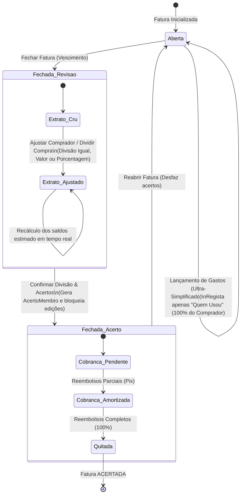

# Especificação Técnica: Remodelação da Jornada do Cartão de Crédito Coletivo

Este documento especifica a remodelagem do ciclo de vida e usabilidade do cartão de crédito no DIVI. O objetivo é substituir o modelo artificial de divisão imediata no momento da compra por uma jornada humana e flexível, separando o **uso diário** da **divisão e acerto de contas** que ocorrem somente após o fechamento da fatura.

---

## 1. O Problema e a Nova Jornada Realista

### O Problema Atual
Atualmente, o DIVI força o usuário a definir participantes e divisões de pagamento no momento em que lança um gasto no cartão. Isso é desalinhado com o mundo real de casas compartilhadas, onde:
1. Um membro passa o cartão para fazer uma compra (apenas consumindo limite, sem fluxo de caixa imediato).
2. Outros membros podem usar o mesmo cartão durante o mês.
3. As pessoas não sabem ou não querem calcular divisões e transferências na correria do dia a dia da compra.
4. O acerto financeiro e reembolsos ocorrem exclusivamente **após o fechamento da fatura**.

### A Nova Jornada Proposta


---

## 2. Modificações no Modelo de Domínio (Core Domain)

### A. Entidade `Gasto` ([Gasto.ts](file:///d:/projetos/divi/src/modules/ledger/core/domain/Gasto.ts))
Adição do campo `compradorId` para rastrear quem de fato usou o limite do cartão. No cadastro inicial, a divisão é gravada como 100% atribuída a ele.

```typescript
export interface GastoProps {
  id: string
  faturaId: string
  descricao: string
  valorTotal: Dinheiro
  compradorId: string // <- ID do membro que passou o cartão
  divisoes: ReadonlyArray<DivisaoDeGasto>
}
```

### B. Entidade `AcertoMembro` ([AcertoMembro.ts](file:///d:/projetos/divi/src/modules/ledger/core/domain/AcertoMembro.ts))
Substituição do booleano simples `pago` pelo controle amortizado `valorPago` para suportar reembolsos parciais e pagamentos em múltiplas datas.

```typescript
export interface AcertoMembroProps {
  id: string
  faturaId: string
  membroId: string
  totalConsumido: Dinheiro
  totalAntecipado: Dinheiro
  valorPago?: Dinheiro // <- Total de reembolsos recebidos
  pago?: boolean
  dataPagamento?: Date
}
```
* O status `pago` torna-se calculado: `this.valorPago.centavos >= this.valorAcerto.centavos`.
* O método `registrarReembolso(valor: Dinheiro, data: Date)` incrementa `valorPago`, validando para não estourar a dívida total (`valorAcerto`).

---

## 3. Persistência e Retrocompatibilidade (Adapters)

### LocalStorageGastoRepository
Durante a desserialização de `Gasto` no LocalStorage, garantimos a leitura de despesas antigas que não contêm o campo `compradorId` inferindo-o a partir do primeiro participante da divisão cadastrada:
```typescript
const compradorId = g.compradorId || divisoes[0]?.membroId || 'membro_padrao';
```

### LocalStorageAcertoMembroRepository
Durante a desserialização de `AcertoMembro`, inferimos o `valorPago` para dados legados: se o booleano `pago` for verdadeiro, o `valorPago` assume o valor total do acerto (`valorAcerto`), senão inicia em zero.

---

## 4. Regras de Negócio e Serviços (Application Services)

### FaturaService ([FaturaService.ts](file:///d:/projetos/divi/src/modules/ledger/core/services/FaturaService.ts))
Dividimos o fechamento da fatura em duas ações assíncronas distintas:
1. `fecharFatura(faturaId, dataPagamentoBanco)`: Apenas altera o status da fatura para `FECHADA` e grava a data de vencimento. Bloqueia novos lançamentos de gastos, mas ainda **não gera** acertos financeiros.
2. `confirmarAcertos(faturaId)`: Executa a consolidação matemática definitiva das despesas e pagamentos adiantados dos membros, criando as entidades de `AcertoMembro` no repositório. Tranca a fatura contra novas modificações de compras.
3. `reabrirFatura(faturaId)`: Retorna o status para `ABERTA` e **exclui** todas as entidades de acertos associadas à fatura.

### AcertoService ([AcertoService.ts](file:///d:/projetos/divi/src/modules/ledger/core/services/AcertoService.ts))
Substituímos o método `marcarPago` por `registrarReembolsoMembro(acertoId, valor, data)` que atualiza a amortização parcial. Se todos os acertos daquela fatura forem totalmente quitados, o status da `Fatura` é atualizado para `ACERTADA`.

---

## 5. Nova Jornada de Interface (UI/UX)

### A. Wizard de Cadastro ([NovoLancamentoWizard.vue](file:///d:/projetos/divi/src/components/ledger/NovoLancamentoWizard.vue))
* Remoção do passo de divisão multi-seleção de beneficiários.
* O Passo 3 passa a ser **"Quem Usou?"**: exibe uma lista de avatares com seleção única (quem passou o cartão).
* A finalização cria o gasto associado 100% à pessoa selecionada.

### B. Painel de Fechamento & Ajustes ([DashboardSaldos.vue](file:///d:/projetos/divi/src/components/ledger/DashboardSaldos.vue))
Quando a fatura estiver no estado `FECHADA` mas sem acertos gerados, ela entra no modo **Revisão Interativa**:
1. **Reatribuição Rápida**: Dropdown ou popover em cada linha do extrato para trocar o comprador (`compradorId`) caso tenha sido cadastrado errado.
2. **Modal de Divisão**: Botão para dividir o gasto individual. O usuário poderá escolher:
   * **Divisão Igual**: Divide igualmente entre os membros selecionados.
   * **Divisão por Valor**: Define o valor exato consumido por cada participante.
   * **Divisão por Porcentagem**: Define o percentual proporcional de cada um.
3. **Consolidação em Tempo Real**: Um card lateral exibe o saldo de devedores e credores recalculando instantaneamente conforme as divisões e compradores são modificados.
4. **Confirmação Definitiva**: Botão *"Confirmar Divisão e Acertos"* que chama o `confirmarAcertos(faturaId)`.

Quando a fatura estiver `FECHADA` com acertos gerados (modo de cobrança):
1. Exibe a listagem de acertos (`AcertoMembro`).
2. Botão para **"Registrar Pix / Reembolso"** que permite imputar pagamentos parciais.
3. Exibe o progresso de quitação (ex: *"Faltam R$ 42,00 (Pago R$ 50,00)"*).

---

## 6. Plano de Verificação e Testes

* **Testes Unitários no Domínio**:
  * Testar instanciação de `Gasto` com `compradorId` e validações matemáticas de divisão.
  * Testar lógica de amortização de `AcertoMembro.registrarReembolso` com validação de limite.
* **Testes de Serviço**:
  * Validar `FaturaService.confirmarAcertos` garantindo o cálculo exato dos acertos excluindo o dono.
  * Validar reabertura limpando acertos.
  * Validar `AcertoService.registrarReembolsoMembro` acumulando valores parciais e fechando a fatura como `ACERTADA` ao fim do fluxo.
* **Testes de Integração de UI**:
  * Verificar que os saldos estimados no painel de revisão recalculam ao atualizar as divisões ou reatribuir compradores.
