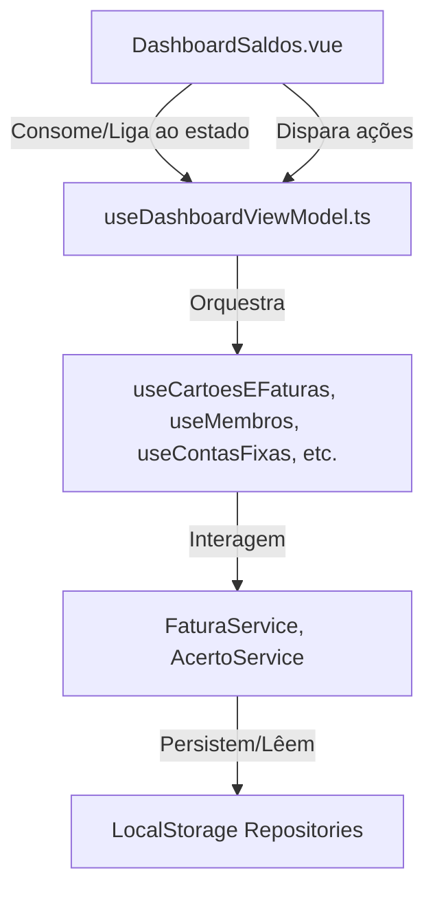

# Documento de Design: Refatoração MVVM e Limpeza da Codebase

Este documento detalha o plano de refatoração para aplicar rigorosamente o padrão MVVM no módulo de finanças residenciais (`ledger`), com foco em limpar a View do Dashboard, reduzir a complexidade ciclomática e remover código morto.

## Contexto e Objetivos

Atualmente, o componente [DashboardSaldos.vue](file:///d:/projetos/divi/src/components/ledger/DashboardSaldos.vue) acumula múltiplas responsabilidades:
1.  **Lógica de Apresentação:** Gestão de estados de múltiplos modais, seletores de data e inputs temporários.
2.  **Lógica de Negócios:** Mapeamento de membros, cálculo de consumo e formatação de valores.
3.  **Persistência (Data Access):** Instanciação direta de repositórios (como `LocalStorageGastoRepository`) e chamadas de persistência diretamente nos event handlers da View.

Isso viola a separação de responsabilidades do padrão MVVM, além de aumentar a complexidade ciclomática e dificultar testes isolados.

**Objetivos:**
*   Isolar todo o estado de apresentação e mutação na nova ViewModel `useDashboardViewModel.ts`.
*   Tornar a View [DashboardSaldos.vue](file:///d:/projetos/divi/src/components/ledger/DashboardSaldos.vue) passiva (100% livre de acesso a dados ou regras complexas).
*   Reduzir a complexidade ciclomática de funções de tratamento de datas e listas.
*   Eliminar imports inutilizados, código comentado ou redundâncias.

---

## Arquitetura Proposta (MVVM)



### 1. Camada da View ([DashboardSaldos.vue](file:///d:/projetos/divi/src/components/ledger/DashboardSaldos.vue))
*   **Papel:** Passiva. Apenas renderiza a árvore de componentes e bindings de classe.
*   **Restrições:** Não importa adaptadores de LocalStorage, não faz cálculos complexos de domínio. Apenas consome o retorno de `useDashboardViewModel()`.

### 2. Camada da ViewModel ([useDashboardViewModel.ts](file:///d:/projetos/divi/src/modules/ledger/composables/useDashboardViewModel.ts))
*   **Papel:** Gerencia o estado de visualização do dashboard (modais abertos, inputs reativos) e serve de intermediário com a camada de negócio/dados.
*   **Estados de UI expostos:**
    *   Controle de abertura de BottomSheets (histórico, fechar fatura, configurar/lançar conta fixa, netting, etc.).
    *   Formulários temporários (valor do Pix de reembolso parcial, etc.).
*   **Mapeamento de Dados e Ações:**
    *   Expõe getters formatados e computados prontos para renderização.
    *   Expõe métodos que coordenam fluxos complexos (ex: registrar Pix de netting, o que envolve criar um `Gasto` de liquidação e persistir no repositório de gastos).

### 3. Camada do Model (Services, Domains, Repositories)
*   **Papel:** Regras de negócio puras (ex: `Fatura`, `Gasto`, `Dinheiro`) e serviços de orquestração de persistência (`FaturaService`, `AcertoService`).
*   **Restrições:** Não depende de reatividade da UI ou qualquer biblioteca de visualização.

---

## Detalhamento das Mudanças

### Nova ViewModel: [useDashboardViewModel.ts](file:///d:/projetos/divi/src/modules/ledger/composables/useDashboardViewModel.ts)
A ViewModel centralizará o seguinte:

```typescript
export function useDashboardViewModel(props: DashboardProps, emit: DashboardEmits) {
  // 1. Estados Reativos (UI e Filtros)
  const showBottomSheetHistorico = ref(false)
  const periodoSelecionado = ref({ mes: number, ano: number })
  // ... outros estados de modais
  
  // 2. Dependências
  const cartoesEFaturas = useCartoesEFaturas()
  const contasFixas = useContasFixas()
  const membros = useMembros()
  // ...

  // 3. Computeds baseados nos Composables e Período Selecionado
  const faturaAtivaVisualizada = computed(() => { ... })
  const nettingTransferencias = computed(() => { ... })
  // ...

  // 4. Ações
  const confirmarBaixaNetting = async (dados: any) => { ... }
  const excluirGasto = async (id: string) => { ... }
  // ...

  return {
    // estados
    showBottomSheetHistorico,
    // computeds
    faturaAtivaVisualizada,
    nettingTransferencias,
    // ações
    confirmarBaixaNetting,
    excluirGasto,
    // ...
  }
}
```

### Simplificações de Complexidade Ciclomática
*   **Lista de Meses**: A computada `listaMesesSeletor` será otimizada para evitar branches redundantes.
*   **Validações e Ações Netting**: O processo de salvar o gasto de compensação (netting) será envelopado em uma ação limpa dentro da ViewModel, removendo toda a lógica de construção e instanciação do Gasto do corpo do componente da View.

---

## Plano de Verificação

### Testes Automatizados
Rodar os testes existentes antes e depois da refatoração para garantir que não haja regressão:
```bash
npx vitest run
```
Todos os 110 testes (inclusive os testes de integração do `DashboardSaldos.test.ts`) devem continuar passando.

### Verificação Manual
Verificar se todas as modais abrem, fecham e reagem aos inputs no fluxo de uso do aplicativo.
