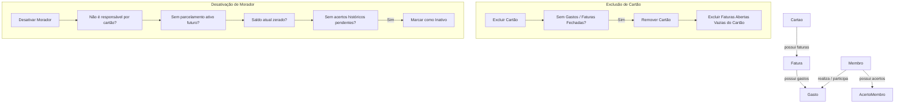

# Especificação de Design: Restrições de Negócio e Integridade Referencial

Este documento especifica o design para a correção de regras de negócio por falta de restrições e relacionamentos no sistema Divi. O objetivo é assegurar a integridade referencial dos dados, evitando faturas órfãs, moradores com pendências históricas desativados e transações financeiras nulas/inválidas.

## 1. Escopo das Restrições

Implementamos a **Abordagem A (Orientada a Serviços/Domínio)**, que concentra as validações nas entidades de domínio e serviços correspondentes.

### 1.1. Validação de Valor do Gasto > 0
Garante que não existam transações financeiras de valor nulo ou negativo no sistema.

- **Entidade `Gasto`**:
  No construtor, validamos que o `valorTotal` seja estritamente positivo:
  ```typescript
  if (!props.valorTotal.isPositivo()) {
    throw new Error('O valor total do gasto deve ser maior que zero')
  }
  ```
- **Ajuste de Testes**:
  O teste unitário `deve lançar erro se o gasto for criado sem divisões` em `Gasto.test.ts` que utilizava valor `0` será atualizado para valor `1000` mantendo divisões vazias, a fim de testar a restrição de divisões corretamente sem que o erro de valor positivo ocorra primeiro.

### 1.2. Validação de Moradores Ativos nos Gastos
Impedir que gastos sejam associados a moradores desativados ou inexistentes (tanto no comprador quanto na divisão de gastos).

- **GastoService**:
  Injetar `IMembroRepository` no `GastoService`.
  No lançamento de gastos (`lancarGastoOuEmprestimo`) e na edição de gastos (`atualizarGastoCompleto`), buscar todos os membros e validar que:
  - O `compradorId` pertence a um morador cadastrado e ativo (`ativo === true`).
  - O `borrowerId` (se definido) pertence a um morador cadastrado e ativo.
  - Cada membro participante em `divisoes` (`membroId`) pertence a um morador cadastrado e ativo.
  - Caso contrário, lançar erro: `"Não é possível associar gastos a moradores inativos ou inexistentes."`

### 1.3. Desativação de Moradores com Acertos Pendentes
Evitar que moradores que devem ao grupo ou possuem saldo a receber histórico de períodos anteriores sejam desativados antes de liquidarem suas pendências.

- **MembroService**:
  Injetar `IAcertoMembroRepository` no `MembroService`.
  No método `desativarMembro`, listar todos os acertos e filtrar por acertos vinculados a este morador (`a.membroId === id`) que possuam status pendente (`!a.pago`).
  Se algum acerto não estiver pago, impedir a desativação lançando o erro: `"Não é possível desativar um morador com acertos pendentes de faturas anteriores."`

### 1.4. Exclusão de Faturas Vazias ao Deletar Cartão
Limpar faturas abertas e vazias que sobram no repositório local após a exclusão de um cartão.

- **Repositório de Faturas**:
  Adicionar a assinatura do método `excluirFaturasAbertasSemGastosPorCartao(cartaoId: string): Promise<void>` em `IFaturaRepository` e implementá-lo no `LocalStorageFaturaRepository`.
  O repositório deve listar todas as faturas `ABERTA` do `cartaoId` e, caso não possuam nenhum gasto associado, excluí-las fisicamente da base local.
- **ViewModel (`useCartoesEFaturas.ts`)**:
  No método `excluirCartaoManual(id)`, chamar `localFaturaRepo.excluirFaturasAbertasSemGastosPorCartao(id)` imediatamente após a exclusão do cartão.

## 2. Diagrama de Relacionamentos e Fluxo



## 3. Plano de Verificação

### 3.1. Testes Automatizados
- Unitários da entidade `Gasto`: validar erro ao inicializar com valor `<= 0`.
- Unitários do `GastoService`:
  - Validar erro se tentar lançar gasto para morador inativo.
  - Validar erro se tentar atualizar gasto associando morador inativo.
- Unitários do `MembroService`:
  - Validar bloqueio de desativação se houver `AcertoMembro` pendente (não pago) histórico.
- Unitários do `LocalStorageFaturaRepository` / ViewModel:
  - Validar se faturas abertas vazias do cartão excluído são removidas com sucesso após a remoção do cartão.

### 3.2. Teste Manual
- Tentar desativar um morador com dívidas/créditos de acerto anteriores não quitados (deve falhar).
- Excluir um cartão que não tenha gastos (deve sumir do banco e não deixar faturas órfãs no localStorage).
- Tentar lançar um gasto/divisão contendo um morador inativo (deve ser rejeitado).
