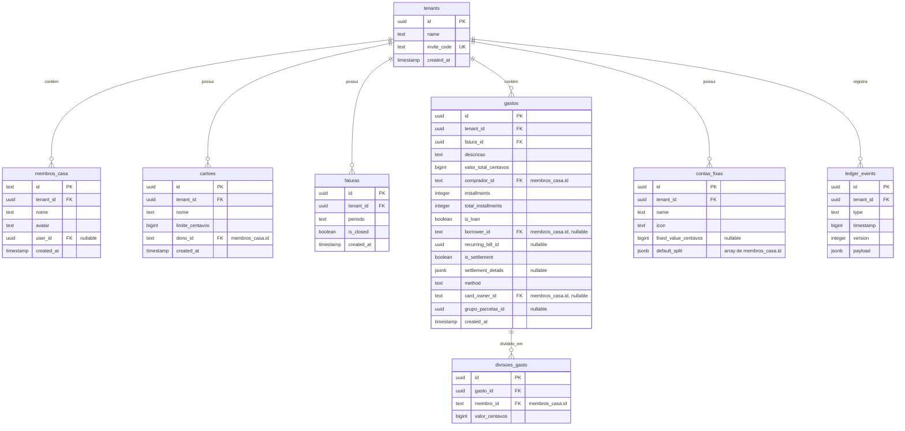

# Especificação de Design: Evolução para SAAS Multitenant com Supabase

**Data:** 2026-05-23  
**Status:** Aprovado pelo Usuário  
**Tópico:** Migração de LocalStorage para Supabase Multitenant com RLS e login por Nome/Senha  

---

## 1. Visão Geral

Este documento detalha o plano de evolução do DIVI de um aplicativo de persistência puramente local (LocalStorage) para um Software as a Service (SaaS) multi-inquilino (Multitenant) utilizando o **Supabase** (Postgres, Auth).

Para manter a simplicidade da experiência de uso e preservar o isolamento arquitetural (Ports & Adapters), as seguintes decisões foram tomadas e validadas:
1.  **Beta de Multitenancy por RLS:** Isolamento das casas através de políticas de Row Level Security (RLS) no PostgreSQL baseadas em um identificador de casa (`tenant_id`).
2.  **Autenticação por Nome/Senha:** Login simplificado sem e-mail visível para o usuário, mapeando `username` para e-mails fictícios (`username@divi.app`) internamente usando o Supabase Auth.
3.  **Código de Convite da Casa:** Associação simples entre novos membros e casas existentes através de um código auto-gerado (ex: `CASA-A8F31`).
4.  **Repositórios Híbridos com Troca Dinâmica:** Troca dinâmica de persistência em runtime através de classes wrappers no `container.ts`. Se o usuário estiver deslogado, os dados continuam no LocalStorage; ao efetuar login, o sistema chaveia transparentemente para as tabelas do Supabase.
5.  **Migração Transparente de Dados Locais:** No primeiro login, os dados existentes do LocalStorage do navegador são migrados de forma íntegra para uma nova Casa criada no Supabase.
6.  **Perfis de Membro Flexíveis:** Chaves de gastos e cartões apontam para a tabela `membros_casa` (e não direto para `auth.users`), permitindo que membros locais (sem conta cadastrada) coexistam com membros reais (com conta cadastrada e vinculada).

---

## 2. Modelagem do Banco de Dados (Supabase / Postgres)

Todas as tabelas operacionais conterão uma coluna `tenant_id` que servirá de âncora para as políticas de segurança.

### 2.1. Esquema Relacional



### 2.2. Row Level Security (RLS)

Ativaremos RLS em todas as tabelas. O critério de acesso reside na tabela `membros_casa` associada ao `auth.uid()`.

```sql
-- Exemplo de política de isolamento de Tenant na tabela 'gastos'
ALTER TABLE public.gastos ENABLE ROW LEVEL SECURITY;

CREATE POLICY "tenant_isolation_policy" ON public.gastos
FOR ALL TO authenticated
USING (
  EXISTS (
    SELECT 1 FROM public.membros_casa 
    WHERE membros_casa.tenant_id = gastos.tenant_id 
      AND membros_casa.user_id = auth.uid()
  )
)
WITH CHECK (
  EXISTS (
    SELECT 1 FROM public.membros_casa 
    WHERE membros_casa.tenant_id = gastos.tenant_id 
      AND membros_casa.user_id = auth.uid()
  )
);
```

---

## 3. Autenticação e Gestão de Sessão

### 3.1. Autenticação Simplificada
*   **Sign Up / Sign In:** A tela de login solicitará `Nome de Usuário` e `Senha`.
*   **Tratamento Frontend:** O app higieniza o input (transforma para minúsculas e remove espaços: `Luan Silva` -> `luansilva`) e executa a chamada contra o Supabase Auth usando o e-mail fictício `luansilva@divi.app`.
*   O token JWT gerado é armazenado em cache pelo Supabase Client SDK e renovado automaticamente.

### 3.2. Troca Dinâmica de Persistência (Ports & Adapters)
Modificamos o container para agir como uma camada de despacho dinâmica (Proxy).

```typescript
// Exemplo de invólucro (Wrapper) no container
class DynamicGastoRepository implements IGastoRepository {
  private get active(): IGastoRepository {
    if (sessionService.isAuthenticated()) {
      return supabaseGastoRepository;
    }
    return localStorageGastoRepository;
  }

  async salvar(gasto: Gasto): Promise<void> {
    return this.active.salvar(gasto);
  }

  async buscarPorFatura(faturaId: string): Promise<Gasto[]> {
    return this.active.buscarPorFatura(faturaId);
  }

  async excluir(id: string): Promise<void> {
    return this.active.excluir(id);
  }

  // ... demais métodos
}
```

---

## 4. Gestão de Tenants (Casas) e Convites

### 4.1. Casa Ativa (`activeTenantId`)
*   O frontend mantém um serviço reativo `TenantSessionService` com o `activeTenantId` corrente.
*   O ID da casa selecionada é mantido no `localStorage` sob a chave `divi_active_tenant_id` para que a tela não perca o contexto no recarregamento.

### 4.2. Fluxo "Criar Casa"
1.  Usuário digita o nome da casa.
2.  O app gera um código alfanumérico no formato `CASA-XXXXX` (onde X são caracteres aleatórios de A-Z, 0-9).
3.  Cria a linha na tabela `tenants`.
4.  Cria uma linha na tabela `membros_casa` vinculando o `auth.uid()` do criador ao `tenant_id` recém-criado, definindo seu nome e avatar inicial.
5.  A casa é definida como ativa na UI.

### 4.3. Fluxo "Entrar na Casa" (Código de Convite)
1.  Usuário insere o código `CASA-XXXXX`.
2.  O app consulta no banco a casa correspondente ao código.
3.  Se encontrada, adiciona o usuário logado à tabela `membros_casa` daquele `tenant_id` com o seu `user_id` preenchido.
4.  A casa é definida como ativa na UI.

---

## 5. Estratégia de Sincronização e Onboarding de Membros

### 5.1. Migração Inicial de Dados
Ao efetuar o primeiro login:
1.  O app verifica o `LocalStorage` em busca de dados legados (`divi_event_stream`, `divi_gastos_cartao`, etc.).
2.  Caso existam, cria um novo Tenant e insere os membros originais (como `"joao"` e `"luciana"`) na tabela `membros_casa`, preenchendo a coluna `user_id` apenas para o usuário logado migrador.
3.  Insere em lote todos os dados operacionais (gastos, divisões, cartões) vinculando-os ao novo `tenant_id`.
4.  Marca a migração local como concluída no navegador.

### 5.2. Vinculação Dinâmica de Convidados
*   Quando o João se cadastrar no app e digitar o código de convite da casa, o app executará uma checagem rápida para ver se já existe um membro chamado `"joao"` (ou com o nome de exibição dele) sem `user_id` associado.
*   Caso positivo, o `user_id` desse registro em `membros_casa` é atualizado para o `auth.uid()` do João.
*   **Resultado:** O João assume instantaneamente o perfil histórico que o administrador havia criado localmente na migração, visualizando todas as suas faturas e participações em despesas passadas de forma instantânea.
