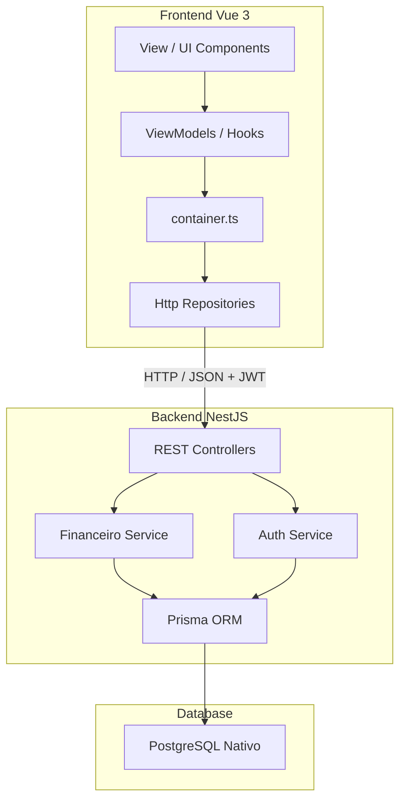

# Design Spec - Desmembramento do Supabase e Integração com NestJS e PostgreSQL Nativo (Sem Offline)

**Data:** 2026-05-28  
**Autor:** Antigravity AI  
**Status:** Aprovado pelo Usuário (Revisão: Sem persistência offline/LocalStorage, com controle automático e autônomo de migrações de DDL via Prisma)

---

## 1. Contexto e Objetivo

O DIVI foi concebido com persistência híbrida (LocalStorage local + Supabase SaaS). Para reduzir a complexidade ciclomática e eliminar o acréscimo de código morto, o sistema será simplificado para rodar **exclusivamente de forma online**, com dados armazenados diretamente em um banco **PostgreSQL** por meio de um backend **NestJS**.

Esta decisão resulta nos seguintes objetivos de design:
1. **Remover todo o código de persistência local (LocalStorage)** do frontend, eliminando a complexidade de sincronização concorrente, travas de escrita locais (Web Locks) e proxies dinâmicos de repositório.
2. **Desmembrar o Supabase** do frontend, desinstalando seu SDK.
3. Criar uma aplicação **NestJS** independente na pasta `backend/` conectada diretamente ao **PostgreSQL nativo** usando **Prisma ORM**.
4. **Gerenciamento Autônomo e Automatizado de Migrações (DDL)**: Adotar o **Prisma Migrate** com execução programática automática no bootstrap do NestJS, permitindo que o sistema atualize/corrija a estrutura do banco sozinho ao iniciar.
5. Implementar **Autenticação JWT simplificada** no backend com persistência de usuários na tabela `usuarios`.
6. Implementar no frontend **apenas Repositórios HTTP** que consomem a API REST do NestJS, reduzindo drasticamente o tamanho e complexidade da base de código do cliente.

---

## 2. Arquitetura Simplificada do Sistema



---

## 3. Detalhamento Técnico: Backend (NestJS + PostgreSQL + Prisma)

### 3.1. Estrutura do Backend
O NestJS será inicializado na pasta `backend/` e usará as seguintes dependências principais:
- `@nestjs/common`, `@nestjs/core`, `@nestjs/jwt`, `@nestjs/passport`
- `@prisma/client` e `prisma` (DevDependency)
- `bcrypt` para hash de senhas.

### 3.2. Modelagem com Prisma (`backend/prisma/schema.prisma`)
Mapearemos as tabelas do DDL original para o PostgreSQL nativo:

```prisma
datasource db {
  provider = "postgresql"
  url      = env("DATABASE_URL")
}

generator client {
  provider = "prisma-client-js"
}

model Tenant {
  id         String       @id @default(uuid()) @db.Uuid
  name       String
  inviteCode String       @unique @map("invite_code")
  createdAt  DateTime     @default(now()) @map("created_at")
  membros    MembroCasa[]
  cartoes    Cartao[]
  faturas    Fatura[]
  gastos     Gasto[]
  contasFixas ContaFixa[]

  @@map("tenants")
}

model Usuario {
  id           String       @id @default(uuid()) @db.Uuid
  username     String       @unique
  passwordHash String       @map("password_hash")
  createdAt    DateTime     @default(now()) @map("created_at")
  perfisMembro MembroCasa[]

  @@map("usuarios")
}

model MembroCasa {
  id          String   @id // Mantemos string (ex: 'membro-uuid') para bater com o frontend
  tenantId    String   @map("tenant_id") @db.Uuid
  nome        String
  avatar      String
  userId      String?  @map("user_id") @db.Uuid
  createdAt   DateTime @default(now()) @map("created_at")
  
  tenant      Tenant   @relation(fields: [tenantId], references: [id], onDelete: Cascade)
  usuario     Usuario? @relation(fields: [userId], references: [id], onDelete: SetNull)

  compras     Gasto[]          @relation("CompradorGasto")
  divisoes    DivisaoGasto[]
  cartoesDono Cartao[]

  @@map("membros_casa")
}

model Cartao {
  id                  String   @id @default(uuid()) @db.Uuid
  tenantId            String   @map("tenant_id") @db.Uuid
  nome                String
  limiteCentavos      BigInt   @map("limite_centavos")
  donoId              String   @map("dono_id")
  createdAt           DateTime @default(now()) @map("created_at")

  tenant              Tenant   @relation(fields: [tenantId], references: [id], onDelete: Cascade)
  dono                MembroCasa @relation(fields: [donoId], references: [id])

  @@map("cartoes")
}

model Fatura {
  id        String   @id @default(uuid()) @db.Uuid
  tenantId  String   @map("tenant_id") @db.Uuid
  periodo   String   // Formato 'MM-AAAA'
  isClosed  Boolean  @default(false) @map("is_closed")
  createdAt DateTime @default(now()) @map("created_at")

  tenant    Tenant   @relation(fields: [tenantId], references: [id], onDelete: Cascade)
  gastos    Gasto[]

  @@map("faturas")
}

model Gasto {
  id                  String   @id @default(uuid()) @db.Uuid
  tenantId            String   @map("tenant_id") @db.Uuid
  faturaId            String   @map("fatura_id") @db.Uuid
  descricao           String
  valorTotalCentavos  BigInt   @map("valor_total_centavos")
  compradorId         String   @map("comprador_id")
  installments        Int      @default(1)
  totalInstallments   Int      @default(1) @map("total_installments")
  isLoan              Boolean  @default(false) @map("is_loan")
  borrowerId          String?  @map("borrower_id")
  recurringBillId     String?  @map("recurring_bill_id") @db.Uuid
  isSettlement        Boolean  @default(false) @map("is_settlement")
  settlementDetails   Json?    @map("settlement_details")
  method              String   // 'pix' | 'card'
  cardOwner           String?  @map("card_owner")
  grupoParcelasId     String?  @map("grupo_parcelas_id") @db.Uuid
  createdAt           DateTime @default(now()) @map("created_at")

  tenant              Tenant   @relation(fields: [tenantId], references: [id], onDelete: Cascade)
  fatura              Fatura   @relation(fields: [faturaId], references: [id], onDelete: Cascade)
  comprador           MembroCasa @relation("CompradorGasto", fields: [compradorId], references: [id])
  divisoes            DivisaoGasto[]

  @@map("gastos")
}

model DivisaoGasto {
  id            String     @id @default(uuid()) @db.Uuid
  gastoId       String     @map("gasto_id") @db.Uuid
  membroId      String     @map("membro_id")
  valorCentavos BigInt     @map("valor_centavos")

  gasto         Gasto      @relation(fields: [gastoId], references: [id], onDelete: Cascade)
  membro        MembroCasa @relation(fields: [membroId], references: [id], onDelete: Cascade)

  @@map("divisoes_gasto")
}

model ContaFixa {
  id                  String   @id @default(uuid()) @db.Uuid
  tenantId            String   @map("tenant_id") @db.Uuid
  name                String
  icon                String
  fixedValueCentavos  BigInt?  @map("fixed_value_centavos")
  defaultSplit        Json     @map("default_split") // Array de strings (membro_id)

  tenant              Tenant   @relation(fields: [tenantId], references: [id], onDelete: Cascade)

  @@map("contas_fixas")
}
```

### 3.3. Gerenciamento Autônomo de Versões de DDL (Migrations na Inicialização)
Para que o sistema se conserte sozinho e execute as atualizações de DDL de forma autônoma:
1. **Migrations Declaradas:** As migrações continuarão sendo geradas em tempo de desenvolvimento via CLI:
   ```bash
   npx prisma migrate dev --name <descricao_da_mudanca>
   ```
2. **Execução Autônoma no Bootstrap:** No bootstrap da aplicação NestJS (`main.ts`), antes do servidor começar a escutar requisições (`app.listen`), executaremos o comando `prisma migrate deploy` de forma programática.
   
   Exemplo de implementação em `backend/src/main.ts`:
   ```typescript
   import { NestFactory } from '@nestjs/core';
   import { AppModule } from './app.module';
   import { execSync } from 'child_process';
   import { Logger } from '@nestjs/common';

   async function bootstrap() {
     const logger = new Logger('Bootstrap');

     // Executa migrações automáticas pendentes antes de iniciar o app
     try {
       logger.log('Iniciando verificação autônoma de migrações DDL...');
       execSync('npx prisma migrate deploy', { stdio: 'inherit' });
       logger.log('Migrações DDL aplicadas/verificadas com sucesso!');
     } catch (error) {
       logger.error('Falha ao aplicar migrações DDL de forma autônoma:', error);
       // Dependendo do ambiente, podemos optar por parar a inicialização se falhar
     }

     const app = await NestFactory.create(AppModule);
     app.enableCors();
     await app.listen(3000);
     logger.log('Servidor NestJS rodando na porta 3000');
   }
   bootstrap();
   ```
   Com isso, qualquer atualização ou hotfix de banco contido no projeto será aplicado no PostgreSQL imediatamente quando o servidor NestJS for iniciado.

### 3.4. Serviços de Autenticação
* **POST `/auth/register`**: Registra um usuário (`username`, `password`) e cria a entidade `Usuario`.
* **POST `/auth/login`**: Valida credenciais e retorna um token JWT `{ access_token }`.
* **GET `/auth/me`**: Retorna os detalhes do usuário logado e as casas associadas na tabela `membros_casa`.

---

## 4. Detalhamento Técnico: Frontend (Vue 3)

### 4.1. Removendo a Dependência do Supabase e Persistência Local
* Executar `npm uninstall @supabase/supabase-js`.
* Excluir os arquivos `src/shared/supabase.ts`, `src/shared/supabase.test.ts`.
* Excluir toda a pasta `src/models/repositories/supabase/`.
* **Excluir toda a pasta `src/models/repositories/local/` e seus respectivos testes**.
* Excluir arquivos auxiliares de concorrência local como `src/shared/utils/StorageLock.ts` and `StorageLock.test.ts`.
* Remover `useStorageSync.ts` e qualquer lógica de sincronização periódica de dados ou escuta a eventos de armazenamento local no `App.vue`.

### 4.2. Implementando Repositórios HTTP
Criaremos os novos repositórios HTTP sob `src/models/repositories/http/` contendo requisições HTTP para a API NestJS. O token JWT será obtido do `TenantSessionService` e inserido no header HTTP.

Exemplo de estrutura base HTTP:
```typescript
async function fetchWithAuth(url: string, options: RequestInit = {}): Promise<Response> {
  const token = localStorage.getItem('divi_jwt_token');
  const tenantId = localStorage.getItem('divi_active_tenant_id');
  
  const headers = {
    'Content-Type': 'application/json',
    ...(token ? { 'Authorization': `Bearer ${token}` } : {}),
    ...(tenantId ? { 'X-Tenant-ID': tenantId } : {}),
    ...options.headers,
  };

  const response = await fetch(`${import.meta.env.VITE_API_URL || 'http://localhost:3000'}${url}`, {
    ...options,
    headers,
  });

  if (response.status === 401) {
    // Logout automático se o token expirar
  }
  
  return response;
}
```

### 4.3. Simplificação do `container.ts`
O arquivo `container.ts` será massivamente simplificado, pois não criará mais proxies dinâmicos. Ele instanciará e exportará diretamente as implementações de `HttpRepository` (comunicação direta com o backend NestJS):

```typescript
export const membroRepository = new HttpMembroRepository()
export const cartaoRepository = new HttpCartaoRepository()
export const faturaRepository = new HttpFaturaRepository()
export const gastoRepository = new HttpGastoRepository()
export const contaFixaRepository = new HttpContaFixaRepository()
export const acertoMembroRepository = new HttpAcertoMembroRepository()
```

### 4.4. Refatoração do `TenantSessionService.ts`
* O serviço controlará o estado de login através do JWT retornado e guardado no localStorage.
* Se não houver JWT no localStorage, o usuário é considerado deslogado e redirecionado para a tela de login. Não haverá mais suporte para uso sem conta (modo offline).

---

## 5. Plano de Limpeza de Código Morto e Redução de Complexidade

* **Remoção de Arquivos Mortos:** Exclusão de arquivos de migração obsoletos (`MigrationService.ts`, `MigrationService.test.ts`), arquivo de teste temporário `src/scratch_debug.test.ts` e arquivos de repositórios mock/local.
* **Imports Órfãos:** Limpar qualquer importação quebrada do antigo módulo de Supabase e do LocalStorage.

---

## 6. Plano de Verificação

### Automatizada
* Adaptar os testes de viewmodels (`useMembros.test.ts`, `useCartoesEFaturas.test.ts`, etc.) para mockar as chamadas HTTP (usando mocks globais de `fetch` ou biblioteca equivalente), garantindo que as regras de negócio de UI permaneçam 100% testadas e válidas.
* Rodar a suíte de testes unitários do frontend:
  ```bash
  npx vitest run
  ```
* Rodar o build de produção do frontend:
  ```bash
  npm run build
  ```
* Executar testes unitários e de integração no backend NestJS:
  ```bash
  npm run test
  ```

### Manual
* Subir o banco de dados PostgreSQL localmente via Docker.
* Rodar as migrações do Prisma no backend.
* Iniciar o backend NestJS (`npm run start:dev`).
* Iniciar o frontend (`npm run dev`).
* Testar fluxos de Registro, Login, Criação de Casa, Entrada por Código e Lançamentos.
