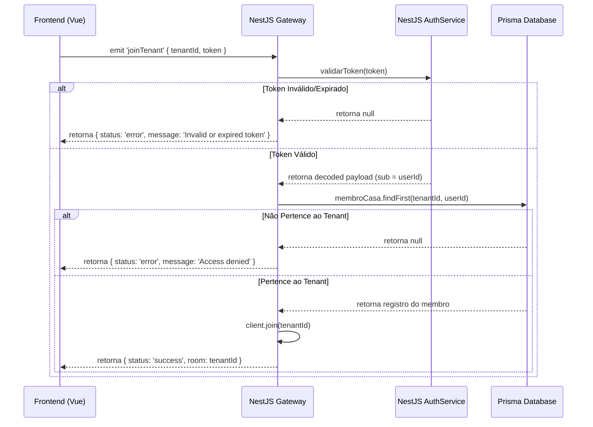

# Design Spec: Segurança e Robustez da Comunicação em Tempo Real (WebSockets)

Este documento especifica a arquitetura e as alterações necessárias para reforçar a segurança e a resiliência do sistema de comunicação em tempo real (WebSockets) do DIVI.

## 1. Objetivos

* **Segurança**: Impedir que conexões não autenticadas ou usuários sem privilégios de acesso a uma casa (tenant) possam entrar nas salas de eventos do WebSocket.
* **Resiliência e Estabilidade**:
  - Evitar que formatos inválidos de UUID passados pelo cliente provoquem erros não tratados ou travamentos no backend NestJS.
  - Eliminar o registro cumulativo de listeners no frontend que provocava requisições HTTP duplicadas de refresh à API.
  - Garantir o envio automático da credencial atualizada do usuário durante handshakes de reconexão do socket.

## 2. Arquitetura e Fluxo de Dados

### Autenticação e Autorização no Gateway


## 3. Alterações Propostas

### Backend (NestJS)

#### [MODIFY] [auth.service.ts](file:///d:/projetos/divi/backend/src/auth/auth.service.ts)
- Adicionar o método público `validarToken(token: string)` para decodificar e verificar a validade do JWT.
  ```typescript
  validarToken(token: string) {
    try {
      return this.jwtService.verify(token);
    } catch (err) {
      return null;
    }
  }
  ```

#### [MODIFY] [financeiro.gateway.ts](file:///d:/projetos/divi/backend/src/financeiro/financeiro.gateway.ts)
- Injetar o `AuthService` e o `PrismaService` no construtor.
- Modificar o handler `joinTenant` para receber o `token` juntamente com o `tenantId`.
- Validar o token e a associação do usuário ao tenant.
- Envolver a query do banco com um bloco `try/catch` para capturar exceções causadas por strings de `tenantId` inválidas (erros de formato UUID no banco).

---

### Frontend (Vue)

#### [MODIFY] [SocketService.ts](file:///d:/projetos/divi/src/models/services/SocketService.ts)
- No método `on(event, callback)`, chamar `this.socket.off(event)` antes de `this.socket.on` para garantir que o listener anterior do mesmo evento seja desregistrado, evitando callbacks duplicados.
- No evento `connect` do socket, ler o token mais recente diretamente do `localStorage` no momento do envio de `joinTenant`.
  ```typescript
  this.socket.on('connect', () => {
    const token = localStorage.getItem('divi_jwt_token')
    this.socket?.emit('joinTenant', { tenantId, token }, (res: any) => { ... })
  })
  ```

---

## 4. Plano de Verificação

### Testes de Integração e Regressão
- Executar os testes unitários existentes (`npx vitest run`) no frontend para certificar que os mocks continuam consistentes.
- Validar se o NestJS compila e inicia sem dependências circulares.
