# Ausculta e Atomização de Código Morto

## Requirements
Mapear caminhos vivos de execução, atomizar funções complexas para garantir clareza de propósito e remover definitivamente código, variáveis e abstrações sem uso ("entropia"), rejeitando o uso de marcações passivas como `// TODO: remove`. Incluir varredura abrangente cobrindo domínios core (Fatura, Gasto, Auth, User, Relatórios) e a camada de persistência (Prisma Schema). Aprofundar os critérios estritos de atomização e varredura no ecossistema Backend (NestJS e Prisma), identificando sistematicamente providers órfãos, módulos não importados, campos de DTO obsoletos e desalinhamentos profundos entre o modelo de dados e as consultas do código-fonte. Garantir a estabilidade da aplicação por meio de testes rigorosos pós-refatoração e do uso de ferramentas de análise estática automatizada.

A varredura deve priorizar casos de duplicação de lógica entre services (equivalentes a código morto por coexistência), bugs semânticos em strings de auditoria e violações de tipagem forte descobertos na leitura do codebase real.

## Entities

```mermaid
classDiagram
direction TB

class RefactoringTarget {
    +String filePath
    +Boolean isDeadCode
    +Boolean needsAtomization
    +Boolean isDuplication
    +analyze()
    +prune()
    +atomize()
    +deduplicate()
}

class FaturaService {
    -IFaturaRepository faturaRepo
    +fecharFatura()
    +reabrirFatura()
    +assegurarFaturasAbertas()
}

class CartaoService {
    +salvarFatura()
    +salvarMuitasFaturas()
    +validarFeatureFlag() <<DUPLICADA>>
    +moradorLegacyFlagMap <<CONSTANTE INLINE>>
}

class LancamentoService {
    +salvarGasto()
    +salvarMuitosGastos()
    +excluirGasto()
    +excluirMuitosGastos()
    +listarGastos() <<MÉTODO MORTO>>
    +validarFeatureFlag() <<DUPLICADA>>
    +moradorLegacyFlagMap <<CONSTANTE INLINE>>
}

class AuditLogService {
    +registrar()
    +listar()
    +verificarPermissaoAuditLog() <<LÓGICA INLINE TRIPLICADA>>
}

class MembroService {
    +criarTenant()
    +obterTenantPermissions()
    +atualizarTenantPermissions()
    +defaultPermissions <<OBJETO DUPLICADO>>
}

class AuthService {
    +loginComGoogle()
    +associarUsuarioAoTenantTx()
    +validarClaimsGoogle() <<usa any>>
    +extrairDadosDoPayload() <<usa any>>
    +gerarRespostaLogin() <<usa any>>
}

class GastoMapper {
    +paraUpsert()
    +mapearDivisoes() <<usa any[]>>
}

class FinanceiroController {
    +atualizarTenantPermissions() <<permissionsDto: any>>
}

class PermissaoService {
    +validarFeatureFlag()
    +moradorLegacyFlagMap <<CONSTANTE CENTRALIZADA>>
}

class SharedPermissions {
    +DEFAULT_PERMISSIONS <<CONSTANTE>>
    +FEATURE_FLAGS_LIST <<CONSTANTE>>
}

class StaticAnalysisTools {
    +executarKnip()
    +analisarWorkspaces()
    +verificarUnusedImports()
}

class KnipConfiguration {
    +definirWorkspaces()
    +mapearEntrypoints()
    +ignorarFalsosPositivos()
}

class NestDependencyGraph {
    +mapearProviders()
    +identificarModulosOrfaos()
    +verificarInjecaoDinamica()
}

class PrismaModelAnalyzer {
    +cruzarSelectsVsModels()
    +identificarColunasLegadas()
}

class DatabaseSchema {
    +identificarCamposObsoletos()
    +removerTabelasOrfas()
}

class FrontendVue {
    +rastrearComponentesObsoletos()
    +limparComposables()
    +otimizarScriptSetup()
}

class TestSuites {
    +limparMocksObsoletos()
    +removerTestesSemAlvo()
    +validarCobertura()
}

RefactoringTarget --> NestDependencyGraph : utilizes
RefactoringTarget --> PrismaModelAnalyzer : utilizes
RefactoringTarget --> CartaoService : targets
RefactoringTarget --> LancamentoService : targets
RefactoringTarget --> AuditLogService : targets
RefactoringTarget --> MembroService : targets
RefactoringTarget --> AuthService : targets
RefactoringTarget --> GastoMapper : targets
RefactoringTarget --> FinanceiroController : targets
RefactoringTarget --> FaturaService : targets
RefactoringTarget --> FrontendVue : targets
RefactoringTarget --> TestSuites : targets
RefactoringTarget --> DatabaseSchema : targets
CartaoService ..> PermissaoService : extrair para
LancamentoService ..> PermissaoService : extrair para
AuditLogService ..> PermissaoService : extrair para
MembroService ..> SharedPermissions : extrair para
StaticAnalysisTools --> RefactoringTarget : enables
StaticAnalysisTools --> KnipConfiguration : uses
PermissaoService --> SharedPermissions : uses
```

## Approach
1. Mapeamento de Runtime (Ausculta) e Análise Estática Automatizada:
   - Iniciar pelos entrypoints do NestJS (Controllers e WebSockets) e componentes root do Vue (roteador, App.vue) para traçar a árvore de dependências ativas.
   - Empregar análise estática rigorosa baseada em workspaces (Frontend e Backend) usando o `knip` através do arquivo `knip.json`. O `knip` deve ser configurado para varrer `src/**/*.ts` e `src/**/*.vue`, identificando arquivos, exports, types e interfaces não utilizados. No Backend, analisar também o grafo de injeção de dependências do NestJS para identificar serviços declarados em `providers` mas não injetados em nenhum construtor.
   - Complementar com o compilador TypeScript e ferramentas auxiliares (ex: `eslint-plugin-unused-imports`) para identificar rotas e métodos órfãos em múltiplos domínios (Faturas, Gastos, Auth, Users e Relatórios), além de validar a correspondência entre os DTOs (`@ApiProperty`) e seu uso efetivo nos endpoints.

2. Remoção de Entropia (Purge) — Código, Duplicações e Database:
   - Eliminar sem cerimônia arquivos, variáveis, interfaces, types e imports reportados como não utilizados. Nenhuma anotação de `TODO: remove` é permitida.
   - Identificar e consolidar duplicações de lógica que equivalem funcionalmente a código morto: múltiplas implementações do mesmo comportamento em services diferentes são candidatas imediatas a extração em um utilitário compartilhado. Exemplos identificados no codebase:
     - `validarFeatureFlag` implementada identicamente em `CartaoService`, `LancamentoService` e com variante inline em `AuditLogService.listar` — extrair para `PermissaoService` compartilhado.
     - `moradorLegacyFlagMap` definida inline e duplicada em `CartaoService` e `LancamentoService` — extrair como constante compartilhada.
     - Objeto `defaultPermissions` duplicado literalmente em `MembroService.criarTenant` e `MembroService.obterTenantPermissions` — extrair como constante de módulo.
   - Revisar o `schema.prisma` para criar um mapeamento cruzado entre os blocos `select` / `include` presentes nas consultas do Prisma Client e as colunas do modelo. Identificar models, relations, índices ou campos definidos no banco que nunca transitam para a camada de serviço/DTO, depreciando-os adequadamente na camada de dados.
   - Expandir a varredura ativamente para o Frontend (Vue), mapeando componentes `.vue`, stores, composables e views que não são mais importados no projeto ou cujas rotas foram desativadas. Focar na limpeza de imports e `refs`/`computeds` na Composition API.
   - Limpar a base de testes, identificando e removendo mocks, setups complexos e variáveis obsoletas em arquivos `.test.ts` e `.spec.ts` referentes a códigos apagados.

3. Identificação e Purge de Métodos Mortos Não Rastreáveis por Imports:
   - Métodos que existem em services mas nunca são chamados através do controller (único ponto de entrada externo) são código morto de execução, mesmo que ainda importados. Identificar sistematicamente métodos públicos de services que não possuem chamada no `FinanceiroController` ou em outros services ativos.
   - Exemplo concreto identificado: `LancamentoService.listarGastos` nunca é chamado pelo controller (o controller chama exclusivamente `listarGastosVisiveis`). Verificar se existe caso de uso legítimo ou remover.
   - Aplicar o mesmo raciocínio a outros métodos públicos em services: todo método público que não possui chamador no grafo de execução ativo é candidato à remoção.

4. Atomização de Funções e Isolamento de Side-Effects (Névoa):
   - Refatorar métodos longos com múltiplas responsabilidades em sub-funções menores, coesas e puras, com "nomes honestos" que descrevem exatamente o que fazem (Extract Method). Introduzir Mappers ou Factories para retirar lógica extensa de transformação de dados de dentro dos Services.
   - Aplicar critérios matemáticos de complexidade: quebrar loops aninhados e condicionais profundas (profundidade de aninhamento <= 2). Reduzir complexidade ciclomática para, no máximo, 5 por método.
   - Aplicar revisão rigorosa nos Controllers do NestJS para delegar toda e qualquer regra de negócio aos respectivos serviços, mantendo-os estritamente como camada de transporte e validação (DTOs).
   - Lógicas de auditoria duplicadas dentro de loops (ex: construção de `detalhesLog` e chamada a `auditLogService.registrar` dentro do loop de `excluirMuitosGastos`, copiando a lógica de `excluirGasto`) devem ser extraídas para métodos privados puros e compartilhados.

5. Correção de Bugs Semânticos Identificados:
   - A varredura deve identificar e corrigir inconsistências de string em ações de auditoria. Exemplo concreto: `MembroService.atualizarTenantPermissions` registra a ação com o código `'ALTERAR_RENDA'` ao invés do correto `'ALTERAR_PERMISSOES'` — bug semântico que polui o histórico de auditoria com ações incorretas.
   - Revisar todas as chamadas a `auditLogService.registrar` para garantir que o campo `acao` corresponde semanticamente ao que foi realmente executado.

6. Testes e Verificação Pós-Refatoração (Verification):
   - Após cada ciclo de purga e atomização em um domínio, rodar testes unitários para validar a estabilidade e assegurar que a refatoração não quebrou contratos.
   - Analisar o relatório de coverage de testes (`jest --coverage` ou `vitest run --coverage`) comparando o antes e depois. A cobertura não pode regredir.
   - Validar testes E2E básicos se as rotas expostas de Auth ou Relatórios sofreram alterações, garantindo a jornada do usuário.

## Structure

### Dependencies
1. A ausculta foca no fluxo: `Controller / Gateway` → `Service` → `Repository / Prisma`.
2. Qualquer nó desta árvore que não tenha um "pai" vivo deve ser descartado.
3. Utilitários compartilhados (ex: `PermissaoService`, constantes de permissão) devem residir em `shared/` ou dentro do módulo como serviços internos injetáveis, evitando duplicação entre services do mesmo módulo.

### Layered Architecture
1. Entrypoints Layer (Controllers/Sockets/Vue Router): Garantem que os gatilhos externos estão de fato roteados. Métodos de service sem rota ativa no controller são código morto.
2. Business Layer (Services/Composables): Devem ter responsabilidades únicas. Funções longas aqui devem ser desmembradas (atomizadas). Lógica de validação de permissão não deve ser reimplementada por cada service — extrair para um service dedicado.
3. Persistence Layer (Repositories/Prisma): Interfaces sem uso e queries abandonadas devem ser removidas.
4. Shared Layer (Constantes/Utilitários): Constantes como `DEFAULT_PERMISSIONS` e `FEATURE_FLAGS_LIST` e utilitários como `PermissaoService` devem existir nesta camada, consumidos por todos os services que precisam, sem duplicação.
5. Tooling Layer (Knip/ESLint): Camada transversal de auditoria contínua que garante a integridade estrutural via `knip.json`.

## Operations

### Refactor [Tooling] - Configuração e Execução do Knip
1. Responsibility: Centralizar e configurar a análise de código morto através do Knip, respeitando a separação de workspaces (Frontend e Backend).
2. Methods:
   - Configurar `knip.json` declarando os workspaces apropriados (ex: `.` para Frontend e `"backend"` para NestJS).
   - Definir os `entrypoints` corretos (ex: `src/main.ts`) e `project` files (`src/**/*.ts`, `src/**/*.vue`).
   - Executar relatórios do Knip de forma iterativa, limpando os exports não utilizados, types orfãos e arquivos inteiros marcados como "Unused files".
   - Ajustar falsos positivos no Knip através de exclusões específicas (`ignore`) apenas para arquivos dinâmicos injetados por plugins/frameworks.

### Refactor [Service] - Extração de PermissaoService Compartilhado
1. Responsibility: Eliminar a triplicação da lógica de verificação de feature flags presente em `CartaoService`, `LancamentoService` e `AuditLogService`, centralizando-a em um serviço coeso e injetável.
2. Methods:
   - Criar `PermissaoService` (ou `FeatureFlagService`) dentro do módulo `financeiro`, declarando-o como `provider` no `FinanceiroModule`.
   - Migrar o método `validarFeatureFlag` com toda a sua lógica (resolução do executor, leitura de `tenant.permissions`, verificação do `moradorLegacyFlagMap`) para o novo service.
   - Extrair `moradorLegacyFlagMap` como constante de módulo (fora da classe), pois é um mapa estático sem dependência de instância.
   - Substituir as 3 implementações inline (`CartaoService`, `LancamentoService`, `AuditLogService`) pela injeção e chamada ao `PermissaoService`.
   - Garantir que `PermissaoService` seja adicionado ao array `providers` e, se necessário, ao `exports` do `FinanceiroModule`.

### Refactor [Service] - Extração de Constantes de Permissão Compartilhadas
1. Responsibility: Eliminar a duplicação literal do objeto `defaultPermissions` presente em `MembroService.criarTenant` e `MembroService.obterTenantPermissions`, além de unificar a lista canônica de feature flags.
2. Methods:
   - Declarar `DEFAULT_PERMISSIONS` como constante de módulo no arquivo do `MembroService` ou em um arquivo `permissions.constants.ts` dentro de `shared/`.
   - Substituir as duas definições inline pelo uso da constante compartilhada.
   - Verificar se `atualizarTenantPermissions` acessa a lista de flags de forma hardcoded (o merge manual de 8 chaves booleanas no método atual é candidato a refatoração por iteração sobre `DEFAULT_PERMISSIONS`).

### Refactor [Service] - LancamentoService
1. Responsibility: Atomizar lógicas complexas de lançamento, eliminar métodos mortos e extrair lógica de auditoria duplicada em loops de exclusão em lote.
2. Methods:
   - `listarGastos`: Auditar se este método possui algum chamador no grafo de execução ativo. Caso não haja nenhum endpoint ou service que o consuma (o controller usa exclusivamente `listarGastosVisiveis`), remover sem cerimônia.
   - `excluirMuitosGastos`: A lógica de construção do log de auditoria (formatação de `descricaoStr` e `detalhesLog`) está duplicada inline no loop em relação à `excluirGasto`. Extrair para método privado puro `montarLogExclusaoGasto(gasto)` que retorna apenas a string, eliminando a repetição.
   - `processarGastoIndividual`, `rotearSalvamentoGastoTx` ou `upsertGastoCompletoTx`: Extrair lógicas condicionais aninhadas ou mapeamentos de dados para novos Mappers fora do Service.
   - Remover dependência de `validarFeatureFlag` interna após migração para `PermissaoService`.

### Refactor [Service] - CartaoService
1. Responsibility: Atomizar lógicas longas de fechamento e verificação de faturas, eliminar validação de permissão duplicada.
2. Methods:
   - `salvarFatura` e `salvarMuitasFaturas`: Extrair a lógica condicional de verificação de reabertura/fechamento para métodos privados puros, e garantir que a orquestração fique limpa no fluxo principal. Isolar o Prisma Client.
   - Remover a implementação local de `validarFeatureFlag` após migração para `PermissaoService`.

### Refactor [Service] - MembroService
1. Responsibility: Corrigir o bug semântico na ação de auditoria, eliminar a duplicação do objeto de permissões padrão e atomizar o método `salvarMembro` que mistura múltiplas responsabilidades.
2. Methods:
   - `atualizarTenantPermissions`: Corrigir o código de ação do audit log de `'ALTERAR_RENDA'` para `'ALTERAR_PERMISSOES'`, que é o comportamento semântico correto deste método.
   - `obterTenantPermissions` e `criarTenant`: Substituir a definição literal do objeto `defaultPermissions` pela constante `DEFAULT_PERMISSIONS` compartilhada.
   - `salvarMembro`: O método acumula validação de permissões do executor, validação de regras de negócio, criação de usuário e persistência. Separar em sub-métodos com responsabilidade única: `validarPermissoesExecutor`, `resolverUserId` e delegar persistência para `persistirMembro` (já existente).
   - `atualizarTenantPermissions`: O merge manual de 8 chaves booleanas é verboso e frágil (se uma nova flag for adicionada, o merge não a contempla automaticamente). Refatorar para iterar sobre as chaves de `DEFAULT_PERMISSIONS` para construir `updatedRolePermissions`.

### Refactor [Mapper] - GastoMapper
1. Responsibility: Eliminar uso de `any` no mapper para conformidade com Strict Typing.
2. Methods:
   - `mapearDivisoes(tenantId: string, gastoId: string, divisoes: any[])`: Substituir `any[]` pelo tipo correto `DivisaoGastoDto[]` (ou criar tipo intermediário `DivisaoGastoInput` se necessário). Garantir que `valorCentavos` seja tipado como `number` e que a conversão para `BigInt` ocorra de forma explícita e tipada.

### Refactor [Controller] - FinanceiroController
1. Responsibility: Assegurar que os controllers atuem apenas como camada de transporte e expurgar tipagens vagas.
2. Methods:
   - `atualizarTenantPermissions(@Body() permissionsDto: any)`: Substituir `any` por um DTO tipado (ex: `AtualizarPermissoesDto`) com validação via `class-validator`, declarando os campos aceitos explicitamente. Remover a possibilidade de propriedades arbitrárias chegarem à camada de serviço.
   - Inspecionar `FinanceiroController` para identificar qualquer regra de negócio que ainda resida no controller e migrá-la para o service correspondente.
   - Analisar os DTOs e remover campos aceitos na requisição que são ignorados no processamento interno.

### Refactor [Service] - AuthService
1. Responsibility: Auditar logs de permissão, delegação de token e exclusão de código morto referente a autenticações legadas. Eliminar uso de `any` em métodos privados.
2. Methods:
   - `validarClaimsGoogle(payload: any)`, `extrairDadosDoPayload(payload: any)`, `gerarRespostaLogin(user: any)`: Substituir `any` por tipos explícitos derivados da biblioteca `google-auth-library` (tipo `TokenPayload`) e do modelo Prisma (`Usuario`).
   - `associarUsuarioAoTenantTx(tx, user: any, ...)`: Tipar `user` como o tipo retornado pelo Prisma na criação de `Usuario`.
   - `loginComGoogle` e fluxos como `associarUsuarioAoTenantTx`: Verificar se existem blocos obsoletos de verificação de claims ou caminhos de código não alcançados.
   - Purge: Remover rotas legadas de login que não são mais consumidas.

### Refactor [Module] - Limpeza do Grafo de DI NestJS
1. Responsibility: Remover módulos, providers e middlewares que não participam do ciclo de vida ativo da aplicação no backend.
2. Methods:
   - Rastrear a árvore de `imports` a partir do `AppModule`. Identificar e remover qualquer módulo que não seja alcançado no fluxo principal.
   - Limpar listas de `providers`, `imports` e `exports` em todos os módulos, expurgando injeções órfãs.
   - Adicionar `PermissaoService` ao `FinanceiroModule.providers` durante a refatoração.

### Refactor [Frontend] - Varredura de Componentes, Vue 3 e Composition API
1. Responsibility: Eliminar componentes visuais, lógicas de interface e estados globais inativos, aplicando padrões estritos da Composition API e separação de responsabilidades.
2. Methods:
   - Auditar rotas do Vue Router para assegurar que todas as views apontam para componentes válidos e em uso.
   - No `<script setup>`: remover variáveis `ref`, `reactive` ou `computed` não consumidas no template nem no ciclo de vida.
   - Identificar e eliminar props (`defineProps`) ou emits (`defineEmits`) declarados mas não utilizados pelo componente pai ou filho.
   - Extrair lógicas de negócio e chamadas de API de dentro dos componentes para `composables` testáveis e puros, deixando o `.vue` responsável apenas pela apresentação (Smart vs Dumb components).
   - Apagar componentes `.vue` órfãos, composables abandonados e stores do Pinia sem consumo.

### Refactor [Database] - Prisma Schema Pruning e Otimização
1. Responsibility: Garantir que o banco de dados reflita apenas as entidades ativamente utilizadas pelo domínio com base nas queries ativas.
2. Methods:
   - Inspecionar `schema.prisma` confrontando com as cláusulas explícitas (`select` / `include`) ativas no código gerado pelo Prisma Client.
   - Identificar e remover colunas legadas, relações não utilizadas (`@relation`) e índices secundários (`@@index`) obsoletos, preparando scripts de migração (`DROP COLUMN/INDEX`).
   - Verificar se o campo `Cartao.responsavelPadraoId` possui `@relation` declarada no schema ou se é apenas um ID solto sem FK — avaliar se a ausência de relação é intencional ou esquecimento de refatoração anterior.

### Script/Audit [System] - Varredura e Validação de Cobertura
1. Responsibility: Mapear e apagar entropia, garantindo que a cobertura de código seja mantida ou aumentada.
2. Core Methods:
   - Backend/Frontend: Remover imports inúteis. Encontrar funções/módulos inalcançáveis e excluí-los.
   - Testes: Inspecionar e limpar testes de código apagado e mocks não usados.
   - Executar suíte de testes gerando coverage, falhando o processo se houver regressão significativa na cobertura dos serviços refatorados.

## Norms
1. Nomenclature Standards: Sub-funções geradas na atomização devem expressar exatamente a sua finalidade (ex: `parseFaturaIdOrDefault`, `extrairClaimsDeAuth`, `montarLogExclusaoGasto`).
2. Clean Code: Nenhuma variável sem leitor deve permanecer. Blocos de código comentados devem ser sumariamente apagados.
3. Strict Typing & Prisma: Abolir o uso de `any` em todos os arquivos. Prioridade imediata: `GastoMapper.mapearDivisoes`, `AuthService` (métodos privados), `FinanceiroController.atualizarTenantPermissions`. Desencorajar seleções implícitas (`select: *`) via Prisma, forçando mapeamentos explícitos que ajudem ferramentas de rastreabilidade a identificar colunas não utilizadas.
4. NestJS DI Purity: Nenhum provider ou módulo deve ser mantido no código apenas "para uso futuro". Se não pertence à árvore ativa originada no `AppModule`, deve ser excluído.
5. Deletion Standard: Exclusão imediata. É estritamente proibido adicionar `// TODO: remove`. Confie no controle de versão (Git).
6. SRP & Complexity: Métodos refatorados (max 30-40 linhas, complexidade <= 5) e funções de mapeamento de dados devem ser mantidos puros e isolados dos Controllers/Services.
7. Audit Log Semantics: Toda chamada a `auditLogService.registrar` deve usar um código de ação que descreve semanticamente a operação executada. Códigos de ação errados (ex: `'ALTERAR_RENDA'` para atualização de permissões) são bugs semânticos e devem ser corrigidos junto à refatoração.
8. No Dead Logic via Duplication: Lógica implementada identicamente em dois ou mais lugares equivale funcionalmente a código morto — um dos locais é sempre o "original" e o restante são cópias sem ownership. Toda duplicação identificada é candidata imediata à extração em utilitário compartilhado.

## Safeguards
1. Functional Constraints: A refatoração e as remoções não podem alterar o comportamento esperado do sistema. Os testes devem continuar passando.
2. Test Coverage: A porcentagem de code coverage não pode regredir após as deleções e atomizações. Deve haver verificação pré e pós-deploy.
3. NestJS Dynamic Injection Constraints: Providers instanciados dinamicamente (ex: `ModuleRef.get()`, estratégias Passport ou handlers CQRS) não aparecem na árvore estática de construtores e exigem proteção explícita para evitar exclusão indevida.
4. Prisma Migration Risks: A remoção de colunas no Prisma gera migrações destrutivas. Em tabelas de alto volume ou críticas, aplicar uma estratégia de _Zero-Downtime Migration_ (ignorando primeiro no código antes de dar `DROP` na base de dados).
5. Integration Constraints: Componentes injetados dinamicamente (decorators de cron, WebSockets `@SubscribeMessage`) não podem ser apagados baseando-se apenas em falta de imports diretos explícitos.
6. API Deprecation: Endpoints públicos não podem ser removidos abruptamente sem fase de *deprecation* (ex: headers de warning e log de consumo).
7. Exception Handling: Extração de métodos não deve mascarar exceções (`try/catch` vazios).
8. Granular Commits: Commits em partes lógicas isoladas garantem rollback de refatorações complexas de DB/NestJS.
9. Dead Method Verification: Antes de remover um método público de um service (ex: `LancamentoService.listarGastos`), rastrear se existe algum consumidor fora do `FinanceiroController` visível (outros services, scripts, testes de integração). Apenas remover após confirmação de ausência total de chamadores.
10. Shared Service Backward Compatibility: A extração do `PermissaoService` deve preservar exatamente o mesmo comportamento das implementações existentes. Qualquer diferença sutil na lógica de lookup de `moradorLegacyFlagMap` entre as três implementações deve ser harmonizada antes da extração, não após.
