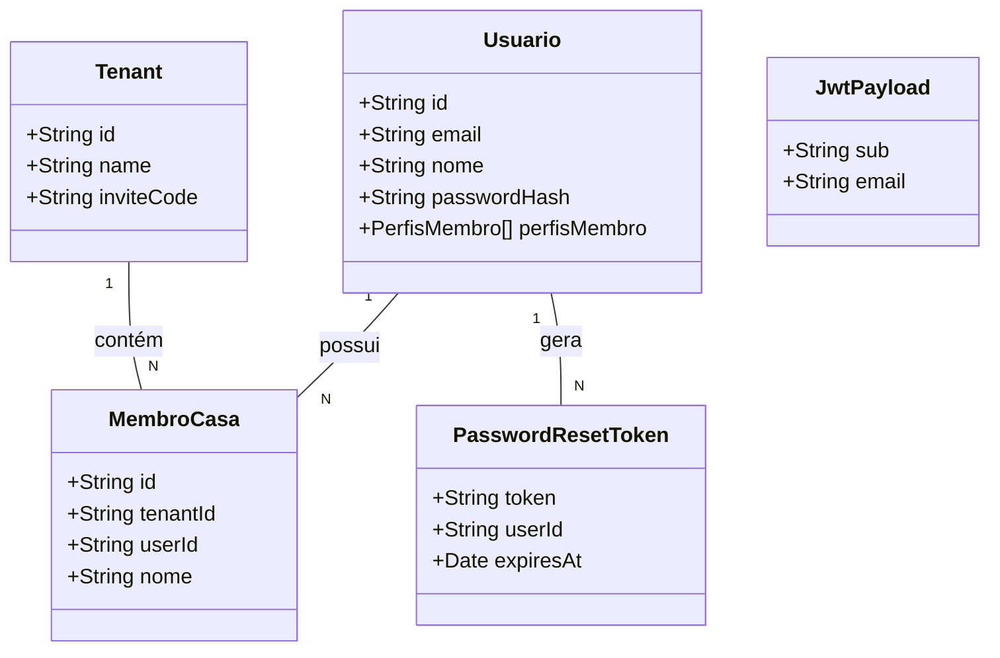

# Review e Fortalecimento do Sistema de Autenticação

## Requirements
Implementar medidas de reforço e auditoria no sistema de autenticação existente para garantir segurança, confiabilidade e robustez no ambiente de produção.

## Entities

## Approach
1. **Auditoria e Segurança**:
   - Validar a configuração do `JWT_SECRET` e expiração do token.
   - Fortalecer o tratamento de erros em operações críticas (ex: envio de e-mail).

2. **Reforço Técnico**:
   - Implementar testes de integração focados no fluxo de registro multitenant.
   - Padronizar o tratamento de exceções (GlobalExceptionHandler).

3. **Logica de Negocio**:
   - Manter a integridade do fluxo de registro e vinculação de usuários a Tenants.
   - Refinar a resiliência em caso de falhas externas (e-mail, etc.).

## Structure
### Inheritance Relationships
1. JwtStrategy implements PassportStrategy
2. JwtAuthGuard extends AuthGuard

### Dependencies
1. AuthService calls PrismaService, JwtService, MailService, FinanceiroGateway
2. JwtStrategy calls None
3. JwtAuthGuard calls Reflector

### Layered Architecture
1. Controller Layer: AuthController (interface com o cliente)
2. Service Layer: AuthService (lógica de negócio e coordenação)
3. Strategy/Guard Layer: JwtStrategy, JwtAuthGuard (autenticação e proteção)
4. Exception Handling Layer: GlobalExceptionHandler (centralização de erros)

## Operations

### Implementar Testes de Integração - AuthFlow
1. Objetivo: Validar cenários de registro, login e recuperação de senha.
2. Responsabilidade: Cobrir casos de borda (inviteCode inválido, e-mail já existente).

### Refatorar Tratamento de Erros - GlobalExceptionHandler
1. Responsabilidade: Centralizar tratamento de erros utilizando `backend/src/shared/filters/global-exception.filter.ts` e definições de exceções em `backend/src/shared/exceptions/auth-exceptions.ts`.
2. Detalhes: Filtro configurado como `APP_FILTER` global para capturar `HttpException` e erros não tratados.

### Refinar Fluxo de Registro - AuthService
1. Objetivo: Melhorar a resiliência da vinculação de MembroCasa ao Tenant.
2. Lógica: Implementada atomicidade utilizando `prisma.$transaction` para garantir a criação do usuário e a vinculação ao Tenant/Membro simultaneamente.

## Norms
1. Annotation Standards: Uso de @Injectable, @Controller, @Module, @Public.
2. Dependency Injection: Uso estrito de construtores com inversão de dependência.
3. Exception Handling: Uso de exceções específicas (UnauthorizedException, ConflictException, etc.) herdadas de HttpException. Utilização de `ExceptionFilter` global para padronização de respostas de erro da API.
4. Logging: Registrar falhas críticas (ex: envio de e-mail) sem expor detalhes sensíveis.

## Safeguards
1. Performance Constraints: Otimizar chamadas ao Prisma (evitar N+1).
2. Security Constraints: Nunca expor detalhes da existência de e-mail no login ou reset.
3. Business Rule Constraints: Todo novo usuário com inviteCode deve ser obrigatoriamente vinculado a um Tenant.
4. Exception Handling Constraints: Nenhum erro de infraestrutura (mail, gateway) deve quebrar o fluxo principal de autenticação.
