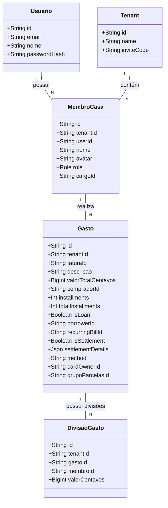

# Codebase Cleanup and Complexity Reduction

## Requirements
Simplificar a complexidade ciclomática na lógica de registro e onboarding de usuários, remover métodos públicos redundantes e código morto da lógica de lançamentos de gastos no backend, e eliminar propriedades obsoletas no ViewModel do dashboard no frontend, promovendo a densificação e a manutenibilidade do sistema Divi sem alterar suas regras de negócio nem o comportamento das APIs existentes.

## Entities

## Approach
1. **Redução de Complexidade Ciclomática**:
   - Refatorar `AuthService.register` extraindo o gerenciamento transacional do `inviteCode` e do vínculo de `MembroCasa` para métodos auxiliares privados e coesos no mesmo arquivo:
     * `associarUsuarioAoTenantTx(tx, user, inviteCode, membroId)`: Coordena o fluxo condicional de convites e vinculações no banco.
     * `vincularMembroExistenteTx(tx, tenantId, userId, membroId)`: Gerencia a atualização de `userId` para registros vinculados a membros já cadastrados (não-novos).
   - Isso reduz a indentação profunda (5+ níveis de ifs) para no máximo 2 níveis.

2. **Remoção de Código Morto (Backend)**:
   - Deletar os métodos públicos `salvarDespesaComum`, `salvarEmprestimo` e `registrarAcerto` em `LancamentoService`. Eles são redundantes visto que a API expõe apenas o método público `salvarGasto` (que já gerencia esses fluxos dinamicamente com base nas flags do DTO).
   - Atualizar a suíte de testes `lancamento.service.spec.ts` para exercitar diretamente o método `salvarGasto` passando DTOs de teste com flags correspondentes (por exemplo, `isLoan: true` ou `isSettlement: true`), mantendo a mesma cobertura de testes mas direcionada à API pública real.

3. **Remoção de Código Morto (Frontend)**:
   - Deletar a propriedade e o método `excluirGasto` do ViewModel `useDashboardViewModel.ts`, visto que esta ação é inteiramente tratada pela função de modal unificada `confirmarEstorno` e `excluirGasto` não possui referências nos templates Vue.

4. **Densificação e Preservação de Integridade**:
   - Manter as assinaturas externas de controllers e contratos inalterados para evitar quebras de API.
   - Assegurar que os testes unitários afetados passem integralmente.

## Structure

### Inheritance Relationships
1. AuthService implements Injectable
2. LancamentoService implements Injectable

### Dependencies
1. AuthService depende de: PrismaService, JwtService, MailService, FinanceiroGateway
2. LancamentoService depende de: PrismaService, FinanceiroGateway
3. useDashboardViewModel depende de: useCartoesEFaturas, useContasFixas, useDashboardUIState, useDashboardPeriodos, useDashboardNetting, useToast

### Layered Architecture
1. Controller Layer: `AuthController`, `FinanceiroController` (inalterados, apenas chamando os serviços refatorados).
2. Service Layer: `AuthService` (com subfunções privadas de onboarding), `LancamentoService` (apenas com `salvarGasto` público).
3. ViewModel Layer: `useDashboardViewModel` (com `excluirGasto` deletado).

## Operations

### Refatorar AuthService
1. Local: [auth.service.ts](file:///d:/projetos/financeiro-divi/backend/src/auth/auth.service.ts)
2. Extrair lógica condicional do bloco transacional de `register` para:
   - `private async associarUsuarioAoTenantTx(tx: Prisma.TransactionClient, user: Usuario, inviteCode?: string, membroId?: string)`
   - `private async vincularMembroExistenteTx(tx: Prisma.TransactionClient, tenantId: string, userId: string, membroId?: string)`
3. Simplificar o método `register` substituindo o bloco transacional aninhado por uma chamada simples a `associarUsuarioAoTenantTx`.

### Refatorar LancamentoService
1. Local: [lancamento.service.ts](file:///d:/projetos/financeiro-divi/backend/src/financeiro/lancamento.service.ts)
2. Remover os seguintes métodos:
   - `salvarDespesaComum`
   - `salvarEmprestimo`
   - `registrarAcerto`
3. Manter os métodos privados correspondentes (`salvarDespesaComumTx`, `salvarEmprestimoTx`, `registrarAcertoTx`) como auxiliares exclusivos de `salvarGasto` e `salvarMuitosGastos`.

### Atualizar Testes de Lançamento
1. Local: [lancamento.service.spec.ts](file:///d:/projetos/financeiro-divi/backend/src/financeiro/lancamento.service.spec.ts)
2. Atualizar as asserções de testes unitários para chamarem `service.salvarGasto` em vez de chamar os wrappers obsoletos deletados, mantendo as mesmas asserções de validação de persistência.

### Limpar useDashboardViewModel
1. Local: [useDashboardViewModel.ts](file:///d:/projetos/financeiro-divi/src/viewmodels/useDashboardViewModel.ts)
2. Remover o método `excluirGasto` (linhas 147-151).

## Norms
1. **Single Responsibility (SRP)**: Reduzir responsabilidade acumulada de métodos concentrando fluxos de IO/DB em rotinas dedicadas.
2. **DRY**: Não manter rotinas duplicadas ou que encapsulam chamadas que já são dinâmicas.
3. **TypeScript Strictness**: Garantir declarações corretas de tipos de dados sem introduzir imports não utilizados.

## Safeguards
1. **Performance Constraints**: A atomicidade transacional utilizando `$transaction` do Prisma no registro de usuário e gravação de gastos deve ser preservada.
2. **Backward Compatibility**: Nenhuma rota da API REST (ex: `/api/financeiro/gastos`, `/api/auth/register`) deve ter sua URL, parâmetros ou contratos DTO alterados.
3. **Execution Safety**: Rodar a verificação de build `pnpm run build` após as alterações para certificar que nenhum import foi quebrado.
4. **Test Integrity**: Executar todos os testes do Jest do backend (`pnpm run test` no backend) e Vitest do frontend (`pnpm run test` no frontend) para garantir regressão zero.
