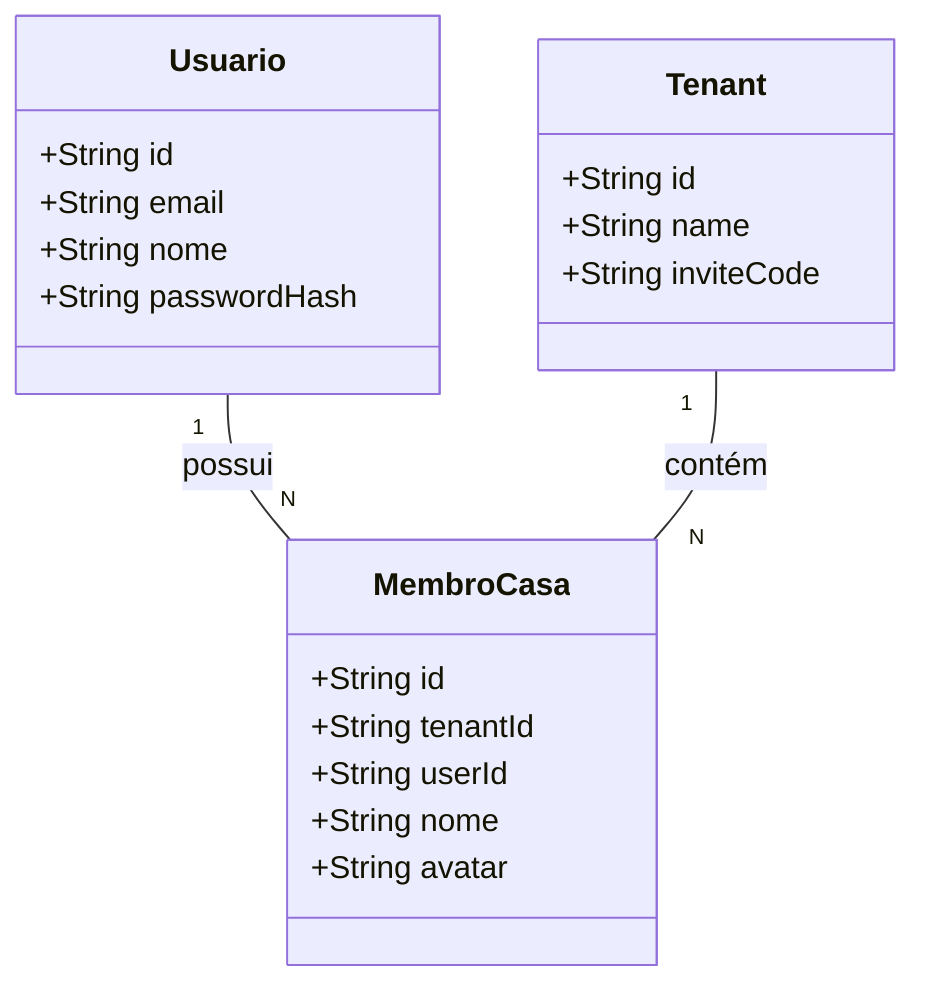

# Redução de Complexidade Ciclomática no Serviço de Autenticação

## Requirements
Reduzir a complexidade ciclomática na lógica de registro e onboarding de usuários, simplificando métodos com ramificações profundas e condicionais aninhados, promovendo a legibilidade, testabilidade e manutenibilidade da camada de serviço do Divi sem alterar suas regras de negócio nem o comportamento das APIs existentes.

## Entities

## Approach
1. **Modularização de Lógica Transacional**:
   - Refatorar o método `register` na classe `AuthService` dividindo o bloco transacional que coordena o onboarding em subfunções privadas e coesas.
   - As subfunções privadas `associarUsuarioAoTenantTx` e `vincularMembroExistenteTx` devem receber explicitamente a instância de transação do Prisma (`tx: Prisma.TransactionClient`).
   - Toda a lógica de verificação de convites, criação de novos moradores ou vinculação de moradores órfãos deve operar exclusivamente sob a transação recebida.

2. **Redução de Níveis de Aninhamento**:
   - Extrair condicionais aninhadas (ifs dentro de ifs em mais de 5 níveis) para que cada método privado trate apenas de um único fluxo de decisão, reduzindo a complexidade ciclomática do método principal para o menor nível possível (no máximo 2 níveis de aninhamento).

3. **Validação de Negócio e Exceções**:
   - Realizar validação de e-mails duplicados fora da transação de forma precoce com `ConflictException` do NestJS.
   - Tratar com segurança os casos onde o código de convite é inválido ou o `membroId` é inexistente.

## Structure

### Inheritance Relationships
1. `AuthService` implementa `Injectable` (NestJS)

### Dependencies
1. `AuthService` depende de: `PrismaService`, `JwtService`, `MailService` e `FinanceiroGateway`

### Layered Architecture
1. **Controller Layer**: `AuthController` (responsável por expor a API de registro sem alterações de contrato)
2. **Service Layer**: `AuthService` (contém o método `register` público e os métodos privados de onboarding transacional)
3. **Database Layer**: `PrismaService` (responsável pelo acesso atômico e execução de transações)

## Operations

### Refatorar AuthService
1. Local: [auth.service.ts](file:///d:/projetos/financeiro-divi/backend/src/auth/auth.service.ts)
2. Criar método privado para vinculação de moradores órfãos:
   - Assinatura: `private async vincularMembroExistenteTx(tx: Prisma.TransactionClient, tenantId: string, userId: string, membroId?: string): Promise<string | null>`
   - Lógica:
     - Retornar `null` se `membroId` não for fornecido ou for igual a `'novo'`.
     - Buscar no banco usando `tx.membroCasa.findFirst` verificando o par `(id, tenantId)`.
     - Se não encontrar, retornar `null`.
     - Se encontrar, atualizar o campo `userId` com o ID do usuário criado e retornar o `membroId`.
3. Criar método privado para coordenação de associação a tenants:
   - Assinatura: `private async associarUsuarioAoTenantTx(tx: Prisma.TransactionClient, user: any, inviteCode?: string, membroId?: string): Promise<{ tenantId: string | null; membroId: string | null }>`
   - Lógica:
     - Retornar `{ tenantId: null, membroId: null }` se `inviteCode` for nulo/indefinido.
     - Buscar no banco usando `tx.tenant.findUnique` pelo código em caixa alta.
     - Se não encontrar o tenant, retornar `{ tenantId: null, membroId: null }`.
     - Tentar realizar a vinculação do morador órfão pelo método `vincularMembroExistenteTx`.
     - Se a vinculação funcionar, retornar o `tenantId` e o `membroId` correspondente.
     - Caso contrário, criar um novo registro em `MembroCasa` usando `tx.membroCasa.create` e retornar o `tenantId` e o ID do novo membro.
4. Simplificar o método `register`:
   - Assinatura: `async register(email: string, nome: string, passwordSecret: string, inviteCode?: string, membroId?: string)`
   - Lógica:
     - Realizar a limpeza do e-mail e verificar duplicidade usando `this.prisma.usuario.findUnique`.
     - Gerar hash da senha utilizando `bcrypt`.
     - Executar a transação via `this.prisma.$transaction` onde se cria o `Usuario` e se chama a subfunção `associarUsuarioAoTenantTx`.
     - Disparar notificação via WebSocket fora da transação se o tenant for vinculado com sucesso.
     - Retornar os dados básicos do usuário criado.

## Norms
1. **Transaction Isolation**: É expressamente proibido o uso de `this.prisma` em subfunções auxiliares de transação. Toda interação com o banco dentro de `associarUsuarioAoTenantTx` e `vincularMembroExistenteTx` deve ser realizada por meio da referência `tx` recebida por parâmetro.
2. **TypeScript Strictness**: Garantir assinaturas tipadas e verificações corretas de tipos de dados sem o uso de `any` ou casting desnecessário (exceto onde compatível com retorno do Prisma).
3. **DRY**: Reutilizar as funções auxiliares internas de transação e evitar duplicação de fluxos de consulta ao banco de dados.

## Safeguards
1. **Backward Compatibility**: Nenhuma alteração pode quebrar o contrato da rota `/api/auth/register`, nem suas assinaturas externas e parâmetros recebidos.
2. **Transactional Soundness**: A criação de usuário e o vínculo com membros/tenants devem ser atômicos no Prisma. Se a criação do membro falhar, o usuário não deve ser persistido.
3. **Null-Safety**: Lidar com ausência de `inviteCode` ou `membroId` de maneira segura para não causar quebras inesperadas ou falhas de chave estrangeira (FK) no banco de dados.
