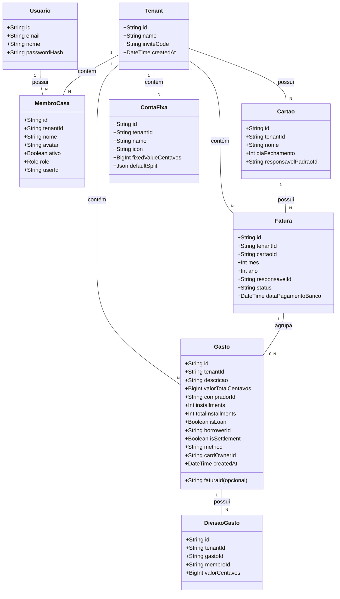

# Alinhamento do Modelo de Negócios Divi com a Realidade

## Requirements
Adequar a modelagem de dados e as regras de negócio do sistema de finanças compartilhadas Divi à realidade informal de divisão de despesas domésticas. Isso consiste em:
1. **Opcionalidade de Faturas para Gastos**: Tornar a associação de gastos com faturas de cartões opcional, permitindo transações avulsas via PIX, dinheiro e débito sem a necessidade de criar cartões ou faturas fictícias no sistema.
2. **Simplificação de Permissões**: Eliminar a complexidade burocrática de cargos customizados em banco de dados (`CargoCasa`), adotando uma hierarquia simplificada de controle baseada em roles nativas pré-definidas.
3. **Flexibilidade na Gestão de Cartões**: Permitir que qualquer membro ativo da casa cadastre cartões de crédito para fins de compartilhamento de despesas, removendo a restrição de que o usuário criador deve obrigatoriamente ser o responsável padrão.

## Entities


## Approach
1. **Banco de Dados & Schema**:
   - Atualizar `backend/prisma/schema.prisma` para tornar `faturaId` opcional na tabela de `gastos` (`faturaId String?`).
   - Remover a tabela `cargos_casa` e a relação `cargoId` do modelo `MembroCasa`. As permissões passam a ser inferidas exclusivamente pelo enum `Role` (ADMIN, MORADOR, VISUALIZADOR).
   - Rodar a migração do Prisma gerando um arquivo de migração SQL seguro.

2. **Lógica de Serviços do Backend**:
   - Ajustar o `GastoDto` para aceitar `faturaId` opcional.
   - Modificar `LancamentoService` para lidar com a opcionalidade do `faturaId`. Se o método de pagamento for 'pix' ou outro tipo avulso e nenhum `faturaId` for fornecido, salvar no banco com `null`.
   - Modificar `CartaoService` em `salvarCartao` para remover a checagem que restringe o cadastro apenas para cartões nos quais o usuário logado é o responsável padrão.

3. **Arquitetura & Fluxo do Frontend**:
   - Remover do frontend a emulação de cartões virtuais e faturas virtuais (`PIX_DEFAULT_ID`). O extrato de lançamentos e o cálculo de netting não devem depender de uma fatura de PIX fictícia para o agrupamento mensal de despesas avulsas.
   - Atualizar a função utilitária `gastoPertenceAoPeriodo` no frontend para verificar se o `faturaId` do gasto é nulo. Se for nulo, a vinculação com o período selecionado deve ocorrer via mês e ano de criação da despesa (`createdAt`).
   - Limpar no frontend toda importação ou menção a cargos customizados, direcionando para a role básica do membro (`membro.role`).

## Structure

### Inheritance Relationships
1. `MembroCasa` e `Gasto` mapeiam para tipos de dados com compatibilidade nula nos campos `userId` e `faturaId` respectivamente.

### Dependencies
1. O frontend (`useDashboardViewModel.ts`) interage com `gastoService` e `faturaService` sem a premissa de que todo gasto precisa estar atrelado a uma fatura ativa no banco.
2. `gastoPertenceAoPeriodo.ts` passa a depender da data de criação do gasto (`createdAt`) como fallback em casos de gastos avulsos (PIX, Dinheiro, etc.).

### Layered Architecture
1. **Prisma Layer**: Controla chaves estrangeiras opcionais e remoção das tabelas de cargo.
2. **DTO Layer**: Opcionalidade de campos nos payloads de entrada no NestJS.
3. **Service Layer**: Flexibilidade na persistência de gastos sem faturas no backend.
4. **ViewModel / Component Layer**: Exibição de extratos consolidados por competência mensal para gastos avulsos e agrupamento físico para gastos de faturas de cartões reais.

## Operations

### Atualizar Prisma Schema e Executar Migração
1. Local: [schema.prisma](file:///d:/projetos/financeiro-divi/backend/prisma/schema.prisma)
2. Modificar o campo `faturaId` no modelo `Gasto`:
   ```prisma
   model Gasto {
     ...
     faturaId            String?  @map("fatura_id") // Modificado para opcional
     ...
   }
   ```
3. Remover a relação e modelo de cargo em `MembroCasa` e apagar `CargoCasa`:
   - Deletar `cargoId` e relação `cargo` de `MembroCasa`.
   - Deletar o model `CargoCasa`.
4. Executar no terminal:
   `pnpm --filter backend prisma migrate dev --name make-fatura-optional-and-remove-cargo`

### Ajustar Backend DTOs e Validações
1. Local: [gasto.dto.ts](file:///d:/projetos/financeiro-divi/backend/src/financeiro/dto/gasto.dto.ts)
2. Modificar o campo `faturaId` para opcional:
   - Trocar `@IsNotEmpty()` por `@IsOptional()`
   - Mudar assinatura para `faturaId?: string;`

### Refatorar Lógica de Cartão no Backend
1. Local: [cartao.service.ts](file:///d:/projetos/financeiro-divi/backend/src/financeiro/cartao.service.ts)
2. Modificar o método `salvarCartao` para remover o bloco de checagem restritivo de posse:
   - Remover as linhas:
     ```typescript
     if (!membro || membro.id !== responsavelPadraoId) {
       throw new BadRequestException('Você só pode cadastrar cartões nos quais você é o responsável padrão.');
     }
     ```

### Limpar Emulação de Cartão PIX no Frontend
1. Local: [FaturaService.ts](file:///d:/projetos/financeiro-divi/src/models/services/FaturaService.ts)
2. Remover a criação dinâmica da fatura fictícia `PIX_DEFAULT_ID` nas linhas 26 a 35:
   - Remover o bloco que insere `PIX_DEFAULT_ID` na lista `novasFaturas`.
3. Local: [CartaoResolver.ts](file:///d:/projetos/financeiro-divi/src/models/services/CartaoResolver.ts)
4. Modificar `resolverCartao` para aceitar e retornar `cartaoId: null` para pagamentos à vista/PIX/dinheiro:
   ```typescript
   export function resolverCartao(
     method: 'pix' | 'card',
     cardOwnerId: string | null,
     compradorId: string,
     todosCartoes: Cartao[]
   ): CartaoResolvido {
     if (method === 'pix') {
       return {
         cartaoId: null, // Modificado de 'PIX_DEFAULT_ID' para null
         cardOwner: null,
         responsavelFaturaId: compradorId,
       }
     }
     ...
     const primeiroCartao = todosCartoes[0]
     return {
       cartaoId: primeiroCartao?.id ?? null, // Modificado de 'PIX_DEFAULT_ID' para null
       cardOwner: null,
       responsavelFaturaId: compradorId,
     }
   }
   ```

### Atualizar Utilitário de Filtro de Períodos
1. Local: [gastoPeriodo.ts](file:///d:/projetos/financeiro-divi/src/shared/utils/gastoPeriodo.ts)
2. Atualizar a lógica para avaliar a competência da data caso o `faturaId` seja nulo/indefinido:
   ```typescript
   export const gastoPertenceAoPeriodo = (g: Gasto, mes: number, ano: number, faturas: Fatura[]) => {
     if (!g.faturaId) {
       const dataGasto = g.createdAt ? new Date(g.createdAt) : new Date()
       return dataGasto.getMonth() + 1 === mes && dataGasto.getFullYear() === ano
     }
     const fat = faturas.find(f => f.id === g.faturaId)
     if (fat) {
       return fat.periodo.mes === mes && fat.periodo.ano === ano
     }
     const periodoVirtual = extrairPeriodoDeFaturaId(g.faturaId)
     if (periodoVirtual) {
       return periodoVirtual.mes === mes && periodoVirtual.ano === ano
     }
     return false
   }
   ```

### Ajustar Entidade Gasto no Frontend
1. Local: [Gasto.ts](file:///d:/projetos/financeiro-divi/src/models/entities/Gasto.ts)
2. Modificar as propriedades da interface `GastoProps` e da classe `Gasto` para tornar `faturaId` do tipo `string | null` e incluir a propriedade `createdAt?: Date | string`.

### Refatorar Tipagem e Null-Safety em GastoService
1. Local: [GastoService.ts](file:///d:/projetos/financeiro-divi/src/models/services/GastoService.ts)
2. Corrigir o método `relancarGasto` para computar a data de competência a partir de `createdAt` do gasto original se `faturaId` for nulo.
3. Ajustar `salvarParcelasAtualizadas` e `atualizarGastoIndividual` para buscar faturas originais apenas se `gasto.faturaId` for válido.
4. Mudar assinatura do método `criarGastoAtualizado` para aceitar `faturaId: string | null`.

### Aplicar Null-Safety no Estorno do Dashboard
1. Local: [useDashboardViewModel.ts](file:///d:/projetos/financeiro-divi/src/viewmodels/useDashboardViewModel.ts)
2. Tratar `faturaId` opcional com verificação de segurança antes de chamar `cartoesEFaturas.reabrirFatura` no estorno de lançamentos de netting.

### Atualizar Asserções de Testes de Cartão
1. Local: [CartaoResolver.test.ts](file:///d:/projetos/financeiro-divi/src/models/services/CartaoResolver.test.ts)
2. Atualizar cenários de pagamento via PIX e sem cartão cadastrado para esperar `cartaoId: null` em vez de `'PIX_DEFAULT_ID'`.

### Excluir Arquivos de Cargos Descontinuados
1. Remover do sistema de arquivos os arquivos obsoletos `cargo.service.ts` e `dto/cargo-casa.dto.ts` na pasta `backend/src/financeiro/`.

## Norms
1. **TypeScript Safety**: Chaves opcionais de relacionamentos em banco de dados (`faturaId?: string | null`) devem ser tratadas com verificações estritas de nulo no front e backend.
2. **Fallback Dynamics**: Sempre que uma despesa avulsa for lançada, o backend deve salvar `faturaId: null` em vez de valores vazios or strings fictícias.
3. **Prisma Schema Consistency**: A remoção do modelo `CargoCasa` deve ser feita de modo limpo, excluindo também as referências de importação ou tabelas correlacionadas e executando o lint do schema.

## Safeguards
1. **Retrocompatibilidade de Dados**: A migração de banco de dados não deve quebrar registros de despesas existentes. Os gastos legados vinculados ao `PIX_DEFAULT_ID` devem ser mantidos funcionando ou atualizados para `faturaId = null` via script de migração Prisma.
2. **Prevenção de Faturas Órfãs**: A exclusão de um cartão de crédito deve desencadear a exclusão segura de suas faturas no banco ou o bloqueio caso existam gastos atrelados reais.
3. **Null-Safety no Dashboard**: O ViewModel de Extrato deve estar preparado para renderizar itens de gastos sem crashar ao tentar acessar propriedades de uma fatura inexistente.
