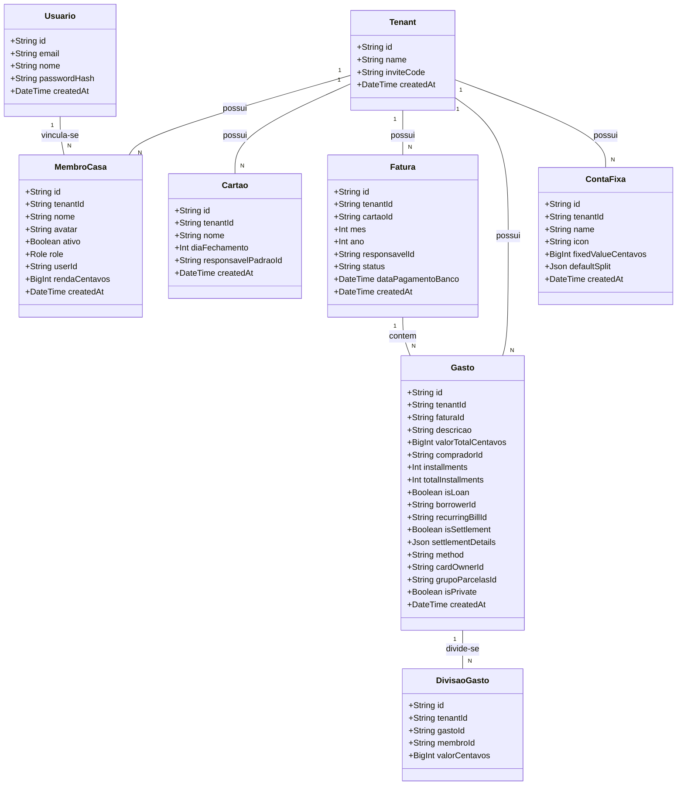

# Geração de Funcionalidades Baseadas no Alinhamento com a Realidade de Mercado (DIVI)

## Requirements
- **Implementar Divisão Proporcional à Renda**: Permitir que grupos configurem as rendas mensais de cada morador e usem essas proporções de renda de forma automatizada no wizard de lançamento de despesas e nas contas fixas, de forma a reduzir o principal atrito financeiro doméstico apontado pelas estatísticas.
- **Implementar Flag de Privacidade para Gastos (isPrivate)**: Oferecer a opção de ocultar a descrição de despesas pessoais específicas feitas nos cartões e faturas compartilhadas do grupo, preservando o valor bruto no cálculo de saldos e netting. Isso protege a privacidade individual e combate o problema estrutural de infidelidade financeira (esconder gastos).
- **Manter Flexibilidade Operacional Descentralizada**: Garantir que o cadastro de cartões, faturas e lançamentos permaneça livre de burocracias de permissões e chaves rígidas, respeitando a dinâmica residencial baseada em confiança mútua.

## Entities

## Approach
1. **Modelagem de Dados e Migração**:
   - Adicionar o campo opcional `rendaCentavos` (BigInt) na tabela `MembroCasa` no arquivo `schema.prisma`.
   - Adicionar o campo `isPrivate` (Boolean, default: false) na tabela `Gasto` no arquivo `schema.prisma`.
   - Executar a migração via Prisma CLI para aplicar as alterações estruturais no banco de dados Postgres local.

2. **Backend (NestJS)**:
   - **DTOs**: Atualizar o `MembroDto` para incluir o campo opcional `rendaCentavos` e o `GastoDto` para aceitar `isPrivate`.
   - **MembroService**: Ajustar o mapeamento no `persistirMembro` para armazenar `rendaCentavos` (convertendo para BigInt caso venha como número do cliente).
   - **LancamentoService**: Modificar o método `upsertGastoCompletoTx` para incluir o campo `isPrivate`.
   - **Regra de Mascaramento**: Na listagem e busca de gastos do `FinanceiroController`, verificar se `gasto.isPrivate` é verdadeiro e se o `gasto.compradorId` é diferente do ID de membro do usuário logado na requisição. Caso seja verdadeiro, a string da `descricao` do gasto deve ser mascarada para `"Gasto Pessoal"` antes de enviar a resposta HTTP. Isso previne o vazamento de detalhes privados de compras individuais para o resto do grupo doméstico, enquanto mantém o fluxo financeiro exato de valores.

3. **Frontend (Vue 3 + Vite)**:
   - **Modo Foco e Cadastro de Renda**: Adicionar o campo numérico "Renda Mensal" nos formulários de criação e edição de moradores (`MembroFormBottomSheet.vue` e `GestaoAcessoTab.vue`). O valor em reais deve ser convertido para centavos ao enviar para a API.
   - **Cálculo de Proporção Dinâmica no Wizard**: No componente `NovoLancamentoWizard.vue` (na etapa de definição de divisão), incluir o botão "Dividir Proporcional à Renda". Ao ser acionado, o sistema calcula a divisão percentual e em centavos de forma proporcional baseando-se nas rendas autodeclaradas dos membros selecionados (ex: `valor_membro = valor_total * (renda_membro / soma_rendas_selecionadas)`). Se algum membro selecionado não tiver renda cadastrada, exibir um alerta sugerindo a atribuição de um valor ou assumindo um rateio igualitário para esse membro específico.
   - **Checkbox de Privacidade no Wizard**: Adicionar o checkbox "Marcar como gasto privado (apenas o valor será visível para os outros)" no formulário de criação de gastos.
   - **Exibição Mascarada no Feed**: No componente do feed de atividades, garantir que a descrição do gasto seja renderizada de forma amigável (como "Gasto Privado de [Nome Comprador]") caso a descrição recebida do backend seja mascarada ou marcada como privada.

## Structure
### Componentes e Serviços Backend:
- `MembroService` depende de `PrismaService` para salvar `rendaCentavos`.
- `LancamentoService` depende de `PrismaService` para persistir `isPrivate` no banco.
- `FinanceiroController` injeta `MembroService` e `LancamentoService`, aplicando a lógica de filtragem/mascaramento de gastos com base na identidade do usuário logado.

### Componentes Frontend:
- `ConfiguracoesMembros.vue` carrega as informações do membro por meio de `useMembros`.
- `GestaoAcessoTab.vue` renderiza a edição de moradores.
- `MembroFormBottomSheet.vue` coleta os dados de criação.
- `NovoLancamentoWizard.vue` gerencia as etapas de entrada de gastos e divisões de saldo.

## Operations

### [Backend] Alteração no Schema do Prisma
1. Adicionar o campo `rendaCentavos` no modelo `MembroCasa` no arquivo `schema.prisma`:
   - `rendaCentavos BigInt? @map("renda_centavos")`
2. Adicionar o campo `isPrivate` no modelo `Gasto` no arquivo `schema.prisma`:
   - `isPrivate Boolean @default(false) @map("is_private")`
3. Executar o comando no terminal do backend para gerar e aplicar a migration:
   - `npx prisma migrate dev --name add_renda_e_isprivate`

### [Backend] Atualização dos DTOs
1. Modificar `backend/src/financeiro/dto/membro.dto.ts` adicionando:
   - `@ApiPropertyOptional({ description: 'Renda do membro em centavos' })`
   - `@IsOptional()`
   - `@IsNumber()`
   - `rendaCentavos?: number;`
2. Modificar `backend/src/financeiro/dto/gasto.dto.ts` adicionando:
   - `@ApiPropertyOptional({ description: 'Indica se o gasto é privado' })`
   - `@IsOptional()`
   - `@IsBoolean()`
   - `isPrivate?: boolean;`

### [Backend] Atualização dos Serviços
1. Atualizar o método `persistirMembro` em `backend/src/financeiro/membro.service.ts` para mapear `rendaCentavos` para o Prisma:
   - Se `rendaCentavos` estiver presente no DTO, converter para `BigInt` (ou salvar `null` se ausente) nas seções `create` e `update` do `upsert`.
2. Atualizar o método `upsertGastoCompletoTx` em `backend/src/financeiro/lancamento.service.ts` para mapear `isPrivate` para a gravação do Prisma:
   - Se `isPrivate` estiver presente no DTO, persistir como booleano na gravação e atualização do Gasto.

### [Backend] Lógica de Mascaramento no Controller
1. No arquivo `backend/src/financeiro/financeiro.controller.ts`, modificar o endpoint que retorna os gastos (ou na serialização dos gastos retornados).
2. Identificar o ID de membro associado ao usuário autenticado que realiza a requisição (`request.user.id` mapeado para o membro da moradia ativa).
3. Ao retornar os gastos de um período/fatura, aplicar um mapeamento:
   - Se `gasto.isPrivate === true` e `gasto.compradorId !== membroIdDoRequisitante`, alterar a propriedade `descricao` para `"Gasto Pessoal"`. A propriedade `isPrivate` original deve ser mantida como `true` para que o frontend saiba aplicar a estilização correta de privacidade.

### [Frontend] Atualização de Entidades e Tipos
1. Atualizar o modelo de entidade `Membro` no frontend para suportar a propriedade `rendaCentavos?: number` ou `BigInt`.
2. Atualizar o modelo de entidade `Gasto` no frontend para conter `isPrivate: boolean`.

### [Frontend] Tela de Configuração de Moradores
1. Adicionar o campo "Renda Mensal (R$)" nos componentes `MembroFormBottomSheet.vue` e na seção de edição do morador em `GestaoAcessoTab.vue`.
2. Criar uma máscara de entrada ou converter o input decimal amigável (ex: `3000.50`) multiplicando por `100` para salvar no banco como centavos inteiros (`300050`).
3. Ao carregar as informações do membro, exibir a renda convertida dividindo o valor de centavos obtido do backend por `100`.

### [Frontend] Wizard de Novo Lançamento
1. Adicionar o checkbox de Gasto Privado na primeira etapa do `NovoLancamentoWizard.vue` (dados da compra).
2. Na etapa de rateio da divisão de gastos do wizard, incluir a opção de botão "Rateio Proporcional à Renda".
3. Implementar a lógica de cálculo do rateio proporcional no viewmodel/wizard:
   - Somar a renda de todos os membros selecionados para a divisão.
   - Para cada membro, calcular o valor correspondente: `valorMembro = Math.round(valorTotal * (rendaMembro / somaRendas))`.
   - Lidar com problemas de arredondamento de centavos distribuindo a diferença de resto (centavo órfão) para o comprador ou para o membro de maior valor.
   - Se algum membro selecionado não possuir renda cadastrada, disparar um aviso informando que o cálculo assumirá uma renda padrão provisória de igual proporção com os demais moradores.

### [Frontend] Mascaramento Visual no Feed
1. No componente de histórico/feed de gastos (`ActivityFeed.vue`), verificar se `gasto.isPrivate` é verdadeiro e aplicar uma estilização visual diferenciada (ex: ícone de cadeado, fonte itálica em cinza) quando a despesa for de outro usuário, com o texto `"Gasto Pessoal"`.

## Norms
- **Valores Financeiros em Centavos**: Todo cálculo e armazenamento de valores monetários (renda do membro, valor total do gasto, parcelas de divisão de gasto) devem ser mantidos como inteiros representando centavos (`BigInt` no banco, convertidos adequadamente para JSON) para evitar imprecisões aritméticas de ponto flutuante IEEE 754.
- **Mascaramento Protetivo**: O mascaramento da descrição do gasto privado deve ser executado primariamente no backend para evitar que a descrição real seja inspecionada nas requisições de rede (ferramentas de desenvolvedor de navegadores).
- **Padronização de DTOs**: Seguir estritamente o uso dos DTOs decorados com `class-validator` e `class-transformer` no NestJS.

## Safeguards
- **Consistência de Divisão**: O backend deve validar na transação de salvamento de gastos se a soma de todas as divisões (`DivisaoGasto.valorCentavos`) bate exatamente com o valor total do gasto (`Gasto.valorTotalCentavos`), impedindo transações inconsistentes.
- **Renda Não Negativa**: Adicionar validação de que a renda do membro (`rendaCentavos`) deve ser maior ou igual a zero (`>= 0`).
- **Verificação de Moradia Coerente**: Impedir que o rateio proporcional inclua membros inativos ou de outros Tenants.
- **Integridade Matemática do Netting**: Garantir que as despesas privadas entrem no cálculo de compensação de saldos de faturas sem qualquer diferença em relação a despesas públicas (a única diferença deve ser a visualização da descrição, a matemática de quem deve a quem permanece intacta).
