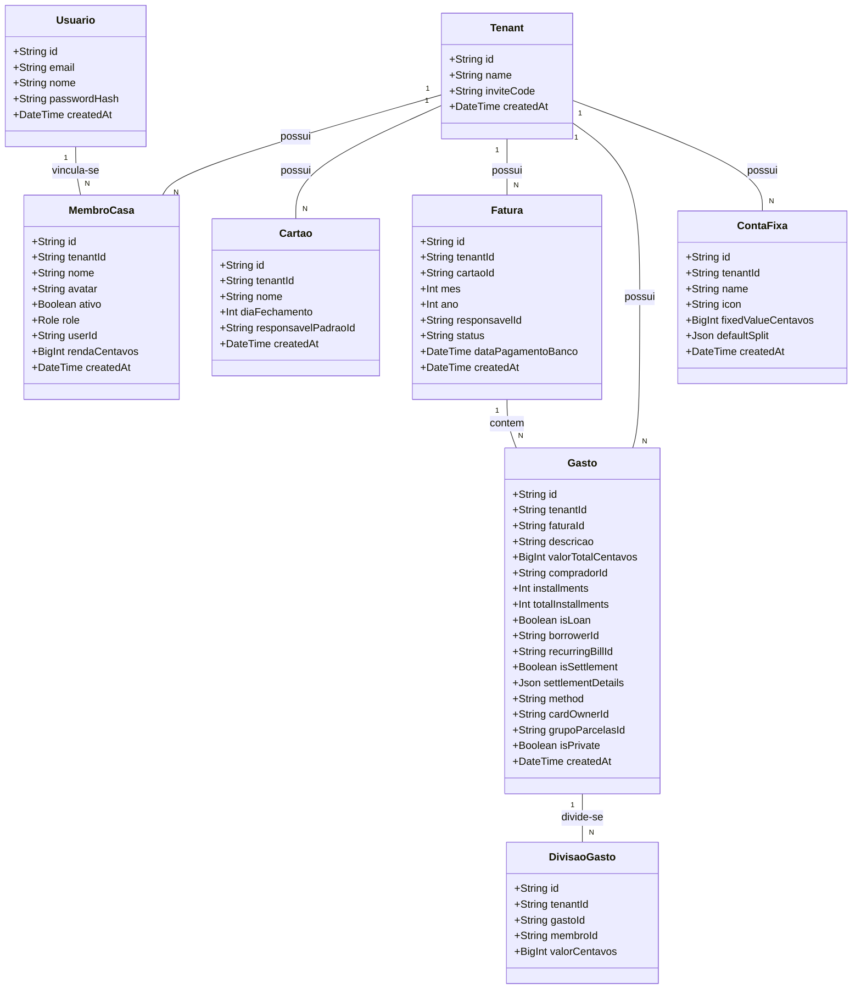

# Geração de Funcionalidades Baseadas no Alinhamento com a Realidade de Mercado (DIVI)

## Requirements
- **Implementar Visualização da Divisão Proporcional à Renda no Wizard**: Exibir dinamicamente o cálculo percentual e simulado de rateio proporcional com base nas rendas declaradas dos moradores selecionados diretamente no componente de interface de divisão do wizard (`StepSplitSelector.vue`), oferecendo clareza imediata e simulação visual antes da confirmação do lançamento.
- **Implementar Mascaramento Condicional de Gasto Privado com Exceção ao Dono do Cartão**: Atualizar o controle de listagem de gastos no backend (`FinanceiroController.listarGastos`) para que a descrição de gastos privados (`isPrivate = true`) seja visível ao comprador (`compradorId`) e ao dono do cartão físico (`cardOwnerId`), mascarando-a como `"Gasto Pessoal"` apenas para os demais moradores da casa.
- **Impedir a Desativação de Moradores com Saldo Acumulado Ativo**: Adicionar validação contábil no backend (`MembroService.validarRegrasSalvarMembro`) que previne a desativação de qualquer `MembroCasa` se a soma de seus pagamentos acumulados subtraída de suas divisões de gastos (saldo netting consolidado) no Tenant for diferente de zero.

## Entities


## Approach
1. **Lógica de Mascaramento Inteligente e Seguro no Backend**:
   - No backend, no arquivo `backend/src/financeiro/financeiro.controller.ts`, o endpoint `GET /financeiro/gastos` intercepta o array de despesas.
   - Para cada gasto, verifica: se `gasto.isPrivate === true` e `gasto.compradorId !== requisitante.membroId` e `gasto.cardOwnerId !== requisitante.membroId`, substitui a propriedade `descricao` por `"Gasto Pessoal"`.
   - Isso garante proteção de privacidade na visualização de terceiros, mas permite que o comprador e o dono do cartão (responsável pela fatura real) enxerguem a descrição para a conciliação bancária de forma transparente.

2. **Validação Contábil Contra Fuga de Dívidas (Desativação Bloqueada)**:
   - No `MembroService` do backend, durante a alteração de dados do membro, caso o status de ativação esteja mudando de `ativo: true` para `ativo: false`:
     - Realizar agregação do total pago pelo membro: `SUM(valorTotalCentavos)` na tabela `Gasto` filtrando por `tenantId` e `compradorId`.
     - Realizar agregação do total devido pelo membro: `SUM(valorCentavos)` na tabela `DivisaoGasto` filtrando por `tenantId` e `membroId`.
     - Se `totalPago - totalDevido !== 0`, lançar `BadRequestException` informando o saldo restante e impedindo a desativação até o acerto/netting do saldo ser finalizado.

3. **Cálculo de Proporção em Tempo Real no Wizard de Divisão (Frontend)**:
   - No componente `StepSplitSelector.vue`, calcular computacionalmente e em tempo real a divisão simulada proporcional à renda baseada nos membros atualmente selecionados e no valor digitado (obtido como prop do wizard ou simulado).
   - Renderizar o percentual calculado de cada membro diretamente abaixo de seu respectivo avatar na interface de seleção quando a opção "Proporcional" estiver selecionada, garantindo visibilidade da simulação de rateio em tempo real.
   - Tratar a ausência de renda de moradores aplicando a renda média estimada dos demais moradores com renda cadastrada.

## Structure

### Relacionamentos e Fluxo
1. `FinanceiroController` depende de `MembroService` para buscar a identidade do membro requisitante logado no sistema.
2. `FinanceiroController` intercepta a lista de gastos obtida do `LancamentoService` no método `listarGastos` para aplicar a regra de mascaramento de privacidade.
3. `MembroService` usa o `PrismaService` para realizar consultas de agregação de saldos acumulados de moradores antes de permitir alterações de status.
4. `StepSplitSelector.vue` recebe `membros` como prop e emite eventos de atualização do `splitType` e de `participantesDivisao`.

## Operations

### [Backend] Modificar Lógica de Mascaramento no Controller
**Arquivo**: `backend/src/financeiro/financeiro.controller.ts`
1. No método `listarGastos`, modificar a serialização de mascaramento:
   - Obter o membro da moradia correspondente ao usuário logado: `const membro = await this.membroService.obterMembroPorUsuario(tenantId, req.user.userId)`.
   - Iterar no array de gastos. Se um gasto possuir `gasto.isPrivate === true`, verificar se `gasto.compradorId !== membro.id && gasto.cardOwnerId !== membro.id`.
   - Caso ambas as negações sejam verdadeiras, alterar a propriedade `descricao` do gasto para `"Gasto Pessoal"`.
   - Retornar o array modificado.

### [Backend] Impedir Desativação de Moradores com Saldo Pendente
**Arquivo**: `backend/src/financeiro/membro.service.ts`
1. No método `validarRegrasSalvarMembro`, localizar a verificação de desativação (onde `isActive === false` e `membroAtual.ativo === true`).
2. Adicionar uma consulta de agregação no banco de dados:
   - Obter a soma de todos os gastos daquele membro:
     ```typescript
     const totalPago = await this.prisma.gasto.aggregate({
       where: { tenantId, compradorId: id },
       _sum: { valorTotalCentavos: true }
     });
     ```
   - Obter a soma de todas as divisões atribuídas àquele membro:
     ```typescript
     const totalDevido = await this.prisma.divisaoGasto.aggregate({
       where: { tenantId, membroId: id },
       _sum: { valorCentavos: true }
     });
     ```
   - Calcular o saldo contábil: `const saldoCentavos = Number(totalPago._sum.valorTotalCentavos || 0n) - Number(totalDevido._sum.valorCentavos || 0n)`.
   - Se `saldoCentavos !== 0`, disparar `throw new BadRequestException('Não é possível desativar um morador com saldo pendente na moradia (Saldo atual: R$ ' + (saldoCentavos / 100).toFixed(2).replace('.', ',') + ').')`.
### [Frontend] Repasse do Valor do Lançamento no Wizard
**Arquivo**: `src/views/screens/NovoLancamentoWizard.vue`
1. Passar a prop `:valor-total` para o componente `<StepSplitSelector>` na etapa de divisão (`currentState === 'SPLIT'`), convertendo o valor reativo string/number do formulário:
   - `:valor-total="Number(valor)"`

### [Frontend] Simulação e Visualização Proporcional de Renda na UI de Divisão
**Arquivo**: `src/views/components/wizard/StepSplitSelector.vue`
1. Adicionar a prop `valorTotal?: number` na interface `Props` do componente.
2. Implementar computação reativa `proporcoesMembros` para simular o rateio e percentuais em tempo real, com segurança de tipos para lidar com rendas nulas ou não cadastradas:
   ```typescript
   const proporcoesMembros = computed(() => {
     if (props.splitType !== 'proportional' || props.participantesDivisao.length === 0) {
       return {}
     }
     
     const participantesComRenda = props.participantesDivisao.map(id => {
       const m = props.membros.find(memb => memb.id === id)
       const renda = m?.rendaCentavos && Number(m.rendaCentavos) > 0 ? Number(m.rendaCentavos) : 0
       return { id, renda }
     })

     const temMembrosSemRenda = participantesComRenda.some(p => p.renda === 0)
     const membrosComRendaValida = participantesComRenda.filter(p => p.renda > 0)

     if (membrosComRendaValida.length === 0) {
       const pct = 100 / props.participantesDivisao.length
       const resultado: { [id: string]: { percent: number; valor?: number; estimada: boolean } } = {}
       props.participantesDivisao.forEach(id => {
         resultado[id] = {
           percent: pct,
           estimada: false,
           valor: props.valorTotal ? (props.valorTotal / props.participantesDivisao.length) : undefined
         }
       })
       return resultado
     }

     if (temMembrosSemRenda) {
       const somaRendasValidas = membrosComRendaValida.reduce((acc, p) => acc + p.renda, 0)
       const rendaMedia = Math.round(somaRendasValidas / membrosComRendaValida.length)
       participantesComRenda.forEach(p => {
         if (p.renda === 0) p.renda = rendaMedia
       })
     }

     const somaRendasTotal = participantesComRenda.reduce((acc, p) => acc + p.renda, 0)
     const resultado: { [id: string]: { percent: number; valor?: number; estimada: boolean } } = {}

     participantesComRenda.forEach(p => {
       const mOriginal = props.membros.find(memb => memb.id === p.id)
       const estimada = !mOriginal?.rendaCentavos || Number(mOriginal.rendaCentavos) <= 0

       const percent = (p.renda / somaRendasTotal) * 100
       let valorEstimado: number | undefined = undefined
       if (props.valorTotal) {
         valorEstimado = props.valorTotal * (p.renda / somaRendasTotal)
       }

       resultado[p.id] = {
         percent,
         valor: valorEstimado,
         estimada
       }
     })

     return resultado
   })
   ```
3. Atualizar a marcação do template do seletor para exibir a porcentagem calculada, o valor simulado e um indicador `*est.` (estimado) para membros sem renda, com segurança contra objetos undefined (`?.`):
   ```html
   <span 
     v-if="splitType === 'proportional' && internalParticipantes.includes(m.id) && proporcoesMembros[m.id]"
     class="text-[9px] font-bold text-ash mt-0.5 leading-none block text-center animate-in fade-in duration-300"
   >
     {{ Math.round(proporcoesMembros[m.id]?.percent ?? 0) }}%
     <span v-if="proporcoesMembros[m.id]?.valor !== undefined" class="block text-[8px] text-slate-500 font-semibold mt-0.5">
       R$ {{ (proporcoesMembros[m.id]?.valor ?? 0).toFixed(2).replace('.', ',') }}
     </span>
     <span v-if="proporcoesMembros[m.id]?.estimada" class="text-[8px] text-amber-600 block mt-0.5 font-medium">*est.</span>
   </span>
   ```

## Norms
- **Mascaramento no Servidor**: O mascaramento de strings descritivas de gastos privados deve ser realizado exclusivamente no backend para evitar que dados confidenciais transitem nas requisições HTTP e fiquem expostos no console de rede do navegador do cliente.
- **Valores Centesimais em BigInt**: Toda comparação matemática e operações de agregação de saldos devem usar inteiros representando centavos (`BigInt` em nível de banco de dados, convertendo para Number/BigInt no NestJS conforme adequado) para afastar erros de arredondamento inerentes à ponto flutuante.

## Safeguards
- **Validade do Saldo de Netting**: Qualquer membro com saldo diferente de zero (devedor ou credor) está proibido de ser desativado ou excluído da casa, assegurando que o total geral de netting da moradia permaneça sempre perfeitamente balanceado em zero.
- **Exceção de Fraude de Fatura**: O mascaramento de gastos privados nunca deve ser aplicado ao proprietário do cartão (`cardOwnerId`), permitindo que o titular da linha de crédito faça a conciliação sem fricções contábeis.
- **Segurança de Validação Transacional**: As somas de rateio em centavos gravadas no banco de dados devem corresponder exatamente ao valor total do gasto, bloqueando qualquer lançamento incompleto ou inconsistente.
