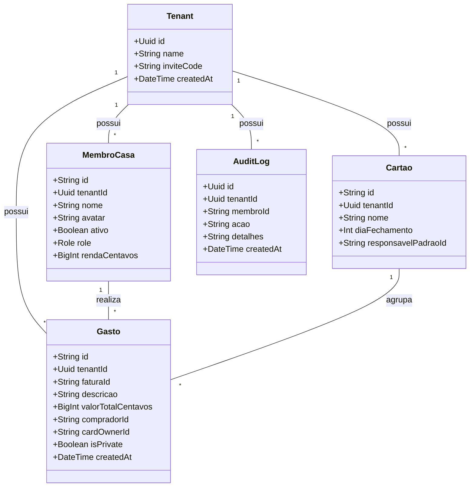

# REASONS Canvas: Validação e Segurança do Modelo de Negócios DIVI

## Requirements
- **Mitigar Riscos de Infidelidade Financeira e Abusos**: Proteger os membros do Tenant contra alterações retroativas indesejadas e exclusões inexplicáveis de gastos.
- **Implementar Log de Auditoria da Moradia**: Gravar de forma transparente todas as ações de criação, modificação e deleção de transações financeiras, bem como alterações de renda de membros.
- **Garantir a Soberania Contábil**: Assegurar a integridade do netting residencial com relatórios claros e controle transparente das operações do grupo.

---

## Entities

---

## Approach
1. **Confiança Transparente (Audit Trail)**:
   - Toda alteração crítica realizada em um Tenant (como salvar um gasto, deletar um gasto, atualizar a renda de um membro ou cadastrar um cartão) gerará um registro na tabela `AuditLog`.
   - O log de auditoria será exibido em uma linha do tempo (timeline) na tela de configurações ou em uma aba dedicada da casa para visualização de todos.

2. **Validação do Mascaramento no Backend**:
   - Garantir que no `FinanceiroController.listarGastos` as descrições de despesas com `isPrivate = true` sejam substituídas por `"Gasto Pessoal"` antes de serializar o JSON, a menos que o solicitante seja o comprador ou o proprietário do cartão.

---

## Structure

### Inheritance Relationships
1. `AuditLog` mapeia diretamente para o modelo de banco de dados do Prisma.
2. `AuditLogDto` é o DTO de serialização para envio à API.

### Dependencies
1. `FinanceiroController` injeta `LancamentoService`, `MembroService` e `CartaoService`.
2. `LancamentoService` e `MembroService` dependem de `PrismaService` e instanciam/gravam em `AuditLog`.
3. `AuditLogService` gerencia as leituras e gravações na tabela `AuditLog`.

### Layered Architecture
1. **Controller Layer**: 
   - `FinanceiroController` gerencia as requisições de listagem de logs (`GET /financeiro/audit-logs`).
2. **Service Layer**:
   - `AuditLogService` cuida da persistência dos logs.
   - `LancamentoService` integra chamadas do `AuditLogService` sob transações de banco de dados.
3. **Data Access Layer**:
   - Prisma Client para gerenciar acessos e migrations nas tabelas `audit_logs`, `gastos` e `cartoes`.

---

## Operations

### Criar Tabela no Prisma Schema e Migration
1. Adicionar o modelo `AuditLog` ao `schema.prisma`:
   - Campos: `id` (Uuid, default uuid), `tenantId` (Uuid), `membroId` (String), `acao` (String), `detalhes` (String), `createdAt` (DateTime).
2. Executar comando de migração: `pnpm --filter divi-backend exec prisma migrate dev --name add-audit-log-and-approvals`.

### Implementar Service - AuditLogService (Backend)
1. Criar `backend/src/financeiro/audit-log.service.ts`.
2. Métodos:
   - `registrar(tx: Prisma.TransactionClient, tenantId: string, membroId: string, acao: string, detalhes: string): Promise<AuditLog>`
   - `listar(tenantId: string): Promise<AuditLog[]>`

### Modificar DTOs e Services existentes (Backend)
1. **MembroService.salvarMembro**:
   - Sob transação, se a renda (`rendaCentavos`) for atualizada, registrar log de auditoria: `"ALTERAR_RENDA"` com detalhes `"Renda de [Nome] alterada"`.
2. **LancamentoService.salvarGasto**:
   - Sob transação, registrar log de auditoria: `"CRIAR_GASTO"` ou `"EDITAR_GASTO"` com o valor e descrição (respeitando a privacidade nos detalhes do log para outros membros, ou seja, se for privado, registrar apenas `"Gasto pessoal lançado por [Nome]"`).
3. **LancamentoService.excluirGasto**:
   - Sob transação, registrar log de auditoria: `"EXCLUIR_GASTO"` com detalhes `"Gasto [Descrição/Privado] de R$ [Valor] excluído por [Nome]"`.

### Criar Rotas no Controller (Backend)
1. `GET /financeiro/audit-logs`: Retorna a lista de logs do tenant ativo.

### Implementar na Interface (Frontend)
1. **DashboardSaldos.vue**:
   - Adicionar uma aba ou botão "Histórico de Atividades" que abre uma modal/linha de tempo com a lista de `AuditLogs`.

---

## Norms
1. **Transacionalidade de Logs**: A gravação de um registro de auditoria deve ocorrer estritamente na mesma transação de banco de dados (`$transaction`) que a operation financeira que a originou. Se a operation falhar, o log não deve ser salvo.
2. **Sanitização de logs privados**: Descrições de gastos com `isPrivate = true` não devem ser detalhadas na coluna `detalhes` do log de auditoria de forma aberta para evitar vazamento. O texto do log de auditoria deve ser genérico (ex: `"Gasto Pessoal de R$ 50,00 adicionado por Luan"`).
3. **Tratamento de Erros**: Falhas de validação ou de permissão devem lançar exceções apropriadas e unificadas.

---

## Safeguards
1. **Privacidade no log**: Assegurar que os detalhes do log de auditoria não revelem despesas pessoais para terceiros.
