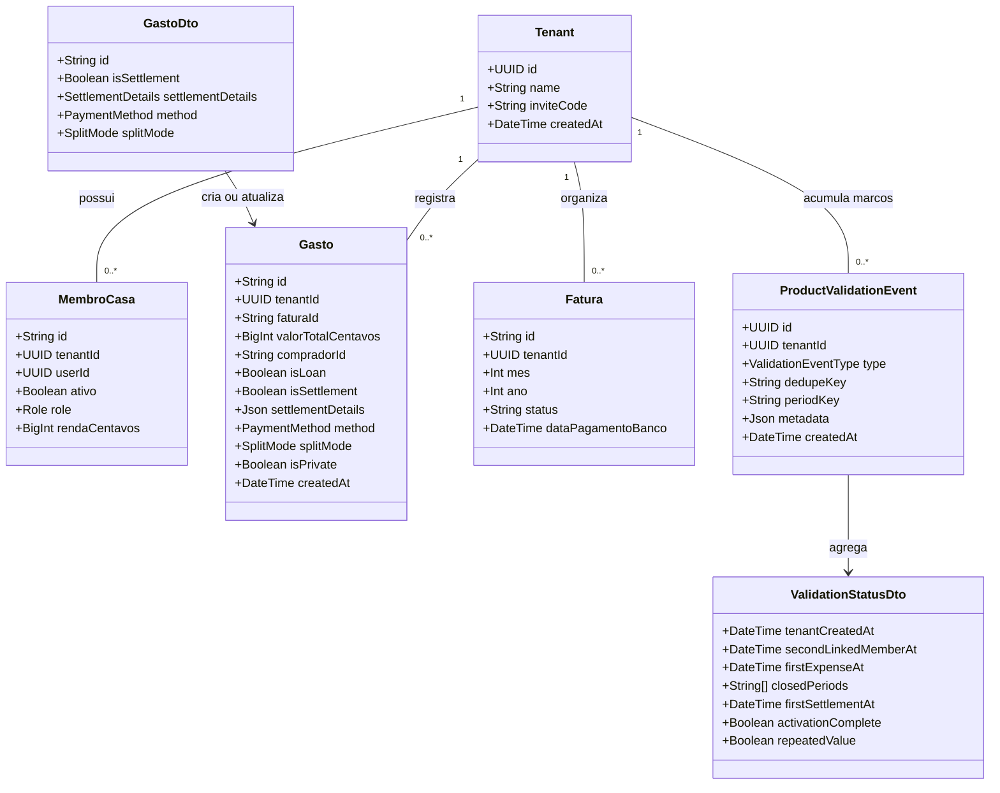

# Validacao Comportamental do Modelo de Negocio DIVI

## Requirements

Implementar uma camada minima e confiavel de validacao comportamental para medir se casas reais atingem e repetem o valor central do DIVI: fechar despesas compartilhadas de um periodo com saldos e acertos claros.

- Registrar no backend, de forma idempotente, os marcos de criacao da casa, adesao de um segundo usuario real, primeiro gasto, fechamento de periodos distintos e primeiro acerto.
- Persistir o criterio de rateio escolhido em cada gasto para distinguir divisao igualitaria, proporcional a renda e customizada sem inferir intencoes posteriormente.
- Impedir rateio proporcional quando algum participante selecionado nao possuir renda valida, exigindo uma escolha explicita em vez de estimar renda pela media.
- Registrar acertos como operacoes de liquidacao reais, preservando origem, destino e meio de pagamento, em vez de trata-los como despesas comuns.
- Disponibilizar para administradores da casa um resumo dos marcos de ativacao e repeticao, sem expor valores, descricoes ou dados de outras casas.
- Atualizar a linguagem dos pontos principais de entrada para comunicar reconciliacao mensal e clareza de acertos, sem prometer eliminar conflitos financeiros.
- Preservar os fluxos atuais de gastos, cartoes, faturas, contas fixas, privacidade e auditoria, alterando apenas o necessario para produzir evidencia confiavel.
- Nao implementar assinatura, cobranca, Open Finance, importacao bancaria, experimentacao automatizada, analytics de terceiros ou dashboard global nesta entrega.

## Entities

### Existing Types to Preserve

- `Tenant`, `MembroCasa`, `Gasto`, `DivisaoGasto` e `Fatura` permanecem como conceitos centrais existentes.
- `AuditLog` continua representando rastreabilidade visivel ao usuario. `ProductValidationEvent` possui finalidade distinta: medir marcos de produto sem registrar detalhes financeiros.
- `DivisaoGasto` permanece com valores finais em centavos. Nao criar entidade de formula de rateio nem recalcular gastos historicos quando a renda mudar.
- `Gasto.settlementDetails` continua sendo JSON estruturado com `fromMemberId`, `toMemberId` e `method`.

### New Enums

- `SplitMode`: `EQUAL`, `INCOME`, `CUSTOM`.
- `ValidationEventType`: `TENANT_CREATED`, `SECOND_LINKED_MEMBER_JOINED`, `FIRST_EXPENSE_CREATED`, `PERIOD_CLOSED`, `FIRST_SETTLEMENT_RECORDED`.
- `PaymentMethod` no frontend: `pix`, `card`, `cash`. O banco pode continuar armazenando o metodo como texto para compatibilidade.

### Event Identity Rules

- `TENANT_CREATED`, `SECOND_LINKED_MEMBER_JOINED`, `FIRST_EXPENSE_CREATED` e `FIRST_SETTLEMENT_RECORDED` usam `dedupeKey = "first"`.
- `PERIOD_CLOSED` usa `dedupeKey` e `periodKey` no formato `YYYY-MM`.
- A combinacao `tenantId + type + dedupeKey` e unica, tornando repeticoes, concorrencia e retries inofensivos.
- `metadata` aceita somente dimensoes nao sensiveis e previamente definidas, como quantidade de participantes, `splitMode` e metodo. Nao armazenar descricao, valor, renda, email, nome ou detalhes livres.

## Approach

1. Validacao orientada a eventos de dominio:
   - Gerar marcos somente depois que a operacao de negocio correspondente for persistida com sucesso.
   - Registrar os eventos no backend, dentro da mesma transacao quando o servico ja utiliza `Prisma.TransactionClient`.
   - Nao aceitar endpoint generico para o cliente publicar marcos, evitando eventos falsos, duplicados ou fora de ordem.
   - Usar eventos idempotentes como evidencia operacional, nao como substituto para entrevistas e pesquisa qualitativa.

2. Medicao conservadora de ativacao e repeticao:
   - Considerar adesao coletiva apenas quando houver pelo menos dois `MembroCasa` ativos com `userId` nao nulo. Perfis virtuais nao comprovam adesao de outra pessoa.
   - Considerar primeiro gasto apenas para uma criacao nova que nao seja emprestimo nem acerto.
   - Considerar periodo fechado somente quando nao restar fatura aberta para o mesmo `mes/ano` entre as faturas persistidas daquele periodo.
   - Derivar `activationComplete` de segundo usuario vinculado, primeiro gasto e pelo menos um periodo fechado.
   - Derivar `repeatedValue` de dois ou mais `periodKey` distintos fechados. Nao usar login ou abertura de tela como proxy de valor.

3. Criterio de rateio explicito:
   - Persistir a escolha feita no momento do lancamento.
   - Tratar registros antigos e atualizacoes sem informacao como `CUSTOM`, pois nao e seguro inferir se uma distribuicao numericamente igual foi uma escolha igualitaria ou manual.
   - Para `INCOME`, exigir renda positiva de todos os participantes selecionados.
   - Distribuir restos de centavos de forma deterministica por renda decrescente e, em caso de empate, por `membroId` crescente.
   - Manter `EQUAL` como padrao do wizard e permitir que o usuario volte explicitamente para ele quando faltarem rendas.

4. Acerto como operacao propria:
   - Estender o fluxo de lancamento para `expense`, `loan` e `settlement`.
   - Para `settlement`, persistir `isSettlement = true`, `isLoan = false`, uma unica divisao para o recebedor e `settlementDetails` coerente com origem, destino e metodo.
   - Tratar `cash` como metodo sem cartao, assim como `pix` para resolucao de fatura, mas preservar o valor `cash` no gasto e no detalhe do acerto.
   - Rejeitar acerto com origem igual ao destino, valor nao positivo ou membros fora do tenant.

5. API e seguranca:
   - Adicionar somente leitura `GET /api/financeiro/validacao/status`, protegida por JWT, `X-Tenant-ID` e `Role.ADMIN`.
   - Retornar apenas marcos da casa ativa e flags derivadas; nao retornar metadata bruta nem agregados entre tenants.
   - Continuar usando `ValidationPipe`, DTOs com `class-validator`, `BadRequestException`, `NotFoundException` e `ForbiddenException` conforme os padroes NestJS existentes.
   - Nao introduzir um `GlobalExceptionHandler` Java-style. Se houver necessidade de formato global no futuro, usar um `ExceptionFilter` NestJS em mudanca separada; nesta entrega, preservar os contratos de erro atuais.

6. Compatibilidade e migracao:
   - Adicionar colunas com defaults seguros e executar backfill implicito via default `CUSTOM`.
   - Nao alterar IDs, relacoes compostas, contratos de tenant ou historico de divisoes.
   - Mudancas nos servicos devem ser incrementais e trabalhar com as alteracoes nao relacionadas ja presentes no worktree.

## Structure

### Inheritance and Interface Relationships

1. `ProductValidationService` e um provider NestJS `@Injectable`; nao requer interface adicional enquanto houver uma unica implementacao Prisma.
2. `HttpGastoRepository` continua implementando `IGastoRepository` e passa a mapear `splitMode`, `isSettlement`, `settlementDetails` e `cash` sem alterar os demais metodos.
3. `Gasto` continua sendo uma classe de dominio simples e recebe `splitMode` e o metodo ampliado sem heranca ou wrappers novos.
4. `ValidationStatusDto` e um DTO de resposta; nao deve virar entidade persistida.

### Dependencies

1. `MembroService` depende de `ProductValidationService` para registrar criacao da casa e segundo usuario vinculado.
2. `LancamentoService` depende de `ProductValidationService` para registrar primeiro gasto e primeiro acerto dentro da transacao de persistencia.
3. `CartaoService` depende de `ProductValidationService` para registrar o fechamento consolidado de cada periodo.
4. `FinanceiroController` injeta `ProductValidationService` para consultar o status da casa ativa.
5. `NovoLancamentoWizard` usa `StepSplitSelector` para validar a disponibilidade de renda e envia `splitMode` ao `GastoService`.
6. `GastoService` e `LancamentoService` do frontend preservam e propagam `splitMode`, `flow = settlement`, `settlementDetails` e `cash` ate `HttpGastoRepository`.

### Layered Architecture

1. Controller Layer:
   - Expor somente o resumo de validacao do tenant e os contratos financeiros existentes.
   - Aplicar `@Roles(Role.ADMIN)` na leitura do status de validacao.
2. Backend Service Layer:
   - Gerar marcos a partir de operacoes persistidas.
   - Validar membros, periodos, rateios e acertos.
   - Manter transacoes e notificacoes Socket.IO existentes.
3. Prisma Data Layer:
   - Persistir eventos idempotentes e o criterio de rateio.
   - Garantir unicidade e isolamento por tenant.
4. Frontend Domain Layer:
   - Representar explicitamente tipo de fluxo, metodo e criterio de rateio.
   - Preservar metadados ao editar ou recriar gastos parcelados.
5. ViewModel and View Layer:
   - Bloquear proporcionalidade invalida antes do envio.
   - Comunicar as consequencias de privacidade e o objetivo de fechamento mensal com texto factual.
6. Exception Handling Layer:
   - Reutilizar excecoes HTTP do NestJS e o tratamento de mensagens existente no frontend.
   - Nao adicionar filtros globais ou uma hierarquia nova de excecoes sem necessidade funcional.

## Operations

### 1. Create Prisma Migration - Product Validation Events and Split Mode

1. Responsibility: adicionar armazenamento minimo para marcos de validacao e criterio de rateio.
2. Schema changes:
   - Criar enum Prisma `SplitMode` com `EQUAL`, `INCOME`, `CUSTOM`.
   - Criar enum Prisma `ValidationEventType` com os cinco tipos definidos em Entities.
   - Adicionar `splitMode SplitMode @default(CUSTOM) @map("split_mode")` em `Gasto`.
   - Criar `ProductValidationEvent` com `id`, `tenantId`, `type`, `dedupeKey`, `periodKey?`, `metadata?`, `createdAt`.
   - Adicionar relacao `validationEvents ProductValidationEvent[]` em `Tenant`.
   - Criar `@@unique([tenantId, type, dedupeKey])`, indice por `tenantId` e indice por `[tenantId, createdAt]`.
3. Migration constraints:
   - Mapear tabela para `product_validation_events`.
   - Usar `onDelete: Cascade` na relacao com `Tenant`.
   - Registros existentes de `gastos` devem receber `CUSTOM` sem reescrever divisoes.
4. Completion criteria:
   - `prisma generate` funciona.
   - A migracao sobe em banco vazio e em banco com gastos existentes.

### 2. Create Backend Service - ProductValidationService

1. Responsibility: registrar marcos idempotentes e produzir o resumo de ativacao da casa.
2. Methods:
   - `registrarMarco(tenantId: string, type: ValidationEventType, dedupeKey: string, options?: { periodKey?: string; metadata?: ValidationMetadata }, tx?: Prisma.TransactionClient): Promise<void>`
     - Usar `upsert` pela chave composta.
     - Na atualizacao, nao sobrescrever `createdAt` nem metadata original.
     - Sanitizar metadata por allowlist; rejeitar chaves desconhecidas em desenvolvimento e ignora-las em producao com log de warning.
   - `registrarSegundoUsuarioSeAplicavel(tenantId: string, tx?: Prisma.TransactionClient): Promise<void>`
     - Contar membros ativos com `userId` nao nulo.
     - Registrar `SECOND_LINKED_MEMBER_JOINED/first` quando a contagem for pelo menos dois.
   - `registrarPeriodoFechadoSeConsolidado(tenantId: string, mes: number, ano: number): Promise<void>`
     - Consultar faturas persistidas do periodo.
     - Nao registrar se nao houver fatura ou se alguma estiver `ABERTA`.
     - Registrar `PERIOD_CLOSED/YYYY-MM` uma unica vez.
   - `obterStatus(tenantId: string): Promise<ValidationStatusDto>`
     - Ler o `Tenant.createdAt` e eventos do tenant.
     - Ordenar periodos cronologicamente e retornar somente strings `YYYY-MM` validas.
     - Calcular `activationComplete` e `repeatedValue` conforme Approach.
3. Dependency injection: `PrismaService` e `Logger` do NestJS.
4. Transaction management:
   - Aceitar `Prisma.TransactionClient` opcional para compartilhar a transacao do dominio.
   - A leitura consolidada de periodo ocorre apos o upsert da fatura ter sido confirmado.
5. Error behavior:
   - Falha ao registrar marco dentro da transacao deve abortar a operacao para evitar evidencia divergente.
   - A consulta de status para tenant inexistente deve lancar `NotFoundException`.

### 3. Integrate Tenant and Membership Milestones - MembroService

1. Responsibility: registrar criacao de casa e adesao coletiva real.
2. Update `criarTenant(name: string, userId: string)`:
   - Executar criacao do tenant, criacao do membro administrador e `TENANT_CREATED/first` na mesma transacao.
   - Preservar nome, convite, avatar e role atuais.
3. Update `entrarTenantPorCodigo(inviteCode: string, userId: string)`:
   - Depois de vincular ou criar o membro, chamar `registrarSegundoUsuarioSeAplicavel`.
   - Se o usuario ja for membro, chamar a verificacao de forma idempotente antes de retornar.
4. Update `salvarMembro(...)`:
   - Quando a operacao criar ou vincular um `userId` real e ativo, verificar o marco do segundo usuario.
   - Perfis sem login e membros inativos nao contam para o marco.
5. Tests:
   - Criacao de tenant grava exatamente um marco.
   - Dois usuarios vinculados gravam o marco; um usuario mais perfis virtuais nao gravam.
   - Repetir entrada ou salvar o mesmo membro nao duplica evento.

### 4. Persist Explicit Split Mode - Backend and Frontend Contracts

1. Responsibility: preservar a escolha de rateio como dado observavel.
2. Backend DTO:
   - Adicionar `splitMode?: SplitMode` em `GastoDto` com `@IsOptional()` e `@IsEnum(SplitMode)`.
   - Usar `CUSTOM` quando clientes antigos omitirem o campo.
3. Backend persistence:
   - Incluir `splitMode` no create/update de `LancamentoService.upsertGastoCompletoTx`.
   - Preservar `splitMode` em edicoes e lotes.
4. Frontend domain:
   - Adicionar `SplitMode = 'equal' | 'income' | 'custom'` ou equivalente centralizado.
   - Adicionar `splitMode` a `GastoProps` e `Gasto`, com default `custom` para payloads antigos.
   - Mapear `EQUAL/INCOME/CUSTOM` nos DTOs HTTP sem acoplar o dominio Vue aos nomes Prisma.
5. Launch inputs:
   - Adicionar `splitMode` obrigatorio a `LancarGastoInput` para novas operacoes.
   - Contas fixas geradas por divisao uniforme usam `equal`.
   - Emprestimos e acertos usam `custom`.
   - Edicoes preservam o valor original, exceto quando o usuario altera explicitamente a distribuicao.
6. Completion criteria:
   - Todo novo gasto possui criterio persistido.
   - Gastos antigos continuam carregando como `custom`.
   - Compras parceladas preservam o mesmo criterio em todas as parcelas.

### 5. Remove Invented Income Fallback - StepSplitSelector and NovoLancamentoWizard

1. Responsibility: impedir que o produto crie um acordo financeiro nao fornecido pelos usuarios.
2. `StepSplitSelector` computed state:
   - Criar `membrosSelecionadosSemRenda: Membro[]` considerando apenas participantes selecionados.
   - Criar `proporcionalDisponivel = membrosSelecionadosSemRenda.length === 0 && participantesDivisao.length > 0`.
   - Remover toda substituicao de renda zero pela media dos demais.
3. UI behavior:
   - Permitir selecionar a aba proporcional para explicar o bloqueio, mas nao permitir confirmar o lancamento enquanto houver renda ausente.
   - Mostrar os nomes dos membros sem renda e as duas saidas: configurar renda ou escolher divisao igual.
   - Nao exibir percentuais ou valores estimados para renda ausente.
4. `NovoLancamentoWizard` validation:
   - Atualizar `canAdvance` para retornar falso em `SPLIT` quando `splitType === 'proportional'` e houver participante sem renda positiva.
   - No `handleGravar`, validar novamente antes de calcular; em estado invalido, mostrar toast e nao chamar o servico.
   - Para rateio valido, manter calculo em centavos e desempate deterministico.
   - Enviar `splitMode: 'income'` ou `splitMode: 'equal'` conforme a escolha.
5. Tests:
   - Proporcional com todas as rendas positivas fecha exatamente o total.
   - Proporcional com qualquer renda ausente nao salva e nao usa media.
   - Igualitario continua funcionando sem renda cadastrada.
   - Empate de renda distribui resto de centavos de forma estavel.

### 6. Correct Settlement Flow - Frontend Domain and Backend Validation

1. Responsibility: registrar pagamentos entre membros como acertos reais e mensuraveis.
2. Extend types:
   - `LancarGastoInput.flow`: `expense | loan | settlement`.
   - `paymentMethod`: `pix | card | cash`.
   - Adicionar `settlementDetails?: { fromMemberId: string; toMemberId: string; method: 'pix' | 'cash' }`.
3. `CartaoResolver`:
   - Tratar apenas `card` como metodo que exige resolucao de cartao.
   - Para `pix` e `cash`, retornar `cartaoId = null`, `cardOwner = null` e o comprador como responsavel.
4. Frontend `LancamentoService`:
   - Para `settlement`, criar `Gasto` com `isSettlement = true`, `isLoan = false`, `splitMode = custom` e detalhes obrigatorios.
   - Nao permitir parcelamento, privacidade ou cartao em acertos.
5. `useDashboardViewModel.confirmarBaixaNetting`:
   - Enviar `flow: 'settlement'`, preservar `cash` sem convertê-lo para `card`, e preencher origem/destino.
6. Backend `LancamentoService`:
   - Validar valor positivo, origem diferente do destino, detalhe coerente com comprador/divisao e existencia dos dois membros no tenant.
   - Registrar `FIRST_SETTLEMENT_RECORDED/first` na mesma transacao, apenas em criacao nova de acerto.
7. Tests:
   - Acerto Pix e dinheiro sao persistidos com os metodos corretos.
   - Acerto nao aparece como despesa comum nas somas existentes.
   - Acerto invalido e rejeitado antes de alterar dados.
   - Retry do mesmo acerto nao duplica o marco.

### 7. Register First Expense Milestone - LancamentoService

1. Responsibility: identificar a primeira utilizacao financeira real da casa.
2. Integration:
   - Depois do upsert de um gasto novo e antes de concluir a transacao, registrar `FIRST_EXPENSE_CREATED/first` quando `isLoan === false` e `isSettlement === false`.
   - Nao registrar novamente em edicao, exclusao, recriacao tecnica de parcela ou lote que contenha somente atualizacoes.
   - Em criacao parcelada, todas as parcelas podem passar pelo mesmo caminho, mas a chave unica deve resultar em um unico evento.
3. Metadata allowlist:
   - `splitMode`, `paymentMethod`, `participantCount`, `installmentCount`, `isRecurringBill`.
   - Nao incluir valor, descricao, comprador ou IDs de membros.
4. Tests:
   - Primeiro gasto grava evento.
   - Emprestimo e acerto nao gravam primeiro gasto.
   - Edicao de gasto existente nao grava evento novo.
   - Batch de parcelas produz um evento.

### 8. Register Consolidated Period Closure - CartaoService

1. Responsibility: medir conclusao e repeticao do job mensal.
2. Update `salvarFatura` and `salvarMuitasFaturas`:
   - Apos persistir status `FECHADA`, chamar `registrarPeriodoFechadoSeConsolidado` para os pares `mes/ano` afetados.
   - Deduplicar pares de periodo no batch antes de consultar.
   - Nao registrar ao criar fatura aberta ou reabrir periodo.
3. Consolidation rule:
   - O periodo deve ter pelo menos uma fatura persistida.
   - Nenhuma fatura do mesmo tenant e periodo pode permanecer `ABERTA`.
   - Fechamentos concorrentes de varias faturas devem convergir para um evento por periodo.
4. Reopening behavior:
   - Nao excluir o marco historico ao reabrir; ele representa que o fluxo foi concluido ao menos uma vez.
   - Um novo fechamento do mesmo periodo continua idempotente.
5. Tests:
   - Fechar apenas parte das faturas nao registra periodo.
   - Fechar a ultima fatura registra `YYYY-MM`.
   - Batch fechado registra uma vez.
   - Dois meses distintos fazem `repeatedValue = true`.

### 9. Expose Tenant Validation Status - FinanceiroController

1. Responsibility: permitir inspecao segura dos marcos da propria casa durante o piloto.
2. Endpoint:
   - `GET /financeiro/validacao/status` sob o prefixo global `/api`.
   - Exigir JWT, `X-Tenant-ID` e `@Roles(Role.ADMIN)`.
   - Chamar `ProductValidationService.obterStatus(tenantId)`.
3. Response:
   - `tenantCreatedAt`, datas opcionais dos primeiros marcos, `closedPeriods`, `activationComplete`, `repeatedValue`.
   - Nao retornar eventos de outras casas, metadata bruta, contagens de receita ou informacoes pessoais.
4. Swagger:
   - Documentar operacao, cabecalho, autorizacao, resposta e erros 401/403/404.
5. Tests:
   - Admin do tenant recebe apenas seu status.
   - Morador e visualizador recebem 403.
   - Tenant inexistente ou nao associado nao vaza dados.

### 10. Align Product Copy with the Validated Job

1. Responsibility: comunicar um resultado controlavel pelo produto.
2. Update copy in `LoginScreen`, `TenantSelectorScreen`, onboarding success and relevant empty state:
   - Priorizar frases sobre organizar despesas compartilhadas, fechar o mes e entender os acertos.
   - Remover ou evitar alegacoes de eliminar brigas, impedir infidelidade financeira ou garantir justica.
3. Privacy copy in `NovoLancamentoWizard`:
   - Informar que somente a descricao e ocultada para moradores nao autorizados.
   - Informar que valor, impacto no saldo e identidade financeira necessaria permanecem compartilhados.
   - Informar que o dono do cartao pode ver a descricao para conciliacao.
4. Constraints:
   - Nao redesenhar telas nem alterar a identidade visual.
   - Manter textos curtos e compreensiveis em dispositivos moveis.

### 11. Add Verification Coverage

1. Backend unit tests:
   - `ProductValidationService` para idempotencia, isolamento, metadata e flags derivadas.
   - `MembroService`, `LancamentoService` e `CartaoService` para integracoes de marcos.
   - Controller para RBAC e contrato do status.
2. Frontend unit/component tests:
   - `StepSplitSelector` e `NovoLancamentoWizard` para bloqueio de renda ausente.
   - `LancamentoService`, `GastoService`, `HttpGastoRepository` e `CartaoResolver` para propagacao de tipos.
   - `useDashboardViewModel` para acerto Pix e dinheiro.
3. Regression checks:
   - Edicao de parcelas preserva `splitMode`, privacidade e dados de acerto.
   - Netting continua calculando saldos corretamente.
   - Gastos antigos sem `splitMode` continuam carregando.
4. Commands:
   - Executar testes Vitest do frontend.
   - Executar testes Jest do backend.
   - Executar `pnpm run build` na raiz.

## Norms

1. NestJS and DTO Standards:
   - Providers usam `@Injectable()` e injecao por construtor.
   - Endpoints usam decorators Swagger ja adotados pelo projeto.
   - Enums recebidos pela API usam `@IsEnum`; valores opcionais usam `@IsOptional`.
   - Nao aceitar `tenantId` no body; usar exclusivamente o cabecalho validado pelo guard.
2. Prisma Standards:
   - Todas as tabelas novas usam nomes `snake_case` via `@@map` e campos via `@map` quando necessario.
   - Operacoes de evento dentro de fluxos transacionais recebem o mesmo `Prisma.TransactionClient`.
   - Idempotencia depende de constraint unica no banco, nao apenas de `findFirst` seguido de `create`.
3. Domain Standards:
   - Valores monetarios continuam em centavos inteiros.
   - Divisoes sempre somam exatamente o total.
   - Tipos de fluxo, metodo e rateio sao unions/enums centralizados, sem strings duplicadas espalhadas.
   - Defaults de compatibilidade devem ser conservadores: `CUSTOM`, nunca uma inferencia mais especifica.
4. Exception Handling:
   - Usar excecoes HTTP NestJS com mensagens acionaveis para validacoes de negocio.
   - Nao expor stack trace, SQL, IDs internos de outros tenants ou metadata de evento.
   - Reutilizar `mensagemErro` e `useToast` no frontend.
   - Nao criar `GlobalExceptionHandler` ou hierarquia de excecoes fora do padrao atual nesta entrega.
5. Logging:
   - Logs tecnicos usam `Logger` do NestJS.
   - Nao registrar valores, descricoes, renda, email, token, codigo de convite ou detalhes privados.
   - Colisao idempotente esperada nao deve ser logada como erro.
6. Frontend Standards:
   - Manter Vue 3 Composition API, TypeScript estrito e os repositorios HTTP existentes.
   - Estado derivado usa `computed`; nao duplicar calculos de disponibilidade de renda entre componentes sem uma funcao pura compartilhada.
   - Mensagens de bloqueio devem usar `role="alert"` ou texto associado ao controle afetado.
7. Testing Standards:
   - Jest para backend e Vitest para frontend.
   - Testes verificam comportamento e contratos, nao detalhes privados de implementacao.
   - Mocks Prisma devem incluir os novos delegates e preservar as alteracoes atuais do worktree.
8. Documentation Standards:
   - Comentarios somente em regras nao obvias, especialmente criterios de marco e idempotencia.
   - Swagger deve explicar que o endpoint de validacao e por tenant e nao contem dados financeiros.

## Safeguards

1. Functional Constraints:
   - Nenhum marco pode ser criado por requisicao arbitraria do frontend.
   - `repeatedValue` exige dois periodos distintos fechados, nao duas tentativas no mesmo periodo.
   - Perfis virtuais sem `userId` nao contam como segundo usuario.
   - Rateio proporcional nao pode prosseguir com renda ausente, zero ou negativa.
   - Acertos nao podem ser privados, parcelados nem associados a cartao.
2. Data Integrity Constraints:
   - `tenantId + type + dedupeKey` deve ser unico no banco.
   - `periodKey` deve seguir `YYYY-MM`, com mes entre 01 e 12.
   - A soma de `DivisaoGasto.valorCentavos` deve ser igual a `Gasto.valorTotalCentavos` para despesas, emprestimos e acertos.
   - Alteracoes de renda nao recalculam divisoes historicas.
3. Privacy Constraints:
   - Eventos nao armazenam descricao, valor, renda, nomes, emails, IDs de membros, cartoes ou detalhes de compra.
   - O endpoint retorna apenas a casa ativa validada pelos guards.
   - `AuditLog` e `ProductValidationEvent` nao devem compartilhar automaticamente o mesmo texto ou payload.
4. Security Constraints:
   - Status de validacao exige role `ADMIN`.
   - Toda consulta e escrita deve filtrar por `tenantId`.
   - Dados privados continuam mascarados no backend antes da serializacao.
5. Performance Constraints:
   - Registrar um marco exige no maximo um upsert adicional no fluxo principal.
   - Consulta de status deve usar indices e no maximo duas consultas Prisma simples.
   - Nao adicionar SDK de analytics, fila, cron job ou dependencia externa.
6. Concurrency Constraints:
   - Requisicoes concorrentes para fechar faturas ou criar parcelas nao podem duplicar marcos.
   - A constraint unica e o `upsert` sao obrigatorios para garantir convergencia.
7. Compatibility Constraints:
   - Payloads antigos sem `splitMode` continuam aceitos e persistidos como `CUSTOM`.
   - Gastos existentes continuam legiveis apos a migracao.
   - Nao alterar rotas existentes nem remover campos dos DTOs atuais.
8. Scope Constraints:
   - Nao implementar cobranca, planos, trial ou paywall.
   - Nao implementar Open Finance, OCR, importacao CSV/OFX ou pagamentos Pix.
   - Nao criar painel global de administracao ou comparar tenants pela API.
   - Nao adicionar experimentos A/B, NPS ou pesquisa in-app nesta entrega.
9. Product Claims Constraints:
   - A interface nao deve afirmar que o DIVI elimina conflitos, previne abuso ou resolve infidelidade financeira.
   - Rateio por renda deve ser apresentado como criterio opcional acordado, nao como definicao universal de justica.
   - Privacidade deve explicar claramente o que permanece visivel.
10. Verification Constraints:
   - Todos os novos caminhos de negocio devem ter testes positivos, negativos e idempotentes.
   - Build frontend e backend devem concluir sem erros de tipo.
   - Nenhum teste existente pode ser removido ou enfraquecido para acomodar a mudanca.
