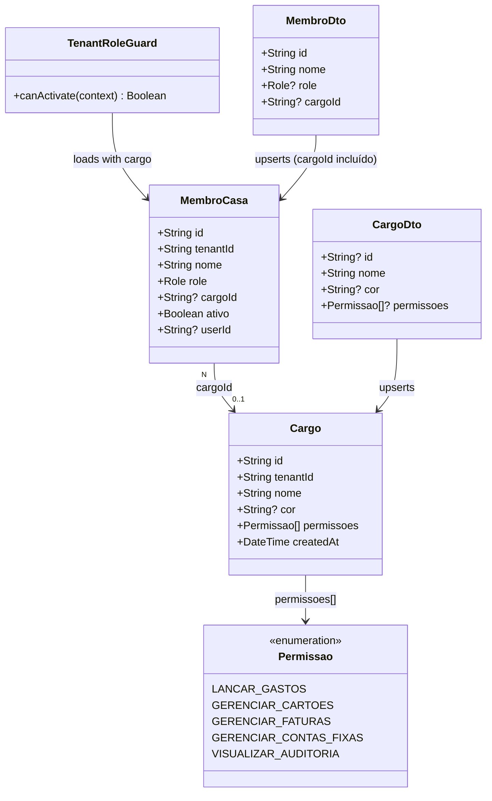

# Fix: RBAC de Cargos — Permissões Canônicas, Persistência e Enforcement

## Requirements

Corrigir o sistema de controle de acesso baseado em cargos (RBAC) para que as permissões associadas a `Cargo` tenham efeito real nas operações do sistema, substituindo o modelo atual em que `permissoes String[]` é decorativo e `cargoId` nunca é persistido.

- Fechar o bug de persistência: `persistirMembro` deve gravar `cargoId` no upsert do banco
- Definir um enum canônico `Permissao` como contrato fechado de permissões do sistema
- Migrar `Cargo.permissoes String[]` para `Cargo.permissoes Permissao[]` via enum Prisma
- Criar o decorator `@Permissoes(...permissoes)` equivalente ao `@Roles()` existente
- Evoluir `TenantRoleGuard` para carregar `cargo` via `include` e verificar permissões de cargo quando o decorator `@Permissoes` estiver presente
- Aplicar `@Permissoes()` nas rotas operacionais do `FinanceiroController` atualmente protegidas apenas por `@Roles(Role.ADMIN, Role.MORADOR)`, permitindo que membros com cargos adequados também as acessem
- Manter `@Roles(Role.ADMIN)` intacto para operações de governança (gerenciar membros, cargos, validação)

## Entities



## Approach

1. **Schema & Migração**:
   - Adicionar enum `Permissao` no `schema.prisma` com os valores canônicos derivados das operações do controller
   - Alterar `Cargo.permissoes` de `String[]` para `Permissao[]`
   - Gerar e aplicar migration Prisma; dados existentes em `permissoes String[]` são descartados via `DEFAULT ARRAY[]::\"Permissao\"[]` na migration (não há enforcement atual, descarte é seguro)

2. **Decorator `@Permissoes()`**:
   - Criar `backend/src/auth/permissoes.decorator.ts` seguindo exatamente o padrão de `roles.decorator.ts`
   - Chave de metadata: `PERMISSOES_KEY = 'permissoes'`

3. **Evolução do `TenantRoleGuard`**:
   - Ler metadata de `@Permissoes()` além de `@Roles()`
   - Se nem `@Roles` nem `@Permissoes` estiverem presentes: deixar passar (comportamento atual mantido)
   - Se `@Roles` estiver presente: verificar `membro.role` como hoje
   - Se `@Permissoes` estiver presente (sem `@Roles`): o guard verifica se `membro.cargo?.permissoes` contém ao menos uma das permissões requeridas — ADMIN sempre passa (super-papel)
   - Se ambos estiverem presentes: qualquer um satisfeito libera acesso (lógica OR)
   - Usar `include: { cargo: true }` no `findFirst` de `membroCasa` para carregar `cargo` em uma única query

4. **Bug fix em `persistirMembro`**:
   - Adicionar `cargoId: data.cargoId ?? null` nos campos `create` e `update` do upsert Prisma em `membro.service.ts`

5. **Aplicação de `@Permissoes()` no controller**:
   - Rotas de escrita operacional (`POST/DELETE gastos`, `POST/DELETE cartoes`, `POST/DELETE faturas`, `POST/DELETE contas-fixas`) passam a ter `@Permissoes(Permissao.X)` — o que significa que MORADOR sem cargo específico ainda acessa (ADMIN passa sempre), e membros com o cargo correto também acessam
   - Manter `@Roles(Role.ADMIN)` exclusivo para: `POST /membros`, `POST /cargos`, `DELETE /cargos/:id`, `GET /validacao/status`

6. **Atualização do `CargoDto`**:
   - Substituir `@IsArray()` + `@IsString()` por `@IsEnum(Permissao, { each: true })` para validação na entrada da API

## Structure

### Inheritance & Interface Relationships
1. `TenantRoleGuard` implements `CanActivate` (NestJS) — evolução in-place, sem nova classe
2. `Permissao` é um enum Prisma gerado em `@prisma/client` — importado diretamente pelo guard, decorator e DTO
3. `permissoes.decorator.ts` segue o mesmo padrão de `roles.decorator.ts` (SetMetadata + export typed)

### Dependencies
1. `TenantRoleGuard` depende de `Reflector` (NestJS) e `PrismaService`
2. `TenantRoleGuard` lê metadata de `ROLES_KEY` (existente) e `PERMISSOES_KEY` (novo)
3. `FinanceiroController` injeta `@Permissoes()` nos handlers — sem nova dependência de serviço
4. `CargoDto` importa `Permissao` de `@prisma/client`
5. `MembroService.persistirMembro` usa o campo `cargoId` já presente em `MembroDto`

### Layered Architecture
1. **Schema (Prisma)**: Enum `Permissao` + `Cargo.permissoes Permissao[]` — fonte da verdade de contratos
2. **Auth Layer** (`backend/src/auth/`): `permissoes.decorator.ts` (novo) + `tenant-role.guard.ts` (evoluído)
3. **Controller Layer**: `FinanceiroController` — aplicação de `@Permissoes()` nas rotas operacionais
4. **Service Layer**: `MembroService.persistirMembro` — bug fix de `cargoId`; `CargoService` — sem alteração de lógica
5. **DTO Layer**: `CargoDto` — validação enum substituindo string livre

## Operations

### Op 1 — Atualizar `schema.prisma`: adicionar enum `Permissao` e migrar `Cargo.permissoes`

1. Adicionar enum logo após o enum `Role` existente:
   ```
   enum Permissao {
     LANCAR_GASTOS
     GERENCIAR_CARTOES
     GERENCIAR_FATURAS
     GERENCIAR_CONTAS_FIXAS
     VISUALIZAR_AUDITORIA
   }
   ```
2. Alterar a linha `permissoes String[]` no model `Cargo` para:
   ```
   permissoes Permissao[] @default([])
   ```
3. Executar `pnpm --filter divi-backend exec prisma migrate dev --name add_permissao_enum`
4. A migration gerada deve produzir:
   - `CREATE TYPE "Permissao" AS ENUM (...)`
   - `ALTER TABLE "cargos" ALTER COLUMN "permissoes" TYPE "Permissao"[] USING ARRAY[]::\"Permissao\"[]`
   - O `USING ARRAY[]` descarta valores string existentes — comportamento correto pois não havia enforcement

---

### Op 2 — Criar `backend/src/auth/permissoes.decorator.ts`

1. Responsabilidade: decorar handlers com a lista de permissões de cargo requeridas
2. Implementação espelhando `roles.decorator.ts`:
   ```ts
   import { SetMetadata } from '@nestjs/common';
   import { Permissao } from '@prisma/client';

   export const PERMISSOES_KEY = 'permissoes';
   export const Permissoes = (...permissoes: Permissao[]) => SetMetadata(PERMISSOES_KEY, permissoes);
   ```

---

### Op 3 — Evoluir `backend/src/auth/tenant-role.guard.ts`

1. Importar `PERMISSOES_KEY` de `./permissoes.decorator` e `Permissao` de `@prisma/client`
2. Ler metadata de permissões no início de `canActivate`:
   ```ts
   const requiredPermissoes = this.reflector.getAllAndOverride<Permissao[]>(PERMISSOES_KEY, [
     context.getHandler(),
     context.getClass(),
   ]);
   ```
3. Early return se nem roles nem permissões forem requeridas:
   ```ts
   if ((!requiredRoles || requiredRoles.length === 0) && (!requiredPermissoes || requiredPermissoes.length === 0)) {
     return true;
   }
   ```
4. Alterar o `findFirst` de `membroCasa` para incluir `cargo`:
   ```ts
   const membro = await this.prisma.membroCasa.findFirst({
     where: { tenantId, userId: user.userId, ativo: true },
     include: { cargo: true },
   });
   ```
5. Lógica de autorização (substituir o bloco `hasRole` atual):
   ```ts
   // ADMIN sempre passa — super-papel de governança
   if (membro.role === Role.ADMIN) return true;

   // Verifica @Roles
   if (requiredRoles?.length) {
     if (requiredRoles.includes(membro.role)) return true;
   }

   // Verifica @Permissoes via cargo
   if (requiredPermissoes?.length && membro.cargo) {
     const hasPermissao = requiredPermissoes.some(p => membro.cargo!.permissoes.includes(p));
     if (hasPermissao) return true;
   }

   throw new ForbiddenException('Você não possui permissão para executar esta ação.');
   ```

---

### Op 4 — Bug fix: `backend/src/financeiro/membro.service.ts` — `persistirMembro`

1. Localizar o método `private async persistirMembro`
2. Adicionar `cargoId` nos campos de `create` e `update` do upsert:
   - Em `create`: adicionar `cargoId: data.cargoId ?? null`
   - Em `update`: adicionar `cargoId: data.cargoId ?? null`
3. O campo `cargoId` já existe em `MembroDto` com `@IsOptional() @IsString()` — nenhuma alteração de DTO necessária

---

### Op 5 — Atualizar `backend/src/financeiro/dto/cargo.dto.ts`

1. Remover import de `IsArray` e `IsString` para o campo `permissoes`
2. Importar `IsEnum` de `class-validator` e `Permissao` de `@prisma/client`
3. Substituir as decorações do campo `permissoes`:
   ```ts
   @ApiPropertyOptional({ enum: Permissao, isArray: true })
   @IsOptional()
   @IsArray()
   @IsEnum(Permissao, { each: true })
   permissoes?: Permissao[];
   ```

---

### Op 6 — Aplicar `@Permissoes()` no `backend/src/financeiro/financeiro.controller.ts`

1. Importar `Permissoes` de `'../auth/permissoes.decorator'` e `Permissao` de `'@prisma/client'`
2. Aplicar nos seguintes handlers (substituindo ou complementando `@Roles(Role.ADMIN, Role.MORADOR)`):

   | Handler | Antes | Depois |
   |---------|-------|--------|
   | `POST /gastos` | `@Roles(ADMIN, MORADOR)` | `@Roles(ADMIN, MORADOR) @Permissoes(Permissao.LANCAR_GASTOS)` |
   | `POST /gastos/batch` | `@Roles(ADMIN, MORADOR)` | `@Roles(ADMIN, MORADOR) @Permissoes(Permissao.LANCAR_GASTOS)` |
   | `DELETE /gastos/:id` | `@Roles(ADMIN, MORADOR)` | `@Roles(ADMIN, MORADOR) @Permissoes(Permissao.LANCAR_GASTOS)` |
   | `POST /gastos/delete-batch` | `@Roles(ADMIN, MORADOR)` | `@Roles(ADMIN, MORADOR) @Permissoes(Permissao.LANCAR_GASTOS)` |
   | `POST /cartoes` | `@Roles(ADMIN, MORADOR)` | `@Roles(ADMIN, MORADOR) @Permissoes(Permissao.GERENCIAR_CARTOES)` |
   | `DELETE /cartoes/:id` | `@Roles(ADMIN, MORADOR)` | `@Roles(ADMIN, MORADOR) @Permissoes(Permissao.GERENCIAR_CARTOES)` |
   | `POST /faturas` | `@Roles(ADMIN, MORADOR)` | `@Roles(ADMIN, MORADOR) @Permissoes(Permissao.GERENCIAR_FATURAS)` |
   | `POST /faturas/batch` | `@Roles(ADMIN, MORADOR)` | `@Roles(ADMIN, MORADOR) @Permissoes(Permissao.GERENCIAR_FATURAS)` |
   | `POST /contas-fixas` | `@Roles(ADMIN, MORADOR)` | `@Roles(ADMIN, MORADOR) @Permissoes(Permissao.GERENCIAR_CONTAS_FIXAS)` |
   | `DELETE /contas-fixas/:id` | `@Roles(ADMIN, MORADOR)` | `@Roles(ADMIN, MORADOR) @Permissoes(Permissao.GERENCIAR_CONTAS_FIXAS)` |
   | `GET /audit-logs` | sem decorator | `@Permissoes(Permissao.VISUALIZAR_AUDITORIA)` |

3. **Não alterar**: `@Roles(Role.ADMIN)` em `POST /membros`, `POST /cargos`, `DELETE /cargos/:id`, `GET /validacao/status`
4. **Não alterar**: rotas de leitura sem decorator (`GET /membros`, `GET /cargos`, `GET /gastos`, `GET /cartoes`, `GET /faturas`, `GET /contas-fixas`) — decisão consciente: são dados compartilhados da moradia, acessíveis a qualquer membro autenticado

---

### Op 7 — Atualizar frontend: entidade `Cargo` e `HttpCargoRepository`

1. Em `src/models/entities/Cargo.ts`: alterar o tipo de `permissoes` de `string[]` para `Permissao[]` (usar `type Permissao = 'LANCAR_GASTOS' | 'GERENCIAR_CARTOES' | 'GERENCIAR_FATURAS' | 'GERENCIAR_CONTAS_FIXAS' | 'VISUALIZAR_AUDITORIA'` no arquivo `src/models/entities/Permissao.ts`).
2. Em `HttpCargoRepository.ts`: atualizar os tipos para inferir `Permissao[]`.
3. Em `src/models/repositories/http/HttpMembroRepository.ts`: importar `Permissao` e atualizar a propriedade `cargo.permissoes` no `MembroDto` para `Permissao[]` em vez de `string[]`.
4. Em `src/viewmodels/useCargos.ts`: importar `Permissao` e atualizar a assinatura de `salvarCargo` para aceitar `Permissao[]` no parâmetro `permissoes`.
5. Em `src/viewmodels/useCargos.test.ts`: atualizar as permissões simuladas de `'gastos'` para `'LANCAR_GASTOS'` e ajustar os asserts.
6. Em `src/views/components/settings/GestaoAcessoTab.vue`: atualizar `podeGerenciarMoradores` para apenas verificar `currentMembro.role === 'ADMIN'`, já que a governança de membros é exclusiva de administrador.
7. Em `src/views/components/settings/GestaoCargosTab.vue`: importar `Permissao` e atualizar a interface `SalvarCargoDados` para usar `Permissao[]`. Atualizar a lista `permissoesDisponiveis` para refletir as 5 permissões canônicas: `LANCAR_GASTOS`, `GERENCIAR_CARTOES`, `GERENCIAR_FATURAS`, `GERENCIAR_CONTAS_FIXAS` e `VISUALIZAR_AUDITORIA`.

---

### Op 8 — Testes

1. **`backend/src/auth/tenant-role.guard.spec.ts`** (criar se não existir): cobrir os seguintes cenários:
   - Rota sem `@Roles` nem `@Permissoes`: deve passar
   - `@Roles(ADMIN)` + membro com role `MORADOR`: deve rejeitar com 403
   - `@Roles(ADMIN)` + membro com role `ADMIN`: deve passar
   - `@Permissoes(LANCAR_GASTOS)` + membro `MORADOR` sem cargo: deve rejeitar
   - `@Permissoes(LANCAR_GASTOS)` + membro `MORADOR` com cargo contendo `LANCAR_GASTOS`: deve passar
   - `@Permissoes(LANCAR_GASTOS)` + membro `ADMIN` sem cargo: deve passar (ADMIN é super-papel)
   - `@Roles(MORADOR) @Permissoes(LANCAR_GASTOS)` + membro `VISUALIZADOR` com cargo `LANCAR_GASTOS`: deve passar (OR logic)

2. **`backend/src/financeiro/membro.service.spec.ts`**: adicionar caso verificando que `cargoId` é persistido no upsert quando fornecido

## Norms

1. **Enum como única fonte de verdade**: Qualquer nova permissão do sistema deve ser adicionada ao enum `Permissao` no `schema.prisma` e gerar migration. Nunca usar strings ad-hoc em `permissoes`.

2. **ADMIN é super-papel implícito**: O guard verifica `membro.role === Role.ADMIN` antes de qualquer outra verificação. Nunca listar `Role.ADMIN` em `@Permissoes()` — redundante.

3. **Convenção de decorator duplo**: Quando uma rota deve ser acessível a `MORADOR` por default E também a membros com cargo específico, usar ambos os decorators: `@Roles(Role.ADMIN, Role.MORADOR) @Permissoes(Permissao.X)`. O guard usa lógica OR.

4. **Rotas de leitura sem decorator**: Rotas `GET` de dados compartilhados da moradia (membros, cargos, gastos, cartões, faturas, contas fixas) intencionalmente não têm `@Roles` nem `@Permissoes` — qualquer membro autenticado e ativo no tenant pode ler. Documenta-se via comentário no controller: `// Leitura pública para membros do tenant — sem restrição de cargo`.

5. **Padrão de import do enum Prisma**: Backend importa `Permissao` de `'@prisma/client'`. Frontend usa type local `Permissao` de `'../entities/Permissao'` — mantido em sincronia manualmente com o enum do schema.

6. **Validação de entrada**: `CargoDto.permissoes` usa `@IsEnum(Permissao, { each: true })` para rejeitar valores inválidos na API antes de chegarem ao banco.

7. **Teste de guard obrigatório**: Qualquer alteração no `TenantRoleGuard` deve ser acompanhada de teste unitário cobrindo o caso modificado.

## Safeguards

1. **Sem quebra de rotas existentes**: A lógica `@Roles(ADMIN)` existente não deve ser alterada. ADMIN sempre passa — isso garante que administradores não perdem acesso após a migração.

2. **MORADOR sem cargo mantém acesso às operações atuais**: A combinação `@Roles(ADMIN, MORADOR) @Permissoes(X)` usa OR — MORADOR sem cargo ainda passa via `@Roles`. Nenhum membro perde acesso que já tinha.

3. **`cargoId: null` é válido**: Membro sem cargo (`cargoId = null`) deve funcionar normalmente no guard — o bloco `@Permissoes` verifica `membro.cargo` antes de acessar `.permissoes`. Sem `Optional chaining` não há NullPointerError.

4. **Migration deve usar `USING ARRAY[]`**: A migration de `String[]` para `Permissao[]` deve descartar dados existentes com `USING ARRAY[]::\"Permissao\"[]` — não tentar converter strings arbitrárias que causariam erro de cast.

5. **Frontend type `Permissao` em sincronia com schema**: Ao adicionar novo valor ao enum Prisma, o type frontend em `src/models/entities/Permissao.ts` deve ser atualizado na mesma entrega. Incluir checklist no PR.

6. **`GET /audit-logs` com `@Permissoes(VISUALIZAR_AUDITORIA)` — sem `@Roles` complementar**: Apenas membros com cargo que contenha `VISUALIZAR_AUDITORIA` (ou ADMIN) acessam audit logs. MORADOR sem esse cargo não acessa — decisão de segurança intencional.

7. **Sem exposição de permissões de outros tenants**: `TenantRoleGuard` já escopa o lookup de `membroCasa` por `tenantId` do header `X-Tenant-ID`. O cargo carregado via `include` pertence ao mesmo tenant por FK. Não há risco cross-tenant.

8. **`cargoId` no upsert deve ser `null` explícito quando ausente**: Usar `cargoId: data.cargoId ?? null` — não `data.cargoId` sozinho (seria `undefined`, que Prisma ignora no update, deixando o valor anterior).
