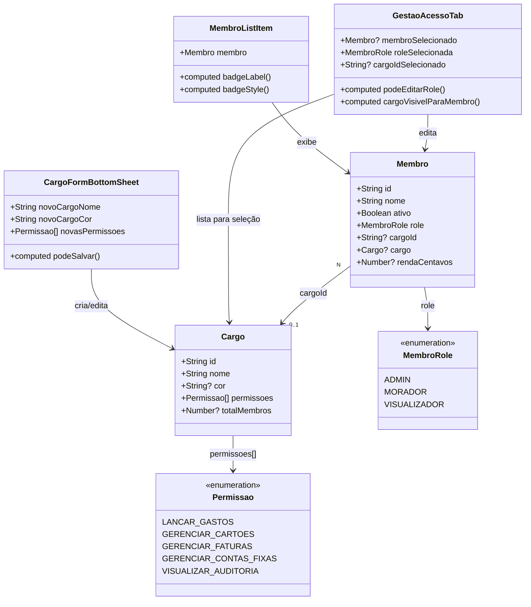

# Fix: UX de Cargo para Contexto Residencial — Reposicionamento de Narrativa e Interação

## Requirements

Reposicionar a UX da feature de Cargo do DIVI para refletir a realidade do público-alvo (casais, repúblicas e famílias), eliminando o enquadramento corporativo atual. O código de backend está correto — o trabalho é puramente de interface: comunicar Cargo como **papel social da casa** com benefícios de acesso opcionais, não como configuração de ACL. Os cinco problemas concretos a resolver:

1. `CargoFormBottomSheet` bloqueia salvamento quando `novasPermissoes.length === 0` — impede cargos puramente cosméticos ("Tesoureiro" sem restrições técnicas)
2. O `<select>` de role em `GestaoAcessoTab` mistura `Role` sistêmico (ADMIN, VISUALIZADOR) com `Cargo IDs` no mesmo controle — semântica incorreta e confusa
3. `MembroListItem` não exibe nenhum badge para MORADOR/VISUALIZADOR sem Cargo — invisível para o usuário entender o papel de cada morador
4. Nenhum indicador contextual comunica que Cargo com permissões só tem efeito real para VISUALIZADOR; para MORADOR é apenas decorativo
5. ADMIN editando qualquer membro ainda vê o seletor de Cargo para membros ADMIN — Cargo é irrelevante para ADMIN (o guard ignora)

## Entities



## Approach

1. **Liberar cargos cosméticos (sem permissões obrigatórias)**:
   - Remover a condição `novasPermissoes.length === 0` do `:disabled` do botão salvar em `CargoFormBottomSheet`
   - A única condição para habilitar save é `novoCargoNome.trim().length > 0`
   - Um Cargo sem permissões é válido e tem valor como label social ("Tesoureiro", "Responsável da Luz")
   - No contador de permissões do botão "Configurar Permissões", exibir "Apenas sinalização visual" quando vazio, ao invés de "Nenhuma selecionada ainda"

2. **Separar controles de Role sistêmico e Cargo no formulário de edição de membro**:
   - O `<select>` atual mistura `value="ADMIN"`, `value="VISUALIZADOR"`, `value=""` (MORADOR) e `value=cargo.id` em um único controle
   - Separar em dois controles distintos: um `<select>` para `role` (ADMIN / MORADOR / VISUALIZADOR) e um `<select>` separado para `cargoId` (lista de Cargos do tenant)
   - O seletor de Cargo só aparece quando `roleSelecionada === 'MORADOR'` ou `roleSelecionada === 'VISUALIZADOR'`
   - O seletor de Cargo fica oculto completamente para membros com `role === 'ADMIN'`
   - Atualizar `handleSalvarEdicao` para usar os dois campos separados ao chamar `atualizarCargoMembro`

3. **Adicionar badge contextual em `MembroListItem` para todos os papéis**:
   - ADMIN: pill `ember` existente — mantida
   - MORADOR com Cargo: pill colorida com `cargo.cor` e `cargo.nome` — mantida
   - MORADOR sem Cargo: pill neutra `stone/ash` com label "Morador" — nova
   - VISUALIZADOR com Cargo: pill colorida com `cargo.cor` e `cargo.nome` — nova (visibilidade do cargo)
   - VISUALIZADOR sem Cargo: pill neutra `stone/ash` com label "Visualizador" — nova

4. **Comunicar contexto de uso de permissões na UI de Cargo**:
   - Na tela de permissões de `CargoFormBottomSheet`, adicionar um banner informativo quando alguma permissão estiver selecionada
   - O banner comunica: "Permissões têm efeito real apenas para Visualizadores. Moradores já têm acesso completo."
   - Estilo: `bg-sky/10 border border-sky/20 rounded-xl text-[10px] text-sky` — informativo, não bloqueante

5. **Ocultar seletor de Cargo para membro ADMIN na edição**:
   - Em `GestaoAcessoTab`, a `computed cargoVisivelParaMembro` retorna `false` quando `roleSelecionada === 'ADMIN'`
   - O bloco do seletor de Cargo usa `v-if="cargoVisivelParaMembro"`

## Structure

### Inheritance & Interface Relationships
1. `GestaoAcessoTab` usa `computed podeEditarRole` existente — sem alteração
2. `GestaoAcessoTab` adiciona `computed cargoVisivelParaMembro` — retorna `true` apenas quando `roleSelecionada !== 'ADMIN'`
3. `CargoFormBottomSheet` expõe `resetForm()` via `defineExpose` — sem alteração de interface
4. `MembroListItem` recebe `membro: Membro` via props — sem alteração de interface

### Dependencies
1. `GestaoAcessoTab` depende de `useMembros` (existente) e `useCargos` (existente) — sem nova dependência
2. `CargoFormBottomSheet` é filho de `GestaoCargosTab` via inline slot — sem alteração de hierarquia
3. `MembroListItem` recebe `membro` com `membro.cargo` já hidratado pelo backend (`include: { cargo: true }`) — sem alteração
4. `atualizarCargoMembro(id, role, cargoId?)` no `useMembros` já aceita os dois parâmetros separados — sem alteração de assinatura

### Layered Architecture
1. **View Layer** (`GestaoCargosTab`, `GestaoAcessoTab`, `MembroListItem`, `CargoFormBottomSheet`): todas as mudanças estão aqui — puramente de template e lógica de apresentação
2. **ViewModel Layer** (`useMembros`, `useCargos`): sem alteração — a assinatura de `atualizarCargoMembro(id, role, cargoId?)` já suporta os parâmetros separados
3. **Model/Service Layer**: sem alteração — o backend já está correto
4. **Entity Layer** (`Membro`, `Cargo`, `Permissao`): sem alteração

## Operations

### Op 1 — Corrigir `CargoFormBottomSheet.vue`: liberar cargo sem permissões

1. Localizar o botão "Criar Cargo" / "Salvar Alterações" na Tela 1 do componente
2. Alterar o `:disabled` binding:
   - **Antes**: `:disabled="!novoCargoNome.trim() || novasPermissoes.length === 0"`
   - **Depois**: `:disabled="!novoCargoNome.trim()"`
3. Localizar o trecho do botão "Configurar Permissões" que exibe o contador de permissões selecionadas:
   - **Antes**: `<span v-else class="text-ash">Nenhuma selecionada ainda</span>`
   - **Depois**: `<span v-else class="text-ash">Apenas sinalização visual</span>`
4. Na Tela 2 (permissões), adicionar banner informativo após o `<div class="space-y-2 overflow-y-auto ...">` existente, quando `novasPermissoes.length > 0`:
   ```html
   <div v-if="novasPermissoes.length > 0" class="p-3 bg-sky/10 border border-sky/20 rounded-xl mb-3">
     <p class="text-[10px] text-sky font-bold leading-snug">
       💡 Permissões têm efeito real apenas para Visualizadores. Moradores já têm acesso completo por padrão.
     </p>
   </div>
   ```

---

### Op 2 — Refatorar `GestaoAcessoTab.vue`: separar controles de Role e Cargo

1. **Adicionar `roleSelecionada` como estado separado de `cargoSelecionadoId`**:
   - Adicionar `const roleSelecionada = ref<MembroRole>('MORADOR')` ao `<script setup>`
   - Adicionar `computed`:
     ```ts
     const cargoVisivelParaMembro = computed(() => roleSelecionada.value !== 'ADMIN')
     ```

2. **Atualizar `abrirEdicaoMembro`** para hidratar os dois estados separados:
   ```ts
   const abrirEdicaoMembro = (membro: Membro) => {
     membroSelecionado.value = membro
     roleSelecionada.value = membro.role          // 'ADMIN' | 'MORADOR' | 'VISUALIZADOR'
     cargoSelecionadoId.value = membro.cargoId || ''
     ativoSelecionado.value = membro.ativo
     // ... renda (sem alteração)
   }
   ```

3. **Substituir o `<select>` único no template** pelos dois controles separados:
   ```html
   <!-- Papel na Casa (Role sistêmica) -->
   <div class="space-y-2">
     <label class="text-[10px] font-bold uppercase tracking-widest text-graphite block ml-1">Papel na Casa</label>
     <select v-model="roleSelecionada" :disabled="!podeEditarRole"
       class="w-full p-3.5 rounded-2xl border border-stone bg-white outline-none font-bold text-charcoal">
       <option value="ADMIN">Administrador</option>
       <option value="MORADOR">Morador</option>
       <option value="VISUALIZADOR">Visualizador</option>
     </select>
     <!-- Descrição contextual por role -->
     <p v-if="roleSelecionada === 'VISUALIZADOR'" class="text-[10px] text-ash ml-1">
       Exemplos: filho dependente, ex-parceiro em transição, contador externo.
     </p>
   </div>

   <!-- Cargo (label social + permissões opcionais) — só visível para não-ADMIN -->
   <div v-if="cargoVisivelParaMembro" class="space-y-2">
     <label class="text-[10px] font-bold uppercase tracking-widest text-graphite block ml-1">
       Cargo <span class="text-ash normal-case tracking-normal font-medium">(opcional)</span>
     </label>
     <select v-model="cargoSelecionadoId"
       class="w-full p-3.5 rounded-2xl border border-stone bg-white outline-none font-bold text-charcoal">
       <option value="">Sem cargo</option>
       <option v-for="c in cargos" :key="c.id" :value="c.id">{{ c.nome }}</option>
     </select>
   </div>
   ```

4. **Atualizar `handleSalvarEdicao`** para usar os dois estados separados:
   ```ts
   const handleSalvarEdicao = async () => {
     if (!membroSelecionado.value) return
     salvando.value = true
     try {
       const novaRole = roleSelecionada.value
       const novoCargoId = cargoVisivelParaMembro.value ? (cargoSelecionadoId.value || undefined) : undefined

       const roleAlterada = novaRole !== membroSelecionado.value.role
       const cargoAlterado = novoCargoId !== membroSelecionado.value.cargoId
       if (roleAlterada || cargoAlterado) {
         await atualizarCargoMembro(membroSelecionado.value.id, novaRole, novoCargoId)
       }
       // ... resto sem alteração (ativo, renda)
     }
   }
   ```

---

### Op 3 — Atualizar `MembroListItem.vue`: badge para todos os papéis

1. Substituir o bloco de badges no template. A lógica atual tem dois cases (ADMIN e membro com cargo). Expandir para quatro:

   ```html
   <div class="flex items-center gap-3 shrink-0">
     <!-- ADMIN: pill ember (existente, sem alteração) -->
     <span
       v-if="membro.role === 'ADMIN'"
       class="px-2.5 py-1 rounded-pill text-[9px] font-bold bg-ember/10 text-ember uppercase tracking-widest border border-ember/20"
     >Admin</span>

     <!-- MORADOR/VISUALIZADOR com Cargo: pill colorida (existente, sem alteração estrutural) -->
     <span
       v-else-if="membro.cargo"
       class="px-2.5 py-1 rounded-pill text-[9px] font-bold uppercase tracking-widest border"
       :style="{ backgroundColor: (membro.cargo.cor || '#474645') + '10', color: membro.cargo.cor || '#474645', borderColor: (membro.cargo.cor || '#474645') + '20' }"
     >{{ membro.cargo.nome }}</span>

     <!-- MORADOR sem Cargo: pill neutra (novo) -->
     <span
       v-else-if="membro.role === 'MORADOR'"
       class="px-2.5 py-1 rounded-pill text-[9px] font-bold bg-stone text-ash uppercase tracking-widest border border-stone"
     >Morador</span>

     <!-- VISUALIZADOR sem Cargo: pill neutra (novo) -->
     <span
       v-else-if="membro.role === 'VISUALIZADOR'"
       class="px-2.5 py-1 rounded-pill text-[9px] font-bold bg-sky/10 text-sky uppercase tracking-widest border border-sky/20"
     >Visualizador</span>

     <ChevronRight class="w-4 h-4 text-ash group-hover:text-charcoal group-hover:translate-x-1 transition-all" />
   </div>
   ```

---

### Op 4 — Atualizar `GestaoCargosTab.vue`: exibir contagem de membros por cargo na lista

1. O `Cargo` já possui o campo `totalMembros?: number` (hidratado pelo backend via `listarMembros` com `include: { cargo: true }`)
2. Na lista de cargos existente em `GestaoCargosTab`, adicionar a contagem de membros abaixo do nome do cargo:

   ```html
   <!-- dentro do v-for cargo, após o <span> com cargo.nome -->
   <p class="text-[9px] text-ash mt-0.5">
     {{ cargo.totalMembros ? `${cargo.totalMembros} morador${cargo.totalMembros !== 1 ? 'es' : ''}` : 'Sem moradores' }}
     · {{ cargo.permissoes.length ? `${cargo.permissoes.length} permissão${cargo.permissoes.length !== 1 ? 'ões' : ''}` : 'Apenas visual' }}
   </p>
   ```

3. Atualizar a descrição do card de "Cargos e Permissões":
   - **Antes**: `<p class="text-[11px] text-ash font-medium mt-1 uppercase tracking-wider">Definição de níveis de acesso</p>`
   - **Depois**: `<p class="text-[11px] text-ash font-medium mt-1 uppercase tracking-wider">Papéis e funções dos moradores</p>`

---

### Op 5 — Atualizar título e header de `ConfiguracoesMembros.vue`

1. Alterar o título principal da tela para refletir o enquadramento residencial:
   - **Antes**: `Moradores <span class="text-ember">&</span> Cargos`
   - **Depois**: `Moradores <span class="text-ember">&</span> Papéis`
2. Alterar o subtítulo:
   - **Antes**: `Gestão de acessos da casa`
   - **Depois**: `Quem mora aqui e como cada um contribui`

## Norms

1. **Cargo é aditivo, nunca restritivo**: Nenhuma UI deve sugerir que Cargo remove acesso de MORADOR. A linguagem deve ser "o que este papel pode fazer a mais", não "o que está liberado ou bloqueado".

2. **Separação semântica Role vs. Cargo**: `role` (ADMIN/MORADOR/VISUALIZADOR) é a hierarquia de governança da moradia — sempre presente e editável por ADMIN. `cargoId` é o papel social opcional — só relevante para MORADOR e VISUALIZADOR. Nunca misturar os dois em um único controle de formulário.

3. **Cargo sem permissões é válido**: O backend aceita `permissoes: []` — a UI deve refletir isso. Cargos cosméticos têm valor de organização social. A mensagem padrão para cargo sem permissões é "Apenas sinalização visual", não um erro ou aviso.

4. **Linguagem residencial, não corporativa**: Usar "Papel na Casa" em vez de "Nível de Acesso". Usar "Papéis" em vez de "Cargos e Permissões" em títulos de seção. Usar "Morador" e "Visualizador" como labels de badge — não "MORADOR" em caixa alta.

5. **Design token consistency**: Todos os novos elementos seguem o DESIGN.md:
   - Badge pill: `rounded-pill`, `text-[9px] font-bold uppercase tracking-widest`
   - Banner informativo: `bg-sky/10 border border-sky/20 rounded-xl text-[10px] text-sky`
   - Labels de campo: `text-[10px] font-bold uppercase tracking-widest text-graphite ml-1 block`
   - Texto secundário/desc sob field: `text-[10px] text-ash ml-1`

6. **Descrições contextuais para VISUALIZADOR**: Sempre que a role VISUALIZADOR for selecionável, exibir uma linha de texto explicando casos de uso reais ("filho dependente, ex-parceiro em transição, contador externo"). Isso reduz a fricção de onboarding do ADMIN ao criar membros.

7. **Testes**: Alterações em `GestaoCargosTab` e `GestaoAcessoTab` não possuem testes unitários de componente atualmente — sem obrigação de criar novos testes de UI para este fix. O comportamento de `useMembros.atualizarCargoMembro` permanece inalterado e já é coberto.

## Safeguards

1. **Não alterar nenhum arquivo de backend**: Todas as mudanças são exclusivamente nos componentes Vue e em nenhum arquivo de `backend/`. O guard, controller, services e schema estão corretos.

2. **Não alterar assinaturas de viewmodel**: `useMembros.atualizarCargoMembro(id, role, cargoId?)` e `useCargos.salvarCargo(nome, permissoes, cor?, id?)` permanecem com as mesmas assinaturas. Apenas a lógica interna do template que os chama é ajustada.

3. **Não quebrar o fluxo de salvar `cargoId`**: O `handleSalvarEdicao` refatorado deve continuar chamando `atualizarCargoMembro` com `cargoId = undefined` (não `null`) quando o seletor está oculto para ADMIN — a assinatura do viewmodel já trata `undefined` como "sem alteração de cargo".

4. **Membro ADMIN não deve ver seletor de Cargo**: A `computed cargoVisivelParaMembro` deve checar `roleSelecionada.value !== 'ADMIN'`. Isso inclui o caso em que o ADMIN está editando a si mesmo — `podeEditarRole` já bloqueia a edição de role própria, mas o seletor de Cargo ainda aparecia. Com a nova computed, some completamente.

5. **Badge VISUALIZADOR deve ser distinto visualmente do MORADOR**: Usar `bg-sky/10 text-sky border-sky/20` para VISUALIZADOR vs `bg-stone text-ash border-stone` para MORADOR — paleta sky é consistente com o significado de "informação/somente leitura" no sistema de cores do DESIGN.md.

6. **Banner de permissões é informativo, não impeditivo**: O banner `💡 Permissões têm efeito real apenas para Visualizadores...` aparece como dica, sem bloquear nenhuma ação. Não usar `warning` (coral) — usar `sky` para informação neutra.

7. **`totalMembros` pode ser `undefined`**: O campo `totalMembros?: number` em `Cargo` é opcional. O template em `GestaoCargosTab` deve usar `cargo.totalMembros ?? 0` ou verificação condicional para evitar renderização de `undefined`.

8. **Preservar animações existentes**: Os blocos com `animate-in fade-in slide-in-from-right-3 duration-300` nos formulários não devem ser removidos. As novas seções devem seguir o mesmo padrão de animação para consistência.
