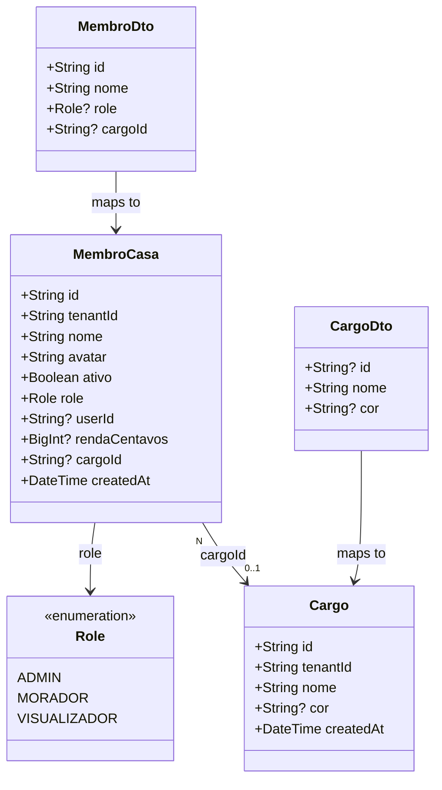

# Refactor: Simplificação de RBAC — Remoção de Permissões de Cargo e Foco em Roles

## Requirements

Simplificar o sistema de controle de acesso (RBAC) do DIVI para remover a redundância entre "Papel na Casa" (Role) e "Cargo", alinhando o produto com o contexto residencial. As permissões técnicas de cargo serão removidas, tornando o Cargo uma tag 100% cosmética/organizacional ("Tesoureiro", "Responsável pelas Compras"), enquanto o controle de acesso real será realizado exclusivamente através de Roles sistêmicos (`ADMIN`, `MORADOR`, `VISUALIZADOR`).

1. **Remover Permissões no Banco**: Eliminar o enum `Permissao` e o campo `permissoes` de `Cargo` no `schema.prisma` e aplicar a migração correspondente.
2. **Simplificar TenantRoleGuard**: Remover a verificação de permissões baseadas em cargo. O Guard validará exclusivamente a propriedade `role` do membro.
3. **Ajustar Controle de Rotas no Controller**: Substituir o decorator `@Permissoes` de todas as rotas operacionais do `FinanceiroController`, definindo que apenas `@Roles(ADMIN, MORADOR)` executam operações de escrita e apenas `@Roles(ADMIN)` acessa a rota `/audit-logs`.
4. **Remover Conceito de Permissão do Frontend**: Excluir a entidade `Permissao` no frontend, retirar as referências em `Cargo.ts`, repositórios e DTOs.
5. **Simplificar Telas e Formulários de Cargo**: Remover a seleção e configuração de permissões em `CargoFormBottomSheet.vue` e `GestaoCargosTab.vue`, transformando o fluxo de criação de Cargo em uma etapa simples que requer apenas Nome e Cor.

## Entities



## Approach

1. **Schema & Migration (Prisma)**:
   - Remover o enum `Permissao` e a propriedade `permissoes Permissao[]` do model `Cargo` no `schema.prisma`.
   - Gerar e aplicar a migração no banco de dados com `pnpm --filter divi-backend exec prisma migrate dev --name remove_permissao_enum_cargos`.

2. **Remoção de Decorator e simplificação do Guard**:
   - Deletar o arquivo `backend/src/auth/permissoes.decorator.ts`.
   - Modificar `backend/src/auth/tenant-role.guard.ts`:
     - Remover o import de `PERMISSOES_KEY` e `Permissao`.
     - Remover o lookup de `requiredPermissoes`.
     - Retirar o `include: { cargo: true }` da consulta Prisma em `membroCasa.findFirst` para evitar queries desnecessárias.
     - Reduzir a lógica de autorização para checar apenas o super-papel `ADMIN` e a propriedade `membro.role` contra as `requiredRoles`.

3. **Adequação do FinanceiroController**:
   - Em `backend/src/financeiro/financeiro.controller.ts`:
     - Remover os imports de `Permissoes` e `Permissao`.
     - Remover a anotação `@Permissoes` em todas as rotas.
     - Proteger rotas operacionais (gastos, cartões, faturas, contas fixas) usando exclusivamente `@Roles(Role.ADMIN, Role.MORADOR)`.
     - A rota `GET /financeiro/audit-logs` deve ser restrita apenas a administradores da casa através do decorator `@Roles(Role.ADMIN)`.

4. **Simplificação de Serviços e DTOs no Backend**:
   - Em `backend/src/financeiro/dto/cargo.dto.ts`: remover o campo `permissoes`.
   - Em `backend/src/financeiro/cargo.service.ts`: atualizar o salvamento do cargo no banco para não receber nem persistir permissões.

5. **Ajuste de Entidades e Repositórios no Frontend**:
   - Deletar `src/models/entities/Permissao.ts`.
   - Em `src/models/entities/Cargo.ts`: remover a propriedade `permissoes` do construtor e da tipagem da classe.
   - Em `src/models/repositories/http/HttpCargoRepository.ts` e `HttpMembroRepository.ts`: ajustar os DTOs de transporte para remover a propriedade `permissoes`.
   - Em `src/viewmodels/useCargos.ts`: atualizar a assinatura do método `salvarCargo(nome, cor?, id?)` para remover a lista de permissões.

6. **Simplificação de UX no Frontend**:
   - Em `src/views/components/settings/GestaoCargosTab.vue`:
     - Deletar a constante `permissoesDisponiveis` e o mapeamento de permissões.
     - Remover a contagem de permissões do card na lista de cargos.
     - Simplificar o envio de dados do `SalvarCargoDados` para excluir o array de permissões.
   - Em `src/views/components/ledger/membros/CargoFormBottomSheet.vue`:
     - Remover a prop `permissoesDisponiveis`.
     - Remover os estados `novasPermissoes` e `mostrarBottomSheetPermissoesCargo`.
     - Simplificar o formulário removendo a Tela 2 (seleção de checkboxes e banner informativo de permissões).
     - Habilitar o salvamento do cargo apenas pela verificação do nome preenchido: `:disabled="!novoCargoNome.trim()"`.
     - Reposicionar o botão "Excluir" (e seu estado de confirmação) diretamente na tela principal do BottomSheet para permitir a exclusão rápida do cargo.

## Structure

### Inheritance & Interface Relationships
1. `TenantRoleGuard` continua implementando `CanActivate` (NestJS), mas agora lê exclusivamente a chave `ROLES_KEY`.
2. O DTO de resposta e escrita do Cargo não transfere mais propriedades relacionadas a permissões.
3. `Cargo` no frontend deixa de depender de `Permissao`.

### Dependencies
1. `TenantRoleGuard` perde a dependência de `@Permissoes` metadata.
2. `FinanceiroController` deixa de importar o decorator de permissões e o enum correspondente do Prisma.
3. `GestaoCargosTab` e `CargoFormBottomSheet` deixam de interagir com as chaves e listas de permissões do sistema.

### Layered Architecture
1. **Schema Layer**: `schema.prisma` simplificado sem o enum e a tabela de permissões.
2. **Auth Layer**: Limpeza do guard e exclusão do decorator obsoleto.
3. **Controller/DTO Layer**: Remoção de validações de arrays de permissões no `CargoDto`.
4. **Service Layer**: Ajustes em `CargoService` para remover o payload de permissões no upsert.
5. **View Layer**: Simplificação drástica dos formulários Vue, removendo telas de checkboxes de permissão e exibindo apenas Nome e Cor do cargo.

## Operations

### Op 1 — Atualizar `schema.prisma` e Aplicar Migration
1. Abrir `backend/prisma/schema.prisma` e:
   - Excluir o bloco `enum Permissao` (linhas 57-63).
   - No modelo `Cargo` (linhas 79-92), remover o campo `permissoes Permissao[] @default([])`.
2. Executar no terminal:
   ```powershell
   pnpm --filter divi-backend exec prisma migrate dev --name remove_permissao_enum_cargos
   ```

### Op 2 — Remover Decorator e Limpar Guard
1. Deletar o arquivo `backend/src/auth/permissoes.decorator.ts`.
2. Editar `backend/src/auth/tenant-role.guard.ts`:
   - Remover imports de `PERMISSOES_KEY` e `Permissao`.
   - Limpar o lookup de `requiredPermissoes`.
   - Atualizar a verificação `if ((!requiredRoles || requiredRoles.length === 0)) { return true; }`.
   - Remover o `include: { cargo: true }` da query `prisma.membroCasa.findFirst`.
   - Remover a lógica que checa `requiredPermissoes` e `membro.cargo`.

### Op 3 — Adequar Rotas no `FinanceiroController.ts`
1. Abrir `backend/src/financeiro/financeiro.controller.ts` e:
   - Remover imports relacionados a `Permissoes` e `Permissao`.
   - Alterar as decorações das rotas operacionais (gastos, cartões, faturas, contas fixas) para usar apenas `@Roles(Role.ADMIN, Role.MORADOR)`.
   - Alterar a rota `GET /financeiro/audit-logs` para usar `@Roles(Role.ADMIN)`.

### Op 4 — Ajustar Cargo Service e DTO
1. Abrir `backend/src/financeiro/dto/cargo.dto.ts` e remover a propriedade `permissoes` do `CargoDto`.
2. Abrir `backend/src/financeiro/cargo.service.ts` e atualizar o método `salvarCargo`:
   - Remover referências ao array de `permissoes` no create/update do Prisma.

### Op 5 — Limpar Modelo e Repositórios do Frontend
1. Excluir o arquivo `src/models/entities/Permissao.ts`.
2. Abrir `src/models/entities/Cargo.ts` e remover `permissoes: Permissao[]` da classe e do construtor.
3. Abrir `src/models/repositories/http/HttpCargoRepository.ts`:
   - Remover `permissoes` do DTO e do mapeamento nos métodos.
4. Abrir `src/models/repositories/http/HttpMembroRepository.ts`:
   - Remover `permissoes` do mapeamento de cargo hidratado em membros.

### Op 6 — Ajustar ViewModel e Testes do Frontend
1. Abrir `src/viewmodels/useCargos.ts`:
   - Atualizar `salvarCargo` para não receber nem enviar `permissoes` na API.
2. Abrir `src/viewmodels/useCargos.test.ts` e `src/views/screens/ConfiguracoesMembros.test.ts`:
   - Atualizar mocks de cargos para remover a propriedade `permissoes`.

### Op 7 — Simplificar Componentes da UI
1. Abrir `src/views/components/settings/GestaoCargosTab.vue` e:
   - Remover import de `Permissao`, constante `permissoesDisponiveis`, e propriedade `permissoes` de `SalvarCargoDados`.
   - Remover o encadeamento de permissões na lista de cargos do HTML.
2. Abrir `src/views/components/ledger/membros/CargoFormBottomSheet.vue` e:
   - Remover prop `permissoesDisponiveis`.
   - Excluir variáveis de controle `novasPermissoes` e `mostrarBottomSheetPermissoesCargo`.
   - Limpar o template removendo completamente o contêiner da Tela 2 (`v-else` de permissões).
   - Colocar os botões de ação e exclusão do cargo na visualização única.
   - Atualizar a validação e o envio dos dados no clique do botão Salvar.

## Norms

1. **Acesso por Role**: O controle de acesso a qualquer rota operacional passa a ser baseado unicamente no enum `Role`. ADMIN tem plenos poderes, MORADOR pode operar gastos e faturas, e VISUALIZADOR tem acesso de apenas leitura de forma universal.
2. **Cargos Cosméticos**: Cargos existem exclusivamente para engajamento e comunicação social de responsabilidades da casa. Nenhuma lógica técnica de restrição no código deve depender do cargo de um membro.
3. **Membro sem Cargo**: Um membro da casa ter `cargoId = null` é um estado padrão e plenamente suportado no sistema sem gerar exceções.

## Safeguards

1. **Garantir Acesso de Morador**: Garantir que moradores sem cargo mantenham acesso operacional completo às rotas financeiras via `@Roles(Role.ADMIN, Role.MORADOR)`.
2. **Exclusão de Cargo em Uso**: Na UI de exclusão de cargo, manter o aviso contextual de membros vinculados, garantindo que o backend faça a exclusão de forma limpa sem quebrar as associações (usando `onDelete: SetNull` que já está configurado na foreign key).
3. **Compilação e Testes Unitários**: Garantir que as alterações em ambos os repositórios (backend e frontend) passem nos testes do CI. O build completo deve rodar sem erros de compilação de TypeScript.
