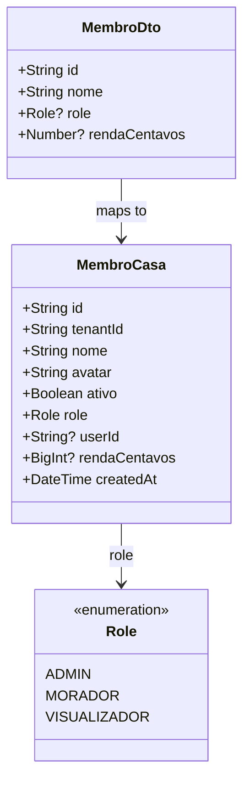

# Refactor: Remoção Completa de Cargos — Foco do RBAC Exclusivo em Roles

## Requirements

Remover completamente o conceito de "Cargo" (tabelas, colunas, DTOs, serviços, endpoints, viewModels, componentes Vue e arquivos de teste correspondentes) de todo o projeto DIVI (backend e frontend). O controle de acesso (RBAC) será baseado exclusivamente nas Roles sistêmicas (`ADMIN`, `MORADOR`, `VISUALIZADOR`).

1. **Remover no Banco de Dados**: Excluir a tabela `Cargo` e a coluna `cargoId` (com sua relação e chave estrangeira) da tabela `MembroCasa` no `schema.prisma` e aplicar a migração correspondente.
2. **Deletar Código do Backend**: Remover o arquivo `CargoService` e seus DTOs, apagar as rotas de cargos no `FinanceiroController` e limpar o `MembroService` e seus testes unitários de qualquer referência a cargos.
3. **Deletar Código do Frontend**: Remover a entidade `Cargo.ts`, o repositório `HttpCargoRepository.ts` e seu contrato, a viewModel `useCargos.ts` e seus testes unitários.
4. **Simplificar Interface (UI)**: Excluir os componentes `GestaoCargosTab.vue` e `CargoFormBottomSheet.vue`. Em `GestaoAcessoTab.vue`, remover o seletor de cargos. Em `ConfiguracoesMembros.vue`, remover a aba de cargos e toda a lógica de Modo Foco associada.
5. **Atualizar Badges na Listagem**: Ajustar o componente `MembroListItem.vue` para exibir badges baseados apenas nas Roles do sistema (`ADMIN`, `MORADOR` e `VISUALIZADOR`), removendo a exibição de badges de cargos.
6. **Limpeza de Testes Unitários**: Excluir arquivos de teste obsoletos e limpar mocks de cargos nos testes de membros existentes no frontend e no backend.

## Entities



## Approach

1. **Banco de Dados & Migration (Prisma)**:
   - Remover o model `Cargo` do `schema.prisma`.
   - Remover a coluna `cargoId` e o relacionamento `cargo` de `MembroCasa` no `schema.prisma`.
   - Criar uma migration manual para dropar a tabela `cargos`, remover a coluna `cargo_id` de `membros_casa` e aplicar via `prisma migrate deploy` em ambiente não interativo para evitar resets.

2. **API Backend**:
   - Deletar `backend/src/financeiro/cargo.service.ts` e `backend/src/financeiro/dto/cargo.dto.ts`.
   - Em `backend/src/financeiro/financeiro.module.ts`: remover o service do array de providers.
   - Em `backend/src/financeiro/financeiro.controller.ts`: removerendpoints `/cargos` e a injeção do service.
   - Em `backend/src/financeiro/membro.service.ts`: remover a injeção de cargo nas queries (como `include: { cargo: true }` no lookup de membros) e remover persistência de `cargoId` em `persistirMembro`.

3. **Frontend VM & Models**:
   - Deletar `src/models/entities/Cargo.ts`, `src/models/repositories/http/HttpCargoRepository.ts`, `src/models/repositories/ICargoRepository.ts`, `src/viewmodels/useCargos.ts` e `src/viewmodels/useCargos.test.ts`.
   - Limpar as dependências do container de injeção em `src/shared/container.ts`.
   - Em `src/models/entities/Membro.ts` e `src/models/repositories/http/HttpMembroRepository.ts`: remover a propriedade `cargoId` e o mapeamento de `cargo`.

4. **Componentes da Interface**:
   - Deletar `src/views/components/settings/GestaoCargosTab.vue` e `src/views/components/ledger/membros/CargoFormBottomSheet.vue`.
   - Em `src/views/components/settings/GestaoAcessoTab.vue`: remover o seletor HTML de Cargo e a lógica de computed/state associada.
   - Em `src/views/screens/ConfiguracoesMembros.vue`: remover a aba de cargos e a renderização do componente, além de limpar referências no script setup.
   - Em `src/views/components/ledger/membros/MembroListItem.vue`: remover a renderização do badge do cargo, deixando apenas badges baseados em Role.

5. **Testes do Frontend**:
   - Ajustar os mocks de dados de teste em `ConfiguracoesMembros.test.ts` e `useMembros.test.ts` para que não definam nem verifiquem propriedades de cargo.

## Structure

### Inheritance & Interface Relationships
1. `Membro` no frontend deixa de ter a propriedade e associação com a classe `Cargo`.
2. Repositórios HTTP perdem a dependência de `ICargoRepository` e as classes de DTO do Cargo correspondentes.

### Dependencies
1. `MembroService` e `FinanceiroController` no backend não possuem mais nenhuma dependência do `CargoService`.
2. `ConfiguracoesMembros.vue` remove a dependência do componente `GestaoCargosTab` e da viewModel `useCargos`.
3. `GestaoAcessoTab` deixa de depender de `useCargos`.

### Layered Architecture
1. **Schema Layer**: `schema.prisma` simplificado sem o modelo `Cargo`.
2. **Controller Layer**: Remoção de rotas `/cargos` do `FinanceiroController`.
3. **Service Layer**: Remoção de `CargoService` e adequação de `MembroService` para ignorar `cargoId`.
4. **View Layer**: Simplificação total das configurações de membros, restando apenas o gerenciamento de Roles dos membros da casa.

## Operations

### Op 1 — Atualizar `schema.prisma` e Aplicar Migration
1. Abrir `backend/prisma/schema.prisma` e:
   - Excluir o modelo `model Cargo` por completo.
   - No modelo `Tenant`, excluir a relação `cargos Cargo[]`.
   - No modelo `MembroCasa`, excluir o campo `cargoId String? @map("cargo_id") @db.Uuid` e a relação `cargo Cargo? @relation(fields: [cargoId], references: [id], onDelete: SetNull)`.
2. Criar a migration manual criando o diretório `backend/prisma/migrations/20260612043000_remove_cargos_model` e adicionando o arquivo `migration.sql` com:
   ```sql
   -- DropForeignKey
   ALTER TABLE "membros_casa" DROP CONSTRAINT "membros_casa_cargo_id_fkey";
   ALTER TABLE "cargos" DROP CONSTRAINT "cargos_tenant_id_fkey";

   -- AlterTable
   ALTER TABLE "membros_casa" DROP COLUMN "cargo_id";

   -- DropTable
   DROP TABLE "cargos" CASCADE;
   ```
3. Aplicar a migration no terminal:
   ```powershell
   pnpm --filter divi-backend exec prisma migrate deploy
   ```

### Op 2 — Remover Código de Cargo do Backend
1. Deletar os arquivos do backend:
   - `backend/src/financeiro/cargo.service.ts`
   - `backend/src/financeiro/dto/cargo.dto.ts`
   - `backend/src/financeiro/cargo.service.spec.ts` (se existir)
2. No arquivo `backend/src/financeiro/financeiro.module.ts`:
   - Remover import de `CargoService`.
   - Remover `CargoService` do array de `providers`.
3. No arquivo `backend/src/financeiro/financeiro.controller.ts`:
   - Remover imports de `CargoService` e `CargoDto`.
   - Remover a injeção de `cargoService` no construtor.
   - Remover os métodos `@Get('cargos') listarCargos`, `@Post('cargos') salvarCargo` e `@Delete('cargos/:id') excluirCargo`.
4. No arquivo `backend/src/financeiro/dto/membro.dto.ts`:
   - Remover a propriedade `cargoId` e suas anotações do `MembroDto`.
5. No arquivo `backend/src/financeiro/membro.service.ts`:
   - Em `listarMembros`, remover o `include: { cargo: true }` da consulta.
   - Em `persistirMembro`, remover o campo `cargoId` da extração e do upsert (deletar linhas com `cargoId`).
6. No arquivo `backend/src/financeiro/membro.service.spec.ts`:
   - Remover o caso de teste `'deve persistir cargoId no upsert quando fornecido'`.

### Op 3 — Deletar Arquivos de Cargo no Frontend
1. Deletar os arquivos do frontend:
   - `src/models/entities/Cargo.ts`
   - `src/models/repositories/http/HttpCargoRepository.ts`
   - `src/models/repositories/ICargoRepository.ts`
   - `src/viewmodels/useCargos.ts`
   - `src/viewmodels/useCargos.test.ts`
   - `src/views/components/settings/GestaoCargosTab.vue`
   - `src/views/components/ledger/membros/CargoFormBottomSheet.vue`
2. No arquivo `src/shared/container.ts`:
   - Remover imports de `ICargoRepository`, `HttpCargoRepository` e `Cargo`.
   - Remover o registro de `cargoRepository` do container.

### Op 4 — Ajustar Modelo de Membros no Frontend
1. No arquivo `src/models/entities/Membro.ts`:
   - Remover import de `Cargo`.
   - Remover a propriedade `cargoId` e `cargo` da classe, do construtor e do tipo `MembroProps`.
2. No arquivo `src/models/repositories/http/HttpMembroRepository.ts`:
   - Remover import de `Cargo`.
   - No DTO `MembroDto`, remover `cargoId` e `cargo`.
   - No método `listarTodos`, remover a instanciação e o mapeamento de `cargo: item.cargo ? new Cargo(...)`.
   - No método `salvar`, remover `cargoId: membro.cargoId` do JSON de body.

### Op 5 — Ajustar Componentes de UI do Frontend
1. No arquivo `src/views/components/settings/GestaoAcessoTab.vue`:
   - Remover a importação de `useCargos`.
   - Remover o seletor HTML do Cargo (bloco com `v-if="cargoVisivelParaMembro" v-model="cargoSelecionadoId"`).
   - Remover a inicialização do `cargoSelecionadoId` no `abrirEdicaoMembro` e no `handleSalvarEdicao`.
2. No arquivo `src/views/screens/ConfiguracoesMembros.vue`:
   - Remover a importação de `GestaoCargosTab`.
   - Remover a aba "Cargos" / "Papéis" do template HTML e remover a verificação de aba ativa para renderizar o componente.
   - Limpar a lógica de Modo Foco relacionada ao fechamento do formulário de cargo (`@cancelar` no `CargoFormBottomSheet`).
3. No arquivo `src/views/components/ledger/membros/MembroListItem.vue`:
   - Remover o bloco que renderiza o badge colorido do cargo (`v-else-if="membro.cargo"`).
   - Ajustar para que quando o membro for `MORADOR` sem cargo, ou `VISUALIZADOR` sem cargo, os badges neutros continuem sendo renderizados normalmente.

### Op 6 — Ajustar Testes Unitários do Frontend
1. No arquivo `src/views/screens/ConfiguracoesMembros.test.ts`:
   - Remover mocks de `useCargos` e `mockCargos`.
   - Ajustar mocks de membros para remover referências à chave `cargo` e `cargoId`.
   - Remover o caso de teste `'deve ocultar cabecalho... ao abrir o formulario de novo cargo (Modo Foco)'`.
2. No arquivo `src/viewmodels/useMembros.test.ts`:
   - Remover qualquer verificação de cargos associada aos testes de criação/atualização de membros.

## Norms

1. **RBAC Exclusivo por Roles**: Não há cargos com permissões no banco ou na UI. A Role sistêmica é a única fonte da verdade de privilégios.
2. **Sem dados órfãos**: Ao remover qualquer entidade ou propriedade, garanta a deleção física de todos os arquivos de testes associados.
3. **Coesão**: Mantenha as views enxutas, removendo contêineres e loops mortos da interface.

## Safeguards

1. **Garantir Integridade de Compilação**: Rodar o build completo (`pnpm run build`) para verificar que nenhum import antigo ou tipo fantasma de `Cargo` ou `Permissao` restou no código do backend ou do frontend.
2. **Migration com Deploy**: Não usar `migrate dev` no ambiente não-interativo para evitar resets. Use `migrate deploy`.
3. **Preservar Badges Neutras por Role**: Garantir que moradores e visualizadores sem cargo continuem recebendo badges neutras ("Morador", "Visualizador") na listagem para manter o alinhamento de UX no contexto familiar.
