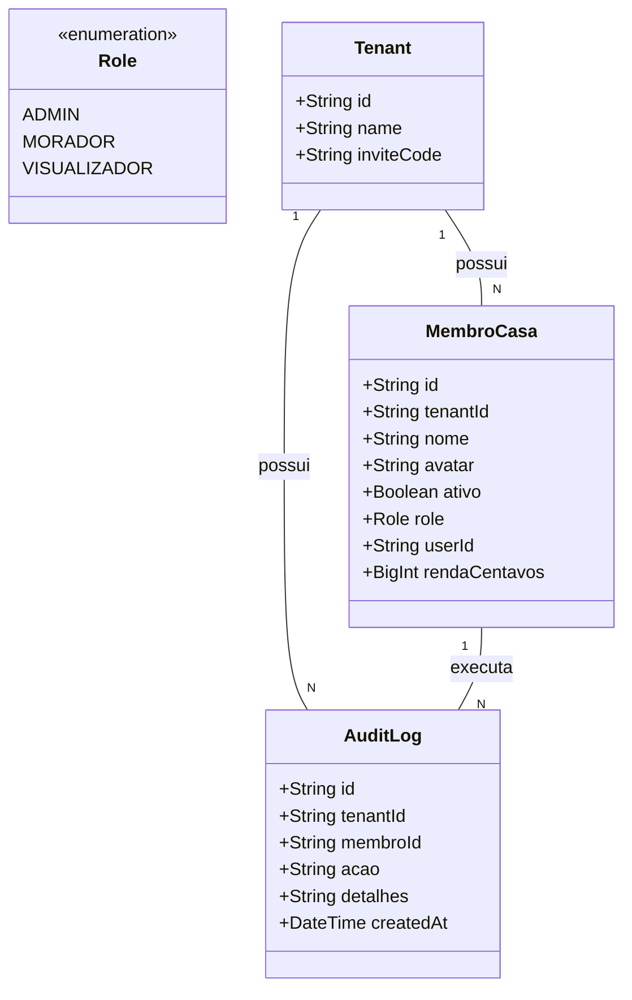

# Abertura de Logs de Auditoria para Moradores e Reforço de Segurança Multitenant

## Requirements

- **Habilitar Acesso à Auditoria**: Permitir que moradores normais (`MORADOR`) e visualizadores (`VISUALIZADOR`) leiam o histórico de atividades contábeis da casa (`GET /audit-logs`), aumentando a transparência e evitando atritos no rateio.
- **Prevenir Vazamento de Dados (BOLA)**: Garantir que todos os endpoints de consulta de leitura que usam `x-tenant-id` no cabeçalho (`membros`, `cartoes`, `faturas`, `gastos`, `contas-fixas`) sejam rigorosamente protegidos pelo `TenantRoleGuard` contra requisições feitas por usuários que não pertencem ao tenant ativo.

---

## Entities

---

## Approach

1. **Abertura do Acesso aos Logs**:
   - Mudar a restrição do endpoint `GET /financeiro/audit-logs` no backend. A rota deixará de exigir `@Roles(Role.ADMIN)` e passará a permitir `@Roles(Role.ADMIN, Role.MORADOR, Role.VISUALIZADOR)`.
   - Isso permite que qualquer membro pertencente à moradia visualize a trilha de atividades, eliminando erros silenciosos na UI (toasts de 403 Forbidden) quando moradores comuns clicarem no ícone de notificações.

2. **Reforço de Segurança Multitenant (BOLA)**:
   - Identificamos que as rotas de leitura `GET /membros`, `GET /cartoes`, `GET /faturas`, `GET /gastos` e `GET /contas-fixas` não possuíam o decorator `@Roles()`. Devido ao guard global `TenantRoleGuard`, rotas sem o decorator `@Roles` eram ignoradas e liberadas sem validar se o usuário solicitante pertencia ao tenant informado no cabeçalho `x-tenant-id`.
   - Adicionar o decorator `@Roles(Role.ADMIN, Role.MORADOR, Role.VISUALIZADOR)` em todas essas rotas de leitura. Isso força o guard a validar a vinculação do usuário autenticado ao tenant ativo, bloqueando tentativas de acesso de fora.

3. **Validação de Testes**:
   - Atualizar a suíte de testes unitários do controller e do guard para certificar a compilação do NestJS e integridade das regras de acesso.

---

## Structure

### Layered Architecture
1. **Controller Layer**: [FinanceiroController](file:///d:/projetos/financeiro-divi/backend/src/financeiro/financeiro.controller.ts) interceptará e validará as requisições HTTP baseando-se nos decorators `@Roles`.
2. **Guard Layer**: [TenantRoleGuard](file:///d:/projetos/financeiro-divi/backend/src/auth/tenant-role.guard.ts) fará o enforcement consultando se o usuário logado possui a Role mínima ou está listado como membro ativo do tenant correspondente no banco.

---

## Operations

### Modify Controller - FinanceiroController
1. **Responsabilidade**: Atualizar os decorators de rotas para liberar logs a todos os membros e restringir leitura multitenant a usuários autorizados.
2. **Endpoints a Modificar**:
   - `GET /financeiro/audit-logs`:
     - Decorator anterior: `@Roles(Role.ADMIN)`
     - Decorator novo: `@Roles(Role.ADMIN, Role.MORADOR, Role.VISUALIZADOR)`
   - `GET /financeiro/membros`:
     - Decorator novo: `@Roles(Role.ADMIN, Role.MORADOR, Role.VISUALIZADOR)`
   - `GET /financeiro/cartoes`:
     - Decorator novo: `@Roles(Role.ADMIN, Role.MORADOR, Role.VISUALIZADOR)`
   - `GET /financeiro/faturas`:
     - Decorator novo: `@Roles(Role.ADMIN, Role.MORADOR, Role.VISUALIZADOR)`
   - `GET /financeiro/gastos`:
     - Decorator novo: `@Roles(Role.ADMIN, Role.MORADOR, Role.VISUALIZADOR)`
   - `GET /financeiro/contas-fixas`:
     - Decorator novo: `@Roles(Role.ADMIN, Role.MORADOR, Role.VISUALIZADOR)`

### Update Test - FinanceiroControllerSpec
1. **Responsabilidade**: Garantir que as alterações no controller compilem e mantenham a cobertura.
2. **Métodos**:
   - Verificar se o teste de integração do controller continua passando e adaptá-lo caso necessário.

---

## Norms

1. **Annotation Standards**: Toda rota operacional privada que envolva manipulação ou leitura de dados contextualizados por moradia (`x-tenant-id`) deve obrigatoriamente declarar o decorator `@Roles` com os papéis autorizados.
2. **Exception Handling**: Em caso de falha de validação no Guard, lançar `ForbiddenException` com mensagens claras e sem expor UUIDs do sistema.

---

## Safeguards

1. **Segurança Multitenant**: Um usuário autenticado sob o token X **nunca** deve conseguir visualizar membros, gastos, cartões ou faturas do Tenant Y a menos que possua um registro ativo correspondente na tabela `membros_casa`.
2. **Prevenção de Falso-Negativo em Testes**: A suite de build deve compilar o TypeScript do backend (`pnpm --filter divi-backend run build`) de forma limpa, e todos os testes de guard e controller devem passar.
