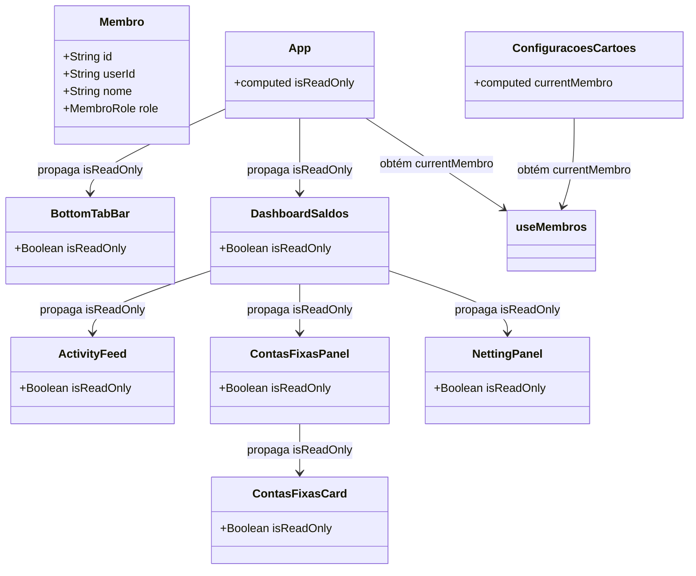

# Iteração do Controle de Acesso do Visualizador no Frontend

## Requirements

- **Desativar Ações para Visualizador**: Integrar a checagem da Role do usuário logado para desativar preventivamente todas as ações de escrita financeira no frontend para a Role `VISUALIZADOR`.
- **Componentes Impactados**:
  - `BottomTabBar`: Desabilitar o FAB de lançamentos.
  - `ActivityFeed`: Ocultar botões de Ajustar e Estornar gastos.
  - `ContasFixasPanel` & `ContasFixasCard`: Ocultar criação de novas contas, desativar cliques operacionais (pointer events) e remover cursor de clique nos cards.
  - `NettingPanel`: Desabilitar o botão de Registrar Pagamento.
  - `ConfiguracoesCartoes`: Ocultar criação e remoção de cartões.

---

## Entities

---

## Approach

1. **Estado Global no App.vue**:
   - Resgatar a propriedade `currentMembro` do hook `useMembros()` no `App.vue`.
   - Criar uma `computed` reativa `isReadOnly` que avalia se `currentMembro.value?.role === 'VISUALIZADOR'`.
   - Propagar essa flag como propriedade `is-read-only` para o `BottomTabBar` e para o `DashboardSaldos`.

2. **Fluxo de Leitura no Dashboard e Componentes**:
   - `BottomTabBar.vue`: Adicionar a prop `isReadOnly` e desabilitar o FAB central de lançamentos caso ela seja verdadeira.
   - `DashboardSaldos.vue`: Receber a prop `isReadOnly` e repassá-la aos painéis (`ActivityFeed`, `ContasFixasPanel`, `NettingPanel`).
   - `ActivityFeed.vue`: Receber `isReadOnly` e usar um `v-if="!isReadOnly"` para ocultar a div de ações de "Ajustar" e "Estornar" despesas.
   - `ContasFixasPanel.vue`: Receber `isReadOnly`, ocultar o botão de "Adicionar Nova Conta" e repassá-la aos cards (`ContasFixasCard`).
   - `ContasFixasCard.vue`: Receber `isReadOnly`, barrar a execução dos métodos de interação do ponteiro (`onPointerDown` e `onPointerUp`) e remover a classe visual de `cursor-pointer`.
   - `NettingPanel.vue`: Receber `isReadOnly` e usar `:disabled="faturaSelecionadaFechada || isReadOnly"` no botão de Registrar Pagamento.

3. **Autonomia de Sessão no Menu de Perfil**:
   - `ConfiguracoesCartoes.vue` já possui importação direta de `useMembros()`. Bastará usar `currentMembro?.role !== 'VISUALIZADOR'` para ocultar o botão de adicionar cartões e de lixeira (excluir).

---

## Structure

### Layered Architecture
- **View Layer**: Os componentes Vue lerão as novas propriedades reativas e aplicarão condicionais de renderização (`v-if`) e desativação (`disabled`) para limitar as interações baseadas na Role.

---

## Operations

### Modify Screen - App.vue
1. **Responsabilidade**: Resgatar o membro autenticado e computar a flag de somente leitura, propagando-a aos subcomponentes.
2. **Alterações**:
   - Desestruturar `currentMembro` da chamada `useMembros()`.
   - Declarar a computed: `const isReadOnly = computed(() => currentMembro.value?.role === 'VISUALIZADOR')`.
   - Passar `:is-read-only="isReadOnly"` nas tags `<DashboardSaldos>` e `<BottomTabBar>`.

### Modify Component - BottomTabBar.vue
1. **Responsabilidade**: Adicionar prop e desabilitar botão FAB de novos lançamentos.
2. **Alterações**:
   - Adicionar `isReadOnly?: boolean` na interface `Props`.
   - Atualizar o `:disabled` do botão FAB central para: `:disabled="isMonthClosed || isReadOnly"`.

### Modify Screen - DashboardSaldos.vue
1. **Responsabilidade**: Receber e propagar a flag de somente leitura para os painéis filhos.
2. **Alterações**:
   - Adicionar `isReadOnly?: boolean` na interface `Props`.
   - Passar `:is-read-only="props.isReadOnly"` para os componentes `<ContasFixasPanel>`, `<ActivityFeed>` e `<NettingPanel>`.

### Modify Component - ActivityFeed.vue
1. **Responsabilidade**: Ocultar botões de mutação de gastos.
2. **Alterações**:
   - Adicionar `isReadOnly?: boolean` na interface `Props`.
   - Colocar `v-if="!isReadOnly"` na div contendo as ações do feed (Ajustar e Estornar).

### Modify Component - ContasFixasPanel.vue
1. **Responsabilidade**: Ocultar criação de novas contas fixas e propagar flag aos cards.
2. **Alterações**:
   - Adicionar `isReadOnly?: boolean` na interface `Props`.
   - Ocultar o botão "Adicionar Nova Conta" usando `v-if="!isReadOnly"`.
   - Passar `:is-read-only="isReadOnly"` para `<ContasFixasCard>`.

### Modify Component - ContasFixasCard.vue
1. **Responsabilidade**: Bloquear toque tátil e remover indicação visual de clique.
2. **Alterações**:
   - Adicionar `isReadOnly?: boolean` na interface `Props`.
   - Na função `onPointerDown(e)`, inserir no topo: `if (props.isReadOnly) return`.
   - Na função `onPointerUp()`, inserir no topo: `if (props.isReadOnly) return`.
   - No template do card, condicionar a classe `cursor-pointer`: `:class="[{ 'cursor-pointer': !isReadOnly }]``.

### Modify Component - NettingPanel.vue
1. **Responsabilidade**: Desabilitar registro de compensação financeira.
2. **Alterações**:
   - Adicionar `isReadOnly?: boolean` na interface `Props`.
   - Atualizar a prop do botão de acerto para: `:disabled="faturaSelecionadaFechada || isReadOnly"`.

### Modify Component - ConfiguracoesCartoes.vue
1. **Responsabilidade**: Ocultar botões de novo cartão e exclusão de cartões.
2. **Alterações**:
   - Ocultar o botão de "Novo Cartão" com `v-if="currentMembro?.role !== 'VISUALIZADOR'"`.
   - Ocultar o botão de lixeira de exclusão com `v-if="currentMembro?.role !== 'VISUALIZADOR'"`.

---

## Norms

1. **Reactive Props**: Usar props reativas do Vue (`defineProps`) para trafegar o estado de somente leitura de forma explícita e tipada.
2. **Defensive UI Programming**: Elementos interativos bloqueados no backend devem sempre possuir correspondência visual desativada/ocultada no frontend para evitar erros desnecessários de requisição.

---

## Safeguards

1. **Integridade de Interação**: O visualizador deve ser incapaz de acionar o modal de Novo Lançamento, Ajustar Gasto, Excluir Gasto, Cadastrar Cartão ou Registrar Compensação de Netting.
2. **Consistência de Testes**: Todos os testes unitários do frontend (`vitest`) e o build de produção (`pnpm run build`) devem passar após as alterações de propriedades.
