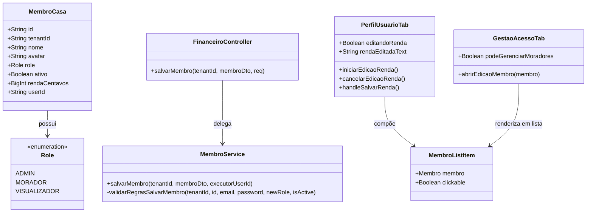

# Iteração do Controle de Acesso do Morador no RBAC

## Requirements

- **Autonomia de Gestão de Renda do Morador**: Permitir que membros com a Role `MORADOR` atualizem sua própria renda mensal diretamente na interface de forma legítima e segura.
- **Autonomia de Gestão de Cartões**: Garantir que moradores mantenham a capacidade de criar e excluir seus próprios cartões pessoais na aba "Meu Perfil" (através de `ConfiguracoesCartoes`), enquanto a Role `VISUALIZADOR` permanece restrita de realizar tais operações de escrita.
- **Restrição de Governança de Terceiros**: Garantir que moradores sem privilégios de `ADMIN` não possam visualizar formulários de edição, inativar, suspender ou alterar privilégios (Roles) de outros moradores.
- **Diferenciação Visual Estrita**: Tornar a aba de "Acessos" puramente informativa para não-admins, desativando cliques na lista de membros e removendo os elementos visuais indicadores de interação (chevron, hover e cursor pointer).
- **Critérios de Aceite (DoD)**:
  - O `MORADOR` consegue atualizar sua própria renda em "Meu Perfil".
  - O `MORADOR` consegue gerenciar seus próprios cartões (criar/deletar), mas o `VISUALIZADOR` tem essas ações bloqueadas.
  - Se um `MORADOR` ou `VISUALIZADOR` tentar enviar um payload alterando outro membro (ou mudando a própria Role/Status de Ativo) para o backend, receberá `403 Forbidden` ou `400 Bad Request` com validação estrita.
  - A aba "Acessos" remove feedbacks visuais de clique e chevron se o usuário ativo não for `ADMIN`.
  - Todos os testes de unidade e build do monorepo continuam passando com sucesso.

---

## Entities



---

## Approach

1. **Validação e Proteção Estrita no Backend**:
   - **Controller (`FinanceiroController.ts`)**: Expandir a anotação de controle da rota `POST /financeiro/membros` para `@Roles(Role.ADMIN, Role.MORADOR)`, permitindo que moradores comuns acessem o endpoint para atualização própria.
   - **Service (`MembroService.ts`)**:
     - No método `salvarMembro`, obter o perfil do executor através do `executorUserId`.
     - Validar se o executor possui privilégios de `ADMIN`. Se não possuir:
       - O `id` do membro sendo alterado no payload deve obrigatoriamente coincidir com o `id` de membro do próprio executor. Caso contrário, lançar `ForbiddenException('Você só pode editar os seus próprios dados.')`.
       - O novo papel (`role`) no payload deve coincidir com o papel atual. Caso contrário, lançar `BadRequestException('Você não pode alterar o seu próprio papel.')`.
       - O status de atividade (`ativo`) deve coincidir com o status atual. Caso contrário, lançar `BadRequestException('Você não pode alterar o seu próprio status de atividade.')`.

2. **Gerenciamento de Renda Pessoal no Frontend (`PerfilUsuarioTab.vue`)**:
   - Adicionar uma seção para exibição e edição de **Renda Mensal** na aba "Meu Perfil".
   - Seguir o mesmo padrão visual e de fluxo reativo da edição de nome (lápis para editar, input com botões de salvar/cancelar).
   - Implementar formatação em moeda reativa (`@input="handleRendaInput"`) e a chamada ao ViewModel: `atualizarRendaMembro(currentMembro.value.id, novaRendaCentavos)`.

3. **Lista Informativa de Moradores (`GestaoAcessoTab.vue` e `MembroListItem.vue`)**:
   - Adicionar a propriedade opcional `clickable?: boolean` (default: `true`) no `MembroListItem.vue`.
   - Se `clickable === false`:
     - Ocultar o ícone `ChevronRight`.
     - Remover as classes de clique (`cursor-pointer active:scale-[0.98] hover:border-ember/40`) e aplicar `cursor-default`.
   - No `GestaoAcessoTab.vue`, passar `:clickable="podeGerenciarMoradores"` para o `MembroListItem` e bloquear a abertura da gaveta de edição na função `abrirEdicaoMembro` caso não seja Admin.

---

## Structure

### Layered Architecture
- **Controller Layer**: O controller intercepta a requisição, permitindo tanto `ADMIN` quanto `MORADOR` na rota de salvamento de membros.
- **Service Layer**: O service implementa a lógica de segurança granular baseada no ID do executor.
- **View Layer**: Os componentes Vue ajustam sua interatividade de acordo com a Role do usuário ativo, impedindo cliques e revelando inputs de self-service.

---

## Operations

### Modify Controller - FinanceiroController.ts
1. **Responsabilidade**: Liberar acesso ao endpoint de salvar membro para moradores.
2. **Alterações**:
   - Alterar o decorator da rota `Post('membros')` para `@Roles(Role.ADMIN, Role.MORADOR)`.

### Modify Service - MembroService.ts
1. **Responsabilidade**: Garantir a segurança e impedir que não-admins alterem outros membros, status ou roles.
2. **Alterações**:
   - No método `salvarMembro(tenantId, membroData, executorUserId)`:
     - Buscar o membro executor:
       ```typescript
       const executorMembro = await this.prisma.membroCasa.findFirst({
         where: { tenantId, userId: executorUserId }
       });
       ```
     - Se `executorMembro?.role !== Role.ADMIN`:
       - Lançar `ForbiddenException('Você só pode editar os seus próprios dados.')` se `id` (do payload) for diferente de `executorMembro.id`.
       - Lançar `BadRequestException('Você não pode alterar o seu próprio papel.')` se `role` (do payload) for enviado e for diferente de `membroAtual.role`.
       - Lançar `BadRequestException('Você não pode alterar o seu próprio status de atividade.')` se `ativo` (do payload) for enviado e for diferente de `membroAtual.ativo`.
   - Garantir a importação de `ForbiddenException` do `@nestjs/common`.

### Modify Component - MembroListItem.vue
1. **Responsabilidade**: Ocultar chevron de clique e remover estilo tátil se o item for configurado como não-clicável.
2. **Alterações**:
   - Declarar na interface `Props`: `clickable?: boolean`.
   - No template do container raiz, condicionar a classe de cursor e hover:
     - `:class="[ { 'opacity-60 grayscale-[0.5]': !membro.ativo }, clickable !== false ? 'cursor-pointer active:scale-[0.98] hover:border-ember/40' : 'cursor-default' ]"`
     - Ajustar `@click` para disparar o emit apenas se `clickable !== false`: `@click="clickable !== false && emit('click')"`.
   - Ocultar a tag `<ChevronRight>` utilizando `v-if="clickable !== false"`.

### Modify Component - GestaoAcessoTab.vue
1. **Responsabilidade**: Impedir abertura de modal de edição para não-admins.
2. **Alterações**:
   - No template, passar `:clickable="podeGerenciarMoradores"` para a tag `<MembroListItem>`.
   - No método `abrirEdicaoMembro(membro)`, adicionar no topo:
     - `if (!podeGerenciarMoradores.value) return`.

### Modify Component - PerfilUsuarioTab.vue
1. **Responsabilidade**: Permitir a visualização e edição reativa da renda do próprio morador.
2. **Alterações**:
   - Desestruturar `atualizarRendaMembro` do hook `useMembros()`.
   - Declarar variáveis reativas:
     - `const editandoRenda = ref(false)`
     - `const rendaEditadaText = ref('')`
     - `const salvandoRenda = ref(false)`
     - `const inputRendaRef = ref<HTMLInputElement | null>(null)`
   - Criar funções de fluxo:
     - `iniciarEdicaoRenda()`: popula `rendaEditadaText` formatada e foca o input.
     - `cancelarEdicaoRenda()`: redefine o estado.
     - `handleSalvarRenda()`: limpa o texto monetário, converte para centavos, chama `atualizarRendaMembro` e fecha edição.
     - `handleRendaInput(e)`: máscara monetária idêntica à do formulário de moradores.
   - Adicionar no template (abaixo do nome do usuário) a linha de exibição de renda com lápis de edição, e o input com botões de salvar/cancelar em modo de edição.

---

## Norms

1. **Role Boundary Enforcement**: A validação de escopo de Role deve ocorrer primariamente no backend de forma robusta e defensiva. A UI é um espelho preventivo e não a única barreira de segurança.
2. **Consistent UX Input**: Inputs de edição inline devem compartilhar o mesmo comportamento tátil e visual de feedback ao salvar, cancelar ou digitar valores monetários.

---

## Safeguards

1. **Prevenção de Escalação de Privilégio**: Um morador comum não deve ser capaz de alterar a propriedade `role` de seu próprio registro no payload (ex: mudando de `MORADOR` para `ADMIN`). O backend deve barrar esta ação de forma estrita.
2. **Proteção Contra Desativação Acidental**: Um morador comum não deve conseguir suspender a si mesmo (`ativo: false`).
3. **Gerenciamento de Cartões**: O morador é livre para gerenciar os cartões que estão sob sua titularidade (responsabilidade padrão), enquanto ações de escrita em cartões permanecem estritamente proibidas para a Role VISUALIZADOR.
4. **Consistência de Testes**: Garantir que as alterações no controller e service do backend não quebrem os testes unitários de permissões e de membros.
