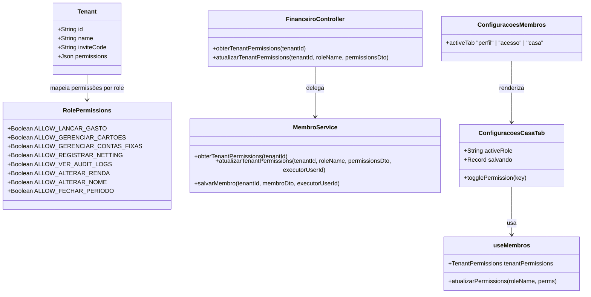

# Permissões Dinâmicas de Moradores como Feature Flags

## Requirements

- **Configuração Dinâmica de Permissões por Role**: Permitir que o `ADMIN` configure na UI as permissões de escrita e visualização individualmente para cada papel (Role) da moradia. O design deve suportar Custom Roles (papéis customizados) criados dinamicamente no futuro.
- **Seletor de Role na UI**: A aba "Casa" (ou "Permissões") de moradores deve permitir selecionar qual Role (ex: Morador, Visualizador) o ADMIN deseja configurar, exibindo os switches correspondentes.
- **Feature Flags Parametrizadas**:
  - `ALLOW_LANCAR_GASTO` (Lançar despesas comuns e parceladas)
  - `ALLOW_GERENCIAR_CARTOES` (Criar e excluir cartões de crédito)
  - `ALLOW_GERENCIAR_CONTAS_FIXAS` (Criar e estornar contas fixas recorrentes)
  - `ALLOW_REGISTRAR_NETTING` (Registrar pagamento de netting)
  - `ALLOW_VER_AUDIT_LOGS` (Visualizar o histórico/logs de auditoria da casa)
  - `ALLOW_ALTERAR_RENDA` (Permitir alterar a própria renda no perfil de membro)
  - `ALLOW_ALTERAR_NOME` (Permitir alterar o próprio nome de exibição no perfil de membro)
  - `ALLOW_FECHAR_PERIODO` (Permitir encerrar o período / fechar e reabrir o mês de despesas)
- **Persistência Estruturada por Role**: Persistir no campo JSON `permissions` do modelo `Tenant` um mapa de permissões indexado pelo nome da Role (ex: `permissions: { "MORADOR": { "ALLOW_LANCAR_GASTO": true }, "VISUALIZADOR": { "ALLOW_LANCAR_GASTO": false } }`).
- **Validação de Retaguarda por Role**: O backend deve verificar dinamicamente a respectiva flag correspondente à Role do usuário executor antes de autorizar a operação, lançando `403 Forbidden` se estiver inativa para aquela Role.

---

## Entities

---

## Approach

1. **Persistência no Prisma (Backend)**:
   - Manter o campo `permissions Json? @default("{}")` na tabela `Tenant` no `schema.prisma`.
   - Tratar na camada de negócio (`MembroService`) para que novos tenants criados em `criarTenant` já venham com o mapa padrão contendo as roles e todas as flags como `true` para `MORADOR` e `false` para `VISUALIZADOR`.

2. **Rotas e Validações no Backend**:
   - Criar rota `GET /financeiro/tenants/permissions` (para qualquer membro ler o estado ativo).
   - Criar rota `PATCH /financeiro/tenants/permissions/:role` (restrita a `@Roles(Role.ADMIN)`) que atualiza as flags de uma Role específica no JSON da moradia no banco e dispara uma notificação Socket `permissoes_alteradas` para todos os clientes conectados.
   - Nos serviços (`LancamentoService`, `CartaoService` e `AuditLogService`):
     - Buscar a Role do membro executor da requisição.
     - Validar no JSON de permissões do Tenant se a respectiva flag (ex: `ALLOW_LANCAR_GASTO`, `ALLOW_GERENCIAR_CARTOES`) para aquela Role está ativada.
     - Caso esteja desativada, lançar `ForbiddenException('O administrador da moradia desativou esta permissão para o seu papel.')`.
   - No `CartaoService` (salvarFatura, salvarMuitasFaturas):
     - Buscar a Role do executor.
     - Se o executor não for `ADMIN`, e a transação envolver o fechamento (status `'FECHADA'`) ou a reabertura (fatura salva como `'ABERTA'` mas que anteriormente estava como `'FECHADA'` no banco de dados): validar se a flag `ALLOW_FECHAR_PERIODO` para o seu papel está desativada. Caso desativada, lançar `ForbiddenException('O administrador da moradia desativou a permissão de fechar ou reabrir o período para o seu papel.')`.
   - No `MembroService` (salvarMembro):
     - Buscar a Role do executor.
     - Se o executor não for `ADMIN` e estiver alterando seu próprio nome (comparado ao banco de dados), verificar se `ALLOW_ALTERAR_NOME` está desativado para o seu papel. Se desativado, lançar `ForbiddenException('O administrador da moradia desativou a permissão de alterar o nome para o seu papel.')`.
     - Se o executor não for `ADMIN` e estiver alterando sua própria renda (comparada ao banco de dados), verificar se `ALLOW_ALTERAR_RENDA` está desativado para o seu papel. Se desativado, lançar `ForbiddenException('O administrador da moradia desativou a permissão de alterar a renda para o seu papel.')`.

3. **Modificações de UI no Frontend**:
   - **ConfiguracoesMembros.vue**:
     - Adicionar a aba "Casa" (ou "Permissões") acessível exclusivamente para `ADMIN`.
     - No formulário de edição de perfil, obter a Role do usuário logado e verificar as flags `ALLOW_ALTERAR_NOME` e `ALLOW_ALTERAR_RENDA`. Se estiverem inativas, desativar os respectivos campos de input para edição.
   - **ConfiguracoesCasaTab.vue**:
     - Exibir seletor da Role a ser configurada (ex: Morador, Visualizador).
     - Renderizar switches (toggles) elegantes para as 8 feature flags da Role selecionada.
     - Ao alternar o switch, disparar chamada PATCH no servidor para a respectiva Role.
   - **Verificação Reativa de Permissão**:
     - As views e viewmodels devem ler a Role do usuário logado e verificar no mapa de permissões do Tenant ativo se a flag correspondente está ligada, ocultando ou desabilitando componentes caso contrário.

---

## Structure

### Layered Architecture
- **Database Layer**: Nova coluna JSON em `Tenant`.
- **Controller Layer**: Endpoints HTTP adicionais para consulta e atualização de permissões da moradia.
- **Service Layer**: Lógica de validação estrita nos serviços de Cartões, Gastos, Contas Fixas, Logs e Membros.
- **View Layer**: O modal de configurações de membros e painéis do dashboard passam a gerenciar as restrições reativas de interface baseadas nas feature flags do Tenant.

---

## Operations

### Modify Schema - schema.prisma
1. **Responsabilidade**: Adicionar o campo no modelo de dados.
2. **Alterações**:
   - No modelo `Tenant`, adicionar: `permissions Json? @default("{}") @map("permissions")`.

### Modify Controller - FinanceiroController.ts
1. **Responsabilidade**: Expor rotas de obtenção e modificação de permissões do tenant.
2. **Alterações**:
   - Criar `@Get('tenants/permissions')` com `@Roles(Role.ADMIN, Role.MORADOR, Role.VISUALIZADOR)` chamando `membroService.obterTenantPermissions(tenantId)`.
   - Criar `@Patch('tenants/permissions/:role')` com `@Roles(Role.ADMIN)` chamando `membroService.atualizarTenantPermissions(tenantId, roleName, body, req.user.userId)`.

### Modify Service - MembroService.ts
1. **Responsabilidade**: Implementar a lógica de leitura, persistência padrão e validação de permissões administrativas e de perfil por Role.
2. **Alterações**:
   - No método `criarTenant(name, userId)`:
     - Iniciar o objeto JSON de permissões mapeando cada uma das Roles conhecidas (`MORADOR`, `VISUALIZADOR`, etc.) para um objeto com as 8 chaves de permissão como `true` para `MORADOR` e `false` para `VISUALIZADOR`.
   - Criar o método `obterTenantPermissions(tenantId)`:
     - Buscar o Tenant e retornar o objeto `permissions` serializado. Se estiver vazio/nulo, retornar o mapa padrão com as flags de cada Role.
   - Criar o método `atualizarTenantPermissions(tenantId, roleName, permissionsDto, executorUserId)`:
     - Fazer o merge das novas permissões no JSON do Tenant no banco de dados na chave da Role especificada (`roleName`).
     - Disparar notificação via Socket Gateway: `this.gateway.notificarAlteracao(tenantId, 'permissoes_alteradas')`.
   - No método `salvarMembro(tenantId, membroData, executorUserId)`:
     - Validar se o executor não for `ADMIN`.
     - Caso esteja alterando o nome de exibição (membroData.nome diferente de membroAtual.nome) e a flag `ALLOW_ALTERAR_NOME` para o papel do executor seja falsa, lançar `ForbiddenException('O administrador da moradia desativou a permissão de alterar o nome para o seu papel.')`.
     - Caso esteja alterando a renda (membroData.rendaCentavos diferente de membroAtual.rendaCentavos) e a flag `ALLOW_ALTERAR_RENDA` para o papel do executor seja falsa, lançar `ForbiddenException('O administrador da moradia desativou a permissão de alterar a renda para o seu papel.')`.

### Implement Service Validations - Guard ou Services do Backend
1. **Responsabilidade**: Garantir a segurança interna de cada domínio contra mutações indesejadas baseada nas Roles dos executores.
2. **Alterações**:
   - Em `LancamentoService.ts` (salvarGasto, excluirGasto, salvarContaFixa, excluirContaFixa):
     - Buscar a Role do executor.
     - Validar se a flag correspondente (`ALLOW_LANCAR_GASTO` ou `ALLOW_GERENCIAR_CONTAS_FIXAS`) para aquela Role do executor é falsa no Tenant ativo. Lançar `ForbiddenException`.
   - Em `CartaoService.ts` (salvarFatura, salvarMuitasFaturas):
     - Buscar a Role do executor.
     - Se o executor não for `ADMIN`, validar se a operação de fechamento/reabertura (status `'FECHADA'` envolvido de/para) é bloqueada pela flag `ALLOW_FECHAR_PERIODO` para o seu papel. Lançar `ForbiddenException('O administrador da moradia desativou a permissão de fechar ou reabrir o período para o seu papel.')`.
     - No método `salvarCartao` e `excluirCartao`: validar `ALLOW_GERENCIAR_CARTOES`.
   - Em `AuditLogService.ts` (listar):
     - Buscar a Role do executor.
     - Validar se a flag correspondente (`ALLOW_VER_AUDIT_LOGS`) para aquela Role é falsa no Tenant ativo. Lançar `ForbiddenException`.

### Create Component - ConfiguracoesCasaTab.vue
1. **Responsabilidade**: Interface administrativa de ativação/desativação de feature flags da moradia por Role.
2. **Alterações**:
   - Usar o viewmodel `useMembros` para ler e gravar as permissões do tenant ativo por Role.
   - Renderizar seletor de Role (sub-abas ou dropdown) e switches elegantes para as 8 chaves de controle da Role selecionada (incluindo `ALLOW_FECHAR_PERIODO`).
   - Implementar persistência reativa imediata disparando `atualizarPermissions` a cada alternância do switch.

### Modify Screen - ConfiguracoesMembros.vue
1. **Responsabilidade**: Exibir e chavear a nova aba "Casa" (ou "Permissões") para o Administrador, além de restringir edição de campos do formulário de perfil.
2. **Alterações**:
   - Computar se o usuário logado é `ADMIN`: `const isAdmin = computed(() => currentMembro.value?.role === 'ADMIN')`.
   - Adicionar o botão da aba "Casa" na barra de navegação superior, exibido apenas se `isAdmin.value === true`.
   - Tratar a renderização do novo componente `<ConfiguracoesCasaTab>` na aba correspondente.
   - Computar bloqueio de campos de Nome e Renda baseando-se na Role do usuário logado e nas flags `ALLOW_ALTERAR_NOME` e `ALLOW_ALTERAR_RENDA` do `tenantPermissions`. Se bloqueado, adicionar a propriedade `disabled` correspondente nos inputs do formulário de edição de perfil.

### Modify UI Components - Frontend Views
1. **Responsabilidade**: Desativar/ocultar os elementos baseados no estado das permissões ativas por Role.
2. **Alterações**:
   - No viewmodel `useMembros`, buscar as permissões dinâmicas do tenant ativo no método `carregar` a partir do `membroRepository.obterPermissions()`.
   - No `App.vue`, escutar o evento socket `permissoes_alteradas` para recarregar as permissões e atualizar o estado reativo do frontend instantaneamente.
   - No `App.vue` e `BottomTabBar.vue`, desativar o FAB de lançamentos e o clique do FAB se `isLancarGastoBloqueado` (computado a partir de `ALLOW_LANCAR_GASTO` para a Role do usuário) for verdadeiro.
   - No `DashboardSaldos.vue`, computar e repassar as permissões dinâmicas específicas de escrita para moradores para os componentes:
     - `NettingPanel`: desativar botões de Pix de acerto netting se `!ALLOW_REGISTRAR_NETTING` para a Role do usuário.
     - `ContasFixasPanel`: Ocultar botão de adicionar e cliques do cartão se `!ALLOW_GERENCIAR_CONTAS_FIXAS` para a Role do usuário.
     - `ActivityFeed`: desativar botões de edição/exclusão se `!ALLOW_LANCAR_GASTO` para a Role do usuário.
     - `DashboardHeader`: Ocultar sino de log de auditoria se `!ALLOW_VER_AUDIT_LOGS` para a Role do usuário, bloqueando a abertura do modal de logs de auditoria.
     - Botões de "Encerrar Mês" e "Reabrir Período": adicionar a propriedade `disabled` reativa caso a flag `ALLOW_FECHAR_PERIODO` para a Role do usuário esteja desativada (exceto `ADMIN`).
   - No `ConfiguracoesCartoes.vue`, ocultar botões de criar e excluir cartões para moradores se `!ALLOW_GERENCIAR_CARTOES` para a Role do usuário.

---

## Norms

1. **Defensive Defaulting**: Feature flags inexistentes no JSON do Tenant no banco de dados devem sempre ser avaliadas como `true` (permitidas) para a Role correspondente para evitar falhas em moradias antigas.
2. **Real-time Sincronicity**: A alteração de uma flag pelo Admin deve invalidar de imediato as permissões reativas dos clients no frontend via canal de Socket para evitar atritos de requisições falhas.

---

## Safeguards

1. **Soberania Absoluta**: A alteração das feature flags de permissões dinâmicas é de acesso restrito e soberano do `ADMIN`. Tentativas de alteração por moradores ou visualizadores devem ser rejeitadas no backend de forma imediata.
2. **Autonomia Crítica**: A Role `ADMIN` nunca deve ter seus privilégios limitados ou afetados por nenhuma das feature flags dinâmicas, assegurando que o responsável principal pela moradia sempre possa corrigir e operar o sistema.
