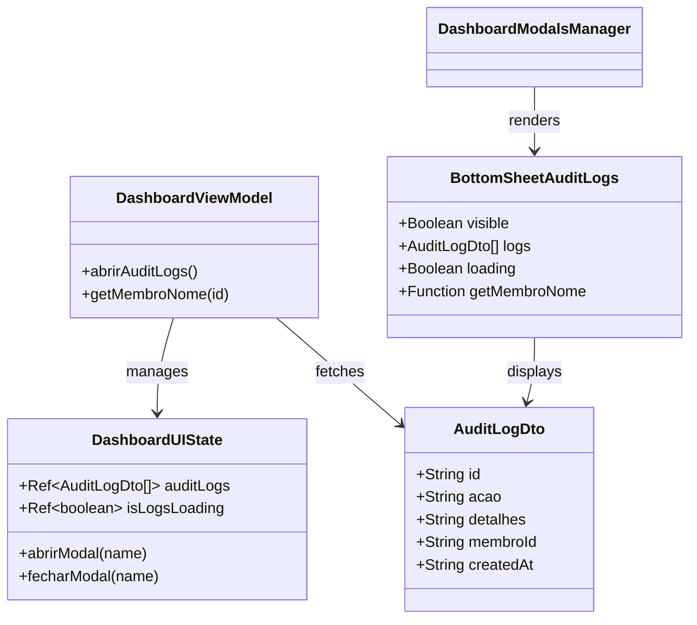

# [Refactor] UI/UX Improvement for Audit Logs Modal

## Requirements
- Transition from a manual, static modal implementation to a fluid, animated `BottomSheet` component.
- Implement standardized "drag-to-close" behavior and spring-based transitions for better UX.
- Centralize modal lifecycle management within the `DashboardModalsManager`.
- Enhance visual feedback for loading and empty states using established project illustrations and tokens.
- Maintain consistent visual identification of audit actions (Create, Edit, Delete, Income) through color coding and iconography.

## Entities

## Approach
1. **State Externalization**: Move the audit log data (`auditLogs`) and its loading state (`isLogsLoading`) from the local view scope to the centralized `DashboardUIState`. This allows the data to be consumed by the `DashboardModalsManager`.
2. **Encapsulation**: Create a specialized `BottomSheetAuditLogs.vue` component. This removes ~80 lines of UI code from `DashboardSaldos.vue`, adhering to the Single Responsibility Principle.
3. **Standardization**: Wrap the new component in the base `BottomSheet.vue`. This automatically provides the application's signature animations, backdrop blur, and mobile-friendly gesture support.
4. **Visual Harmonization**: 
   - Replace manual CSS animations with the built-in `--ease-spring` transitions.
   - Use `IllustrationMascot` for empty states to match the "onboarding" and "empty dashboard" aesthetics.
   - Refine the action badges with proper semantic colors (meadow, sky, coral, sunburst).

## Structure

### Inheritance & Composition
1. `BottomSheetAuditLogs.vue` composes `BottomSheet.vue`.
2. `BottomSheet.vue` provides the structural shell (Teleport, Overlay, Drag Handle).

### Dependencies
1. `DashboardSaldos.vue` calls `vm.abrirAuditLogs()`.
2. `DashboardViewModel` calls `HttpAuditLogRepository` to fetch data.
3. `DashboardModalsManager.vue` receives the state via `vm` and injects it into `BottomSheetAuditLogs`.

### Layered Architecture
1. **View Layer**: `DashboardSaldos.vue` (Trigger), `BottomSheetAuditLogs.vue` (Display).
2. **Manager Layer**: `DashboardModalsManager.vue` (Orchestration).
3. **ViewModel Layer**: `useDashboardViewModel.ts` (Logic), `useDashboardUIState.ts` (State).

## Operations

### Update useDashboardUIState - src/viewmodels/useDashboardUIState.ts
1. **Attributes**:
   - `auditLogs`: `Ref<AuditLogDto[]>` - Initialized as empty array.
   - `isLogsLoading`: `Ref<boolean>` - Initialized as false.
2. **Logic**:
   - Export these new refs in the return object.

### Update useDashboardViewModel - src/viewmodels/useDashboardViewModel.ts
1. **Methods**:
   - `abrirAuditLogs()`:
     - Logic:
       - If already loading, return.
       - Set `ui.isLogsLoading.value = true`.
       - Call `ui.abrirModal('audit-logs')`.
       - Try/Catch block:
         - `ui.auditLogs.value = await auditLogRepo.listarTodos()`.
         - On error, show toast and set `ui.auditLogs.value = []`.
       - Finally: `ui.isLogsLoading.value = false`.
   - **Removal**: Remove `listarAuditLogs()` as its logic is now contained within `abrirAuditLogs()`.

### Create BottomSheetAuditLogs - src/views/components/ledger/dashboard/BottomSheetAuditLogs.vue
1. **Responsibility**: Specialized view for displaying the house activity history.
2. **Props**:
   - `visible`: `boolean`.
   - `logs`: `AuditLogDto[]`.
   - `loading`: `boolean`.
   - `getMembroNome`: `(id: string) => string`.
3. **Template**:
   - Use `BottomSheet` with `title="Atividades da Casa"`.
   - **Header Slot**: Use `h3` with `font-display` and `text-ember` for "da Casa".
   - **Loading State**: Centered spinner with "Carregando..." text in bold uppercase.
   - **Empty State**: `IllustrationMascot` (variant "sky", mood "chill") with descriptive text.
   - **Log List**:
     - Loop through `logs`.
     - Action icon container: Use emojis (💸, ✏️, 🗑️, 💰) with background colors matched to action types.
     - Content: `log.detalhes` with charcoal color.
     - Metadata: Member name and formatted date in small uppercase tracking-wide text.
4. **Logic**:
   - Emits `close` to trigger `vm.fecharModal('audit-logs')`.

### Update DashboardModalsManager - src/views/screens/DashboardModalsManager.vue
1. **Implementation**:
   - Import `BottomSheetAuditLogs`.
   - Add `<BottomSheetAuditLogs />` to the template.
   - Bind props:
     - `:visible="isModalNoTopo('audit-logs')"`.
     - `:logs="vm.auditLogs.value"` (or unrefed).
     - `:loading="vm.isLogsLoading.value"`.
     - `:get-membro-nome="vm.getMembroNome"`.
     - `@close="vm.fecharModal('audit-logs')"`.

### Update DashboardSaldos - src/views/screens/DashboardSaldos.vue
1. **Refactoring**:
   - Remove local refs: `mostrarAuditLogs`, `logsAuditoria`, `carregandoLogs`.
   - Remove the manual `<!-- Modal de Logs de Auditoria -->` HTML block.
   - Update `abrirAuditLogs` function to simply call `vm.abrirAuditLogs()`.
   - **Cleanup**: Remove `listarAuditLogs` from the ViewModel destructuring block.

## Norms
1. **Naming**: Use PascalCase for components and camelCase for functions/variables.
2. **Styling**: Strictly use Tailwind CSS utility classes. Prefer `font-display` for titles.
3. **Reusability**: Use the `BottomSheet` wrapper to ensure consistency in interaction models (drag-to-close).
4. **Type Safety**: Explicitly type props and emits in the new component.

## Safeguards
- **Scroll Locking**: Rely on `BottomSheet.vue`'s built-in scroll lock mechanism.
- **Z-Index**: Use the `Teleport` mechanism provided by `BottomSheet` to avoid stacking context issues.
- **Empty States**: Never show a blank screen; always provide visual feedback via `IllustrationMascot`.
- **Error Handling**: Wrap the API call in a try/catch with user-facing toasts.
- **Responsiveness**: Ensure the list scrolls correctly on short mobile screens while maintaining the `90dvh` max-height.
