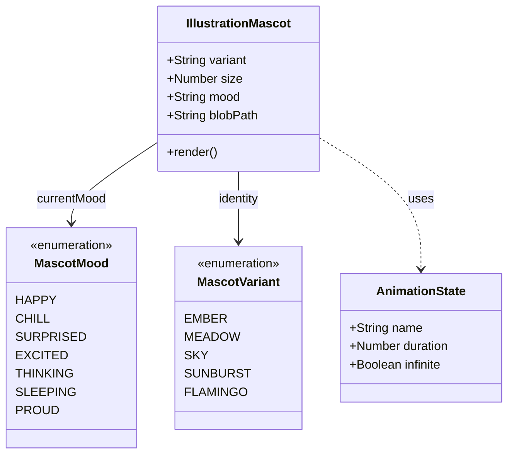

# Melhoria das Expressões dos Mascotes (Mascot Vitality)

## Requirements
- **Implementar Mascot Expression Pack**: Adicionar novos estados emocionais (`excited`, `thinking`, `sleeping`, `proud`).
- **Criar Dynamic Blob Morphing**: Transformar o corpo estático em uma forma orgânica que reage ao humor.
- **Enriquecer Micro-animações**: Reativar e suavizar movimentos de membros e adicionar detalhes expressivos (blush, eye glint).
- **Evoluir Design dos Membros**: Substituir os membros estilo "palito" (linhas simples) por membros orgânicos estilo "noodle/blobby" (formas preenchidas ou traços mais grossos e curvos) para maior expressividade.
- **Adicionar Estados de Interação**: Implementar reações sutis ao hover e transições suaves entre humores.

## Entities

## Approach
1. **SVG Path Optimization**:
   - Padronizar todos os `blobPath` para usarem o mesmo número de pontos (Cubic Bezier segments) para permitir transições via CSS `transition: d 0.6s var(--ease-spring)`.
   - **Subtle Morphing**: Manter a silhueta original do blob, aplicando apenas variações mínimas (1-3 unidades) para preservar a identidade visual icônica.

2. **Modular Expression Rendering**:
   - Refatorar os blocos `v-if/v-else` no template para sub-componentes ou grupos SVG nomeados que herdam o estado de animação.
   - Introduzir "Embellishments" (elementos de realce) como blush com opacidade 40% e brilhos oculares para maior vitalidade.

3. **Motion Design System**:
   - Utilizar variáveis CSS para controlar a intensidade das animações baseadas no `mood`.
   - Implementar `animate-wobble` e `animate-float` refinados no `main.css` com escalas e rotações orgânicas.

## Structure
### Inheritance Relationships
1. `IllustrationMascot.vue` é o componente base que encapsula a lógica de renderização SVG e gerencia o estado de `hovered`.
2. Os humores são mapeados via objetos reativos que retornam caminhos de SVG e estados de animação.

### Dependencies
1. `IllustrationMascot` depende de definições de cores globais do `main.css` (via Tailwind theme).
2. O componente é integrado em telas como `LoginScreen.vue` e `DashboardSaldos.vue` para reagir dinamicamente ao estado da aplicação.

### Layered Architecture
1. View Layer: Template SVG declarativo.
2. Logic Layer: `script setup` gerenciando as propriedades reativas de path e cor.
3. Style Layer: Keyframes CSS para micro-movimentos e respiração.

## Operations

### Update Component - IllustrationMascot.vue
1. **Responsibility**: Renderizar o mascote com expressões dinâmicas e transições suaves.
2. **Attributes**:
   - `mood`: Expandir para incluir `excited`, `thinking`, `sleeping`, `proud`, `surprised`.
   - `hovered`: Estado interno para reação ao mouse.
3. **Methods**:
   - `blobPath` (computed): Retornar o path correspondente ao humor atual (variações sutis da base "M20,50 Q20,15 50,20 Q80,25 85,55 Q90,85 50,80 Q10,75 15,50 Z").
4. **Logic Changes**:
   - Adicionar elementos de "Blush": `opacity-40` para visibilidade.
   - Adicionar "Eye Glint": Pontos brancos (`white`) nos olhos para `proud` e `excited`.
   - Reativar membros: `animate-leg-left`, `animate-leg-right`, `animate-arm-wave`.
   - **Design de Membros**: Usar `stroke-width: 3.2`, `opacity: 0.8` e caminhos curvos (`Quadratic Bezier`) integrados organicamente ao corpo.
   - Adicionar interatividade: `scale-110` no hover.

### Integration - App Screens
1. **LoginScreen.vue**: Mascote muda de humor baseado em `loading` (surprised) e `isRegisterMode` (excited).
2. **DashboardSaldos.vue**: Estado de lista vazia utiliza humor `sleeping`.

### Update Style - CSS Keyframes
1. **Refine `breathe`**: Ajustar para ser mais sutil.
2. **Add `jump-n-vibe`**: Animação para o humor `excited`.
3. **Add `thinking-sway`**: Oscilação lenta e assimétrica.

## Norms
1. **SVG Best Practices**: Manter o `viewBox="0 0 100 100"` e usar `vector-effect="non-scaling-stroke"` se necessário.
2. **Transitions**: Todas as mudanças de humor devem ser interpoladas via CSS transitions no path do corpo.
3. **Accessibility**: Adicionar `aria-label` descritivo baseado no humor (ex: "Mascote Divi feliz").

## Safeguards
1. **Visual Regressions**: Garantir que os mascotes existentes no Header (32px) continuem legíveis.
2. **Path Integrity**: Verificar se o número de nós nos novos `blobPaths` é compatível com os antigos para evitar "flips" durante a transição.
3. **Performance**: Limitar o uso de filtros de drop-shadow dentro do SVG, preferindo caminhos preenchidos com opacidade para sombras internas.
