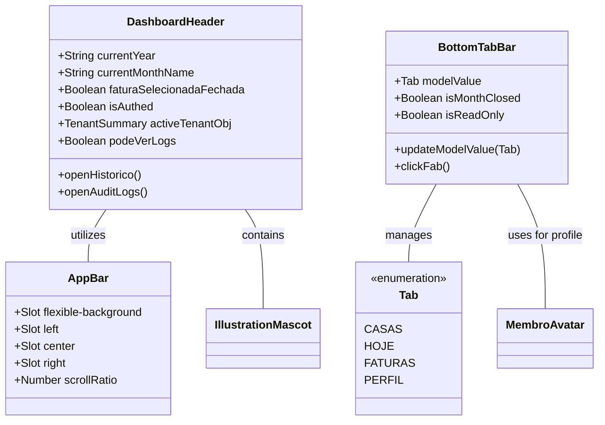

# GGQPA-XXX-202606121120-[Refactor]-ui-premium-navbar-header-evolution

## Requirements
- **Elevate Visual Fidelity**: Transform the existing navbar and header into a premium, polished experience that feels both professional and family-friendly.
- **Inclusive Universal Design**: Ensure the interface is intuitive and accessible for all age groups, specifically children and the elderly, through clear visual hierarchy and simplified interactions.
- **Extreme Minimalism & High Density**: Prioritize an ultra-clean, minimalist aesthetic with maximum information density. Eliminate all non-essential decorative air.
- **Identity-Driven Pinned State**: The pinned (compact) state must NOT be a clinical white bar. It must preserve the "Divi" identity: warm, tactile, and playful. Use subtle canvas tints, "ember" accents, and maintain the mascot's presence as a brand guardian even in the condensed state.
- **AppBar Consistency**: Introduce a standardized `AppBar` component to provide structural and visual consistency across different screens, serving as the foundation for the header.
- **Refine Bottom Navigation**: Transition from a standard sticky bar to a floating, solid-colored pill with refined depth.
- **Thumb-zone Optimization**: Design all primary interactions within the ergonomic reach of a single-handed thumb operation on mobile devices.
- **Jelly-like Fluidity**: Prioritize smoothness and elastic "jelly-like" micro-interactions inspired by iOS for a more tactile and delightful experience.
- **Simplify Dashboard Header**: Reduce visual noise in the header while maintaining essential information (period, tenant, branding).
- **Maintain Brand Identity**: Preserve the presence of the mascot "ember" and the warm color palette (ember, sunburst) in a more integrated manner.
- **SliverAppBar Dynamics**: Implement a scrolling behavior similar to Flutter's SliverAppBar, where the header collapses into a pinned state when scrolling down, transitioning from an expanded transparent layout to a compact solid-colored pinned bar.

## Entities

## Approach
1. **AppBar Structural Foundation**:
   - Create a reusable `AppBar.vue` that defines the three-column layout (Left, Center, Right) for all headers.
   - Ensure consistent height, padding, and alignment across all implementations.

2. **Solid Premium Depth**:
   - Replace glassmorphism with clean, high-quality solid surfaces. Use `bg-canvas` or slightly tinted `bg-stone/50` for the header background in the pinned state to maintain warmth.
   - Implement multi-layered shadows (`shadow-premium`) to create a floating sensation without relying on blur effects.

3. **Universal Design & Inclusivity**:
   - **Visual Clarity**: Use high-contrast color pairings for icons and labels to assist the elderly.
   - **Simplicity for Children**: Rely on recognizable iconography and avoid hidden gestures or complex nested menus.
   - **Generous Hit Areas**: Exceed the standard 44px where possible, especially for critical navigation and the FAB, to accommodate less precise motor control.

4. **Mobile Ergonomics & Safe Areas**:
   - **Floating Offset**: Use `env(safe-area-inset-bottom)` combined with a fixed margin (e.g., 16px) to ensure the floating bar clears the home indicator on iOS and navigation bar on Android.
   - **Thumb Zone**: Place the FAB and primary tabs within the lower 1/3 of the screen for maximum reachability.

5. **Refined Typography & Spacing**:
   - Use `tracking-[0.2em]` for captions to increase premium feel.
   - Standardize icon stroke weights (1.8px for inactive, 2.2px for active) and implement high-contrast visual cues for selected tabs.

6. **Micro-interactions & Fluidity**:
   - **Elastic Transitions**: Apply aggressive spring easings (high damping, low mass) to achieve a "jelly-like" effect on interaction.
   - **Haptic Feedback Simulation**: Add scale down (0.92) and slightly overshoot on scale up for a physical, tactile sensation on click/tap.

7. **Header Restructuring (Ultra-Density & Identity Consistency)**:
   - **Maximum Space Distribution**: Optimize the three-column slot system to push side elements to the absolute limits of the container.
   - **Minimalist Footprint**: Reduce expanded heights and internal paddings.
   - **Branding Integration (The Guardian)**: The mascot must remain visible and playful in the pinned state. Instead of hiding, it should "peek" from behind the branding or sit atop the condensed bar.
   - **Action Button Harmony (Pinned Consistency)**: Side actions must remain tactile and integrated.
     - **Integration**: Use ultra-subtle integrated backgrounds (e.g., `stone/10`) and refined borders (`stone/20`) consistently. Avoid shifting to opaque white backgrounds in the pinned state; prefer subtle stone tints to maintain warmth.
     - **Symmetric Architecture**: Both side buttons share a fixed horizontal footprint and identical corner radius (`rounded-2xl`).
     - Minimalist Content: Maintain textual labels even in the compact state to ensure clarity and accessibility for all age groups. Align labels and icons in a high-density, integrated layout.

8. **Sliver Scrolling Dynamics (Linear Interpolation)**:
   - **Scroll Metrics**: Define `EXPANDED_HEIGHT` (96px) and `COLLAPSED_HEIGHT` (60px). `INTERPOLATION_RANGE = 36px`.
   - **Linear Scroll Ratio (t)**: Calculate `t = clamp(scrollY / INTERPOLATION_RANGE, 0, 1)` — bilateral clamp (min 0, max 1) prevents both overshoot and undershoot.
   - **FlexibleSpaceBar Integration**:
    - **Branding Interpolation**:
      - **Subtle Scaling**: Center branding scales from `1.05` to `0.90` (`scale(1.05 - 0.15 * t)`) centered.
      - **Mascot Symbiosis**: The mascot translates vertically (`top: -14px + 18px * t`) and horizontally (`right: -12px + 12px * t`) while scaling (`0.95 - 0.2 * t`) and unrotating (`4deg - 4deg * t`) as the header collapses. Size is 24px, `mood="happy"`.
      - **Tenant Name Fade**: The tenant name label fades out aggressively: `opacity = max(0, 1 - 2.8 * t)`. It becomes invisible before `t = 0.36`.
      - **Color Fluidity**: Transition colors using progressive opacity.
    - **Surface & Elevation Refinement**:
      - **Background**: Transparent until `t > 0.05`; then `rgba(251, 250, 249, min(1.0, 0.98 * t))`.
      - **Shadow Transition**: Interpolate shadow opacity for `t > 0.6` using `0 (6 * t²)px (24 * t)px -4px rgba(...)`. No shadow below `t = 0.6`.
      - **Border Logic**: Bottom border `rgba(242, 240, 237, max(0, (t - 0.8) * 10))` — fades in starting at `t = 0.8`, fully visible at `t = 0.9`.
    - **Breakout & Internal Rhythm (Edge-to-Edge)**:
      - When `t` approaches 1, the header must expand to cover the parent's horizontal padding using negative margins: `marginLeft = -parent-pad * t`, `marginRight = -parent-pad * t`, `width = 100% + (2 * parent-pad * t)`.
      - In parallel, header's own padding contracts: `paddingLeft = parent-pad * (1 - t)`, `paddingRight = parent-pad * (1 - t)`.
      - The CSS variable `--parent-pad` is defined in the component's scoped style: `1.5rem` (24px) by default, `1rem` (16px) on screens narrower than `640px`.
   - **Pinned Transition**: At `t = 1.0`, the header is fully solid (`bg-canvas`), edge-to-edge, and pinned (sticky top-0).
   - **Parallax Background Layer**: The `flexible-background` slot is rendered in an `absolute inset-0` layer behind all content slots. Its opacity fades from `1` to `0` and it translates downward `translateY(t * 24px)` as the header collapses — creating a parallax separation effect.
   - **Fluid Micro-interactions**: Wrap scroll handler in `requestAnimationFrame` for sub-pixel smoothness. Cancel pending `rafId` on each new scroll event before scheduling a new frame.

## Structure

### Inheritance Relationships
1. `AppBar.vue` is the base layout component for headers.
2. `DashboardHeader.vue` utilizes `AppBar.vue` via slots.
3. `BottomTabBar.vue` is a standalone UI navigation component.
4. All use `lucide-vue-next` for iconography.

### Dependencies
1. `DashboardHeader` depends on `AppBar` and `IllustrationMascot`.
2. `BottomTabBar` depends on `MembroAvatar`.
3. Both depend on Tailwind 4 theme variables (colors, radii, easings).

### Layered Architecture
1. **View Layer**: Components responsible for layout, branding, and navigation triggers.
2. **Design System Layer**: `main.css` providing the @theme tokens and base animations.

## Operations

### Create Component - AppBar.vue
1. **Responsibility**: Provide a consistent, scroll-reactive SliverAppBar layout for all headers, managing four slot zones and all interpolated visual transitions.
2. **Slots**:
   - `flexible-background`: Absolute-positioned parallax backdrop layer (opacity and translateY driven by `scrollRatio`).
   - `left`: Left-aligned content column (`flex-1 basis-0 justify-start`).
   - `center`: Centered branding column (`flex-shrink-0 min-w-max`).
   - `right`: Right-aligned content column (`flex-1 basis-0 justify-end`).
3. **Props**:
   - `scrollRatio`: Number (0.0 to 1.0), provided by the parent (`DashboardHeader`).
4. **CSS Custom Properties** (scoped):
   - `--parent-pad: 1.5rem` (24px) on `≥640px` screens; `1rem` (16px) on `<640px` screens. Drives both breakout and padding interpolation.
   - `will-change: height, padding, background-color, box-shadow, margin, width` for GPU compositing.
5. **Styles**:
   - **Height**: `calc(6rem - (2.25rem * scrollRatio))` — 96px collapsed to 60px.
   - **Background**: Transparent for `t ≤ 0.05`; `rgba(251, 250, 249, min(1.0, 0.98 * t))` for `t > 0.05`.
   - **Edge-to-Edge Breakout**: `marginLeft = calc(-1 * var(--parent-pad) * t)`, `marginRight = calc(-1 * var(--parent-pad) * t)`, `width = calc(100% + 2 * var(--parent-pad) * t)`. Simultaneously, `paddingLeft = calc(var(--parent-pad) * (1 - t))`, `paddingRight = calc(var(--parent-pad) * (1 - t))`.
   - **Shadow**: Appears at `t > 0.6`. Formula: `0 (6 * t²)px (24 * t)px -4px rgba(67, 70, 69, 0.08 * t), 0 0 1px rgba(18, 18, 18, 0.1 * t)`.
   - **Border**: `1px solid rgba(242, 240, 237, max(0, (t - 0.8) * 10))` — visible only from `t = 0.8` onward.
   - **Parallax Layer** (`flexible-background` slot container): `opacity = 1 - t`, `transform = translateY(t * 24px)`.

### Update Component - DashboardHeader.vue
1. **Responsibility**: Provide a minimalist, brand-centric header that owns the scroll logic and delegates all visual interpolation to `AppBar`.
2. **Logic Updates**:
   - **Scroll Interpolation**: Use `EXPANDED_HEIGHT = 96`, `COLLAPSED_HEIGHT = 60`, `INTERPOLATION_RANGE = 36`. Compute `scrollRatio = clamp(scrollY / INTERPOLATION_RANGE, 0, 1)` (bilateral clamp). Listen to `window.scroll` with `{ passive: true }` and update via `requestAnimationFrame`, cancelling any pending `rafId` before scheduling a new frame. Clean up listener and cancel pending `rafId` in `onUnmounted`.
   - **Identity & Density**:
     - **Side Buttons (Left & Right)**: Both buttons have identical structure (`rounded-2xl`, `px-3 py-1.5`, `border border-stone/20`), scale subtly (`scale(1 - 0.05 * t)`, `origin-left`/`origin-right`), and transition warm background (`rgba(242, 240, 237, 0.4 + 0.1 * t)`). Add `shadow-subtle` for `t > 0.8`.
     - **Inner Content Scale**: Label stacks inside each button scale independently (`scale(1 - 0.1 * t)`) with matching transform origins.
     - **Text Label Retention**: Both buttons retain their text labels (`Junho`/month, `Atividade`) in all scroll states — labels scale with the button, never hidden.
     - **Mascot Guardian**: `IllustrationMascot` (variant `ember`, size 24, mood `happy`) stays visible in all states, translating from its initial floating position (`top: -14px, right: -12px`) toward an integrated position (`top: 4px, right: 0px`) as `t → 1`, while scaling down (`0.95 - 0.2 * t`) and unrotating (`4deg → 0deg`).
     - **Tenant Name Fade**: The tenant name label (`activeTenantObj.name`) fades out aggressively: `opacity = max(0, 1 - 2.8 * t)`, becoming invisible before the header is half-collapsed.
   - **Vertical Alignment**: All slot contents (`items-center`) are vertically centered throughout the transition.

### Update Component - BottomTabBar.vue
1. **Responsibility**: Provide a floating, ergonomic navigation bar.
2. **Logic Updates**:
   - **Floating Container**: Solid floating pill with `bg-white` and `shadow-premium`.
   - **Jelly Animation**: Elastic transitions for active tab indicators and the FAB.
   - **Touch Targets**: Minimum hit area of `48x48px`.

## Norms
1. **Tailwind 4 First**: Use @theme variables.
2. **Identity First**: Avoid generic "SaaS" aesthetics in favor of warm, tactile choices.
3. **Consistency**: Side actions must have identical visual weight.
4. **High Contrast**: WCAG AA standards.

## Safeguards
1. **Universal Mobile Design**: Intuitive for all ages.
2. **Fluidity over Complexity**: Snappy and organic animations.
3. **No Blur**: No glassmorphism.
4. **Safe Area Resilience**: Handle `env(safe-area-inset-bottom)`.
5. **No Breaking Changes**: Preserve prop and event interfaces.
