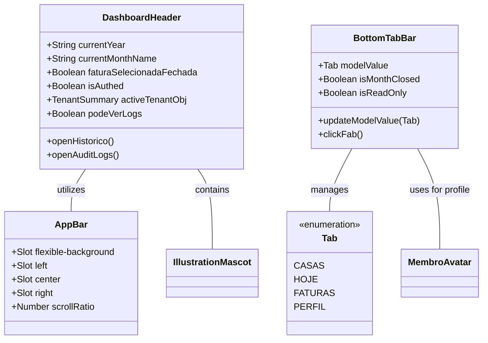

# GGQPA-XXX-202606121120-[Refactor]-ui-premium-navbar-header-evolution

## Requirements
- **Elevate Visual Fidelity**: Transform the existing navbar and header into a premium, polished experience that feels both professional and family-friendly.
- **Inclusive Universal Design**: Ensure the interface is intuitive and accessible for all age groups, specifically children and the elderly, through clear visual hierarchy and simplified interactions.
- **Extreme Minimalism & High Density**: Prioritize an ultra-clean, minimalist aesthetic with maximum information density. Eliminate all non-essential decorative air.
- **Identity-Driven Pinned State**: The pinned (compact) state must NOT be a clinical white bar. It must preserve the "Divi" identity: warm, tactile, and playful. Use subtle canvas tints, "ember" accents, and maintain the mascot's presence as a brand guardian even in the condensed state.
- **AppBar Consistency**: Introduce a standardized `AppBar` component to provide structural and visual consistency across different screens, serving as the foundation for the header.
- **Refine Bottom Navigation**: Transition from a standard sticky bar to a floating, solid-colored pill with refined depth.
- **Thumb-zone Optimization**: Design all primary interactions within the ergonomic reach of a single-handed thumb operation on mobile devices.
- **Jelly-like Fluidity**: Prioritize smoothness and elastic "jelly-like" micro-interactions inspired by iOS for a more tactile and delightful experience.
- **Simplify Dashboard Header**: Reduce visual noise in the header while maintaining essential information (period, tenant, branding).
- **Maintain Brand Identity**: Preserve the presence of the mascot "ember" and the warm color palette (ember, sunburst) in a more integrated manner.
- **SliverAppBar Dynamics**: Implement a scrolling behavior similar to Flutter's SliverAppBar, where the header collapses into a pinned state when scrolling down, transitioning from an expanded transparent layout to a compact solid-colored pinned bar.
- **Zero-Jitter Scroll Architecture**: The header collapse must be 100% jitter-free. Any involuntary stutter, jump, or double-interpolation caused by CSS `transition` fighting JS-driven style mutations is unacceptable. All scroll-driven style mutations must bypass the CSS transition pipeline entirely — using direct DOM manipulation (`el.style.xxx`) instead of reactive Vue state that triggers re-renders.

## Entities

## Approach
1. **AppBar Structural Foundation**:
   - Create a reusable `AppBar.vue` that defines the three-column layout (Left, Center, Right) for all headers.
   - Ensure consistent height, padding, and alignment across all implementations.

2. **Solid Premium Depth**:
   - Replace glassmorphism with clean, high-quality solid surfaces. Use `bg-canvas` or slightly tinted `bg-stone/50` for the header background in the pinned state to maintain warmth.
   - Implement multi-layered shadows (`shadow-premium`) to create a floating sensation without relying on blur effects.

3. **Universal Design & Inclusivity**:
   - **Visual Clarity**: Use high-contrast color pairings for icons and labels to assist the elderly.
   - **Simplicity for Children**: Rely on recognizable iconography and avoid hidden gestures or complex nested menus.
   - **Generous Hit Areas**: Exceed the standard 44px where possible, especially for critical navigation and the FAB, to accommodate less precise motor control.

4. **Mobile Ergonomics & Safe Areas**:
   - **Floating Offset**: Use `env(safe-area-inset-bottom)` combined with a fixed margin (e.g., 16px) to ensure the floating bar clears the home indicator on iOS and navigation bar on Android.
   - **Thumb Zone**: Place the FAB and primary tabs within the lower 1/3 of the screen for maximum reachability.

5. **Refined Typography & Spacing**:
   - Use `tracking-[0.2em]` for captions to increase premium feel.
   - Standardize icon stroke weights (1.8px for inactive, 2.2px for active) and implement high-contrast visual cues for selected tabs.

6. **Micro-interactions & Fluidity**:
   - **Elastic Transitions**: Apply aggressive spring easings (high damping, low mass) to achieve a "jelly-like" effect on interaction.
   - **Haptic Feedback Simulation**: Add scale down (0.92) and slightly overshoot on scale up for a physical, tactile sensation on click/tap.

7. **Header Restructuring (Ultra-Density & Identity Consistency)**:
   - **Maximum Space Distribution**: Optimize the three-column slot system to push side elements to the absolute limits of the container.
   - **Minimalist Footprint**: Reduce expanded heights and internal paddings.
   - **Branding Integration (The Guardian)**: The mascot must remain visible and playful in the pinned state. Instead of hiding, it should "peek" from behind the branding or sit atop the condensed bar.
   - **Action Button Harmony (Pinned Consistency)**: Side actions must remain tactile and integrated.
     - **Integration**: Use ultra-subtle integrated backgrounds (e.g., `stone/10`) and refined borders (`stone/20`) consistently. Avoid shifting to opaque white backgrounds in the pinned state; prefer subtle stone tints to maintain warmth.
     - **Symmetric Architecture**: Both side buttons share a fixed horizontal footprint and identical corner radius (`rounded-2xl`).
     - Minimalist Content: Maintain textual labels even in the compact state to ensure clarity and accessibility for all age groups. Align labels and icons in a high-density, integrated layout.

8. **Sliver Scrolling Dynamics (Linear Interpolation — Zero-Jitter Architecture)**:

   > **Root Cause Analysis (Jitter Diagnosis)**: The previous implementation exhibited jitter from four compounding sources:
   > 1. **CSS `transition-all` + JS `:style` conflict**: The `transition-all duration-75` Tailwind class on the `<header>` element causes the browser's CSS engine to interpolate from the *previous* computed value to each new JS-set value every ~16ms frame. This creates a perpetual "catching up" effect — a double-interpolation loop that manifests as stuttering and micro-jumps.
   > 2. **Vue reactive `computed` triggers re-renders**: Using `scrollY` as a reactive `ref` and `scrollRatio` as a `computed` causes Vue's reactivity system to schedule a VDOM diff + patch on every RAF callback, adding framework overhead on the animation path. This is entirely unnecessary since no conditional rendering depends on `scrollRatio`.
   > 3. **`animate-wobble` CSS animation conflicts with `:style` transform**: The mascot's `animate-wobble` class applies a CSS `@keyframes` that writes to `transform`. The parent `:style` binding also writes to `transform` on the same element. The two compete frame-by-frame, causing the mascot to jump erratically.
   > 4. **`transition-all duration-300` on interior elements**: Buttons and text stacks inside the header have CSS transition applied to `transform`. Since their `transform` is recalculated on every RAF frame via `:style`, the CSS transition engine sees a new target every ~16ms and perpetually re-initiates interpolation rather than settling — creating the "fighting" sensation.

   **Corrected Architecture (Direct DOM Mutation Pattern)**:
   - **Scroll Metrics**: Define `EXPANDED_HEIGHT = 96`, `COLLAPSED_HEIGHT = 60`, `INTERPOLATION_RANGE = 36`.
   - **Linear Scroll Ratio (t)**: `t = clamp(window.scrollY / INTERPOLATION_RANGE, 0, 1)`. Bilateral clamp prevents overshoot and undershoot.
   - **No Reactive State for Scroll Ratio**: Do NOT store `scrollY` in a Vue `ref` and do NOT derive `scrollRatio` via `computed`. Instead, use `useTemplateRef` (Vue 3.5+) to obtain direct DOM references to the `<header>` element and every interpolated child element. Write `el.style.xxx = value` directly inside the RAF callback. This completely bypasses Vue's reactivity pipeline for scroll-driven mutations.
   - **Remove All CSS Transitions from Scroll-Driven Elements**: Every element whose style is mutated on scroll MUST NOT have a CSS `transition` on the properties being mutated. Specifically:
     - Remove `transition-all` (and any `transition`) from the `<header>` in `AppBar.vue`.
     - Remove `transition-all` from the side buttons in `DashboardHeader.vue`.
     - Remove `transition-all` from the inner label stacks of side buttons.
     - CSS transitions are only permitted for interaction-state changes (`:hover`, `:active`, `:focus`) on properties that are NOT also driven by scroll.
   - **Mascot Transform Isolation**: The mascot element that receives scroll-driven `transform` (position, scale, rotate) via direct DOM mutation must NOT simultaneously carry a CSS animation that also writes to `transform`. Remove the `animate-wobble` class from the scroll-interpolated mascot wrapper. The wobble effect, if desired in the fully expanded state (`t = 0`), must be implemented as a CSS animation applied to an inner child element that only transforms `rotate` and `scale` within a sub-wrapper — keeping the outer wrapper's `transform` exclusively owned by the scroll logic.
   - **FlexibleSpaceBar Integration**:
     - **Branding Interpolation**: Center branding scales from `1.05` to `0.90` (`scale(1.05 - 0.15 * t)`) centered.
     - **Mascot Symbiosis**: Mascot outer wrapper receives direct style mutation: `top = (-14 + 18 * t)px`, `right = (-12 + 12 * t)px`, `transform = scale(${0.95 - 0.2 * t}) rotate(${4 - 4 * t}deg)`. Size 24px, `mood="happy"`. No CSS animation on this wrapper.
     - **Tenant Name Fade**: `opacity = max(0, 1 - 2.8 * t)`. Invisible before `t = 0.36`.
   - **Surface & Elevation Refinement (via Direct DOM)**:
     - **Background**: Transparent for `t ≤ 0.05`; `rgba(251, 250, 249, min(1.0, 0.98 * t))` for `t > 0.05`.
     - **Shadow**: Appears for `t > 0.6`. Formula: `0 ${6 * t²}px ${24 * t}px -4px rgba(67,70,69,${0.08*t}), 0 0 1px rgba(18,18,18,${0.1*t})`.
     - **Border**: `1px solid rgba(242, 240, 237, ${max(0, (t - 0.8) * 10)})`.
   - **Breakout & Internal Rhythm (Edge-to-Edge)**:
     - `marginLeft = calc(-1 * var(--parent-pad) * t)`, `marginRight = calc(-1 * var(--parent-pad) * t)`, `width = calc(100% + 2 * var(--parent-pad) * t)`.
     - `paddingLeft = calc(var(--parent-pad) * (1 - t))`, `paddingRight = calc(var(--parent-pad) * (1 - t))`.
     - `--parent-pad`: `1.5rem` (≥640px); `1rem` (<640px).
   - **Pinned State**: At `t = 1.0`, header is fully solid, edge-to-edge, sticky `top-0`.
   - **Parallax Background Layer**: `opacity = 1 - t`, `transform = translateY(${t * 24}px)`. Applied via direct DOM ref.
   - **RAF Pattern**: Cancel pending `rafId` before each new `requestAnimationFrame`. Clean up listener and cancel `rafId` in `onUnmounted`.

## Structure

### Inheritance Relationships
1. `AppBar.vue` is the base layout component for headers.
2. `DashboardHeader.vue` utilizes `AppBar.vue` via slots.
3. `BottomTabBar.vue` is a standalone UI navigation component.
4. All use `lucide-vue-next` for iconography.

### Dependencies
1. `DashboardHeader` depends on `AppBar` and `IllustrationMascot`.
2. `BottomTabBar` depends on `MembroAvatar`.
3. Both depend on Tailwind 4 theme variables (colors, radii, easings).

### Layered Architecture
1. **View Layer**: Components responsible for layout, branding, and navigation triggers.
2. **Design System Layer**: `main.css` providing the @theme tokens and base animations.

## Operations

### Create Component - AppBar.vue
1. **Responsibility**: Provide a consistent, scroll-reactive SliverAppBar layout for all headers, managing four slot zones and exposing DOM refs for zero-jitter direct style mutation.
2. **Slots**:
   - `flexible-background`: Absolute-positioned parallax backdrop layer. Exposes a ref so the parent can drive `opacity` and `translateY` directly.
   - `left`: Left-aligned content column (`flex-1 basis-0 justify-start`).
   - `center`: Centered branding column (`flex-shrink-0 min-w-max`).
   - `right`: Right-aligned content column (`flex-1 basis-0 justify-end`).
3. **Props**:
   - Remove `scrollRatio` prop. AppBar no longer accepts or reacts to a scroll ratio. All scroll-driven style mutations are applied externally via `expose`d DOM refs.
4. **Expose (via `defineExpose`)**:
   - `headerEl`: ref to the `<header>` root element.
   - `parallaxEl`: ref to the `flexible-background` wrapper div.
5. **CSS Custom Properties** (scoped):
   - `--parent-pad: 1.5rem` (24px) on `≥640px` screens; `1rem` (16px) on `<640px` screens.
   - `will-change: height, padding, background-color, box-shadow, margin, width` for GPU compositing.
6. **Styles (baseline only — NO `transition` on scroll-driven properties)**:
   - Remove `transition-all`, `transition`, or any CSS transition from the `<header>` element's scoped styles and from its Tailwind class list. No transition class may be present on the header or the parallax wrapper.
   - Apply `position: sticky; top: 0; z-index: 50; overflow: hidden` via class.
   - Base height `6rem` (96px), expressed as a CSS variable or inline style updated by the parent.
   - CSS `transition` is only permitted on `:hover` / `:focus-visible` pseudo-classes that target non-scroll properties (e.g., ring, outline).

### Update Component - DashboardHeader.vue
1. **Responsibility**: Own all scroll logic and apply scroll-driven style mutations directly to DOM elements via `useTemplateRef`, bypassing Vue's reactivity pipeline and the CSS transition engine.
2. **Scroll Engine (Direct DOM Mutation Pattern)**:
   - Import `useTemplateRef` from Vue 3.5+.
   - Declare template refs for every element that receives scroll-driven style changes: the AppBar component instance (`appBarRef`), the left button (`leftBtnRef`), the left label stack (`leftLabelRef`), the right button (`rightBtnRef`), the right label stack (`rightLabelRef`), the center branding wrapper (`centerRef`), the mascot outer wrapper (`mascotRef`), the tenant name element (`tenantNameRef`).
   - Do NOT use `ref()`/`computed()` for `scrollY` or `scrollRatio`. Use plain `let` variables: `let t = 0`.
   - In `onMounted`, add `window.addEventListener('scroll', handleScroll, { passive: true })` and call `applyStyles(0)` for initial render.
   - The `handleScroll` function: cancel pending `rafId`, then schedule `requestAnimationFrame(applyStyles)`.
   - The `applyStyles(timestamp?)` function (or called with no arg from RAF): read `window.scrollY`, compute `t = Math.min(Math.max(window.scrollY / 36, 0), 1)`, then imperatively mutate each DOM ref's `.style` property.
   - In `onUnmounted`, remove scroll listener and cancel pending `rafId`.
3. **Direct Style Mutations per element** (all applied inside `applyStyles`):
   - **AppBar `<header>` (`headerEl`)**: `height`, `backgroundColor`, `boxShadow`, `borderBottom`, `marginLeft`, `marginRight`, `width`, `paddingLeft`, `paddingRight` — using the same formulas defined in Approach §8. NO CSS transition on these properties.
   - **Parallax wrapper (`parallaxEl`)**: `opacity = 1 - t`, `transform = translateY(${t * 24}px)`.
   - **Left button (`leftBtnRef`)**: `transform = scale(${1 - 0.05 * t})`, `backgroundColor = rgba(242, 240, 237, ${0.4 + 0.1 * t})`, `boxShadow` for `t > 0.8`. No `transition-all` class on this button.
   - **Left label stack (`leftLabelRef`)**: `transform = scale(${1 - 0.1 * t})` with `transformOrigin: left`.
   - **Right button (`rightBtnRef`)**: mirror of left button.
   - **Right label stack (`rightLabelRef`)**: mirror of left label stack, `transformOrigin: right`.
   - **Center branding (`centerRef`)**: `transform = scale(${1.05 - 0.15 * t})`.
   - **Mascot outer wrapper (`mascotRef`)**: `top = ${-14 + 18 * t}px`, `right = ${-12 + 12 * t}px`, `transform = scale(${0.95 - 0.2 * t}) rotate(${4 - 4 * t}deg)`. This element must NOT carry `animate-wobble` or any CSS animation that writes to `transform`.
   - **Tenant name (`tenantNameRef`)**: `opacity = ${Math.max(0, 1 - 2.8 * t)}`.
4. **Mascot Wobble Preservation**: The playful wobble effect for the mascot is preserved by wrapping `IllustrationMascot` in two layers: an outer wrapper (the scroll-driven ref `mascotRef`) and an inner wrapper that carries the `animate-wobble` class. The inner wrapper only animates `rotate` and `scale(1±0.01)`, which are separate from the outer's scroll-driven transform. This way neither layer's CSS and JS transforms conflict.
5. **Remove `:style` bindings from template**: All scroll-driven style changes are moved out of Vue's template `:style` syntax. Template only declares static classes and non-scroll-driven bindings (e.g., `v-if`, `aria-*`, `@click`).
6. **Text Label Retention**: Both side buttons retain their text labels in all scroll states — only scaled, never hidden.
7. **Vertical Alignment**: All slot contents (`items-center`) remain vertically centered throughout the transition.

### Update Component - BottomTabBar.vue
1. **Responsibility**: Provide a floating, ergonomic navigation bar.
2. **Logic Updates**:
   - **Floating Container**: Solid floating pill with `bg-white` and `shadow-premium`.
   - **Jelly Animation**: Elastic transitions for active tab indicators and the FAB.
   - **Touch Targets**: Minimum hit area of `48x48px`.

## Norms
1. **Tailwind 4 First**: Use @theme variables.
2. **Identity First**: Avoid generic "SaaS" aesthetics in favor of warm, tactile choices.
3. **Consistency**: Side actions must have identical visual weight.
4. **High Contrast**: WCAG AA standards.
5. **CSS/JS Transition Separation**: CSS `transition` and JS-driven style mutations are mutually exclusive on the same property of the same element. Scroll-driven properties (height, transform, opacity, background, shadow, margin, padding, width, border) must have zero CSS transition — they are driven by RAF at 60fps. Interaction-only properties (ring, outline, cursor) may have CSS transitions. Violating this rule causes double-interpolation jitter.
6. **Direct DOM for Animation-Critical Paths**: Use `useTemplateRef` + imperative `el.style.xxx` mutations (not Vue reactive state) for all scroll-driven visual updates. Reactive state (`ref`, `computed`) is forbidden on the hot path.

## Safeguards
1. **Universal Mobile Design**: Intuitive for all ages.
2. **Fluidity over Complexity**: Snappy and organic animations.
3. **No Blur**: No glassmorphism.
4. **Safe Area Resilience**: Handle `env(safe-area-inset-bottom)`.
5. **No Breaking Changes**: Preserve event interfaces (`openHistorico`, `openAuditLogs`). The `scrollRatio` prop on `AppBar` is removed — any consumer that previously passed it must be updated to use the `expose` pattern.
6. **Zero Jitter Contract**: Any implementation that produces visible stutter, frame-doubling, or jump during scroll is a regression and must not be merged. The test criterion is: drag-scroll at 60fps on a mid-range Android device (Pixel 6, Chrome) must produce a perfectly linear collapse with no visible jump between frames.
7. **No `transition-all` on Scroll-Driven Elements**: The Tailwind class `transition-all` (and any shorthand `transition`) is forbidden on any element whose `transform`, `opacity`, `background-color`, `box-shadow`, `height`, `margin`, `padding`, or `width` is driven by the scroll RAF loop. Linters or code review must flag this pattern.
8. **No CSS Animation on Scroll-Driven `transform` Wrapper**: A CSS `@keyframes` animation (e.g., `animate-wobble`, `animate-float`) must never be applied to an element that also receives `transform` mutations via JS. Use inner/outer wrapper isolation instead.
