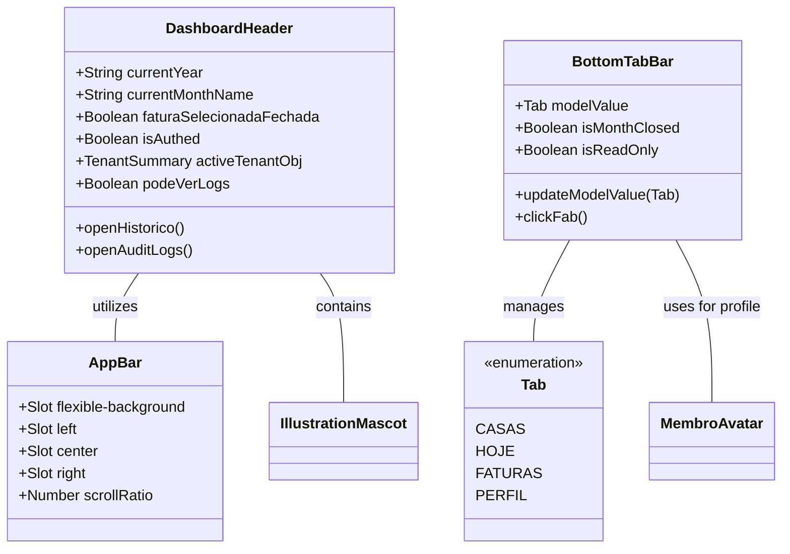

# GGQPA-XXX-202606121120-[Refactor]-ui-premium-navbar-header-evolution

## Requirements
- **Elevate Visual Fidelity**: Transform the existing navbar and header into a premium, polished experience that feels both professional and family-friendly.
- **Inclusive Universal Design**: Ensure the interface is intuitive and accessible for all age groups, specifically children and the elderly, through clear visual hierarchy and simplified interactions.
- **Extreme Minimalism & High Density**: Prioritize an ultra-clean, minimalist aesthetic with maximum information density. Eliminate all non-essential decorative air.
- **Identity-Driven Pinned State**: The pinned (compact) state must NOT be a clinical white bar. It must preserve the "Divi" identity: warm, tactile, and playful. Use subtle canvas tints, "ember" accents, and maintain the mascot's presence as a brand guardian even in the condensed state.
- **AppBar Consistency**: Introduce a standardized `AppBar` component to provide structural and visual consistency across different screens, serving as the foundation for the header.
- **Refine Bottom Navigation**: Transition from a standard sticky bar to a floating, solid-colored pill with refined depth.
- **Thumb-zone Optimization**: Design all primary interactions within the ergonomic reach of a single-handed thumb operation on mobile devices.
- **Jelly-like Fluidity**: Prioritize smoothness and elastic "jelly-like" micro-interactions inspired by iOS for a more tactile and delightful experience.
- **Simplify Dashboard Header**: Reduce visual noise in the header while maintaining essential information (period, tenant, branding).
- **Maintain Brand Identity**: Preserve the presence of the mascot "ember" and the warm color palette (ember, sunburst) in a more integrated manner.
- **SliverAppBar Dynamics — Flutter-Faithful**: Implement the exact four-property SliverAppBar behavior from Flutter using the Web platform equivalent:
  - **`pinned: true`** → header is always visible at the top, never leaves the viewport. Uses CSS `position: sticky; top: 0`.
  - **`floating: true`** → header immediately starts appearing as soon as the user scrolls up, regardless of current scroll position (not just from the page top).
  - **`snap: true`** → when the user releases the scroll gesture (`scrollend` event), the header automatically animates to its fully expanded (`t=0`) or fully collapsed (`t=1`) state — it never remains in a partial mid-state.
  - **`FlexibleSpaceBar`** → the space between `expandedHeight` and `collapsedHeight` is filled with rich interpolated content (mascot, tenant name, parallax background) whose opacity, scale, and position are driven by `shrinkOffset`.
- **Zero-Jitter Scroll Architecture**: All scroll-driven style mutations must bypass the CSS transition pipeline entirely — using direct DOM manipulation (`el.style.xxx`) inside `requestAnimationFrame`. No Vue `ref`/`computed` on the scroll hot path.
- **Snap-Back Elimination**: The snap animation uses `Web Animations API` (`element.animate()`) for the final settlement — NOT CSS `transition`. This decouples the snap animation from the continuous scroll engine, eliminating double-interpolation.
- **Physical Height Constraint**: `expandedHeight = 120px` (rich FlexibleSpace visible); `collapsedHeight = 52px` (~12mm physical). The delta (68px) is the `maxShrinkOffset` — the scroll distance over which the header fully collapses.

## Entities

## Approach
1. **AppBar Structural Foundation**:
   - Create a reusable `AppBar.vue` that defines the three-column layout (Left, Center, Right) for all headers.
   - Ensure consistent height, padding, and alignment across all implementations.

2. **Solid Premium Depth**:
   - Replace glassmorphism with clean, high-quality solid surfaces. Use `bg-canvas` or slightly tinted `bg-stone/50` for the header background in the pinned state to maintain warmth.
   - Implement multi-layered shadows (`shadow-premium`) to create a floating sensation without relying on blur effects.

3. **Universal Design & Inclusivity**:
   - **Visual Clarity**: Use high-contrast color pairings for icons and labels to assist the elderly.
   - **Simplicity for Children**: Rely on recognizable iconography and avoid hidden gestures or complex nested menus.
   - **Generous Hit Areas**: Exceed the standard 44px where possible, especially for critical navigation and the FAB, to accommodate less precise motor control.

4. **Mobile Ergonomics & Safe Areas**:
   - **Floating Offset**: Use `env(safe-area-inset-bottom)` combined with a fixed margin (e.g., 16px) to ensure the floating bar clears the home indicator on iOS and navigation bar on Android.
   - **Thumb Zone**: Place the FAB and primary tabs within the lower 1/3 of the screen for maximum reachability.

5. **Refined Typography & Spacing**:
   - Use `tracking-[0.2em]` for captions to increase premium feel.
   - Standardize icon stroke weights (1.8px for inactive, 2.2px for active) and implement high-contrast visual cues for selected tabs.

6. **Micro-interactions & Fluidity**:
   - **Elastic Transitions**: Apply aggressive spring easings (high damping, low mass) to achieve a "jelly-like" effect on interaction.
   - **Haptic Feedback Simulation**: Add scale down (0.92) and slightly overshoot on scale up for a physical, tactile sensation on click/tap.

7. **Header Restructuring (Ultra-Density & Identity Consistency)**:
   - **Maximum Space Distribution**: Optimize the three-column slot system to push side elements to the absolute limits of the container.
   - **Minimalist Footprint**: Reduce expanded heights and internal paddings.
   - **Branding Integration (The Guardian)**: The mascot must remain visible and playful in the pinned state. Instead of hiding, it should "peek" from behind the branding or sit atop the condensed bar.
   - **Action Button Harmony (Pinned Consistency)**: Side actions must remain tactile and integrated.
     - **Integration**: Use ultra-subtle integrated backgrounds (e.g., `stone/10`) and refined borders (`stone/20`) consistently. Avoid shifting to opaque white backgrounds in the pinned state; prefer subtle stone tints to maintain warmth.
     - **Symmetric Architecture**: Both side buttons share a fixed horizontal footprint and identical corner radius (`rounded-2xl`).
     - Minimalist Content: Maintain textual labels even in the compact state to ensure clarity and accessibility for all age groups. Align labels and icons in a high-density, integrated layout.

8. **Sliver Scrolling Dynamics — Flutter SliverAppBar Faithful (pinned + floating + snap)**:

   > **Source**: Behavior modeled after `SliverAppBar(pinned: true, floating: true, snap: true)` with `FlexibleSpaceBar` — the richest Flutter app bar mode, verified against `flutter.dev` and `api.flutter.dev` documentation.

   > **History of fixes**:
   > - **Generation 1**: CSS `transition-all` + JS conflict; Vue reactivity on hot path; transform conflicts on mascot → Fixed via Direct DOM Mutation Pattern.
   > - **Generation 2**: Direction-aware state machine with dead zone → Eliminated snap-back glitch but produced a non-Flutter-faithful experience (direction sensitivity, delta accumulation).
   > - **Generation 3 (current)**: Full Flutter SliverAppBar model — position-based `shrinkOffset`, floating detection via delta, snap via `scrollend` + Web Animations API.

   **Flutter SliverAppBar Conceptual Model (translated to Web)**:

   Flutter's `SliverPersistentHeaderDelegate` exputes two key values every frame:
   - `maxExtent = expandedHeight` — maximum painted height when fully expanded.
   - `minExtent = collapsedHeight` — minimum painted height when pinned.
   - `shrinkOffset = clamp(scrollY, 0, maxExtent - minExtent)` — how many px the bar has shrunk from its maximum. Drives all interpolations.
   - `t = shrinkOffset / (maxExtent - minExtent)` — [0 = expanded, 1 = collapsed].

   **Web Implementation Constants**:
   - `EXPANDED_HEIGHT = 120` (px) — `expandedHeight` equivalent. Generous FlexibleSpace for mascot, tenant name, parallax.
   - `COLLAPSED_HEIGHT = 52` (px) — `collapsedHeight` equivalent. Pinned bar (~12mm physical).
   - `MAX_SHRINK_OFFSET = EXPANDED_HEIGHT - COLLAPSED_HEIGHT = 68` (px) — scroll distance for full collapse.
   - `SNAP_DURATION_MS = 240` — milliseconds for the snap settlement animation (Web Animations API).
   - `SNAP_EASING = 'cubic-bezier(0.4, 0.0, 0.2, 1)'` — Flutter's standard Material easing for snap.

   **Scroll State Variables** (plain `let`, never Vue reactive):
   - `let shrinkOffset = 0` — current shrink amount [0, MAX_SHRINK_OFFSET]. Derived from position, like Flutter.
   - `let floatReveal = 0` — px revealed by upward scroll while page is not at top (floating behavior). Range [0, MAX_SHRINK_OFFSET].
   - `let lastScrollY = 0` — previous `window.scrollY`, for delta computation.
   - `let isSnapping = false` — prevents scroll events from fighting the snap animation.
   - `let rafId: number | null = null`.
   - `let snapAnimations: Animation[] = []` — array of running Web Animations for cancellation.

   **Three-Phase Scroll Behavior** (mimics Flutter exactly):

   Phase A — **Collapsing** (scroll down from top):
   - While `scrollY <= MAX_SHRINK_OFFSET`: `shrinkOffset = scrollY`. Header collapses linearly with scroll position. This is identical to Flutter's `SliverPersistentHeader` behavior at the top of the scroll.
   - `t = shrinkOffset / MAX_SHRINK_OFFSET`.
   - Apply interpolated styles immediately (no dead zone — Flutter has none in this phase).

   Phase B — **Pinned** (scroll down beyond MAX_SHRINK_OFFSET):
   - When `scrollY > MAX_SHRINK_OFFSET`: `shrinkOffset = MAX_SHRINK_OFFSET`, `t = 1`. Header stays fully collapsed at top.
   - `floatReveal = 0` (reset).

   Phase C — **Floating Reveal** (scroll up from anywhere):
   - When `delta < 0` (scrolling up) AND `scrollY > 0`:
     - `floatReveal = min(MAX_SHRINK_OFFSET, floatReveal + abs(delta))`.
     - Effective `shrinkOffset = max(0, MAX_SHRINK_OFFSET - floatReveal)`.
     - `t = shrinkOffset / MAX_SHRINK_OFFSET`.
   - When `delta > 0` (scrolling down again): `floatReveal = max(0, floatReveal - delta)`. Collapses the float reveal.
   - When `scrollY <= MAX_SHRINK_OFFSET`: Phase A takes over — `floatReveal = 0`.

   **`handleScroll()` function**:
   1. If `isSnapping`, return immediately (protect ongoing snap animation).
   2. Cancel pending `rafId`, schedule `requestAnimationFrame(applyStyles)`.

   **`applyStyles()` function**:
   1. Read `currentScrollY = window.scrollY`; compute `delta = currentScrollY - lastScrollY`; update `lastScrollY`.
   2. Determine phase:
      - If `currentScrollY <= 0`: `shrinkOffset = 0`, `floatReveal = 0` → Phase A boundary.
      - Else if `currentScrollY <= MAX_SHRINK_OFFSET` AND `delta >= 0`: Phase A — `shrinkOffset = currentScrollY`, `floatReveal = 0`.
      - Else if `delta >= 0` (scroll down while pinned): Phase B — `shrinkOffset = MAX_SHRINK_OFFSET`, `floatReveal = max(0, floatReveal - delta)`.
      - Else (scroll up — floating): Phase C — `floatReveal = min(MAX_SHRINK_OFFSET, floatReveal + abs(delta))`, `shrinkOffset = max(0, MAX_SHRINK_OFFSET - floatReveal)`.
   3. Compute `t = shrinkOffset / MAX_SHRINK_OFFSET` (clamp [0, 1]).
   4. Call `commitStyles(t)` — direct DOM mutations.

   **`handleScrollEnd()` function** (snap — triggered by `scrollend` event, no polyfill needed in Chrome 110+):
   1. If `isSnapping`, return.
   2. If `t === 0 || t === 1`, return (already settled).
   3. Determine snap target: `targetT = t > 0.5 ? 1 : 0`.
   4. Set `isSnapping = true`.
   5. Cancel all existing `snapAnimations`.
   6. Use `Web Animations API` (`element.animate()`) to tween `shrinkOffset` from current to `targetT * MAX_SHRINK_OFFSET` over `SNAP_DURATION_MS` with `SNAP_EASING`. On each animation `tick`, re-run `commitStyles(currentT)`. On finish: set `isSnapping = false`, `shrinkOffset = target`, update `lastScrollY = window.scrollY`.
   7. Use `polyfillScrollEnd()` for Safari fallback: listen to `scroll` silence for 150ms to fire a synthetic `scrollend`.

   **`commitStyles(t)` function** — direct DOM mutations, NO CSS transition:
   - **`headerEl`**: `height = ${EXPANDED_HEIGHT - (EXPANDED_HEIGHT - COLLAPSED_HEIGHT) * t}px`, `backgroundColor`, `boxShadow`, `borderBottom`, `marginLeft`, `marginRight`, `width`, `paddingLeft`, `paddingRight`.
   - **`parallaxEl`**: `opacity = 1 - t`, `transform = translateY(${t * 24}px)`.
   - **`centerRef`**: `transform = scale(${1 - 0.12 * t})`.
   - **`mascotRef`** (outer wrapper only): `top = ${-14 + 18 * t}px`, `right = ${-12 + 12 * t}px`, `transform = scale(${0.95 - 0.2 * t}) rotate(${4 - 4 * t}deg)`.
   - **`tenantNameRef`**: `opacity = max(0, 1 - 2.5 * t)`.
   - **`leftBtnRef`**: `transform = scale(${1 - 0.05 * t})`, `backgroundColor = rgba(242,240,237,${0.4 + 0.1*t})`, `boxShadow` for `t > 0.8`.
   - **`leftLabelRef`**: `transform = scale(${1 - 0.1 * t})`, `transformOrigin = left center`.
   - **`rightBtnRef` / `rightLabelRef`**: mirror of left.

   **`Surface & Elevation`**:
   - **Height**: `${EXPANDED_HEIGHT - (EXPANDED_HEIGHT - COLLAPSED_HEIGHT) * t}px` (120px → 52px).
   - **Background**: Transparent for `t ≤ 0.05`; `rgba(251, 250, 249, min(0.98, 0.98 * t))` for `t > 0.05`.
   - **Shadow**: For `t > 0.6` → `0 ${6 * t²}px ${24 * t}px -4px rgba(67,70,69,${0.08*t}), 0 0 1px rgba(18,18,18,${0.1*t})`.
   - **Border**: `1px solid rgba(242, 240, 237, ${max(0, (t - 0.8) * 10)})`.

   **Breakout & Padding (Edge-to-Edge — same as before)**:
   - `marginLeft = ${-padPx * t}px`, `marginRight = ${-padPx * t}px`, `width = calc(100% + ${2 * padPx * t}px)`.
   - `paddingLeft = ${padPx * (1 - t)}px`, `paddingRight = ${padPx * (1 - t)}px`.

   **Parallax Layer**: `opacity = 1 - t`, `transform = translateY(${t * 24}px)`.

   **Mascot Transform Isolation**: Outer wrapper (`mascotRef`) receives scroll-driven mutations only. Wobble CSS animation is isolated to the inner wrapper (Safeguard #8).

   **Lifecycle**:
   - `onMounted`: initialize `lastScrollY = window.scrollY`, `shrinkOffset = min(scrollY, MAX_SHRINK_OFFSET)`, call `commitStyles(shrinkOffset / MAX_SHRINK_OFFSET)`, register `scroll` (passive) + `scrollend` listeners.
   - `onUnmounted`: remove both listeners, cancel `rafId`, cancel all `snapAnimations`.

## Structure

### Inheritance Relationships
1. `AppBar.vue` is the base layout component for headers.
2. `DashboardHeader.vue` utilizes `AppBar.vue` via slots.
3. `BottomTabBar.vue` is a standalone UI navigation component.
4. All use `lucide-vue-next` for iconography.

### Dependencies
1. `DashboardHeader` depends on `AppBar` and `IllustrationMascot`.
2. `BottomTabBar` depends on `MembroAvatar`.
3. Both depend on Tailwind 4 theme variables (colors, radii, easings).

### Layered Architecture
1. **View Layer**: Components responsible for layout, branding, and navigation triggers.
2. **Design System Layer**: `main.css` providing the @theme tokens and base animations.

## Operations

### Create Component - AppBar.vue
1. **Responsibility**: Provide a consistent, scroll-reactive SliverAppBar layout for all headers, managing four slot zones and exposing DOM refs for zero-jitter direct style mutation.
2. **Slots**:
   - `flexible-background`: Absolute-positioned parallax backdrop layer. Exposes a ref so the parent can drive `opacity` and `translateY` directly.
   - `left`: Left-aligned content column (`flex-1 basis-0 justify-start`).
   - `center`: Centered branding column (`flex-shrink-0 min-w-max`).
   - `right`: Right-aligned content column (`flex-1 basis-0 justify-end`).
3. **Props**:
   - Remove `scrollRatio` prop. AppBar no longer accepts or reacts to a scroll ratio. All scroll-driven style mutations are applied externally via `expose`d DOM refs.
4. **Expose (via `defineExpose`)**:
   - `headerEl`: ref to the `<header>` root element.
   - `parallaxEl`: ref to the `flexible-background` wrapper div.
5. **CSS Custom Properties** (scoped):
   - `--parent-pad: 1.5rem` (24px) on `≥640px` screens; `1rem` (16px) on `<640px` screens.
   - `will-change: height, padding, background-color, box-shadow, margin, width` for GPU compositing.
6. **Styles (baseline only — NO `transition` on scroll-driven properties)**:
   - Remove `transition-all`, `transition`, or any CSS transition from the `<header>` element's scoped styles and from its Tailwind class list. No transition class may be present on the header or the parallax wrapper.
   - Apply `position: sticky; top: 0; z-index: 50; overflow: hidden` via class.
   - Base height `120px` (EXPANDED_HEIGHT), expressed as a CSS value updated by the parent's `commitStyles()`. Note: the parent always sets `headerEl.style.height` on mount, so the CSS baseline is a fallback only.
   - CSS `transition` is only permitted on `:hover` / `:focus-visible` pseudo-classes that target non-scroll properties (e.g., ring, outline).

### Update Component - DashboardHeader.vue
1. **Responsibility**: Implement a Flutter-faithful SliverAppBar (pinned + floating + snap) using the Web platform. Own all scroll logic. Apply scroll-driven style mutations directly to DOM elements via `useTemplateRef`, bypassing Vue's reactivity pipeline.
2. **Scroll State Variables** (plain `let`, never Vue reactive):
   - `let shrinkOffset = 0` — how many px the bar has shrunk from expanded. Mirrors Flutter's `shrinkOffset` parameter. Range [0, MAX_SHRINK_OFFSET].
   - `let floatReveal = 0` — px revealed by upward scroll while page is scrolled past MAX_SHRINK_OFFSET (floating phase). Range [0, MAX_SHRINK_OFFSET].
   - `let lastScrollY = 0` — previous `window.scrollY`.
   - `let isSnapping = false` — blocks scroll updates during snap animation.
   - `let rafId: number | null = null`.
   - `let snapAnimations: Animation[] = []` — Web Animations API handles for cancellation.
   - Constants: `EXPANDED_HEIGHT = 120`, `COLLAPSED_HEIGHT = 52`, `MAX_SHRINK_OFFSET = 68`, `SNAP_DURATION_MS = 240`, `SNAP_EASING = 'cubic-bezier(0.4, 0.0, 0.2, 1)'`.
3. **Template Refs** (`useTemplateRef` for each scroll-interpolated element): `appBarRef`, `leftBtnRef`, `leftLabelRef`, `rightBtnRef`, `rightLabelRef`, `centerRef`, `mascotRef`, `tenantNameRef`.
4. **`handleScroll()` function**: If `isSnapping`, return. Cancel pending `rafId`, schedule `requestAnimationFrame(applyStyles)`.
5. **`applyStyles()` function** — Flutter three-phase engine:
   a. Read `currentScrollY = window.scrollY`; `delta = currentScrollY - lastScrollY`; update `lastScrollY`.
   b. **Phase A** (top of page, collapsing): if `currentScrollY <= MAX_SHRINK_OFFSET && delta >= 0`: `shrinkOffset = currentScrollY`, `floatReveal = 0`.
   c. **Phase B** (pinned): if `delta >= 0 && currentScrollY > MAX_SHRINK_OFFSET`: `shrinkOffset = MAX_SHRINK_OFFSET`, `floatReveal = max(0, floatReveal - delta)`.
   d. **Phase C** (floating, scroll up): if `delta < 0`: `floatReveal = min(MAX_SHRINK_OFFSET, floatReveal + abs(delta))`; `shrinkOffset = max(0, MAX_SHRINK_OFFSET - floatReveal)`.
   e. Boundary: if `currentScrollY <= 0`: `shrinkOffset = 0`, `floatReveal = 0`.
   f. Compute `t = shrinkOffset / MAX_SHRINK_OFFSET`, clamp [0, 1].
   g. Call `commitStyles(t)`.
6. **`handleScrollEnd()` function** (snap — Flutter `snap: true` equivalent):
   a. If `isSnapping || t === 0 || t === 1`, return.
   b. `targetT = t > 0.5 ? 1 : 0`.
   c. Set `isSnapping = true`.
   d. Cancel all running `snapAnimations`.
   e. Animate `shrinkOffset` from current to `targetT * MAX_SHRINK_OFFSET` using Web Animations API: on each animation frame call `commitStyles(currentAnimatedT)`. On finish: `isSnapping = false`, `shrinkOffset = targetT * MAX_SHRINK_OFFSET`, `floatReveal = targetT === 0 ? shrinkOffset : 0`.
   f. **Safari fallback** (`polyfillScrollEnd`): detect 150ms of scroll silence to fire synthetic `scrollend`.
7. **`commitStyles(t)` function** — direct DOM mutations (zero CSS `transition` on continuous scroll):
   - **`headerEl`**: `height = ${120 - 68 * t}px`, `backgroundColor`, `boxShadow`, `borderBottom`, `marginLeft`, `marginRight`, `width`, `paddingLeft`, `paddingRight` — formulas from Approach §8.
   - **`parallaxEl`**: `opacity = 1 - t`, `transform = translateY(${t * 24}px)`.
   - **`leftBtnRef`**: `transform`, `backgroundColor`, `boxShadow`.
   - **`leftLabelRef`**: `transform`, `transformOrigin = left center`.
   - **`rightBtnRef` / `rightLabelRef`**: mirror of left.
   - **`centerRef`**: `transform = scale(${1 - 0.12 * t})`.
   - **`mascotRef`** (outer only): `top`, `right`, `transform` — no CSS animation on this element.
   - **`tenantNameRef`**: `opacity = max(0, 1 - 2.5 * t)`.
8. **Mascot Wobble Preservation**: Two-layer isolation: outer = `mascotRef` (RAF/Snap-owned transform); inner = `animate-wobble` class (rotate + scale ±0.01, no conflict).
9. **Template**: Static classes only, no `:style` bindings for scroll-driven properties.
10. **Text Label Retention**: Both buttons retain labels in all scroll states.
11. **Lifecycle**: `onMounted` → `lastScrollY = window.scrollY`, `shrinkOffset = min(scrollY, MAX_SHRINK_OFFSET)`, `commitStyles(initial t)`, register `scroll` (passive) + `scrollend` + `polyfillScrollEnd`. `onUnmounted` → remove all listeners, cancel `rafId`, cancel all `snapAnimations`.

### Update Component - BottomTabBar.vue
1. **Responsibility**: Provide a floating, ergonomic navigation bar.
2. **Logic Updates**:
   - **Floating Container**: Solid floating pill with `bg-white` and `shadow-premium`.
   - **Jelly Animation**: Elastic transitions for active tab indicators and the FAB.
   - **Touch Targets**: Minimum hit area of `48x48px`.

## Norms
1. **Tailwind 4 First**: Use @theme variables.
2. **Identity First**: Avoid generic "SaaS" aesthetics in favor of warm, tactile choices.
3. **Consistency**: Side actions must have identical visual weight.
4. **High Contrast**: WCAG AA standards.
5. **CSS/JS Transition Separation**: CSS `transition` and JS-driven style mutations are mutually exclusive on the same property of the same element. Scroll-driven properties (height, transform, opacity, background, shadow, margin, padding, width, border) must have zero CSS transition — they are driven by RAF at 60fps. Interaction-only properties (ring, outline, cursor) may have CSS transitions. Violating this rule causes double-interpolation jitter.
6. **Direct DOM for Animation-Critical Paths**: Use `useTemplateRef` + imperative `el.style.xxx` mutations (not Vue reactive state) for all scroll-driven visual updates. Reactive state (`ref`, `computed`) is forbidden on the hot path.

## Safeguards
1. **Universal Mobile Design**: Intuitive for all ages.
2. **Fluidity over Complexity**: Snappy and organic animations.
3. **No Blur**: No glassmorphism.
4. **Safe Area Resilience**: Handle `env(safe-area-inset-bottom)`.
5. **No Breaking Changes**: Preserve event interfaces (`openHistorico`, `openAuditLogs`). The `scrollRatio` prop on `AppBar` is removed — any consumer must use the `expose` pattern.
6. **Zero Jitter Contract**: No stutter, frame-doubling, or jump during continuous scroll. Test criterion: drag-scroll at 60fps on Pixel 6 / Chrome. Snap animation uses Web Animations API, not CSS `transition`.
7. **No `transition-all` on Scroll-Driven Elements**: `transition-all` and any scroll-driven CSS `transition` is forbidden during continuous scroll. Exception: Web Animations API snap only (never CSS `transition`).
8. **No CSS Animation on Scroll-Driven `transform` Wrapper**: `@keyframes` animations (e.g., `animate-wobble`) must never be on an element that also receives JS `transform` mutations. Use inner/outer wrapper isolation.
9. **Flutter Model Fidelity**: The three-phase model (Phase A: position-based collapse → Phase B: pinned → Phase C: floating reveal) must mirror Flutter's `SliverPersistentHeaderDelegate` behavior. Direct deviations (e.g., applying dead zones in Phase A, or not implementing floating) are regressions.
10. **Snap via Web Animations API Only**: The snap animation MUST use `element.animate()`. CSS `transition` on `headerEl` during snap causes double-interpolation. The `isSnapping` guard MUST prevent scroll events from interfering with the snap animation.
11. **Safari Fallback for `scrollend`**: The native `scrollend` event is required for snap. Because Safari ≤ 17 lacks support, implement `polyfillScrollEnd()` using a 150ms scroll-silence detector. Register on mount, deregister on unmount.
12. **Physical Height Constraint**: `EXPANDED_HEIGHT = 120px`, `COLLAPSED_HEIGHT = 52px`. Do NOT use heights below 52px (collapses too aggressively) or above 128px (too large on mobile). `MAX_SHRINK_OFFSET = 68px`.
