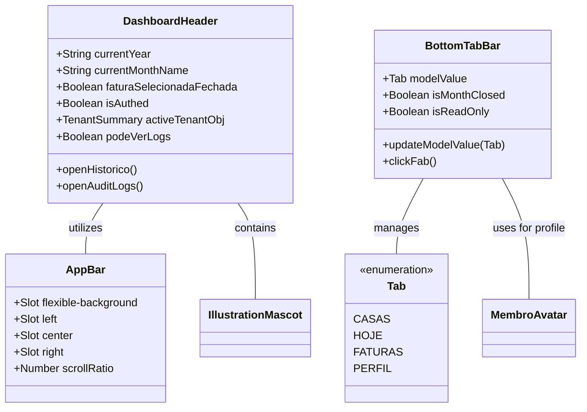

# GGQPA-XXX-202606121120-[Refactor]-ui-premium-navbar-header-evolution

## Requirements
- **Elevate Visual Fidelity**: Transform the existing navbar and header into a premium, polished experience that feels both professional and family-friendly.
- **Inclusive Universal Design**: Ensure the interface is intuitive and accessible for all age groups, specifically children and the elderly, through clear visual hierarchy and simplified interactions.
- **Extreme Minimalism & High Density**: Prioritize an ultra-clean, minimalist aesthetic with maximum information density. Eliminate all non-essential decorative air.
- **Identity-Driven Pinned State**: The pinned (compact) state must NOT be a clinical white bar. It must preserve the "Divi" identity: warm, tactile, and playful. Use subtle canvas tints, "ember" accents, and maintain the mascot's presence as a brand guardian even in the condensed state.
- **AppBar Consistency**: Introduce a standardized `AppBar` component to provide structural and visual consistency across different screens, serving as the foundation for the header.
- **Refine Bottom Navigation**: Transition from a standard sticky bar to a floating, solid-colored pill with refined depth.
- **Thumb-zone Optimization**: Design all primary interactions within the ergonomic reach of a single-handed thumb operation on mobile devices.
- **Jelly-like Fluidity**: Prioritize smoothness and elastic "jelly-like" micro-interactions inspired by iOS for a more tactile and delightful experience.
- **Simplify Dashboard Header**: Reduce visual noise in the header while maintaining essential information (period, tenant, branding).
- **Maintain Brand Identity**: Preserve the presence of the mascot "ember" and the warm color palette (ember, sunburst) in a more integrated manner.
- **SliverAppBar Dynamics — Pinned Header with Constant Height**: Implement the pinned SliverAppBar behavior from Flutter using a jitter-free Web layout:
  - **`pinned: true`** → header is always visible at the top, never leaves the viewport. Uses CSS `position: sticky; top: -68px` (offset of expanded height minus collapsed height).
  - **`constant height`** → the physical height of the header remains fixed at `120px` in the document layout to prevent layout shifts and scroll flickering on mobile browsers.
  - **`counter-translation`** → to keep side buttons and central branding centered within the visible `52px` viewport at the bottom of the header, apply a vertical counter-translation of `translateY(shrinkOffset / 2)` and horizontal translation of `translateX` for lateral movement during scroll.
  - **`floating: false`** → header does not immediately appear when scrolling up. It only expands when the user scrolls back to the top of the page.
  - **`snap: false`** → header does not snap. It collapses and expands linearly with the scroll position.
  - **`FlexibleSpaceBar`** → the space between `expandedHeight` and `collapsedHeight` is filled with rich interpolated content (mascot, tenant name, parallax background) whose opacity, scale, and position are driven by `shrinkOffset`.
- **Zero-Jitter & Zero-Reflow Scroll Architecture**: All scroll-driven style mutations must bypass the CSS transition pipeline and layout engine entirely. Direct DOM manipulation is restricted to GPU-composited properties (transform, opacity, background-color, box-shadow) inside `requestAnimationFrame`. No Vue `ref`/`computed` and no box-model geometry changes (height, width, margin, padding) are permitted on the scroll hot path to avoid layout reflows.
- **Physical Height Constraint**: `expandedHeight = 120px` (rich FlexibleSpace visible); `collapsedHeight = 52px` (~12mm physical). The delta (68px) is the `maxShrinkOffset` — the scroll distance over which the header fully collapses.
- **No Layout Shift on Scroll**: The physical geometry of the header inside the document layout must remain completely static (constant height, width, margin, and padding). Use static edge-to-edge margins/paddings, top sticky offset, and GPU translations instead.

## Entities

## Approach
1. **AppBar Structural Foundation**:
   - Create a reusable `AppBar.vue` that defines the three-column layout (Left, Center, Right) for all headers.
   - Ensure consistent height, padding, and alignment across all implementations.

2. **Solid Premium Depth**:
   - Replace glassmorphism with clean, high-quality solid surfaces. Use `bg-canvas` or slightly tinted `bg-stone/50` for the header background in the pinned state to maintain warmth.
   - Implement multi-layered shadows (`shadow-premium`) to create a floating sensation without relying on blur effects.

3. **Universal Design & Inclusivity**:
   - **Visual Clarity**: Use high-contrast color pairings for icons and labels to assist the elderly.
   - **Simplicity for Children**: Rely on recognizable iconography and avoid hidden gestures or complex nested menus.
   - **Generous Hit Areas**: Exceed the standard 44px where possible, especially for critical navigation and the FAB, to accommodate less precise motor control.

4. **Mobile Ergonomics & Safe Areas**:
   - **Floating Offset**: Use `env(safe-area-inset-bottom)` combined with a fixed margin (e.g., 16px) to ensure the floating bar clears the home indicator on iOS and navigation bar on Android.
   - **Thumb Zone**: Place the FAB and primary tabs within the lower 1/3 of the screen for maximum reachability.

5. **Refined Typography & Spacing**:
   - Use `tracking-[0.2em]` for captions to increase premium feel.
   - Standardize icon stroke weights (1.8px for inactive, 2.2px for active) and implement high-contrast visual cues for selected tabs.

6. **Micro-interactions & Fluidity**:
   - **Elastic Transitions**: Apply aggressive spring easings (high damping, low mass) to achieve a "jelly-like" effect on interaction.
   - **Haptic Feedback Simulation**: Add scale down (0.92) and slightly overshoot on scale up for a physical, tactile sensation on click/tap.

7. **Header Restructuring (Ultra-Density & Identity Consistency)**:
   - **Maximum Space Distribution**: Optimize the three-column slot system to push side elements to the absolute limits of the container.
   - **Minimalist Footprint**: Reduce expanded heights and internal paddings.
   - **Branding Integration (The Guardian)**: The mascot must remain visible and playful in the pinned state. Instead of hiding, it should "peek" from behind the branding or sit atop the condensed bar.
   - **Action Button Harmony (Pinned Consistency)**: Side actions must remain tactile and integrated.
     - **Integration**: Use ultra-subtle integrated backgrounds (e.g., `stone/10`) and refined borders (`stone/20`) consistently. Avoid shifting to opaque white backgrounds in the pinned state; prefer subtle stone tints to maintain warmth.
     - **Symmetric Architecture**: Both side buttons share a fixed horizontal footprint and identical corner radius (`rounded-2xl`).
     - Minimalist Content: Maintain textual labels even in the compact state to ensure clarity and accessibility for all age groups. Align labels and icons in a high-density, integrated layout.

8. **Sliver Scrolling Dynamics — Pinned SliverAppBar (pinned only)**:

   > **Source**: Behavior modeled after `SliverAppBar(pinned: true, floating: false)` with `FlexibleSpaceBar`, verified against `flutter.dev` and `api.flutter.dev` documentation.

   > **History of fixes**:
   > - **Generation 1**: CSS `transition-all` + JS conflict; Vue reactivity on hot path; transform conflicts on mascot → Fixed via Direct DOM Mutation Pattern.
   > - **Generation 2**: Direction-aware state machine with dead zone → Eliminated snap-back glitch but produced a non-Flutter-faithful experience (direction sensitivity, delta accumulation).
   > - **Generation 3**: Full Flutter SliverAppBar model with float and snap.
   > - **Generation 4 (current)**: Simplified Pinned SliverAppBar model — linear position-based `shrinkOffset` with no snap and no float.

   **Flutter Pinned SliverAppBar Conceptual Model (translated to Web)**:

   Flutter's `SliverPersistentHeaderDelegate` computes two key values every frame:
   - `maxExtent = expandedHeight` — maximum painted height when fully expanded.
   - `minExtent = collapsedHeight` — minimum painted height when pinned.
   - `shrinkOffset = clamp(scrollY, 0, maxExtent - minExtent)` — how many px the bar has shrunk from its maximum. Drives all interpolations.
   - `t = shrinkOffset / (maxExtent - minExtent)` — [0 = expanded, 1 = collapsed].

   **Jitter-Free & Reflow-Free Web Layout Strategy**:
   To prevent layout shifts and flickering on mobile touch gestures, the header is styled with `position: sticky` and a negative top offset: `top: -68px` (which is `-(EXPANDED_HEIGHT - COLLAPSED_HEIGHT)`).
   The physical geometry of the header (height, margins, paddings, width) remains completely static at 120px height and full edge-to-edge width. This prevents layout reflows during scroll.
   As the user scrolls, the header rolls up naturally by 68px and gets pinned there.
   To keep the interactive elements (buttons, center logo) centered in the visible 52px region at the bottom of the header, a local vertical translation of `translateY(shrinkOffset / 2)` is applied to them.
   To simulate the lateral breakout padding effect (going edge-to-edge), a horizontal translation of `translateX` is applied dynamically to the left button (`-translateX`) and right button (`+translateX`) where `translateX = Math.max(0, pad - 16) * t`.

   **Web Implementation Constants**:
   - `EXPANDED_HEIGHT = 120` (px) — `expandedHeight` equivalent. Generous FlexibleSpace for mascot, tenant name, parallax.
   - `COLLAPSED_HEIGHT = 52` (px) — `collapsedHeight` equivalent. Pinned bar (~12mm physical).
   - `MAX_SHRINK_OFFSET = EXPANDED_HEIGHT - COLLAPSED_HEIGHT = 68` (px) — scroll distance for full collapse.

   **Scroll State Variables** (plain `let`, never Vue reactive):
   - `let shrinkOffset = 0` — current shrink amount [0, MAX_SHRINK_OFFSET]. Derived directly from scroll position.
   - `let rafId: number | null = null`.

   **Linear Pinned Scroll Behavior**:
   - The header collapses and expands linearly based on the scroll position at the top of the page.
   - `shrinkOffset = clamp(scrollY, 0, MAX_SHRINK_OFFSET)`.
   - `t = shrinkOffset / MAX_SHRINK_OFFSET`.
   - Apply interpolated styles immediately.

   **`handleScroll()` function**:
   1. Cancel pending `rafId`, schedule `requestAnimationFrame(applyStyles)`.

   **`applyStyles()` function**:
   1. Read `currentScrollY = window.scrollY`.
   2. Compute `shrinkOffset = clamp(currentScrollY, 0, MAX_SHRINK_OFFSET)`.
   3. Compute `t = shrinkOffset / MAX_SHRINK_OFFSET` (clamp [0, 1]).
   4. Call `commitStyles(t)` — direct DOM mutations.

   **`commitStyles(t)` function** — direct DOM mutations, NO CSS transition:
   - **`headerEl`**: `height = ${EXPANDED_HEIGHT - (EXPANDED_HEIGHT - COLLAPSED_HEIGHT) * t}px`, `backgroundColor`, `boxShadow`, `borderBottom`, `marginLeft`, `marginRight`, `width`, `paddingLeft`, `paddingRight`.
   - **`parallaxEl`**: `opacity = 1 - t`, `transform = translateY(${t * 24}px)`.
   - **`centerRef`**: `transform = scale(${1 - 0.12 * t})`.
   - **`mascotRef`** (outer wrapper only): `top = ${-14 + 18 * t}px`, `right = ${-12 + 12 * t}px`, `transform = scale(${0.95 - 0.2 * t}) rotate(${4 - 4 * t}deg)`.
   - **`tenantNameRef`**: `opacity = max(0, 1 - 2.5 * t)`.
   - **`leftBtnRef`**: `transform = scale(${1 - 0.05 * t})`, `backgroundColor = rgba(242,240,237,${0.4 + 0.1*t})`, `boxShadow` for `t > 0.8`.
   - **`leftLabelRef`**: `transform = scale(${1 - 0.1 * t})`, `transformOrigin = left center`.
   - **`rightBtnRef` / `rightLabelRef`**: mirror of left.

   **`Surface & Elevation`**:
   - **Height**: `${EXPANDED_HEIGHT - (EXPANDED_HEIGHT - COLLAPSED_HEIGHT) * t}px` (120px → 52px).
   - **Background**: Transparent for `t ≤ 0.05`; `rgba(251, 250, 249, min(0.98, 0.98 * t))` for `t > 0.05`.
   - **Shadow**: For `t > 0.6` → `0 ${6 * t²}px ${24 * t}px -4px rgba(67,70,69,${0.08*t}), 0 0 1px rgba(18,18,18,${0.1*t})`.
   - **Border**: `1px solid rgba(242, 240, 237, ${max(0, (t - 0.8) * 10)})`.

   **Breakout & Padding (Edge-to-Edge — same as before)**:
   - `marginLeft = ${-padPx * t}px`, `marginRight = ${-padPx * t}px`, `width = calc(100% + ${2 * padPx * t}px)`.
   - `paddingLeft = ${padPx * (1 - t)}px`, `paddingRight = ${padPx * (1 - t)}px`.

   **Parallax Layer**: `opacity = 1 - t`, `transform = translateY(${t * 24}px)`.

   **Mascot Transform Isolation**: Outer wrapper (`mascotRef`) receives scroll-driven mutations only. Wobble CSS animation is isolated to the inner wrapper (Safeguard #8).

   **Lifecycle**:
   - `onMounted`: initialize `lastScrollY = window.scrollY`, `shrinkOffset = min(scrollY, MAX_SHRINK_OFFSET)`, call `commitStyles(shrinkOffset / MAX_SHRINK_OFFSET)`, register `scroll` (passive) + `scrollend` listeners.
   - `onUnmounted`: remove both listeners, cancel `rafId`, cancel all `snapAnimations`.

## Structure

### Inheritance Relationships
1. `AppBar.vue` is the base layout component for headers.
2. `DashboardHeader.vue` utilizes `AppBar.vue` via slots.
3. `BottomTabBar.vue` is a standalone UI navigation component.
4. All use `lucide-vue-next` for iconography.

### Dependencies
1. `DashboardHeader` depends on `AppBar` and `IllustrationMascot`.
2. `BottomTabBar` depends on `MembroAvatar`.
3. Both depend on Tailwind 4 theme variables (colors, radii, easings).

### Layered Architecture
1. **View Layer**: Components responsible for layout, branding, and navigation triggers.
2. **Design System Layer**: `main.css` providing the @theme tokens and base animations.

## Operations

### Create Component - AppBar.vue
1. **Responsibility**: Provide a consistent, scroll-reactive SliverAppBar layout for all headers, managing four slot zones and exposing DOM refs for zero-jitter direct style mutation.
2. **Slots**:
   - `flexible-background`: Absolute-positioned parallax backdrop layer. Exposes a ref so the parent can drive `opacity` and `translateY` directly.
   - `left`: Left-aligned content column (`flex-1 basis-0 justify-start`).
   - `center`: Centered branding column (`flex-shrink-0 min-w-max`).
   - `right`: Right-aligned content column (`flex-1 basis-0 justify-end`).
3. **Props**:
   - Remove `scrollRatio` prop. AppBar no longer accepts or reacts to a scroll ratio. All scroll-driven style mutations are applied externally via `expose`d DOM refs.
4. **Expose (via `defineExpose`)**:
   - `headerEl`: ref to the `<header>` root element.
   - `parallaxEl`: ref to the `flexible-background` wrapper div.
5. **CSS Custom Properties** (scoped):
   - `--parent-pad: 1.5rem` (24px) on `≥640px` screens; `1rem` (16px) on `<640px` screens.
   - `will-change: height, padding, background-color, box-shadow, margin, width` for GPU compositing.
6. **Styles (baseline only — NO `transition` on scroll-driven properties)**:
   - Remove `transition-all`, `transition`, or any CSS transition from the `<header>` element's scoped styles and from its Tailwind class list. No transition class may be present on the header or the parallax wrapper.
   - Apply `position: sticky; top: -68px; z-index: 50; overflow: hidden` via class.
   - Base height is fixed at `120px` (EXPANDED_HEIGHT). This height does not change to prevent layout shifts.
   - Margins, width, and paddings are static: `margin-left: calc(-1 * var(--parent-pad))`, `margin-right: calc(-1 * var(--parent-pad))`, `width: calc(100% + 2 * var(--parent-pad))`, `padding-left: var(--parent-pad)`, `padding-right: var(--parent-pad)`. They must never be mutated via JS to prevent layout reflows.
   - CSS `transition` is only permitted on `:hover` / `:focus-visible` pseudo-classes that target non-scroll properties (e.g., ring, outline).

### Update Component - DashboardHeader.vue
1. **Responsibility**: Implement a Pinned SliverAppBar using the Web platform. Own all scroll logic. Apply scroll-driven style mutations directly to DOM elements via `useTemplateRef`, bypassing Vue's reactivity pipeline.
2. **Scroll State Variables** (plain `let`, never Vue reactive):
   - `let shrinkOffset = 0` — how many px the bar has shrunk from expanded. Range [0, MAX_SHRINK_OFFSET].
   - `let rafId: number | null = null`.
   - Constants: `EXPANDED_HEIGHT = 120`, `COLLAPSED_HEIGHT = 52`, `MAX_SHRINK_OFFSET = 68`.
3. **Template Refs** (`useTemplateRef` for each scroll-interpolated element): `appBarRef`, `leftBtnRef`, `leftLabelRef`, `rightBtnRef`, `rightLabelRef`, `centerRef`, `mascotRef`, `tenantNameRef`.
4. **`handleScroll()` function**: Cancel pending `rafId`, schedule `requestAnimationFrame(applyStyles)`.
5. **`applyStyles()` function** — Pinned linear engine:
   a. Read `currentScrollY = window.scrollY`.
   b. Compute `shrinkOffset = clamp(currentScrollY, 0, MAX_SHRINK_OFFSET)`.
   c. Compute `t = shrinkOffset / MAX_SHRINK_OFFSET` (clamp [0, 1]).
   d. Call `commitStyles(t)`.
6. **`commitStyles(t)` function** — direct DOM mutations (zero CSS `transition` on continuous scroll):
   - **`headerEl`**: `backgroundColor`, `boxShadow`, `borderBottom` — formulas from Approach §8. Do NOT mutate height, width, margin, or padding.
   - **`parallaxEl`**: `opacity = 1 - t`, `transform = translateY(${t * 24}px)`.
   - **`leftBtnRef`**: `transform = translateY(${translateY}px) translateX(${-translateX}px) scale(${1 - 0.05 * t})`, where `translateY = (t * MAX_SHRINK_OFFSET) / 2` and `translateX = Math.max(0, pad - 16) * t`, `backgroundColor`, `boxShadow`.
   - **`leftLabelRef`**: `transform = scale(${1 - 0.1 * t})`, `transformOrigin = left center`.
   - **`rightBtnRef` / `rightLabelRef`**: mirror of left (applying `+translateX`).
   - **`centerRef`**: `transform = translateY(${translateY}px) scale(${1 - 0.12 * t})`.
   - **`mascotRef`** (outer only): `top`, `right`, `transform` — no CSS animation on this element.
   - **`tenantNameRef`**: `opacity = max(0, 1 - 2.5 * t)`.
7. **Mascot Wobble Preservation**: Two-layer isolation: outer = `mascotRef` (RAF-owned transform); inner = `animate-wobble` class (rotate + scale ±0.01, no conflict).
8. **Template**: Static classes only, no `:style` bindings for scroll-driven properties.
9. **Text Label Retention**: Both buttons retain labels in all scroll states.
10. **Lifecycle**: `onMounted` → `shrinkOffset = min(scrollY, MAX_SHRINK_OFFSET)`, `commitStyles(initial t)`, register `scroll` (passive). `onUnmounted` → remove scroll listener, cancel `rafId`.

### Update Component - BottomTabBar.vue
1. **Responsibility**: Provide a floating, ergonomic navigation bar.
2. **Logic Updates**:
   - **Floating Container**: Solid floating pill with `bg-white` and `shadow-premium`.
   - **Jelly Animation**: Elastic transitions for active tab indicators and the FAB.
   - **Touch Targets**: Minimum hit area of `48x48px`.

## Norms
1. **Tailwind 4 First**: Use @theme variables.
2. **Identity First**: Avoid generic "SaaS" aesthetics in favor of warm, tactile choices.
3. **Consistency**: Side actions must have identical visual weight.
4. **High Contrast**: WCAG AA standards.
5. **CSS/JS Transition Separation**: CSS `transition` and JS-driven style mutations are mutually exclusive on the same property of the same element. Scroll-driven properties (height, transform, opacity, background, shadow, margin, padding, width, border) must have zero CSS transition — they are driven by RAF at 60fps. Interaction-only properties (ring, outline, cursor) may have CSS transitions. Violating this rule causes double-interpolation jitter.
6. **Direct DOM for Animation-Critical Paths**: Use `useTemplateRef` + imperative `el.style.xxx` mutations (not Vue reactive state) for all scroll-driven visual updates. Reactive state (`ref`, `computed`) is forbidden on the hot path.

## Safeguards
1. **Universal Mobile Design**: Intuitive for all ages.
2. **Fluidity over Complexity**: Snappy and organic animations.
3. **No Blur**: No glassmorphism.
4. **Safe Area Resilience**: Handle `env(safe-area-inset-bottom)`.
5. **No Breaking Changes**: Preserve event interfaces (`openHistorico`, `openAuditLogs`). The `scrollRatio` prop on `AppBar` is removed — any consumer must use the `expose` pattern.
6. **Zero Jitter Contract**: No stutter, frame-doubling, or jump during continuous scroll. Test criterion: drag-scroll at 60fps on Pixel 6 / Chrome.
7. **No `transition-all` on Scroll-Driven Elements**: `transition-all` and any scroll-driven CSS `transition` is forbidden during continuous scroll.
8. **No CSS Animation on Scroll-Driven `transform` Wrapper**: `@keyframes` animations (e.g., `animate-wobble`) must never be on an element that also receives JS `transform` mutations. Use inner/outer wrapper isolation.
9. **SliverAppBar Pinned Fidelity**: The linear scrolling collapse (collapses from 0 to MAX_SHRINK_OFFSET scrollY, remains pinned at COLLAPSED_HEIGHT beyond that, and expands only when scrolling back to 0) must mirror Flutter's `SliverAppBar(pinned: true, floating: false)` behavior.
10. **No Layout Shift or Reflow on Scroll**: The physical geometry of the header inside the document layout must remain completely static (constant height, width, margin, and padding). Mutation of box-model geometry properties via JS on the scroll path is strictly forbidden to prevent browser layout reflows and scroll flickering. Use GPU transitions and sticky top offsets instead.
11. **Physical Height Constraint**: `EXPANDED_HEIGHT = 120px`, `COLLAPSED_HEIGHT = 52px`. Do NOT use heights below 52px (collapses too aggressively) or above 128px (too large on mobile). `MAX_SHRINK_OFFSET = 68px`.
