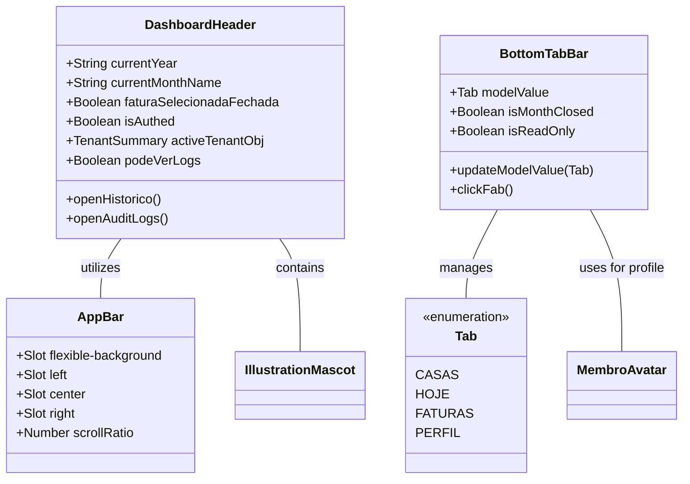

# GGQPA-XXX-202606121120-[Refactor]-ui-premium-navbar-header-evolution

## Requirements
- **Elevate Visual Fidelity**: Transform the existing navbar and header into a premium, polished experience that feels both professional and family-friendly.
- **Inclusive Universal Design**: Ensure the interface is intuitive and accessible for all age groups, specifically children and the elderly, through clear visual hierarchy and simplified interactions.
- **Extreme Minimalism & High Density**: Prioritize an ultra-clean, minimalist aesthetic with maximum information density. Eliminate all non-essential decorative air.
- **Identity-Driven Pinned State**: The pinned (compact) state must NOT be a clinical white bar. It must preserve the "Divi" identity: warm, tactile, and playful. Use subtle canvas tints, "ember" accents, and maintain the mascot's presence as a brand guardian even in the condensed state.
- **AppBar Consistency**: Introduce a standardized `AppBar` component to provide structural and visual consistency across different screens, serving as the foundation for the header.
- **Refine Bottom Navigation**: Transition from a standard sticky bar to a floating, solid-colored pill with refined depth.
- **Thumb-zone Optimization**: Design all primary interactions within the ergonomic reach of a single-handed thumb operation on mobile devices.
- **Jelly-like Fluidity**: Prioritize smoothness and elastic "jelly-like" micro-interactions inspired by iOS for a more tactile and delightful experience.
- **Simplify Dashboard Header**: Reduce visual noise in the header while maintaining essential information (period, tenant, branding).
- **Maintain Brand Identity**: Preserve the presence of the mascot "ember" and the warm color palette (ember, sunburst) in a more integrated manner.
- **SliverAppBar Dynamics**: Implement a scrolling behavior similar to Flutter's SliverAppBar, where the header collapses into a pinned state when scrolling down, transitioning from an expanded transparent layout to a compact solid-colored pinned bar.
- **Zero-Jitter Scroll Architecture**: The header collapse must be 100% jitter-free. Any involuntary stutter, jump, or double-interpolation caused by CSS `transition` fighting JS-driven style mutations is unacceptable. All scroll-driven style mutations must bypass the CSS transition pipeline entirely — using direct DOM manipulation (`el.style.xxx`) instead of reactive Vue state that triggers re-renders.
- **Snap-Back Elimination**: Eliminate the "snap-back glitch" — the involuntary rapid bounce between expanded and collapsed states that occurs when scrolling near the trigger threshold. The transition must be decisively one-directional per scroll gesture.
- **Scroll-Direction-Aware State Machine**: The header must respond to the **direction** of scroll (up vs. down), not to the absolute `scrollY` position. Scroll **down** collapses the header; scroll **up** expands it. The system must internally track its own interpolation variable `t` independently of `scrollY`.
- **Dead Zone Stability**: Implement a configurable dead zone (`DEAD_ZONE_PX`, default 8px) of accumulated scroll delta before triggering any state transition. Small involuntary micro-scrolls within this zone must be silently absorbed, preventing spurious expand/collapse cycles.
- **Physical Height Constraint**: The fully expanded header must measure approximately **12 mm physical height** on the device screen, which translates to 48–56 logical pixels depending on screen density. Use `52px` as the canonical logical pixel target for the expanded state height.

## Entities

## Approach
1. **AppBar Structural Foundation**:
   - Create a reusable `AppBar.vue` that defines the three-column layout (Left, Center, Right) for all headers.
   - Ensure consistent height, padding, and alignment across all implementations.

2. **Solid Premium Depth**:
   - Replace glassmorphism with clean, high-quality solid surfaces. Use `bg-canvas` or slightly tinted `bg-stone/50` for the header background in the pinned state to maintain warmth.
   - Implement multi-layered shadows (`shadow-premium`) to create a floating sensation without relying on blur effects.

3. **Universal Design & Inclusivity**:
   - **Visual Clarity**: Use high-contrast color pairings for icons and labels to assist the elderly.
   - **Simplicity for Children**: Rely on recognizable iconography and avoid hidden gestures or complex nested menus.
   - **Generous Hit Areas**: Exceed the standard 44px where possible, especially for critical navigation and the FAB, to accommodate less precise motor control.

4. **Mobile Ergonomics & Safe Areas**:
   - **Floating Offset**: Use `env(safe-area-inset-bottom)` combined with a fixed margin (e.g., 16px) to ensure the floating bar clears the home indicator on iOS and navigation bar on Android.
   - **Thumb Zone**: Place the FAB and primary tabs within the lower 1/3 of the screen for maximum reachability.

5. **Refined Typography & Spacing**:
   - Use `tracking-[0.2em]` for captions to increase premium feel.
   - Standardize icon stroke weights (1.8px for inactive, 2.2px for active) and implement high-contrast visual cues for selected tabs.

6. **Micro-interactions & Fluidity**:
   - **Elastic Transitions**: Apply aggressive spring easings (high damping, low mass) to achieve a "jelly-like" effect on interaction.
   - **Haptic Feedback Simulation**: Add scale down (0.92) and slightly overshoot on scale up for a physical, tactile sensation on click/tap.

7. **Header Restructuring (Ultra-Density & Identity Consistency)**:
   - **Maximum Space Distribution**: Optimize the three-column slot system to push side elements to the absolute limits of the container.
   - **Minimalist Footprint**: Reduce expanded heights and internal paddings.
   - **Branding Integration (The Guardian)**: The mascot must remain visible and playful in the pinned state. Instead of hiding, it should "peek" from behind the branding or sit atop the condensed bar.
   - **Action Button Harmony (Pinned Consistency)**: Side actions must remain tactile and integrated.
     - **Integration**: Use ultra-subtle integrated backgrounds (e.g., `stone/10`) and refined borders (`stone/20`) consistently. Avoid shifting to opaque white backgrounds in the pinned state; prefer subtle stone tints to maintain warmth.
     - **Symmetric Architecture**: Both side buttons share a fixed horizontal footprint and identical corner radius (`rounded-2xl`).
     - Minimalist Content: Maintain textual labels even in the compact state to ensure clarity and accessibility for all age groups. Align labels and icons in a high-density, integrated layout.

8. **Sliver Scrolling Dynamics (Direction-Aware State Machine — Zero-Jitter Architecture)**:

   > **Root Cause Analysis (Jitter Diagnosis)**: Two generations of bugs were identified:
   > - **Generation 1 (fixed)**: CSS `transition-all` + JS `:style` conflict; Vue `ref`/`computed` re-renders on the hot path; `animate-wobble` vs. `:style` transform conflict on the mascot; `transition-all duration-300` on interior elements.
   > - **Generation 2 (current — snap-back glitch)**: The previous fix still used `t = clamp(window.scrollY / INTERPOLATION_RANGE, 0, 1)` — a **position-based** mapping. This means any scroll position between 0 and 36px produces a different `t` on every frame. When the user scrolls slowly near this range, the header perpetually oscillates between expanded and collapsed states with each small scroll delta, producing the "snap-back" bounce and rapid flickering.

   **Corrected Architecture (Direction-Aware State Machine)**:

   The fundamental shift: `t` is no longer derived from `window.scrollY`. Instead, `t` is a **self-owned JS variable** that is updated based on the **direction and magnitude of scroll deltas**. The engine computes `delta = scrollY - lastScrollY` and drives `t` forward or backward, with a dead zone to absorb micro-oscillations.

   - **Constants**:
     - `EXPANDED_HEIGHT = 52` (px) — canonical logical pixel target for fully expanded state (~12mm physical on a 96dpi screen).
     - `COLLAPSED_HEIGHT = 44` (px) — compact branding-only state.
     - `INTERPOLATION_RANGE = EXPANDED_HEIGHT - COLLAPSED_HEIGHT = 8` (px).
     - `DEAD_ZONE_PX = 8` — accumulated scroll delta in px that must be exceeded before `t` changes. Absorbs small involuntary micro-scrolls.
     - `COLLAPSE_RATE = 1 / 40` — how much `t` advances per px of downward scroll delta (after dead zone).
     - `EXPAND_RATE = 1 / 30` — how much `t` retreats per px of upward scroll delta (expand faster than collapse for responsiveness).
     - `SNAP_THRESHOLD = 0.35` — if `t` crosses this threshold after a directional gesture, snap decisively to `t = 1` (collapsed) or `t = 0` (expanded) to eliminate the ambiguous mid-state.

   - **State Variables** (plain JS `let`, never reactive `ref`):
     - `let t = 0` — current interpolation ratio [0 = expanded, 1 = collapsed]. Initial value 0 (expanded).
     - `let lastScrollY = 0` — previous frame's `window.scrollY`.
     - `let deadZoneAccum = 0` — accumulated unprocessed delta (px). Reset to 0 after dead zone is crossed.
     - `let rafId: number | null = null`.

   - **`handleScroll()` function**: Called on `window.scroll` event (`{ passive: true }`). Cancels pending `rafId`, schedules `requestAnimationFrame(applyStyles)`.

   - **`applyStyles()` function** — direction-aware `t` computation:
     1. Read `const currentScrollY = window.scrollY`.
     2. `const delta = currentScrollY - lastScrollY`.
     3. `lastScrollY = currentScrollY`.
     4. **Boundary clamp**: If `currentScrollY <= 0`, force `t = 0` and `deadZoneAccum = 0` (always fully expanded at page top). Skip remaining logic.
     5. `deadZoneAccum += delta`.
     6. If `Math.abs(deadZoneAccum) < DEAD_ZONE_PX`, do NOT change `t`. Proceed directly to DOM mutations with current `t`.
     7. Otherwise: `const effectiveDelta = deadZoneAccum - Math.sign(deadZoneAccum) * DEAD_ZONE_PX`; `deadZoneAccum = 0`.
     8. If `effectiveDelta > 0` (scrolling down → collapse): `t = Math.min(1, t + effectiveDelta * COLLAPSE_RATE)`.
     9. If `effectiveDelta < 0` (scrolling up → expand): `t = Math.max(0, t + effectiveDelta * EXPAND_RATE)`.
     10. **Snap to stable state**: If `t > SNAP_THRESHOLD && t < 1`, set `t = 1`; if `t < (1 - SNAP_THRESHOLD) && t > 0`, set `t = 0`. This prevents the header from stalling in an indeterminate mid-state.
     11. Apply DOM mutations with final `t` value.

   - **Mascot Transform Isolation**: The mascot outer wrapper (`mascotRef`) receives scroll-driven `top`, `right`, and `transform` mutations. It must NOT carry a CSS animation that writes to `transform`. Wobble animation is isolated to an inner child wrapper (Safeguard #8).

   - **FlexibleSpaceBar Integration** (same formulas as before, now driven by direction-aware `t`):
     - **Branding Interpolation**: Center branding `transform = scale(${1.05 - 0.15 * t})`.
     - **Mascot Symbiosis**: `top = ${-14 + 18 * t}px`, `right = ${-12 + 12 * t}px`, `transform = scale(${0.95 - 0.2 * t}) rotate(${4 - 4 * t}deg)`.
     - **Tenant Name Fade**: `opacity = max(0, 1 - 2.8 * t)`.

   - **Surface & Elevation (via Direct DOM)**:
     - **Height**: `${EXPANDED_HEIGHT - INTERPOLATION_RANGE * t}px` (52px → 44px).
     - **Background**: Transparent for `t ≤ 0.05`; `rgba(251, 250, 249, min(1.0, 0.98 * t))` for `t > 0.05`.
     - **Shadow**: For `t > 0.6` → `0 ${6 * t²}px ${24 * t}px -4px rgba(67,70,69,${0.08*t}), 0 0 1px rgba(18,18,18,${0.1*t})`.
     - **Border**: `1px solid rgba(242, 240, 237, ${max(0, (t - 0.8) * 10)})`.

   - **Breakout & Padding (Edge-to-Edge)**:
     - `marginLeft = ${-padPx * t}px`, `marginRight = ${-padPx * t}px`, `width = calc(100% + ${2 * padPx * t}px)`.
     - `paddingLeft = ${padPx * (1 - t)}px`, `paddingRight = ${padPx * (1 - t)}px`.
     - `--parent-pad`: `1.5rem` (≥640px); `1rem` (<640px).

   - **Parallax Layer**: `opacity = 1 - t`, `transform = translateY(${t * 24}px)`.

   - **CSS Transition for Final Snap Only**: When `t` snaps discretely from a mid-value to 0 or 1 (step 10 above), apply a one-shot CSS transition on the `<header>` to smooth the snap: `header.style.transition = 'height 180ms ease-out, background-color 180ms ease-out'`, immediately after set `header.style.transition = ''` on the next RAF tick. This is the ONLY permitted use of CSS transition on scroll-driven properties — exclusively for the discrete snap settlement, never for continuous scroll.

   - **RAF Pattern**: Cancel pending `rafId` before each new `requestAnimationFrame`. Clean up in `onUnmounted`.

## Structure

### Inheritance Relationships
1. `AppBar.vue` is the base layout component for headers.
2. `DashboardHeader.vue` utilizes `AppBar.vue` via slots.
3. `BottomTabBar.vue` is a standalone UI navigation component.
4. All use `lucide-vue-next` for iconography.

### Dependencies
1. `DashboardHeader` depends on `AppBar` and `IllustrationMascot`.
2. `BottomTabBar` depends on `MembroAvatar`.
3. Both depend on Tailwind 4 theme variables (colors, radii, easings).

### Layered Architecture
1. **View Layer**: Components responsible for layout, branding, and navigation triggers.
2. **Design System Layer**: `main.css` providing the @theme tokens and base animations.

## Operations

### Create Component - AppBar.vue
1. **Responsibility**: Provide a consistent, scroll-reactive SliverAppBar layout for all headers, managing four slot zones and exposing DOM refs for zero-jitter direct style mutation.
2. **Slots**:
   - `flexible-background`: Absolute-positioned parallax backdrop layer. Exposes a ref so the parent can drive `opacity` and `translateY` directly.
   - `left`: Left-aligned content column (`flex-1 basis-0 justify-start`).
   - `center`: Centered branding column (`flex-shrink-0 min-w-max`).
   - `right`: Right-aligned content column (`flex-1 basis-0 justify-end`).
3. **Props**:
   - Remove `scrollRatio` prop. AppBar no longer accepts or reacts to a scroll ratio. All scroll-driven style mutations are applied externally via `expose`d DOM refs.
4. **Expose (via `defineExpose`)**:
   - `headerEl`: ref to the `<header>` root element.
   - `parallaxEl`: ref to the `flexible-background` wrapper div.
5. **CSS Custom Properties** (scoped):
   - `--parent-pad: 1.5rem` (24px) on `≥640px` screens; `1rem` (16px) on `<640px` screens.
   - `will-change: height, padding, background-color, box-shadow, margin, width` for GPU compositing.
6. **Styles (baseline only — NO `transition` on scroll-driven properties)**:
   - Remove `transition-all`, `transition`, or any CSS transition from the `<header>` element's scoped styles and from its Tailwind class list. No transition class may be present on the header or the parallax wrapper.
   - Apply `position: sticky; top: 0; z-index: 50; overflow: hidden` via class.
   - Base height `6rem` (96px), expressed as a CSS variable or inline style updated by the parent.
   - CSS `transition` is only permitted on `:hover` / `:focus-visible` pseudo-classes that target non-scroll properties (e.g., ring, outline).

### Update Component - DashboardHeader.vue
1. **Responsibility**: Own all scroll logic via a direction-aware state machine. Apply scroll-driven style mutations directly to DOM elements via `useTemplateRef`, bypassing Vue's reactivity pipeline and the CSS transition engine. Eliminate snap-back glitch through dead zone absorption and snap-to-stable-state logic.
2. **State Machine Variables** (plain `let`, never Vue reactive):
   - `let t = 0` — interpolation ratio [0 = expanded, 1 = collapsed]. Starts at 0.
   - `let lastScrollY = 0` — previous `window.scrollY`, initialized to `window.scrollY` in `onMounted`.
   - `let deadZoneAccum = 0` — accumulated unprocessed scroll delta in px.
   - `let rafId: number | null = null`.
   - Constants: `EXPANDED_HEIGHT = 52`, `COLLAPSED_HEIGHT = 44`, `INTERPOLATION_RANGE = 8`, `DEAD_ZONE_PX = 8`, `COLLAPSE_RATE = 1 / 40`, `EXPAND_RATE = 1 / 30`, `SNAP_THRESHOLD = 0.35`.
3. **Template Refs**: Declare `useTemplateRef` for every scroll-interpolated element: `appBarRef`, `leftBtnRef`, `leftLabelRef`, `rightBtnRef`, `rightLabelRef`, `centerRef`, `mascotRef`, `tenantNameRef`.
4. **`handleScroll()` function**: Cancel pending `rafId`, schedule `requestAnimationFrame(applyStyles)`. Registered with `{ passive: true }`.
5. **`applyStyles()` function** — full direction-aware implementation:
   a. `const currentScrollY = window.scrollY`.
   b. `const delta = currentScrollY - lastScrollY`; `lastScrollY = currentScrollY`.
   c. If `currentScrollY <= 0`: force `t = 0`, `deadZoneAccum = 0`, skip to DOM mutations.
   d. `deadZoneAccum += delta`.
   e. If `Math.abs(deadZoneAccum) < DEAD_ZONE_PX`: skip `t` update, proceed to DOM mutations with current `t`.
   f. Else: `const eff = deadZoneAccum - Math.sign(deadZoneAccum) * DEAD_ZONE_PX`; `deadZoneAccum = 0`.
      - If `eff > 0` (scroll down → collapse): `t = Math.min(1, t + eff * COLLAPSE_RATE)`.
      - If `eff < 0` (scroll up → expand): `t = Math.max(0, t + eff * EXPAND_RATE)`.
   g. **Snap to stable**: If `t > SNAP_THRESHOLD && t < 1` → `t = 1`; if `t < (1 - SNAP_THRESHOLD) && t > 0` → `t = 0`. Then apply a one-shot CSS transition for the snap only (see Approach §8).
   h. Apply direct DOM mutations with final `t`.
6. **Direct Style Mutations per element** (all inside `applyStyles`):
   - **`headerEl`**: `height = ${52 - 8 * t}px`, `backgroundColor`, `boxShadow`, `borderBottom`, `marginLeft`, `marginRight`, `width`, `paddingLeft`, `paddingRight` — using formulas from Approach §8. Zero CSS `transition` on continuous scroll; one-shot transition only on snap.
   - **`parallaxEl`**: `opacity = 1 - t`, `transform = translateY(${t * 24}px)`.
   - **`leftBtnRef`**: `transform = scale(${1 - 0.05 * t})`, `backgroundColor = rgba(242,240,237,${0.4 + 0.1*t})`, `boxShadow` for `t > 0.8`.
   - **`leftLabelRef`**: `transform = scale(${1 - 0.1 * t})`, `transformOrigin = left center`.
   - **`rightBtnRef`**: mirror of left button.
   - **`rightLabelRef`**: mirror of left label, `transformOrigin = right center`.
   - **`centerRef`**: `transform = scale(${1.05 - 0.15 * t})`.
   - **`mascotRef`**: `top = ${-14 + 18*t}px`, `right = ${-12 + 12*t}px`, `transform = scale(${0.95 - 0.2*t}) rotate(${4 - 4*t}deg)`. No CSS animation on this element.
   - **`tenantNameRef`**: `opacity = ${Math.max(0, 1 - 2.8 * t)}`.
7. **Mascot Wobble Preservation**: Two-layer wrapper isolation: outer = `mascotRef` (RAF-owned transform, no CSS animation); inner = `animate-wobble` class (rotate + scale ±0.01 only, does not conflict).
8. **Template cleanup**: All scroll-driven style changes are removed from Vue template `:style` bindings. Template only contains static classes, `v-if`, `aria-*`, `@click`.
9. **Text Label Retention**: Both buttons retain text labels in all scroll states — only scaled, never hidden.
10. **Vertical Alignment**: All slot contents use `items-center` throughout the transition.
11. **Lifecycle**: `onMounted` → set `lastScrollY = window.scrollY`, call `applyStyles()`, add scroll listener. `onUnmounted` → remove listener, cancel `rafId`.

### Update Component - BottomTabBar.vue
1. **Responsibility**: Provide a floating, ergonomic navigation bar.
2. **Logic Updates**:
   - **Floating Container**: Solid floating pill with `bg-white` and `shadow-premium`.
   - **Jelly Animation**: Elastic transitions for active tab indicators and the FAB.
   - **Touch Targets**: Minimum hit area of `48x48px`.

## Norms
1. **Tailwind 4 First**: Use @theme variables.
2. **Identity First**: Avoid generic "SaaS" aesthetics in favor of warm, tactile choices.
3. **Consistency**: Side actions must have identical visual weight.
4. **High Contrast**: WCAG AA standards.
5. **CSS/JS Transition Separation**: CSS `transition` and JS-driven style mutations are mutually exclusive on the same property of the same element. Scroll-driven properties (height, transform, opacity, background, shadow, margin, padding, width, border) must have zero CSS transition — they are driven by RAF at 60fps. Interaction-only properties (ring, outline, cursor) may have CSS transitions. Violating this rule causes double-interpolation jitter.
6. **Direct DOM for Animation-Critical Paths**: Use `useTemplateRef` + imperative `el.style.xxx` mutations (not Vue reactive state) for all scroll-driven visual updates. Reactive state (`ref`, `computed`) is forbidden on the hot path.

## Safeguards
1. **Universal Mobile Design**: Intuitive for all ages.
2. **Fluidity over Complexity**: Snappy and organic animations.
3. **No Blur**: No glassmorphism.
4. **Safe Area Resilience**: Handle `env(safe-area-inset-bottom)`.
5. **No Breaking Changes**: Preserve event interfaces (`openHistorico`, `openAuditLogs`). The `scrollRatio` prop on `AppBar` is removed — any consumer that previously passed it must be updated to use the `expose` pattern.
6. **Zero Jitter Contract**: Any implementation that produces visible stutter, frame-doubling, or jump during scroll is a regression and must not be merged. The test criterion is: drag-scroll at 60fps on a mid-range Android device (Pixel 6, Chrome) must produce a perfectly linear collapse with no visible jump between frames.
7. **No `transition-all` on Scroll-Driven Elements**: The Tailwind class `transition-all` (and any shorthand `transition`) is forbidden on any element whose `transform`, `opacity`, `background-color`, `box-shadow`, `height`, `margin`, `padding`, or `width` is driven by the scroll RAF loop. Permitted exception: one-shot CSS transition applied programmatically on snap settlement only (Approach §8, final step).
8. **No CSS Animation on Scroll-Driven `transform` Wrapper**: A CSS `@keyframes` animation (e.g., `animate-wobble`, `animate-float`) must never be applied to an element that also receives `transform` mutations via JS. Use inner/outer wrapper isolation instead.
9. **No Position-Based `t` Mapping**: The interpolation variable `t` must NEVER be computed as `window.scrollY / constant`. It must be a self-owned JS variable driven by scroll **delta** and **direction**. Position-based mapping causes snap-back glitch when scrollY oscillates near the trigger threshold.
10. **Dead Zone Mandatory**: The `DEAD_ZONE_PX` accumulator must be implemented. Removing or bypassing it reintroduces the rapid-flip oscillation bug at the transition boundary.
11. **Snap-to-Stable Required**: After computing `t` from a directional delta, if `t` falls in the ambiguous middle band (`0 < t < SNAP_THRESHOLD` or `1 - SNAP_THRESHOLD < t < 1`), it must be snapped decisively to 0 or 1. Leaving `t` in a mid-state causes the header to appear frozen between states.
12. **Physical Height Constraint**: The expanded header height must be 52px logical pixels. Do NOT use 96px or values above 60px, which exceed the 12mm physical target and reduce usable viewport area on mobile.
