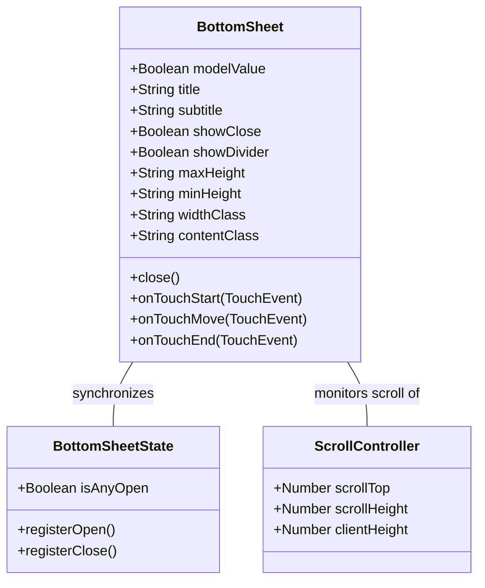

# GGQPA-XXX-202606130511-[Refactor]-ui-premium-bottomsheet-mobile-evolution

## Requirements
- **Improve Mobile BottomSheet UX**: Elevate mobile performance and scroll-to-drag fluidity of the bottom sheet component to feel tactile and delightful like native mobile sheets.
- **Eliminate Drag Latency**: Remove transition-related lag, jitter, and frame dropping under touch drag gestures on mobile viewports.
- **Implement Interactive Backdrop Opacity**: Dynamically fade the dark backdrop overlay (opacity scale from 0.4 down to 0) proportional to the sheet's vertical translation progress during swipe-down gesture.
- **Ensure Smooth Scrolling Transition**: Transition between content scroll and sheet drag seamlessly without requiring the user to release the scroll touch and start a new touch gesture.
- **Optimize Input and Form Protection**: Avoid closing gesture triggers on input fields, buttons, scrollable lists or explicitly marked no-drag areas to prevent accidental close actions.
- **Optimize Event-Loop CPU Consumption**: Eliminate redundant DOM lookup queries (e.g., closest) and completely remove synchronous layout-triggering DOM reads (e.g., scrollTop queries causing layout thrashing) in hot paths of touchmove. Prevent redundant style mutations on unchanged drag offsets to prevent frame drops under continuous swipe loops.

## Entities

## Approach
1. **Gesture Physics and Animation Segregation**:
   - Temporarily remove any transition style class from the draggable sheet element on `touchstart` to avoid CSS transition interpolation fighting the JS transform update. Re-enable easing transition only on `touchend`.
   - Implement `requestAnimationFrame` (RAF) loop for the `touchmove` event handler to throttle style mutations to 60fps/120fps.
   - Use plain non-reactive JavaScript let variables for touch tracking coordinates and animation states, keeping Vue's reactivity proxy checking away from the gesture hot-path.
   - Implement a gesture bypass flag (ignoreGesture) set on touchstart to avoid repeated element queries (closest) in touchmove events.
   - Throttle DOM mutations when translateY offsets are stationary at 0px to minimize render execution times.
   - Cache the scroll offset dynamically using a passive scroll event listener (`lastScrollTop`) to eliminate synchronous `scrollTop` DOM reads during gesture tracking, resolving layout thrashing (forced synchronous layout reflows) completely.

2. **Interactive Backdrop Overlay**:
   - Expose and bind the backdrop DOM element to the swipe progress. Compute current translateY delta and scale backdrop opacity linearly down from `0.4` to `0` as the translation moves from `0` to `100%` of sheet height.

3. **Scroll-to-Drag Transition Engine**:
   - Track content scrolling within `overflow-y-auto` container. When the scroll position hits the top (`scrollTop = 0`) during a downward swipe gesture, transition the gesture lock from scrolling to sheet translateY drag seamlessly in the same touch transaction.

4. **Spring Easing and Snapping**:
   - Calculate scroll velocity and delta on gesture end. If swipe distance exceeds `100px` (or `25%` of height), animate translation to `100%` and close sheet. Otherwise, slide smoothly back to `0px` using Material Spring curves.

## Structure

### Inheritance Relationships
1. `BottomSheet.vue` uses `useBottomSheetState` for global scroll lock side effects.
2. Component registers local event listeners: `touchstart`, `touchmove`, `touchend`, `mousedown` on the wrapper element.

### Dependencies
1. `BottomSheet.vue` depends on `useBottomSheetState` composable and Lucide icons.
2. Custom scrollbar styling matches standard view configurations.

### Layered Architecture
1. View Layer: Vue component layout template.
2. ViewModel Layer: Local gesture state handling and DOM mutations.

## Operations

### Update Component - BottomSheet.vue
1. **Responsibility**: Implement a zero-jitter, highly fluid bottom sheet utilizing RAF-driven GPU transforms, interactive backdrop fading, and scroll-to-drag seamless transition.
2. **Local State Variables** (non-reactive let):
   - `let touchStartY = 0` — start coordinate of touch gesture.
   - `let currentTranslateY = 0` — active vertical offset in px.
   - `let isDragging = false` — active gesture dragging status.
   - `let ignoreGesture = false` — bypass status for restricted interactive targets.
   - `let lastScrollTop = 0` — cached scroll position of contentEl.
   - `let rafId: number | null = null` — requestAnimationFrame handle.
   - `let sheetHeight = 0` — measured sheet height on start.
3. **Template Refs and Listeners**:
   - `sheetEl` — ref to the main bottom sheet card div.
   - `backdropEl` — ref to the background dark fade div.
   - `contentEl` — ref to the scrollable content container div, listening to `@scroll.passive="onContentScroll"`.
4. **`onContentScroll(event)`**:
   - Update `lastScrollTop` to `event.target.scrollTop`.
5. **`onTouchStart(event)`**:
   - Check if event started on input, textarea, anchor, or `.no-drag` selector. If so, set `ignoreGesture = true` and ignore gesture. Otherwise, set `ignoreGesture = false`.
   - Store starting coordinate: `touchStartY = event.touches[0].clientY`.
   - Measure `sheetHeight = sheetEl.clientHeight`.
   - Sincronize cached scroll: `lastScrollTop = contentEl.scrollTop`.
   - Temporarily disable transition class `transition-all` on the sheet element.
6. **`onTouchMove(event)`**:
   - If `ignoreGesture` is true, immediately return. Do not execute any DOM queries.
   - Compute `delta = event.touches[0].clientY - touchStartY`.
   - If `isDragging` is true:
     - If `delta > 0`: schedule `requestAnimationFrame` to execute `applyDragStyles(delta)`.
     - If `delta <= 0` and `currentTranslateY` is not 0: schedule `requestAnimationFrame` to execute `applyDragStyles(0)`.
   - If `isDragging` is false, `delta > 0` and `lastScrollTop` is less than or equal to 0:
     - Set `isDragging = true`, update `touchStartY` to current Y coordinate to prevent sudden jump, and schedule `applyDragStyles(0)`.
6. **`onTouchEnd(event)`**:
   - If `ignoreGesture` is true, return.
   - Determine final delta: `finalDelta = event.changedTouches[0].clientY - touchStartY`.
   - Re-enable transition class.
   - If `finalDelta > 100` (or `25%` of container height):
     - Animate translation to `100%` using `translateY(100%)` with spring easing and trigger `close()` event.
     - Decrement active bottom sheets in `useBottomSheetState`.
   - Else:
     - Animate translation back to `0px` with spring easing and restore normal styles.
7. **`applyDragStyles(delta)`**:
   - Update `translateY` transform directly on the sheet element: `translateY(${delta}px)`.
   - Update opacity of the backdrop element directly based on progress: `opacity = 1 - (delta / sheetHeight)`.

## Norms
1. **GPU Acceleration**: Only mutate `transform` and `opacity` during gesture tracking to ensure hardware acceleration. Box-model properties (height, margin, padding, width) are forbidden on the gesture path.
2. **Vue Reactivity Bypass**: Do not use Vue `ref` or `computed` for coordinates, velocities, or state values read inside hot paths (e.g., `touchmove`).
3. **No transition-all on Gestures**: Draggable elements must never have `transition-all` active during drag.

## Safeguards
1. **Input Protection**: Gestures must not interfere with typing inside text fields, selecting dropdowns, or clicking buttons.
2. **Backdrop Isolation**: Clicking or dragging the backdrop must not trigger visual glitch transitions in the main body.
3. **Zero Jitter Contract**: Smooth drag feedback at 60fps on average mobile devices.
4. **Scroll Lock Integration**: Prevent main body scroll when the bottom sheet is active, and ensure scroll lock is fully released on unmount or transition end.
