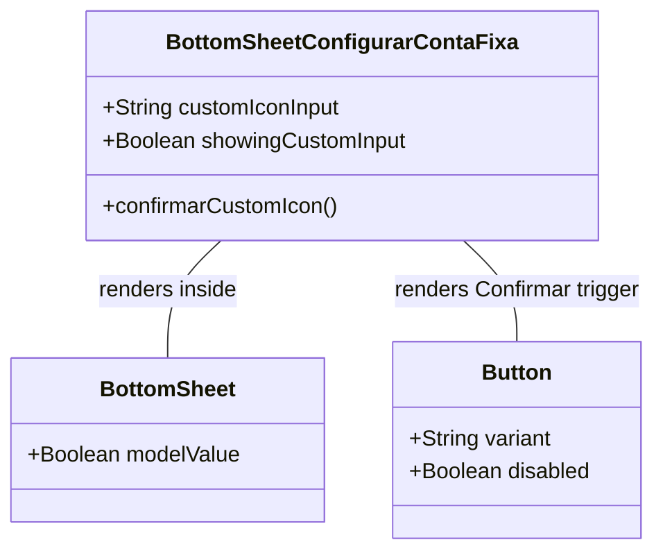

# GGQPA-XXX-202606130542-[Refactor]-ui-mobile-first-icon-selection-responsiveness

## Requirements
- **Implement Mobile-First Icon Selector**: Redesign the custom emoji input selector inside the setup form to use mobile-first responsive stacking.
- **Prevent Element Squashing**: Ensure the input field and "Confirmar" button have adequate touch target sizes and layout spacing on vertical mobile viewports.
- **Align with Desktop Formats**: Retain the compact inline side-by-side layout for desktop viewports.

## Entities

## Approach
1. **Responsive Flex-Direction Flow**:
   - Utilize TailwindCSS responsive direction utilities. Establish a vertical stack flow (`flex-col`) by default for mobile viewports and switch to row flow (`sm:flex-row`) for viewport breakpoints larger than small (`640px` and up).
   
2. **Width Adaptability**:
   - Allow the custom text input to take full width by default.
   - Adjust the confirmation button to be full width on mobile (`w-full`) for enhanced ergonomics and ease-of-tap, transitioning back to width-auto on desktop screens (`sm:w-auto`).

## Structure

### Inheritance Relationships
1. `BottomSheetConfigurarContaFixa.vue` renders and wraps the local template inside the generic UI component `BottomSheet.vue`.

### Dependencies
1. `BottomSheetConfigurarContaFixa.vue` depends on `BottomSheet.vue` and `Button.vue`.

### Layered Architecture
1. View Layer: Responsive HTML template layout utilizing Tailwind CSS classes.
2. Logic/ViewModel Layer: Form state data binding (`customIconInput`, `showingCustomInput`).

## Operations

### Update Component - BottomSheetConfigurarContaFixa.vue
1. **Responsibility**: Align the custom icon text input field container and button with mobile-first responsive guidelines.
2. **Template adjustments (HTML)**:
   - Locate the custom icon input container `div` inside `showingCustomInput` wrapper (currently `flex gap-2`).
   - Change the container class list from `flex gap-2` to `flex flex-col sm:flex-row gap-2`.
   - Update the confirmation `<Button>` class list: append `w-full sm:w-auto` to overwrite the fixed inline width on mobile screens while maintaining desktop dimensions.
3. **Verification**:
   - Confirm that the button continues to trigger `confirmarCustomIcon` properly and that its disabled state remains unaffected.

## Norms
1. **Mobile-First Breakpoint Progression**: CSS layout classes must prioritize mobile viewports by default, appending responsive modifiers (e.g., `sm:`, `md:`) only for desktop scaling.
2. **Ergonomic Buttons**: Any action buttons in mobile forms should span the maximum width of their parent containers to simplify physical thumb tapping.

## Safeguards
1. **Zero Layout Breakage**: The spacing and gap width must prevent text overflow of the "Confirmar" label across all supported viewports.
2. **Action Validation Safeguard**: Ensure that clicking the full-width button remains disabled if `customIconInput` is empty.
