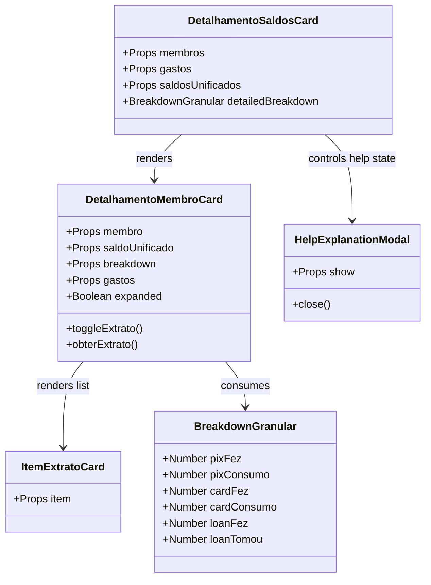

# Improve Detailed Analysis UI UX Accessibility

## Requirements
- Melhorar a legibilidade e clareza da página de análise detalhada de saldos para todos os públicos, especialmente usuários idosos.
- Fornecer feedback visual e textual claro do estado do saldo dos membros (saldo positivo = valores a receber, saldo negativo = valores a pagar, saldo zerado = equilibrado).
- Substituir termos financeiros puramente abstratos (como "Pagou"/"Consumiu" avulsos) por rótulos descritivos com textos de apoio dinâmicos e intuitivos.
- Otimizar a acessibilidade visual através do aumento das fontes menores, eliminação de opacidades excessivamente fracas em dados informativos e uso de cores neutras para valores zerados.
- Introduzir um guia explicativo interativo e amigável (modal ou informativo) que detalhe de forma didática o funcionamento da matemática de divisão de gastos do grupo.
- Ajustar o histórico de transações para o padrão de extrato bancário, onde o cálculo da evolução do saldo acumulado segue a ordem cronológica real (do passado para o presente), e as transações mais recentes são exibidas no topo com seus respectivos saldos daquele momento histórico.

## Entities

## Approach
1. **Redesenho Semântico do Saldo do Membro**:
   - Em vez de um badge de saldo puramente numérico ou matemático (`Saldo: +R$ 10,00`), realizar o tratamento condicional baseado no valor do saldo (`saldoUnificado`).
   - Se `saldoUnificado > 0.005`: exibir badge destacado com texto "A Receber: R$ X" (verde/meadow), acompanhado de uma frase descritiva em fonte legível: *"Você pagou a mais pelo grupo e tem dinheiro a receber."*
   - Se `saldoUnificado < -0.005`: exibir badge destacado com texto "A Pagar: R$ X" (vermelho/coral), acompanhado da frase descritiva: *"Você consumiu mais do que pagou e precisa acertar a diferença."*
   - Se estiver zerado: exibir badge "Saldo Equilibrado" (cinza/graphite) com a frase: *"Você está com as contas em dia no grupo!"*
2. **Didática Estendida nos Cards de Categoria (PIX, Faturas, Empréstimos)**:
   - Adicionar pequenas frases explicativas (legendas) abaixo dos rótulos numéricos dos fluxos no `DetalhamentoMembroCard.vue`.
   - **PIX / Dinheiro**:
     - `Pagou` -> Mudar para `Pagou para o grupo (+)`. Descrição de apoio: *"Compras individuais que você pagou"*
     - `Consumiu` -> Mudar para `Sua parte consumida (-)`. Descrição de apoio: *"O que você usou das compras de todos"*
   - **Faturas**:
     - `Usou` -> Mudar para `Fez no seu cartão (+)`. Descrição de apoio: *"Contas do grupo pagas com seu cartão"*
     - `Consumiu` -> Mudar para `Sua parte na fatura (-)`. Descrição de apoio: *"O que você gastou no cartão dos outros"*
   - **Empréstimos**:
     - `Emprestou` -> Mudar para `Você emprestou (+)`. Descrição de apoio: *"Dinheiro que você enviou para alguém"*
     - `Tomou` -> Mudar para `Pegou emprestado (-)`. Descrição de apoio: *"Dinheiro que você deve devolver a alguém"*
3. **Melhorias de Contraste, Fontes e Neutros**:
   - Aumentar o tamanho das fontes dos rótulos de dados (`text-[10px]` ou `text-xs`) para pelo menos `text-xs` (12px) ou `text-sm` (14px) nos valores principais de fluxo.
   - Remover opacidades fracas em textos informativos importantes (`opacity-60`), garantindo alto contraste no padrão do tema divi (`text-graphite` ou `text-charcoal`).
   - Se o valor do fluxo ou transação for `R$ 0,00`, exibir em tom cinza neutro (`text-graphite` ou `text-stone-500`) e remover os sinais matemáticos de `+` ou `-` para limpar a poluição cognitiva.
   - Implementar o componente `HelpExplanationModal` contendo um passo a passo curto com ícones ilustrativos descrevendo a regra de créditos e débitos do DIVI.
4. **Preservação de Formato do Avatar**:
   - Adicionar a classe `shrink-0` nas instâncias de uso de `MembroAvatar` (ou na sua própria raiz) para impedir a distorção (achatamento) do avatar quando o contêiner flexbox sofrer encolhimento devido a textos de nome e descrições vizinhos.
5. **Cronologia de Extrato Bancário**:
   - O cálculo do saldo acumulado do extrato do membro deve processar os lançamentos em ordem cronológica crescente (do mais antigo para o mais recente) baseado na data do gasto (`createdAt`).
   - A exibição do histórico na tela deve ser em ordem cronológica decrescente (mais recente no topo), invertendo o resultado calculado sem quebrar a matemática acumulada de cada linha.

## Structure

### Inheritance Relationships
1. `HelpExplanationModal` herda e se comporta como um modal de sobreposição acessível (overlay).

### Dependencies
1. `DetalhamentoSaldosCard.vue` depende de `DetalhamentoMembroCard.vue` e `HelpExplanationModal.vue`.
2. `DetalhamentoMembroCard.vue` depende de `ItemExtratoCard.vue` e `MembroAvatar.vue`.
3. `ItemExtratoCard.vue` formata dados a partir do modelo de dados `ItemExtrato` computado em `ExtratoService.ts`.

### Layered Architecture
1. **Presentation Layer**:
   - `DetalhamentoSaldosCard.vue` (contêiner superior).
   - `DetalhamentoMembroCard.vue` (card do membro com as seções de fluxo).
   - `ItemExtratoCard.vue` (exibição de linhas do extrato).
   - `HelpExplanationModal.vue` (modal explicativo de acessibilidade).
   - `MembroAvatar.vue` (avatar customizado do membro com formato dinâmico).
2. **Domain/Service Layer**:
   - `ExtratoService.ts` (cálculo de extrato histórico ordenado).

## Operations

### Create UI Component - HelpExplanationModal.vue
1. **Responsabilidade**: Exibir um guia de apoio simplificado contendo regras de crédito/débito para ajudar usuários mais velhos a interpretar a matemática de acerto do grupo.
2. **Propriedades**:
   - `show`: `Boolean` - Define se o modal deve ser exibido.
3. **Eventos**:
   - `close` - Emitido ao fechar o modal.
4. **Design & Conteúdo**:
   - Usar um overlay escurecido de fundo com transição suave.
   - Caixa de conteúdo centralizada de cantos arredondados (`rounded-2xl`) com um título grande e legível: *"Como funciona o acerto do grupo?"*.
   - Exibir tópicos estruturados com ícones amigáveis do Lucide:
     - 🟢 **A Receber (Crédito)**: *"Quando você paga compras ou faturas pelo grupo, você junta créditos. O grupo te deve esse valor."*
     - 🔴 **A Pagar (Débito)**: *"Quando você consome itens comprados por outra pessoa, você acumula débitos. Você deve pagar esse valor ao grupo."*
     - ⚪ **Saldo Final**: *"É a diferença entre o que você pagou e o que consumiu. Mostra se você tem dinheiro a receber ou se precisa pagar."*
   - Botão grande e fácil de tocar na base: *"Entendi, fechar"*.

### Update View Component - DetalhamentoSaldosCard.vue
1. **Responsabilidade**: Integrar o botão de ajuda e o modal explicativo no cabeçalho do detalhamento.
2. **Alterações**:
   - Importar `HelpExplanationModal.vue`.
   - Adicionar estado `const showHelpModal = ref(false)`.
   - No cabeçalho, ao lado do título "Análise Detalhada", inserir um botão acessível (área de toque `h-10 w-10`, bordas circulares, ícone de ajuda `HelpCircle` ou `Info`).
   - Renderizar o componente `<HelpExplanationModal :show="showHelpModal" @close="showHelpModal = false" />`.

### Update View Component - DetalhamentoMembroCard.vue
1. **Responsabilidade**: Reformular o visual dos saldos dos membros, ajustar labels de fluxo, inverter ordem de exibição do extrato e aprimorar a legibilidade das fontes e valores zerados.
2. **Alterações**:
   - **Cabeçalho do Membro & Saldo**:
     - Substituir o badge compacto de saldo atual por um display visual claro.
     - Usar a lógica `saldoUnificado` para decidir o estado:
       - Se `saldoUnificado > 0.005`: badge grande "A Receber: R$ X" em verde Meadow com descrição abaixo: *"Você pagou a mais pelo grupo e tem dinheiro a receber."*
       - Se `saldoUnificado < -0.005`: badge grande "A Pagar: R$ X" em vermelho Coral com descrição abaixo: *"Você consumiu mais do que pagou e precisa pagar ao grupo."*
       - Caso contrário: badge neutro "Saldo Equilibrado" em cinza com a frase: *"Você está com as contas em dia!"*
     - Garantir o não-encolhimento do `<MembroAvatar>` aplicando `shrink-0` para prevenir deformação da forma blob do avatar.
   - **Grid de Categorias (PIX, Faturas, Empréstimos)**:
     - Substituir os textos de rótulo bruto por labels didáticas acompanhadas de texto de suporte em fonte cinza de tamanho legível (`text-xs`).
     - **PIX / Dinheiro**:
       - Label 1: `Pagou para o grupo (+)` (Descrição: *"Compras individuais pagas por você"*)
       - Label 2: `Sua parte consumida (-)` (Descrição: *"O que você usou dessas compras"*)
     - **Faturas**:
       - Label 1: `Fez no seu cartão (+)` (Descrição: *"Contas do grupo no seu cartão"*)
       - Label 2: `Sua parte na fatura (-)` (Descrição: *"O que você gastou nos cartões de outros"*)
     - **Empréstimos**:
       - Label 1: `Você emprestou (+)` (Descrição: *"Dinheiro enviado para outro membro"*)
       - Label 2: `Pegou emprestado (-)` (Descrição: *"Dinheiro que recebeu de outro membro"*)
   - **Valores Zerados**:
     - No template do `DetalhamentoMembroCard.vue`, ajustar a renderização de valores para verificar se o valor é exatamente zero. Se for zero, aplicar a classe `text-graphite` (cor cinza neutro da paleta) em vez de verde/vermelho, e omitir o sinal `+` ou `-`.
   - **Lista de Extrato**:
     - Reverter a ordem de retorno na função `obterExtrato` usando `[...extratoCalculado].reverse()` para que o lançamento mais recente (com o saldo final atualizado do membro) seja exibido no topo.

### Update View Component - ItemExtratoCard.vue
1. **Responsabilidade**: Refinar a exibição das linhas individuais do extrato para valores zerados.
2. **Alterações**:
   - Ajustar as classes condicionais dos badges de "Pagou" e "Consumiu". Caso o valor pago ou consumido seja zero, não renderizar o badge ou mantê-lo invisível de forma limpa, evitando linhas informativas vazias ou zeradas com coloração forte.

### Update UI Component - MembroAvatar.vue
1. **Responsabilidade**: Garantir que o avatar de qualquer membro possua proporções fixas de círculo/blob e nunca seja deformado sob flexbox em nenhuma viewport ou tamanho de tela.
2. **Alterações**:
   - Adicionar a classe utilitária do Tailwind `shrink-0` na div do contêiner principal para travar as dimensões originais do avatar.

### Update Service - ExtratoService.ts
1. **Responsabilidade**: Ajustar a ordenação do extrato para que siga a cronologia baseada em datas reais de transações.
2. **Alterações**:
   - No método `obterExtratoMembro`, substituir a ordenação baseada no `id` (`id.localeCompare`) por uma ordenação cronológica baseada no campo `createdAt` de forma crescente.

## Norms
1. **Padrões de Acessibilidade (WCAG adaptada)**:
   - Tamanho mínimo de fonte para textos de leitura principal/secundária: `12px` (`text-xs`), preferencialmente `14px` (`text-sm`) para valores numéricos e títulos.
   - Contraste elevado: Não usar níveis de opacidade menores que `opacity-70` ou `opacity-80` em textos pequenos. Usar cores semânticas ativas (`text-meadow`, `text-coral`) apenas em valores realmente maiores que zero.
2. **Vue 3 & TypeScript**:
   - Utilizar a sintaxe `<script setup lang="ts">`.
   - Declarar e tipar estritamente todas as props (`defineProps`) e emissores de eventos (`defineEmits`).
3. **Lucide Icons**:
   - Usar ícones semânticos da biblioteca `lucide-vue-next` (como `HelpCircle`, `Info`, `ArrowUpRight`, `ArrowDownLeft`).

## Safeguards
1. **Salvaguarda de Responsividade**: A estrutura de cartões detalhados deve manter o comportamento `grid-cols-1 md:grid-cols-3` do Tailwind para evitar espremimento de textos longos e descritivos em celulares, mantendo o layout empilhado verticalmente no mobile.
2. **Salvaguarda de Matemática de Saldos**: As mudanças nas views não podem sob nenhuma circunstância recalcular ou alterar os valores fornecidos por `ExtratoService` e pelo objeto `breakdown`. Apenas a renderização visual e a lógica de classesCSS devem ser alteradas.
3. **Salvaguarda de Valores Neutros**: Qualquer valor zerado (tanto nos cards principais quanto no extrato) deve ser impresso de forma limpa como `R$ 0,00` em cinza sem sinalizador de `+` ou `-`, evitando falsos positivos de saldo credor ou devedor.
4. **Salvaguarda de Proporções do Avatar**: O componente `MembroAvatar` ou as tags de contêiner de renderização flexbox onde ele é inserido devem sempre ter a classe `shrink-0` declarada para garantir que o formato original (círculo com bordas orgânicas) nunca seja achatado sob pressão de flexbox.
5. **Salvaguarda de Cronologia de Extrato**: A ordenação das transações no momento do cálculo deve ser estritamente cronológica crescente para evitar distorções no saldo acumulado, devendo ser revertida na exibição para que o topo exiba a transação mais recente com o saldo acumulado total atualizado.
