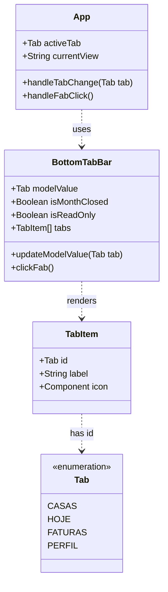

# SPDD Refactor: Melhoria de Nomenclaturas e Acessibilidade da BottomTabBar

## Requirements
- Ajustar os rótulos de exibição das abas da BottomTabBar para termos do cotidiano e de fácil compreensão ("Início", "Acertos", "Minhas Casas", "Ajustes").
- Otimizar os ícones de navegação para representação visual imediata (Calendar -> Home, CreditCard -> Coins).
- Aumentar a acessibilidade visual dos rótulos (aumento de contraste de inativos e tamanho do texto, além de remover caixa alta).
- Garantir compatibilidade reversa total mantendo os IDs internos de navegação inalterados.

## Entities


## Approach
1. **Camada de Apresentação Desacoplada**:
   - Os IDs internos das abas (`'casas' | 'hoje' | 'faturas' | 'perfil'`) serão mantidos inalterados para evitar quebras lógicas em viewmodels, roteamento e testes.
   - O array local `tabs` em `BottomTabBar.vue` será alterado para definir as novas labels e ícones:
     - `'casas'`: label = "Minhas Casas", icon = `Building2`
     - `'hoje'`: label = "Início", icon = `Home`
     - `'faturas'`: label = "Acertos", icon = `Coins`
     - `'perfil'`: label = "Ajustes", icon = `User`
2. **Ajustes de Acessibilidade Visual**:
   - Aumentar o tamanho da fonte do rótulo de `text-[9px]` para `text-[11px]` nos spans de texto.
   - Remover o filtro `uppercase` para manter caixa baixa/mista nas palavras, ajudando idosos com deficiências cognitivas/visuais leves a reconhecer o formato das palavras mais rapidamente.
   - Mudar a cor do rótulo inativo de `text-graphite/60` para `text-graphite/85` (ou similar) para obter contraste aceitável (mínimo de 4.5:1) no fundo branco.
3. **Substituição Segura de Ícones**:
   - Importar `Home` e `Coins` de `lucide-vue-next` e remover `Calendar` e `CreditCard` de `BottomTabBar.vue`.

## Structure

### Inheritance & Types
1. `type Tab` define o tipo união `'casas' | 'hoje' | 'faturas' | 'perfil'`

### Dependencies
1. `App.vue` consome `BottomTabBar.vue`
2. `BottomTabBar.vue` consome `MembroAvatar.vue`
3. `BottomTabBar.vue` importa ícones de `lucide-vue-next` (`Building2`, `Home`, `Coins`, `User`, `Plus`)

### Layered Architecture
- **Root State Layer (`App.vue`)**: Mantém e gerencia o estado da aba ativa.
- **UI Presentational Layer (`BottomTabBar.vue`)**: Exibe a navegação flutuante, manipula cliques e envia eventos de mudança de aba para o componente pai.

## Operations

### Update UI Component - `BottomTabBar.vue`
1. **Path**: [BottomTabBar.vue](file:///d:/projetos/financeiro-divi/src/views/components/ui/BottomTabBar.vue)
2. **Imports**:
   - Substituir a linha de importação de ícones:
     ```typescript
     import { Building2, Calendar, CreditCard, User, Plus } from 'lucide-vue-next'
     ```
     por:
     ```typescript
     import { Building2, Home, Coins, User, Plus } from 'lucide-vue-next'
     ```
3. **Tabs Mapping array**:
   - Substituir o array `tabs`:
     ```typescript
     const tabs = [
       { id: 'casas', label: 'Casas', icon: Building2 },
       { id: 'hoje', label: 'Hoje', icon: Calendar },
       { id: 'faturas', label: 'Faturas', icon: CreditCard },
       { id: 'perfil', label: 'Perfil', icon: User },
     ] as const
     ```
     por:
     ```typescript
     const tabs = [
       { id: 'casas', label: 'Minhas Casas', icon: Building2 },
       { id: 'hoje', label: 'Início', icon: Home },
       { id: 'faturas', label: 'Acertos', icon: Coins },
       { id: 'perfil', label: 'Ajustes', icon: User },
     ] as const
     ```
4. **Active/Inactive Button Class styling**:
   - Ajustar as classes condicionais de contraste inativo (linhas 47 e 92):
     ```typescript
     modelValue === tab.id ? 'text-ember' : 'text-graphite/60 hover:text-charcoal'
     ```
     por:
     ```typescript
     modelValue === tab.id ? 'text-ember' : 'text-graphite/85 hover:text-charcoal'
     ```
5. **Labels Typography**:
   - Substituir a estilização do rótulo `<span>` (linhas 64 e 118):
     ```vue
     <span class="text-[9px] font-bold uppercase tracking-[0.1em] leading-none text-center">
     ```
     por:
     ```vue
     <span class="text-[11px] font-bold leading-none text-center">
     ```
6. **FAB Accessibility**:
   - Substituir a tag do botão FAB (linha 77):
     ```vue
     aria-label="Novo lançamento"
     ```
     por:
     ```vue
     aria-label="Adicionar novo gasto"
     ```

## Norms
1. **Padrão de Nomenclatura**: Termos devem ser descritivos, familiares a leigos e idosos, evitando siglas, termos técnicos e metáforas matemáticas abstratas na navegação de primeiro nível.
2. **Acessibilidade Tipográfica**: Rótulos e elementos de texto secundários não devem ser estilizados com fontes menores que `11px`.
3. **Contraste de Interface**: Rótulos em modo ativo/inativo devem manter taxa de contraste superior a 4.5:1 com o plano de fundo.
4. **Casing Acessível**: Evitar caixa alta generalizada em textos pequenos.

## Safeguards
1. **Integridade de Estados**: É expressamente proibido modificar os IDs técnicos das abas (`'casas'`, `'hoje'`, `'faturas'`, `'perfil'`) para não quebrar referências lógicas no `App.vue`, `DashboardSaldos.vue` e nos viewmodels.
2. **Preservação do Layout**: O container do `BottomTabBar.vue` deve manter sua largura máxima (`max-w-[500px]`) e visual flutuante com borda arredondada (`rounded-pill`) e sombra premium.
3. **Validação Visual**: As palavras "Minhas Casas", "Início", "Acertos" e "Ajustes" devem caber confortavelmente em grids de navegação móvel sem sobreposição.
