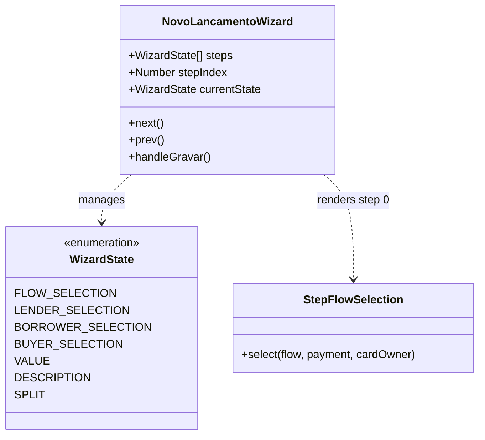

# SPDD Refactor: Remoção do Botão Avançar Redundante no Wizard de Lançamentos

## Requirements
- Ocultar o botão "Avançar" no rodapé do NovoLancamentoWizard durante as etapas de seleção de fluxo (`FLOW_SELECTION`) e de seleção de membros (`BUYER_SELECTION`, `LENDER_SELECTION`, `BORROWER_SELECTION`) para eliminar ações redundantes e evitar erros lógicos de navegação.
- Garantir que o botão "Cancelar/Voltar" se estenda harmoniosamente por toda a largura do rodapé nos passos em que o botão "Avançar" estiver oculto.
- Assegurar a continuidade do avanço automático e manter a integridade dos testes de simulação de fluxo.

## Entities


## Approach
1. **Controle Declarativo da Navegação**:
   - Adicionar a diretiva `v-if="currentState !== 'FLOW_SELECTION' && currentState !== 'BUYER_SELECTION' && currentState !== 'LENDER_SELECTION' && currentState !== 'BORROWER_SELECTION'"` ao botão de "Avançar" no rodapé de [NovoLancamentoWizard.vue](file:///d:/projetos/financeiro-divi/src/views/screens/NovoLancamentoWizard.vue).
2. **Aproveitamento de Layout Flexbox**:
   - Como o botão de cancelamento/voltar possui a classe `flex-1`, ao ocultar o botão principal (que tem a classe `flex-[2]`), o Flexbox do container (`flex gap-3`) fará com que o botão "Cancelar/Voltar" ocupe naturalmente 100% da largura útil do rodapé, sem necessidade de hacks de estilização adicionais.
3. **Preservação de Lógicas de Retorno**:
   - Ao clicar em "Voltar" na etapa posterior, o `stepIndex` é decrementado. O assistente retorna reativamente para um dos estados de seleção, e a diretiva do Vue re-avaliará e ocultará o botão de avanço perfeitamente.

## Structure

### Inheritance & Types
1. `type WizardState` define a união literal `'FLOW_SELECTION' | 'LENDER_SELECTION' | 'BORROWER_SELECTION' | 'BUYER_SELECTION' | 'VALUE' | 'DESCRIPTION' | 'SPLIT'`

### Dependencies
1. `NovoLancamentoWizard.vue` renderiza `StepFlowSelection.vue` e `StepMemberSelection.vue` nas etapas iniciais de escolha e membros.
2. `NovoLancamentoWizard.vue` importa e utiliza `Button.vue` para os controles de rodapé.

### Layered Architecture
- **Wizard Controller Layer (`NovoLancamentoWizard.vue`)**: Gerencia o estado sequencial do formulário (`stepIndex`, `steps`) e controla reativamente os botões de navegação globais baseados na etapa ativa.

## Operations

### Update UI Component - `NovoLancamentoWizard.vue`
1. **Path**: [NovoLancamentoWizard.vue](file:///d:/projetos/financeiro-divi/src/views/screens/NovoLancamentoWizard.vue)
2. **Operations**:
   - Localizar o botão de avançar no rodapé (linhas 284-291):
     ```vue
     <Button
       class="flex-[2]"
       :disabled="!canAdvance || isSubmitting"
       :loading="isSubmitting"
       @click="stepIndex === steps.length - 1 ? handleGravar() : next()"
     >
       {{ stepIndex === steps.length - 1 ? 'Confirmar' : 'Avançar' }}
     </Button>
     ```
   - Adicionar a diretiva `v-if` para torná-lo invisível em todas as etapas de seleção de fluxo e de membros:
     ```vue
     <Button
       v-if="currentState !== 'FLOW_SELECTION' && currentState !== 'BUYER_SELECTION' && currentState !== 'LENDER_SELECTION' && currentState !== 'BORROWER_SELECTION'"
       class="flex-[2]"
       :disabled="!canAdvance || isSubmitting"
       :loading="isSubmitting"
       @click="stepIndex === steps.length - 1 ? handleGravar() : next()"
     >
       {{ stepIndex === steps.length - 1 ? 'Confirmar' : 'Avançar' }}
     </Button>
     ```

## Norms
1. **Estilo Declarativo**: Preferir a diretiva `v-if` nativa do Vue para manipulação estrutural da árvore DOM em vez de manipulações manuais de classes de visibilidade (ex: `hidden`).
2. **Aproveitamento de CSS de Grid/Flexbox**: Usar o comportamento de expansão natural de Flexbox (`flex-1` / `flex-grow`) para gerenciar as larguras dos botões de rodapé sob diferentes modos.

## Safeguards
1. **Comportamento das Ações**: Ocultar o botão não deve impactar os métodos de avanço automático da etapa (seleção de fluxo e membros).
2. **Preservação de Eventos**: O botão "Cancelar/Voltar" deve manter seus bindings de clique originais `@click="stepIndex === 0 ? emit('cancelar') : prev()"` intactos.
