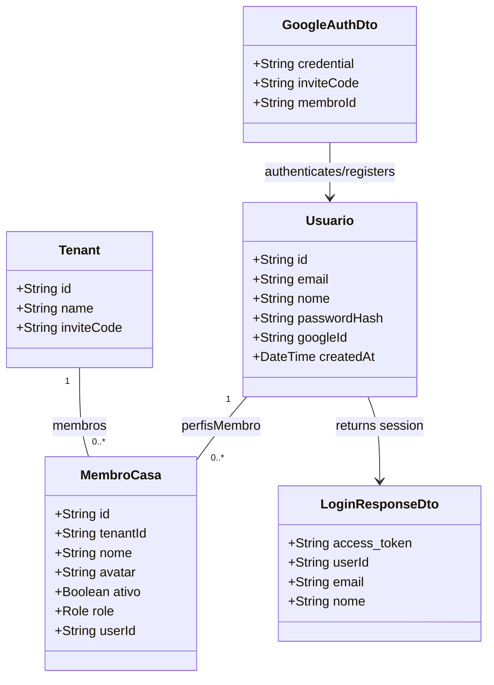

# Google OAuth Sign-In Integration

## Requirements
- Implementar fluxo de autenticação social com o Google (Google Sign-In) no frontend e backend para reduzir churn e atrito de novos usuários.
- Permitir cadastro automático e transparente (Just-in-Time Provisioning) de novos usuários através do Google Identity Services.
- Tornar o cadastro local opcional, permitindo que usuários criados via OAuth não tenham uma senha local inicial.
- Garantir a unificação de perfis quando o e-mail do Google já estiver associado a uma conta existente do DIVI.
- Preservar o vínculo com convites (`inviteCode` e `membroId`) durante o cadastro via Google OAuth.

## Entities

## Approach
1. **Frontend Authentication Flow**:
   - Carregar dinamicamente a biblioteca oficial do Google (`https://accounts.google.com/gsi/client`) para garantir conformidade com políticas de segurança do Google Identity Services.
   - Renderizar o botão oficial do Google de forma responsiva e integrada ao estilo visual do DIVI em [LoginScreen.vue](file:///d:/projetos/financeiro-divi/src/views/screens/LoginScreen.vue).
   - Obter o ID Token de credencial (JWT) via callback do Google e transmiti-lo ao backend no endpoint `POST /api/auth/google`, junto a informações de convite disponíveis no contexto.
2. **Backend Authentication & Account Federation**:
   - Criar um novo endpoint no [AuthController](file:///d:/projetos/financeiro-divi/backend/src/auth/auth.controller.ts) que valida o ID Token do Google usando a biblioteca `google-auth-library`.
   - Obter o payload verificado contendo `email`, `name`, `sub` (que será o `googleId`) e `email_verified`.
   - Se o usuário existir na base pelo e-mail ou pelo `googleId`, atualizar o campo `googleId` (se necessário) e realizar o login emitindo o JWT padrão do DIVI.
   - Se o usuário não existir, efetuar o provisionamento automático e atômico dele sem senha local. Caso existam parâmetros de convite, associá-lo à casa de forma idêntica ao fluxo de registro tradicional (`associarUsuarioAoTenantTx`).
3. **Database Schema Adaptation**:
   - Tornar o campo `password_hash` opcional no schema do Prisma (`passwordHash String?`).
   - Adicionar o campo opcional e indexado `googleId String? @unique` na tabela `usuarios`.
4. **Login Constraints**:
   - Garantir que o login tradicional por e-mail/senha recuse tentativas de login em contas que não possuem hash de senha (usuários que se registraram exclusivamente via Google), devolvendo uma mensagem informativa amigável.

## Structure

### Dependencies
1. `AuthController` depende de `AuthService` para o processamento de tokens e provimento de credenciais.
2. `AuthService` depende de `PrismaService` para busca/persistência de dados e `JwtService` para assinatura das sessões locais.
3. [LoginScreen.vue](file:///d:/projetos/financeiro-divi/src/views/screens/LoginScreen.vue) utiliza o [useLoginViewModel](file:///d:/projetos/financeiro-divi/src/viewmodels/useLoginViewModel.ts) para as chamadas de autenticação.
4. [useLoginViewModel](file:///d:/projetos/financeiro-divi/src/viewmodels/useLoginViewModel.ts) depende de [TenantSessionService](file:///d:/projetos/financeiro-divi/src/models/services/TenantSessionService.ts) para se comunicar com os endpoints do backend.

### Layered Architecture
1. **Controller Layer**: [AuthController](file:///d:/projetos/financeiro-divi/backend/src/auth/auth.controller.ts) expõe o endpoint `POST /auth/google` acessível publicamente.
2. **Service Layer**: [AuthService](file:///d:/projetos/financeiro-divi/backend/src/auth/auth.service.ts) encapsula a verificação do ID Token do Google e a transação atômica de criação de conta + vinculação de membros.
3. **Database Layer**: Prisma Client manipula a tabela `usuarios` atualizada.

## Operations

### Update Database Schema
1. Modificar `backend/prisma/schema.prisma`:
   - Linha 31: Alterar `passwordHash String @map("password_hash")` para `passwordHash String? @map("password_hash")`.
   - Adicionar `googleId String? @unique @map("google_id")` no modelo `Usuario`.
2. Executar `npx prisma migrate dev --name add-google-oauth-fields` na pasta do backend para criar a migração.

### Install Dependencies
1. Adicionar `google-auth-library` às dependências do backend utilizando o gerenciador de pacotes (`pnpm add google-auth-library` no diretório `/backend`).

### Create GoogleAuthDto
1. Criar o arquivo `backend/src/auth/dto/google-auth.dto.ts` contendo:
   - `credential`: String obrigatória (ID Token recebido do Google).
   - `inviteCode`: String opcional (código de convite de casa).
   - `membroId`: String opcional (ID do membro pré-selecionado na casa).

### Update AuthService - Backend
1. Injetar a biblioteca `OAuth2Client` do `google-auth-library`.
2. Criar o método `loginComGoogle(googleAuthDto: GoogleAuthDto)`:
   - Validar a propriedade `credential` usando `oauth2Client.verifyIdToken` passando o `audience: process.env.GOOGLE_CLIENT_ID`.
   - Garantir que a validação foi bem-sucedida e que `payload.email_verified` seja verdadeiro. Se não for, lançar `UnauthorizedException('E-mail do Google não verificado.')`.
   - Buscar o usuário no banco pelo `googleId` ou pelo `email`.
   - Se o usuário for encontrado pelo `email` mas não tiver `googleId` associado, atualizar o registro do usuário adicionando o `googleId`.
   - Se o usuário não existir:
     - Abrir uma transação no Prisma (`this.prisma.$transaction`).
     - Criar o registro do usuário com `email`, `nome` e `googleId`, deixando `passwordHash` nulo.
     - Chamar o método `associarUsuarioAoTenantTx` passando o usuário recém-criado, o `inviteCode` e o `membroId` para garantir que o fluxo de onboarding seja executado.
   - Retornar o token de acesso JWT do app assinado (`access_token: this.jwtService.sign(...)`) e as informações básicas do usuário.
3. Modificar o método `login(email: string, passwordSecret: string)`:
   - Se o usuário encontrado tiver o `passwordHash` nulo, lançar `UnauthorizedException('Esta conta está associada ao login do Google. Por favor, entre usando o Google.')`.

### Update AuthController - Backend
1. Criar o endpoint `POST /auth/google` decorado com `@Public()`.
2. Chamar o método `loginComGoogle` do `AuthService` passando o DTO recebido.

### Update TenantSessionService - Frontend
1. Adicionar o método `loginComGoogle(credential: string, inviteCode?: string, membroId?: string): Promise<boolean>`:
   - Fazer um `POST` para `${this.baseUrl}auth/google` enviando o payload.
   - Tratar a resposta idêntica ao método `login`, salvando o `access_token`, `userId`, `email` e `nome` no `localStorage`.
   - Invocar `carregarSessaoUsuario()` para atualizar o estado de tenants do usuário.
   - Retornar `true` se a requisição for bem-sucedida, caso contrário, registrar o erro e retornar `false`.

### Update useLoginViewModel - Frontend
1. Adicionar o método `handleGoogleLogin(credential: string)`:
   - Invocar `tenantSessionService.loginComGoogle(credential, inviteCode.value, membroId.value)`.
   - Atualizar a propriedade `isAuthed` para `true` em caso de sucesso.
   - Caso falhe, definir uma mensagem apropriada em `errorMsg`.
   - Retornar o resultado boleano.

### Update LoginScreen.vue - Frontend
1. Adicionar o script do Google Identity Services dinamicamente no `onMounted` ou via tag `<script>` no `index.html`.
2. Adicionar o contêiner do botão do Google no layout do formulário:
   - Renderizar o botão do Google usando a API oficial (`google.accounts.id.initialize` e `google.accounts.id.renderButton`).
   - Apresentar o botão na tela de forma visualmente harmoniosa com o layout existente, utilizando estilos que casem com a identidade premium (usar classe de divisor "OU").
   - Configurar o callback do botão do Google para extrair a credencial e acionar `handleGoogleLogin` no viewmodel. Em caso de sucesso, emitir o evento `auth-success`.

## Norms
1. **Mensagens amigáveis**: Retornar sempre exceções do NestJS (`UnauthorizedException`, `BadRequestException`) com mensagens claras e em português para que o usuário final entenda o erro (ex: e-mail duplicado, token expirado).
2. **Uso de Transações**: Todas as ações que alteram o estado do usuário e sua vinculação à casa devem ser transacionadas via Prisma transaction (`$transaction`) para evitar dados parciais em caso de falha.
3. **Consistência do Token**: O payload do JWT assinado para o Google OAuth deve conter a mesma assinatura e chaves que o login tradicional (`sub`, `email`).

## Safeguards
1. **Assinatura do ID Token**: A verificação da credencial do Google no backend deve validar a assinatura contra os certificados públicos do Google com rotação automática gerenciados pela `google-auth-library`.
2. **Validação da Audiência**: Rejeitar estritamente tokens cujo campo `aud` (audience) não corresponda ao `GOOGLE_CLIENT_ID` configurado nas variáveis de ambiente do backend.
3. **Segurança de Login Local**: Impedir que logins clássicos passem se o `passwordHash` for nulo, garantindo que contas federadas fiquem protegidas de ataques de força bruta no fluxo de senhas comuns.
4. **Isolamento de Erros**: O SDK do Google Identity Services no frontend deve ser carregado de forma assíncrona (`async defer`) para não atrasar a renderização da tela principal caso os servidores do Google estejam lentos.
5. **Configuração de Origens Autorizadas**: Garantir que as origens cliente (ex: `http://localhost:5173` no desenvolvimento e o domínio principal em produção) estejam registradas no painel "Origens autorizadas do JavaScript" da credencial de Client ID no Google Cloud Console para evitar rejeição de chamadas com erro de origem não autorizada (HTTP 403).APPLE_CLIENT_ID` no frontend e `APPLE_CLIENT_ID` no backend estejam configurados com o mesmo Service ID correspondente no painel do Apple Developer Console para evitar erros de login do tipo `invalid_client`.
