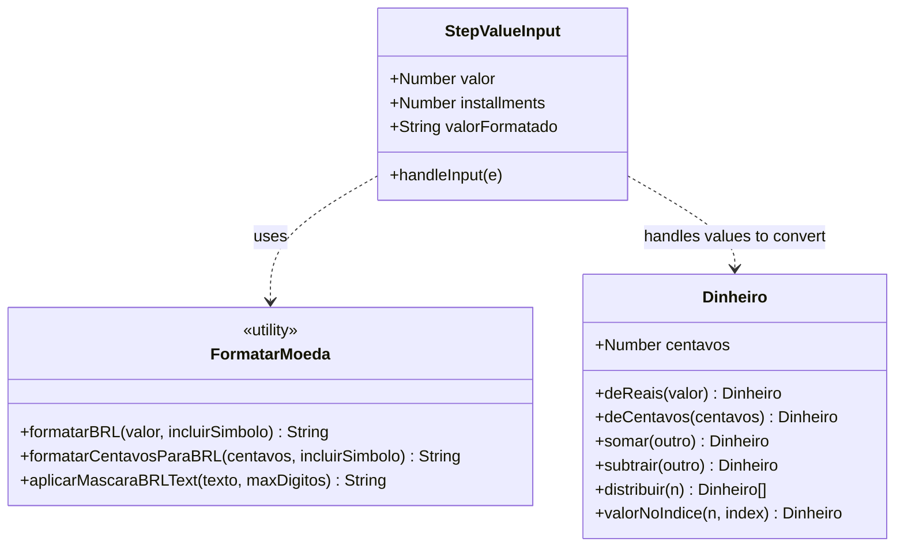

# SPDD Refactor: Utilitário de Formatação de Moeda e Máscara BRL no Wizard

## Requirements
- Padronizar toda a formatação de moeda para o padrão brasileiro de Real (BRL) com separadores de milhares e decimais (ex: `R$ 1.250,00`).
- Substituir inlining do padrão `.toFixed(2).replace('.', ',')` por um utilitário centralizado baseado na API nativa `Intl.NumberFormat('pt-BR')`.
- Implementar uma máscara de digitação de moeda reativa em tempo real na etapa de Valor Total do Wizard (`StepValueInput.vue`) com limite máximo seguro de R$ 99.999.999,99 para evitar erros de interpretação e estouro de inteiros seguros no JavaScript.

## Entities

## Approach
1. **Centralização das Formatações em Util**:
   - Desenvolver o utilitário `src/shared/utils/formatarMoeda.ts` exportando `formatarBRL` e `formatarCentavosParaBRL` com suporte à omissão do símbolo monetário `R$` por meio de parâmetro booleano.
   - Fornecer `aplicarMascaraBRLText(texto: string, maxDigitos?: number): string` para encapsular a lógica de máscara numérica que divide por 100 e formata como `pt-BR`.
2. **Máscara Reativa de Campo de Texto em StepValueInput**:
   - Modificar `<input type="number">` em `StepValueInput.vue` para `<input type="text" inputmode="numeric">` para permitir a máscara textual reativa em tempo real.
   - Escutar o evento `@input` para formatar a string de exibição do input com `aplicarMascaraBRLText` e emitir de volta o valor numérico puro de Reais atualizado via v-model `update:valor` correspondente.
   - Enforcar o teto de R$ 99.999.999,99 limitando a digitação no input a no máximo 10 dígitos na lógica da máscara.
3. **Migração Sistêmica do Frontend**:
   - Mapear todas as ocorrências de `.toFixed(2).replace('.', ',')` nas views e bottom sheets e substituí-las pelas chamadas do utilitário `formatarBRL` ou `formatarCentavosParaBRL` importado.

## Structure

### Inheritance & Types
- `formatarMoeda.ts` define funções puras utilitárias para o escopo global do frontend.

### Dependencies
1. `StepValueInput.vue` depende de `formatarMoeda.ts` para máscara e exibição de parcelamento.
2. Componentes de exibição do Dashboard (`DetalhamentoMembroCard.vue`, `ItemExtratoCard.vue`, `ActivityFeed.vue`, etc.) passam a depender de `formatarMoeda.ts` no lugar de inlining ou de formatações locais redundantes.

### Layered Architecture
- **Utility Layer**: `formatarMoeda.ts` fornece manipulações estritas de strings e internacionalização.
- **UI Presentation Layer**: Componentes do Vue consomem essas funções puras na interpolação do template e manipuladores de evento de input.

## Operations

### Create Utility File - `formatarMoeda.ts`
1. **Path**: [formatarMoeda.ts](file:///d:/projetos/financeiro-divi/src/shared/utils/formatarMoeda.ts)
2. **Logic**:
   - `formatarBRL(valor: number, incluirSimbolo: boolean = true): string`:
     - Retornar o valor formatado via `Intl.NumberFormat('pt-BR')` configurado com fração mínima e máxima 2.
     - Se `incluirSimbolo` for `true`, utilizar `style: 'currency', currency: 'BRL'`.
     - Caso contrário, retornar a formatação padrão decimal.
   - `formatarCentavosParaBRL(centavos: number | bigint, incluirSimbolo: boolean = true): string`:
     - Chamar `formatarBRL(Number(centavos) / 100, incluirSimbolo)`.
   - `aplicarMascaraBRLText(texto: string, maxDigitos: number = 10): string`:
     - Remover todos os caracteres não numéricos com `texto.replace(/\D/g, '')`.
     - Retornar string vazia se o resultado for vazio.
     - Truncar para `maxDigitos` se o comprimento passar do limite.
     - Dividir por 100 e formatar sem o símbolo com `formatarBRL(val, false)`.

### Update Component - `StepValueInput.vue`
1. **Path**: [StepValueInput.vue](file:///d:/projetos/financeiro-divi/src/views/components/wizard/StepValueInput.vue)
2. **Logic**:
   - Importar `formatarBRL` e `aplicarMascaraBRLText` de `../../../shared/utils/formatarMoeda`.
   - Criar uma propriedade reativa `const valorFormatado = ref('')`.
   - Inicializar `valorFormatado` no montante se `props.valor > 0` formatado, do contrário vazio.
   - Atualizar a função `infoParcelamento` para usar `formatarBRL(parcela)`.
   - Implementar `const handleInput = (e: Event)` que:
     - Extrai o `target.value`, aplica `aplicarMascaraBRLText`, atualiza `valorFormatado.value`.
     - Se retornar vazio, emite `update:valor` com `0`.
     - Do contrário, remove os pontos, troca a vírgula por ponto, faz o parse para float e emite `update:valor` com o float em reais resultante.
   - Atualizar o template HTML:
     - Mudar o `<input type="number">` para `<input type="text" inputmode="numeric">`.
     - Substituir `v-model.number="internalValor"` por `:value="valorFormatado"` e `@input="handleInput"`.
     - Atualizar o placeholder para `"0,00"`.

### Update Component - `MembroFormBottomSheet.vue`
1. **Path**: [MembroFormBottomSheet.vue](file:///d:/projetos/financeiro-divi/src/views/components/ledger/membros/MembroFormBottomSheet.vue)
2. **Logic**:
   - Importar `aplicarMascaraBRLText` de `../../../../shared/utils/formatarMoeda`.
   - Atualizar `handleRendaInput` para simplesmente fazer:
     `novaRendaText.value = aplicarMascaraBRLText(target.value)`

### Update Component - `PerfilUsuarioTab.vue`
1. **Path**: [PerfilUsuarioTab.vue](file:///d:/projetos/financeiro-divi/src/views/components/settings/PerfilUsuarioTab.vue)
2. **Logic**:
   - Importar `aplicarMascaraBRLText` e `formatarCentavosParaBRL` de `../../../shared/utils/formatarMoeda`.
   - Atualizar `handleRendaInput` para usar `aplicarMascaraBRLText(target.value)`.
   - Atualizar exibições de renda para usar `formatarCentavosParaBRL`.

### Update Component - `GestaoAcessoTab.vue`
1. **Path**: [GestaoAcessoTab.vue](file:///d:/projetos/financeiro-divi/src/views/components/settings/GestaoAcessoTab.vue)
2. **Logic**:
   - Importar `aplicarMascaraBRLText` e `formatarCentavosParaBRL` de `../../../shared/utils/formatarMoeda`.
   - Atualizar `handleRendaInput` para usar `aplicarMascaraBRLText(target.value)`.
   - Atualizar exibições de renda para usar `formatarCentavosParaBRL`.

### Update Views and Components for Currency Formatter Migration
1. **Paths**:
   - [StepSplitSelector.vue](file:///d:/projetos/financeiro-divi/src/views/components/wizard/StepSplitSelector.vue)
   - [ActivityFeed.vue](file:///d:/projetos/financeiro-divi/src/views/components/ledger/ActivityFeed.vue)
   - [BottomSheetAjustarGasto.vue](file:///d:/projetos/financeiro-divi/src/views/components/ledger/BottomSheetAjustarGasto.vue)
   - [BottomSheetConfirmacaoEstorno.vue](file:///d:/projetos/financeiro-divi/src/views/components/ledger/BottomSheetConfirmacaoEstorno.vue)
   - [ContasFixasCard.vue](file:///d:/projetos/financeiro-divi/src/views/components/ledger/ContasFixasCard.vue)
   - [PopupLancarContaFixa.vue](file:///d:/projetos/financeiro-divi/src/views/components/ledger/PopupLancarContaFixa.vue)
   - [BottomSheetNovoPeriodo.vue](file:///d:/projetos/financeiro-divi/src/views/components/ledger/dashboard/BottomSheetNovoPeriodo.vue)
   - [NettingPanel.vue](file:///d:/projetos/financeiro-divi/src/views/components/ledger/dashboard/NettingPanel.vue)
   - [UnifiedBalancePanel.vue](file:///d:/projetos/financeiro-divi/src/views/components/ledger/dashboard/UnifiedBalancePanel.vue)
   - [DetalhamentoMembroCard.vue](file:///d:/projetos/financeiro-divi/src/views/components/ledger/dashboard/DetalhamentoMembroCard.vue)
   - [ItemExtratoCard.vue](file:///d:/projetos/financeiro-divi/src/views/components/ledger/dashboard/ItemExtratoCard.vue)
2. **Logic**:
   - Substituir as expressões inlined `.toFixed(2).replace('.', ',')` e `toLocaleString('pt-BR')` locais pelas funções de formatação importadas (`formatarBRL` ou `formatarCentavosParaBRL`).

## Norms
1. **Centralização de Util**: Lógicas de formatação de internacionalização nunca devem ser inlinadas nas views. Devem usar `formatarMoeda.ts`.
2. **Formatação de Moeda Nativa**: Usar `Intl.NumberFormat` para obter formatação localizada robusta em vez de regex replacements manuais que omitam milhares.
3. **Mapeamento de Entrada Reativa**: Manter os inputs textuais mascarados com tratamento de eventos `@input` em sincronia com o estado original de float reativo no componente pai.

## Safeguards
1. **Limite de Segurança Numérica**: A máscara de valor de lançamento deve impor no máximo 10 dígitos (teto de R$ 99.999.999,99), evitando overflow nos centavos em JS (`Number.MAX_SAFE_INTEGER`).
2. **Tratamento de Strings Vazias**: Se o campo for totalmente esvaziado, o estado numérico interno do pai deve redefinir para `0`, mantendo o botão "Confirmar" ou "Avançar" desabilitado se aplicável.
3. **Preservação de Layout**: O alinhamento visual dos campos com o prefixo fixo `R$` deve ser preservado.
