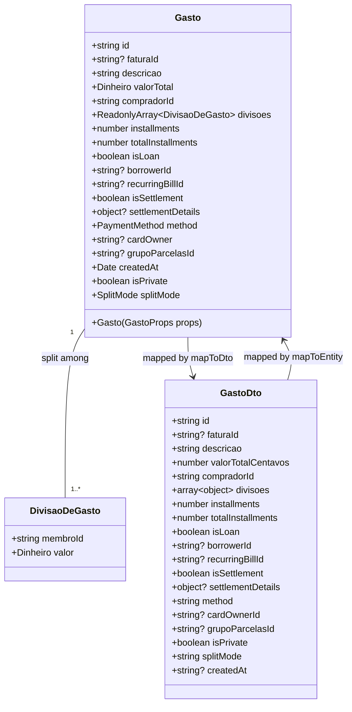

# Rastreamento de Gastos à Vista e Empréstimos no Frontend

## Requirements
- Habilitar o rastreamento temporal correto de gastos à vista (sem fatura de cartão de crédito associada, como Pix e Dinheiro) e de empréstimos pessoais no frontend.
- Garantir que a data real de criação (`createdAt`) gravada no banco de dados seja mantida e consumida no frontend após a sincronização, assegurando a exibição e os cálculos de saldo no período correto de lançamento (mês/ano).

## Entities

## Approach
1. **Preservação de Dados Temporais**:
   - Ajustar o fluxo de transporte HTTP de dados do domínio financeiro mapeando o campo de data de criação (`createdAt`) retornado pelo backend NestJS no repositório HTTP do frontend.
   - O frontend continuará determinando a data local como `new Date()` no construtor de `Gasto` caso `createdAt` não seja fornecido (ex: novos gastos locais ainda não salvos). Porém, gastos recuperados do banco herdarão o valor persistido.
2. **Integração e Desserialização**:
   - Incluir a propriedade `createdAt` na interface local do DTO (`GastoDto`) em `HttpGastoRepository.ts` e realizar o parse da string de data ISO UTC recebida do backend para a propriedade correspondente no construtor de `Gasto`.
3. **Serialização e Envio**:
   - Mapear `createdAt` de volta no método `mapToDto` para que a data seja serializada no formato ISO (ISO String) em requisições de salvamento em lote ou edições, caso aplicável.

## Structure
### Layered Architecture
1. **Domain Layer (Entities)**:
   - `Gasto.ts`: Mantém o modelo de domínio com a propriedade `createdAt: Date` e suporte a inicialização via string de data ISO.
2. **Repository Layer (HTTP API Integration)**:
   - `HttpGastoRepository.ts`: Contém os métodos `mapToEntity` e `mapToDto` responsáveis por mediar o tráfego de dados entre a entidade de domínio e o DTO exposto pela API HTTP.
3. **Service Layer (Domain Logic & Operations)**:
   - `LancamentoService.ts` / `GastoService.ts`: Processa e orquestra a persistência e alteração de gastos, dependendo do `HttpGastoRepository` no frontend.

## Operations

### Update Interface - GastoDto (HttpGastoRepository.ts)
1. Responsibility: Representar a estrutura exata do DTO de gasto consumida e enviada para o backend.
2. Changes:
   - Adicionar o atributo opcional `createdAt?: string` na interface `GastoDto` em [HttpGastoRepository.ts](file:///d:/projetos/financeiro-divi/src/models/repositories/http/HttpGastoRepository.ts).

### Update Class Method - mapToEntity (HttpGastoRepository.ts)
1. Responsibility: Desserializar o DTO de dados do backend para a entidade de domínio `Gasto`.
2. Changes:
   - Mapear o atributo `createdAt: item.createdAt` na instanciação da classe `Gasto` dentro de `mapToEntity` em [HttpGastoRepository.ts](file:///d:/projetos/financeiro-divi/src/models/repositories/http/HttpGastoRepository.ts).

### Update Class Method - mapToDto (HttpGastoRepository.ts)
1. Responsibility: Serializar a entidade de domínio `Gasto` em um DTO de dados compatível com a API REST do backend.
2. Changes:
   - Adicionar o campo `createdAt: gasto.createdAt ? gasto.createdAt.toISOString() : undefined` no objeto de retorno do método `mapToDto` em [HttpGastoRepository.ts](file:///d:/projetos/financeiro-divi/src/models/repositories/http/HttpGastoRepository.ts).

### Verify Repository Tests - HttpGastoRepository.test.ts
1. Responsibility: Validar a persistência, recuperação e correto mapeamento de gastos, incluindo o campo de data de criação.
2. Logic:
   - Verificar se [HttpGastoRepository.test.ts](file:///d:/projetos/financeiro-divi/src/models/repositories/http/HttpGastoRepository.test.ts) roda com sucesso. Se necessário, ajustar as fixtures de teste para conter `createdAt` nas simulações e assegurar que as asserções de mapeamento passem.

## Norms
1. **TypeScript Typing Standards**: O DTO e as entidades devem conter tipagens explícitas. Chaves nulas e opcionais devem ser tratadas adequadamente no mapeamento de entrada.
2. **Date Handling Standards**: Sempre parsear strings de datas vindas da API com `new Date(item.createdAt)` e serializar usando `.toISOString()` para garantir padronização ISO UTC 8601 no tráfego de rede.

## Safeguards
1. **Fallbacks no Mapeamento**: O construtor de `Gasto` deve continuar tolerante a objetos de configuração sem data (usando `new Date()`) para evitar quebras em fluxos de criação offline ou locais que ainda não foram persistidos.
2. **Retrocompatibilidade de Dados**: O campo `createdAt` na interface `GastoDto` deve ser opcional (`createdAt?`) para lidar com possíveis retornos da API que não possuam a propriedade, evitando quebras inesperadas no parser.
