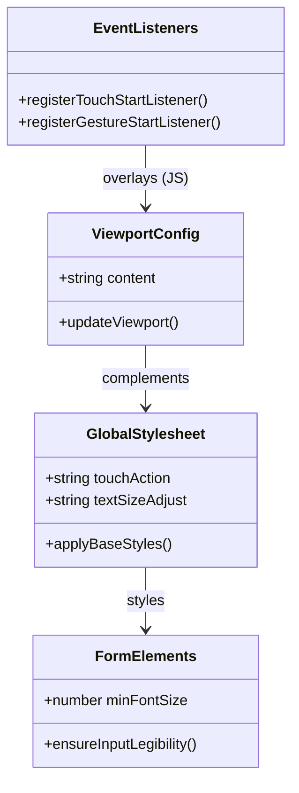

# Desativar Zoom Mobile para Experiência PWA Nativa

## Requirements
- Desativar a capacidade de zoom (tanto pinch-to-zoom quanto double-tap zoom) no PWA do projeto Divi, garantindo uma interface estável e imersiva de aplicativo nativo no mobile.
- Evitar o zoom automático disparado por navegadores móveis (especialmente Safari no iOS) ao focar em elementos de formulário (inputs, textareas, selects).
- Manter a navegação por toque e a rolagem da página fluidas e totalmente funcionais.

## Entities


## Approach
1. **Configuração de Viewport (HTML)**:
   - Adicionar as propriedades `maximum-scale=1.0` e `user-scalable=no` à tag meta viewport no HTML base para desativar o zoom na maioria dos navegadores móveis (Android/Chrome).
2. **Estilização de Gestos e Fontes (CSS)**:
   - Aplicar `touch-action: pan-x pan-y` no `body` e `html` do CSS global para evitar o double-tap zoom indesejado, permitindo scroll livre em ambos os eixos.
   - Definir `text-size-adjust: none` e `-webkit-text-size-adjust: none` para impedir alterações automáticas no tamanho do texto ao mudar a orientação do dispositivo.
   - Definir tamanho mínimo de fonte de 16px para todos os elementos interativos de entrada (inputs, textareas, selects) no CSS global para evitar que navegadores móveis (iOS Safari) deem zoom de foco automático ao focar nestes campos.
3. **Bloqueio Programático de Gestos (JS/TS)**:
   - Adicionar um listener de eventos global de `touchstart` que verifica a contagem de toques. Se houver mais de um toque na tela (`event.touches.length > 1`), bloquear a propagação do evento usando `event.preventDefault()` (usando `{ passive: false }` para permitir o bloqueio).
   - Adicionar listener para o evento `gesturestart` (específico do Safari iOS) e chamar `event.preventDefault()` para travar as tentativas do Safari de ampliar a página com pinça.

## Structure
### Component Collaboration
1. **Entrypoint Markup**:
   - `index.html`: Hospeda a tag meta viewport inicial.
2. **Global CSS**:
   - `src/main.css`: Contém as regras base CSS (`@layer base`) para `body`, `html` e campos de formulário para controlar o `touch-action`, `text-size-adjust` e tamanho mínimo de fonte.
3. **Application Bootstrap**:
   - `src/main.ts`: Configura os listeners de intercepção de gestos na inicialização global do cliente antes de montar a aplicação Vue.

## Operations

### Update HTML - index.html
1. Responsibility: Configurar a viewport do PWA para desabilitar escalamento de usuário por padrão.
2. Changes:
   - Modificar a tag `<meta name="viewport" ... />` em [index.html](file:///d:/projetos/financeiro-divi/index.html) para:
     ```html
     <meta name="viewport" content="width=device-width, initial-scale=1.0, maximum-scale=1.0, user-scalable=no" />
     ```

### Update CSS - src/main.css
1. Responsibility: Aplicar estilos que controlam interações de toque e comportamento de tamanho de fonte de inputs.
2. Changes:
   - Modificar a declaração do `body` dentro de `@layer base` em [main.css](file:///d:/projetos/financeiro-divi/src/main.css) para incluir as regras de escala e manipulação de toque:
     ```css
     body {
       @apply bg-canvas text-graphite font-sans antialiased;
       padding-right: var(--scrollbar-compensate);
       -webkit-tap-highlight-color: transparent;
       position: relative;
       touch-action: pan-x pan-y;
       text-size-adjust: none;
       -webkit-text-size-adjust: none;
     }
     ```
   - Adicionar também no topo da `@layer base` a aplicação do estilo no elemento `html` (caso não esteja lá) ou estender para ambos `html, body`.
   - Adicionar uma regra de estilo geral para inputs dentro de `@layer base` em [main.css](file:///d:/projetos/financeiro-divi/src/main.css) para assegurar que inputs, selects e textareas tenham tamanho mínimo de fonte de `16px` para evitar o zoom de foco do Safari:
     ```css
     input, select, textarea {
       font-size: 16px !important;
     }
     ```
     *Nota*: Isso é crucial para que, ao clicar em inputs de formulários, o iOS Safari não dê zoom de foco automático.

### Update Application Bootstrap - src/main.ts
1. Responsibility: Registrar interceptores JS globais de múltiplos toques e gestos nativos para evitar pinch-to-zoom em navegadores iOS.
2. Logic:
   - Adicionar no topo do arquivo [main.ts](file:///d:/projetos/financeiro-divi/src/main.ts), antes de `createApp(App).mount('#app')`, o seguinte bloco preventivo de eventos:
     ```typescript
     // Impedir pinch-to-zoom no iOS Safari (que ignora a meta tag viewport)
     document.addEventListener('touchstart', (event) => {
       if (event.touches.length > 1) {
         event.preventDefault()
       }
     }, { passive: false })

     document.addEventListener('gesturestart', (event) => {
       event.preventDefault()
     })
     ```

## Norms
1. **Mobile UX Standards**: Aplicativos que rodam como PWAs devem desativar comportamento de zoom nativo do navegador para evitar desalinhamento da interface móvel.
2. **Preventive Gesture Handling**: Os listeners preventivos devem ser aplicados com `{ passive: false }` no document global para garantir a eficácia do método `preventDefault()`.
3. **Form Scale Norms**: Campos de texto e de seleção em aplicativos mobile devem usar no mínimo `16px` de tamanho de fonte, conforme convenções do iOS para impedir zoom automático de foco.

## Safeguards
1. **Passive Event Fallback**: Sempre declarar `{ passive: false }` ao ouvir `touchstart` para mitigar o aviso padrão do Chrome sobre a anulação de listeners passivos globais.
2. **Preservação de Toque Simples**: O listener de `touchstart` deve filtrar estritamente por toques com tamanho maior que 1 dedo (`event.touches.length > 1`), garantindo que toques e rolagens convencionais (com 1 dedo) não sejam impedidos ou sofram latência.
3. **Scroll Sem Travamento**: O uso de `touch-action: pan-x pan-y` no body é preferível a `touch-action: none` pois preserva a capacidade do sistema operacional de fazer rolagem de tela nativa.
