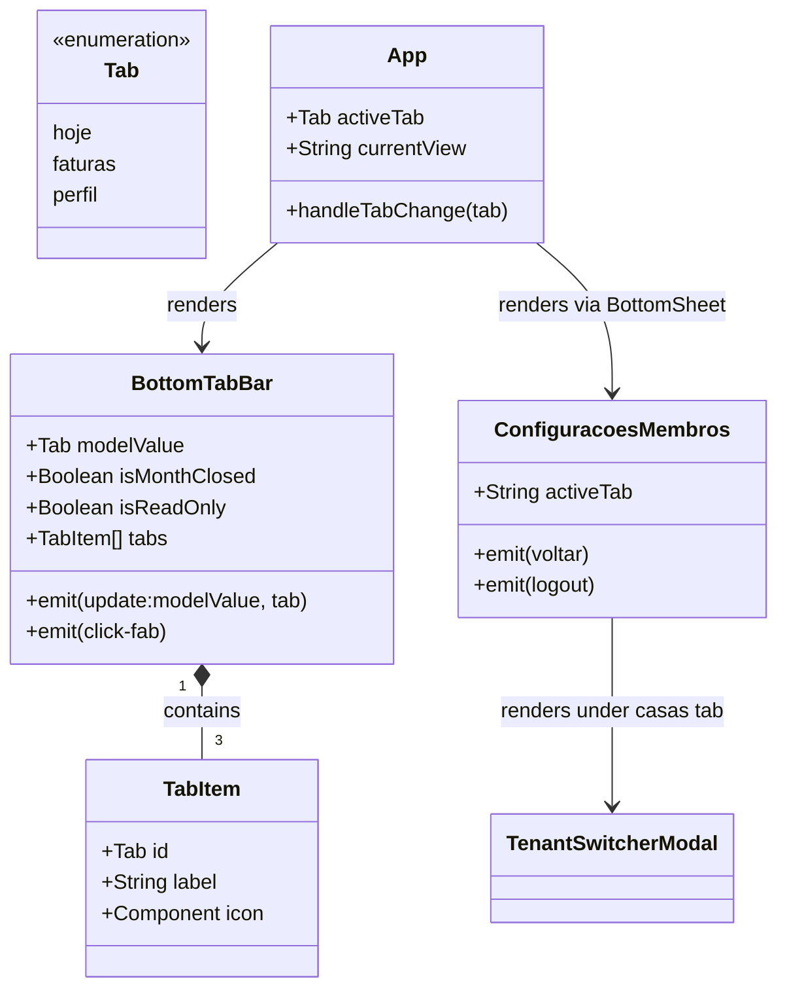

# Reordenar e Simplificar Abas de Navegação (Casa e Ajustes)

## Requirements
- Reorganizar a barra de navegação inferior (BottomTabBar) para ter apenas 3 abas principais: "Casa" (associada ao ID 'hoje'), "Acertos" (ID 'faturas') e "Ajustes" (ID 'perfil').
- Renomear a aba principal do dashboard (ID 'hoje') de "Início" para "Casa", alterando seu ícone para representação de moradias/casas.
- Mover a funcionalidade de alternar e gerenciar casas (controle de inquilinos do tenant via TenantSwitcherModal) para dentro da tela de Ajustes (ConfiguracoesMembros.vue) sob uma nova aba chamada "Casas".
- Remover a aba direta de alternar casas (ID 'casas') da barra de navegação inferior e simplificar o gerenciamento de estados no App.vue.
- Renomear o botão da aba do administrador "Casa" na tela de Ajustes (ConfiguracoesMembros.vue) para "Permissões" para torná-lo mais intuitivo.

## Entities

## Approach
1. [Simplificação e Reordenação da Barra Inferior]:
   - Redefinir as abas no BottomTabBar.vue para conter apenas 3 itens: 'hoje' (label "Casa", usando o ícone de casa/prédio), 'faturas' (label "Acertos", ícone de moedas) e 'perfil' (label "Ajustes", com o avatar/ícone de usuário).
   - Ajustar o layout do BottomTabBar.vue para dividir os botões de forma simétrica: 1 botão à esquerda do FAB central (índices de 0 a 1) e 2 botões à direita (índices de 1 a 3).
   - Ajustar a tipagem Tab para aceitar apenas os valores correspondentes às 3 abas ativas.

2. [Centralização de Configurações e Gerenciamento de Casas]:
   - Adicionar uma nova aba chamada "Casas" no menu flutuante de navegação da tela de Ajustes (ConfiguracoesMembros.vue).
   - Renderizar o componente TenantSwitcherModal dentro da nova aba "Casas" na tela de Ajustes.
   - Quando uma nova casa for selecionada no TenantSwitcherModal, emitir o fechamento das configurações para retornar ao dashboard do novo espaço ativo de forma limpa.

3. [Melhoria de Usabilidade nas Configurações]:
   - Alterar o texto de exibição do botão da aba de controle administrativo no menu de configurações de "Casa" para "Permissões", mantendo a aba mapeada internamente no ID 'casa'.

4. [Ajustes de Fluxo no App Root]:
   - Remover a aba 'casas' e a renderização do BottomSheet de tenantSwitcher isolado no App.vue.
   - Simplificar o método de alteração de aba no App.vue para remover tratativas da aba excluída.

## Structure

### Inheritance Relationships
- Não se aplica (arquitetura baseada em composição de componentes Vue).

### Dependencies
1. App.vue renderiza BottomTabBar.vue e a tela de Ajustes (ConfiguracoesMembros.vue).
2. ConfiguracoesMembros.vue importa e renderiza o painel de alternar casas (TenantSwitcherModal.vue).
3. BottomTabBar.vue importa os ícones de Building2 (ou similar), Coins, User e Plus da biblioteca lucide-vue-next.

### Layered Architecture
1. View Layer (Componentes Vue):
   - App.vue: Gerenciador de navegação e fluxos principais.
   - ConfiguracoesMembros.vue: Painel centralizado de preferências do usuário, acessos, controle de permissões e seleção de casa.
   - BottomTabBar.vue: Componente de navegação inferior contendo os 3 atalhos.

## Operations

### Update Component - BottomTabBar.vue
1. Responsabilidade: Renderizar as 3 abas na barra inferior e gerenciar a emissão de cliques de aba.
2. Atributos / Estado Reativo:
   - tabs: Array com 3 itens do tipo TabItem.
     - Elemento 1: ID 'hoje', rótulo "Casa", ícone Building2.
     - Elemento 2: ID 'faturas', rótulo "Acertos", ícone Coins.
     - Elemento 3: ID 'perfil', rótulo "Ajustes", ícone User.
3. Lógica de Renderização:
   - Dividir a exibição das abas de forma que a primeira aba ('hoje') seja renderizada no container esquerdo (utilizando tabs.slice(0, 1)).
   - As duas abas seguintes ('faturas' e 'perfil') sejam renderizadas no container direito (utilizando tabs.slice(1, 3)).
4. Tipagem:
   - Definir o tipo exportado Tab como a união literal dos IDs 'hoje', 'faturas' e 'perfil'.

### Update Component - App.vue
1. Responsabilidade: Coordenar a tela principal de dashboard e fechar menus quando novos espaços forem selecionados.
2. Lógica de Alteração:
   - Remover do template a renderização do BottomSheet com ID/view 'tenantSwitcher' e o componente TenantSwitcherModal que ficava nele.
   - Simplificar a função handleTabChange para remover o bloco de verificação da aba 'casas', mantendo apenas a verificação para 'perfil' (abre a view de settings) e updating activeTab para as demais abas.

### Update Component - ConfiguracoesMembros.vue
1. Responsabilidade: Centralizar as abas de perfil, acessos, permissões da casa e alternador de casas.
2. Atributos / Estado Reativo:
   - activeTab: Estado que gerencia a aba ativa na tela de configurações, agora aceitando os valores 'perfil', 'acesso', 'casa' e 'casas'.
3. Lógica de Renderização:
   - Incluir um novo botão na barra flutuante de navegação para a aba "Casas".
   - Modificar o botão correspondente à aba 'casa' (visível apenas para administradores) para que seu texto de exibição seja "Permissões".
   - No bloco de renderização do conteúdo das abas, importar e renderizar o componente TenantSwitcherModal sob a aba 'casas'.
   - Associar o evento 'casa-selecionada' do TenantSwitcherModal para disparar a emissão de 'voltar' (fechar a gaveta de configurações).

## Norms
1. Padrões de Componentes Vue: Usar Composition API com script setup e TypeScript.
2. Estilização: Usar classes do Tailwind CSS 4 compatíveis com a estrutura do projeto.
3. Tipagem TypeScript: Garantir que a união literal do tipo Tab não inclua valores inexistentes.

## Safeguards
1. Restrições Funcionais: A barra de navegação inferior deve conter exatamente 3 abas (uma à esquerda e duas à direita do FAB central).
2. Restrições de Layout: O rótulo do primeiro botão da barra inferior deve ser "Casa", e o rótulo do botão de configurações administrativas deve ser "Permissões".
3. Restrições de Integração: A seleção de uma nova moradia através do menu de configurações deve fechar imediatamente a gaveta de configurações e atualizar o dashboard para o espaço ativo.
4. Restrições Técnicas: Não deve haver quebras ou erros de compilação de TypeScript nos arquivos importados após a remoção do tipo literal correspondente à aba excluída.
