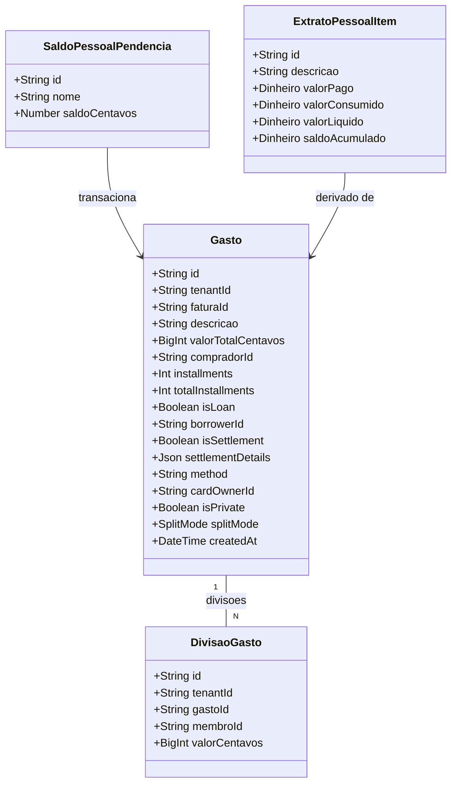

# Gasto Privado e Movimentação Pessoal com Externos

## Requirements
- **Isolamento de Movimentações Pessoais**: Alterar a visibilidade de transações com `isPrivate = true` para que apenas o próprio criador tenha acesso no backend e no frontend.
- **Desvinculação do Balanço Geral**: Movimentações pessoais e transações com terceiros não devem influenciar o saldo unificado, netting ou faturas da moradia compartilhada para nenhum membro.
- **Nova Área de Finanças Pessoais**: Criar a rota e tela "Pessoal" no Bottom Bar para visualização simplificada de movimentações, controle de contas a pagar/receber com externos, e visualização de extrato pessoal. Movimentações pessoais não aparecem no feed de atividades da casa, e vice-versa. Não há necessidade de ícone de "cadeado" pois os feeds são estritamente separados.
- **Movimentações 1-para-1 Sem Divisão**: O fluxo pessoal é estritamente direto e sem divisão (split). Uma transação é sempre integralmente entre o usuário logado e outra parte (seja uma entidade externa identificada pelo padrão `externo:<Nome>` ou um próprio membro interno da casa).
- **Acertos Rápidos Pessoais**: Permitir liquidar saldos pendentes com terceiros (externos ou membros internos) com um clique, criando uma transação privada de acerto no sistema.
- **Correção de Reatividade no Acerto**: Após confirmar um acerto, o painel deve atualizar a UI corretamente, atualizando a store/socket para remover o saldo liquidado.
- **Simplificação Extrema no Wizard**: Refatorar o `NovoLancamentoWizard` separando o comportamento da Casa do comportamento Pessoal. No Pessoal, eliminar conceitos abstratos e divisões. O usuário escolhe apenas entre opções diretas (ex: "A Receber / Alguém me deve", "A Pagar / Eu devo"). Não há etapas de "Quem pagou?" ou "Com quem dividir?". O foco é resolver o problema real de controle 1-para-1.
- **Linguagem Humana na Casa Compartilhada (UX)**: Assim como no Pessoal, a UX do fluxo da Casa Compartilhada deve evitar jargões contábeis ("Gasto", "Empréstimo"). Usar termos focados em intenção: "Despesa Compartilhada" (conta/compra para dividir) e "Repasse Direto" (dinheiro transferido apenas entre moradores).

## Entities

## Approach
1. **Segurança no Backend**:
   - Ajustar o [FinanceiroController](file:///d:/projetos/financeiro-divi/backend/src/financeiro/financeiro.controller.ts) para filtrar os gastos que são privados. Se `isPrivate === true`, o gasto só é retornado se o compradorId ou cardOwnerId for equivalente ao id do `MembroCasa` correspondente ao usuário autenticado (`req.user.userId`).
2. **Separação de Saldos da Moradia**:
   - Ajustar a lógica de cálculo de saldos em [NettingService.ts](file:///d:/projetos/financeiro-divi/src/models/services/NettingService.ts) e [ExtratoService.ts](file:///d:/projetos/financeiro-divi/src/models/services/ExtratoService.ts) para ignorar completamente gastos onde `isPrivate === true`.
3. **Módulo de Finanças Pessoais (Frontend)**:
   - Criar o serviço [ExtratoPessoalService.ts](file:///d:/projetos/financeiro-divi/src/models/services/ExtratoPessoalService.ts) para processar as transações privadas e calcular:
     - O extrato de lançamentos pessoais.
     - Os saldos de Contas a Pagar e A Receber com cada entidade (IDs `externo:<Nome>` ou IDs de membros da casa).
     - A lógica baseia-se puramente em quem deve a quem (1-para-1), sem divisão, focado na área privada.
4. **Interface e Navegação**:
   - Adicionar a aba `'pessoal'` no [BottomTabBar.vue](file:///d:/projetos/financeiro-divi/src/views/components/ui/BottomTabBar.vue) usando o ícone `Wallet` do Lucide.
   - Adicionar o novo painel no [DashboardSaldos.vue](file:///d:/projetos/financeiro-divi/src/views/screens/DashboardSaldos.vue) focado num balanço facilitado: Total A Receber, Total A Pagar, listagem de entidades (externas e membros) com seus saldos, e feed simplificado.
5. **Integração e Funil no Wizard de Lançamentos**:
   - Refatorar o [NovoLancamentoWizard.vue](file:///d:/projetos/financeiro-divi/src/views/screens/NovoLancamentoWizard.vue) adotando um fluxo direto e sem abstrações para o modo Pessoal:
     - Escopo Inicial: Escolha clara entre "Casa" e "Pessoal". (Se aberto a partir da aba Pessoal, inicia `isPrivate` como `true` e pula).
     - Tipo da Movimentação (Casa): Mantém como está ("Gasto/Compra" ou "Empréstimo/Dívida").
     - Tipo da Movimentação (Pessoal): Apenas "A Receber" (alguém me deve) ou "A Pagar" (eu devo).
     - Dinamismo (Pessoal): Sem etapas de "Com quem dividir". A transação é apenas selecionar a outra parte (Externo ou Membro) e o Valor. O sistema grava como um empréstimo/dívida (`isLoan=true`, `isPrivate=true`) direto.
6. **Correção do Acerto (Bugfix)**:
   - Garantir que, ao registrar um acerto privado, a interface (Painel Pessoal e Saldos) ouça o evento ou execute refetch para remover da listagem o saldo recém-liquidado, corrigindo o problema de dados obsoletos.

## Structure

### Dependencies
1. [PersonalBalancePanel.vue](file:///d:/projetos/financeiro-divi/src/views/components/ledger/dashboard/PersonalBalancePanel.vue) chama [ExtratoPessoalService.ts](file:///d:/projetos/financeiro-divi/src/models/services/ExtratoPessoalService.ts) para obter dados consolidados.
2. [DashboardSaldos.vue](file:///d:/projetos/financeiro-divi/src/views/screens/DashboardSaldos.vue) injeta a aba `pessoal` e renderiza [PersonalBalancePanel.vue](file:///d:/projetos/financeiro-divi/src/views/components/ledger/dashboard/PersonalBalancePanel.vue).
3. [NovoLancamentoWizard.vue](file:///d:/projetos/financeiro-divi/src/views/screens/NovoLancamentoWizard.vue) gerencia o novo funil importando [StepScopeSelection.vue](file:///d:/projetos/financeiro-divi/src/views/components/wizard/StepScopeSelection.vue) e [StepFlowSelection.vue](file:///d:/projetos/financeiro-divi/src/views/components/wizard/StepFlowSelection.vue). Inclui botões de "+ Pessoa Externa" em [StepSplitSelector.vue](file:///d:/projetos/financeiro-divi/src/views/components/wizard/StepSplitSelector.vue) e [StepMemberSelection.vue](file:///d:/projetos/financeiro-divi/src/views/components/wizard/StepMemberSelection.vue) para manipular contatos virtuais.

### Mapeamento de Arquivos
- **[MODIFY]** [financeiro.controller.ts](file:///d:/projetos/financeiro-divi/backend/src/financeiro/financeiro.controller.ts): Filtrar gastos retornados com base em `isPrivate` e no usuário logado.
- **[MODIFY]** [NettingService.ts](file:///d:/projetos/financeiro-divi/src/models/services/NettingService.ts): Filtrar despesas privadas para não influenciar os saldos gerais.
- **[MODIFY]** [ExtratoService.ts](file:///d:/projetos/financeiro-divi/src/models/services/ExtratoService.ts): Ignorar despesas privadas nos cálculos do extrato da casa.
- **[MODIFY]** [BottomTabBar.vue](file:///d:/projetos/financeiro-divi/src/views/components/ui/BottomTabBar.vue): Inserir a rota `'pessoal'`.
- **[MODIFY]** [App.vue](file:///d:/projetos/financeiro-divi/src/App.vue): Tratar navegação da nova aba.
- **[MODIFY]** [DashboardSaldos.vue](file:///d:/projetos/financeiro-divi/src/views/screens/DashboardSaldos.vue): Adicionar tela/seção para a nova aba, passando `vm.gastosPrivadosFiltrados` para o painel pessoal para manter o saldo filtrado pelo período.
- **[MODIFY]** [useDashboardViewModel.ts](file:///d:/projetos/financeiro-divi/src/viewmodels/useDashboardViewModel.ts): Criar `gastosPrivadosFiltrados` para garantir que o controle pessoal respeite o mesmo período (mês) de seleção da casa.
- **[MODIFY]** [NovoLancamentoWizard.vue](file:///d:/projetos/financeiro-divi/src/views/screens/NovoLancamentoWizard.vue): Refatorar a entrada do wizard para o modelo de funil (Escopo -> Tipo) e simplificar o fluxo de seleção.
- **[NEW]** [StepScopeSelection.vue](file:///d:/projetos/financeiro-divi/src/views/components/wizard/StepScopeSelection.vue): Componente para seleção de escopo (Casa/Pessoal).
- **[MODIFY]** [StepFlowSelection.vue](file:///d:/projetos/financeiro-divi/src/views/components/wizard/StepFlowSelection.vue): Adaptado apenas para a seleção de tipo (A Pagar / A Receber).
- **[MODIFY]** [StepSplitSelector.vue](file:///d:/projetos/financeiro-divi/src/views/components/wizard/StepSplitSelector.vue): Permitir adicionar pessoa externa na divisão.
- **[MODIFY]** [StepMemberSelection.vue](file:///d:/projetos/financeiro-divi/src/views/components/wizard/StepMemberSelection.vue): Permitir adicionar pessoa externa no empréstimo.
- **[NEW]** [ExtratoPessoalService.ts](file:///d:/projetos/financeiro-divi/src/models/services/ExtratoPessoalService.ts): Serviço para cálculo de extrato e saldos de pendências pessoais (externos e membros internos).
- **[NEW]** [PersonalBalancePanel.vue](file:///d:/projetos/financeiro-divi/src/views/components/ledger/dashboard/PersonalBalancePanel.vue): Painel interativo pessoal com resumo e liquidação. Garantir envio de `DivisaoDeGasto` instanciado para o acerto.

## Operations

### 1. Ajustar Backend (Filtro de Privacidade e Validação de Acertos)
- **Arquivo**: [financeiro.controller.ts](file:///d:/projetos/financeiro-divi/backend/src/financeiro/financeiro.controller.ts)
  - No método `listarGastos`, buscar o membro logado. Filtrar o array de gastos para que, se `isPrivate === true`, o gasto só seja mantido se o membro logado estiver de alguma forma envolvido na transação (seja como comprador `g.compradorId === membro.id`, como proprietário do cartão `g.cardOwnerId === membro.id`, como tomador de empréstimo `g.borrowerId === membro.id`, ou se o id dele estiver presente em alguma das divisões do gasto). Ocultar completamente para outros.
- **Arquivo**: [lancamento.service.ts](file:///d:/projetos/financeiro-divi/backend/src/financeiro/lancamento.service.ts)
  - No método `validarAcertoTx`, permitir que acertos privados (`isPrivate === true`) ocorram independentemente de a outra parte ser externa ou interna. Acertos com externos devem ser obrigatoriamente privados. Acertos entre dois membros internos podem ser públicos (casa) ou privados (área pessoal).
  - Remover a trava que proíbe `g.isPrivate === true` se não houver externo.
  - Ajustar a validação de membros para validar no banco apenas os IDs de membros internos.
- **Arquivo**: [LancamentoService.ts](file:///d:/projetos/financeiro-divi/src/models/services/LancamentoService.ts)
  - No método `lancarGastoOuEmprestimo`, na validação de acertos (`dados.flow === 'settlement'`), flexibilizar a regra de privacidade:
    - Se o acerto envolver um externo, `dados.isPrivate` deve obrigatoriamente ser `true`.
    - Se for entre membros da casa, `dados.isPrivate` pode ser `true` (acerto pessoal) ou `false` (acerto da casa). Remover a trava que impedia `isPrivate === true` para membros internos.
    - Salvar o novo `Gasto` definindo a propriedade `isPrivate: dados.isPrivate || false`.
- **Arquivo**: [NettingService.ts](file:///d:/projetos/financeiro-divi/src/models/services/NettingService.ts)
  - No método `calcularSaldosUnificados`, ignorar gastos onde `g.isPrivate === true`.
- **Arquivo**: [ExtratoService.ts](file:///d:/projetos/financeiro-divi/src/models/services/ExtratoService.ts)
  - No método `obterExtratoMembro` e `obterBreakdownGranular`, pular o processamento se `g.isPrivate === true`.

### 3. Criar Serviço de Extrato Pessoal e Externos
- **Arquivo**: [ExtratoPessoalService.ts](file:///d:/projetos/financeiro-divi/src/models/services/ExtratoPessoalService.ts) [NEW]
- **Métodos**:
  - `obterExtratoPessoal(membroId: string, gastos: Gasto[]): ExtratoPessoalItem[]`:
    - Filtrar gastos onde `g.isPrivate === true`. Calcular o saldo acumulado pessoal.
  - `calcularSaldosPessoais(membroId: string, gastos: Gasto[]): SaldoPessoalPendencia[]`:
    - Filtrar gastos onde `g.isPrivate === true`.
    - Analisar diretações (`isLoan === true` e `isPrivate === true`):
      - Se comprador (credor) for `membroId` e devedor for uma "Parte B" (externa ou outro membro), saldo da Parte B é A Receber (+V).
      - Se comprador (credor) for "Parte B" e devedor for `membroId`, saldo da Parte B é A Pagar (-V).
    - Analisar acertos (`isSettlement === true`):
      - Ajustar os saldos liquidando as pendências conforme o acerto.
    - Agrupar e consolidar o saldo total por ID da outra parte, omitindo quem tem saldo zero.

### 4. Desenvolver Painel de Visualização Pessoal (UI) e Correção de Acertos
- **Arquivo**: [PersonalBalancePanel.vue](file:///d:/projetos/financeiro-divi/src/views/components/ledger/dashboard/PersonalBalancePanel.vue) [NEW]
- **Aparência**: Estilo visual premium "Pixar no papel": warm off-white canvas, cards com inset-depth (`shadow-subtle`), detalhes em Ember e Meadow.
- **Conteúdo e Correção**:
  - Cards de Resumo: Total pessoal do mês, Total a Receber, Total a Pagar.
  - Lista de Pendências Pessoais: Exibir cada pessoa (membro ou externo) com saldo líquido ativo diferente de zero em reais.
  - Botão "Liquidar": Ao clicar, cria o acerto (`isSettlement = true`, `isPrivate = true`). Após o sucesso da chamada da API, deve forçar a atualização/refetch da dashboard.
  - Feed de Atividades: Listar os gastos privados.

### 5. Atualizar Navegação do App
- **Arquivo**: [BottomTabBar.vue](file:///d:/projetos/financeiro-divi/src/views/components/ui/BottomTabBar.vue)
  - Alterar o tipo `Tab` para incluir `'pessoal'`.
  - Inserir a nova aba no array `tabs` com label `'Pessoal'` e ícone `Wallet` (ou `User` e mover perfil para ajustes puros).
- **Arquivo**: [App.vue](file:///d:/projetos/financeiro-divi/src/App.vue)
  - Permitir a aba `'pessoal'` no `handleTabChange`. Passar a aba selecionada para `DashboardSaldos`.
- **Arquivo**: [DashboardSaldos.vue](file:///d:/projetos/financeiro-divi/src/views/screens/DashboardSaldos.vue)
  - Definir `isPessoal` computed.
  - Renderizar o `<PersonalBalancePanel>` quando `isPessoal` for verdadeiro.

### 6. Refatorar Fluxo do Wizard (Funil)
- **Arquivo**: [NovoLancamentoWizard.vue](file:///d:/projetos/financeiro-divi/src/views/screens/NovoLancamentoWizard.vue)
  - Expandir o tipo `wizFlow` para suportar as vertentes de empréstimo: `'expense' | 'loan' | 'loan_given' | 'loan_taken'`.
  - **Passo 1 (Escopo)**: Seleção entre "Casa" ou "Pessoal". Define `isPrivate`.
  - **Passo 2 (Tipo)**: Se `!isPrivate`, mostrar "Despesa Compartilhada" (`expense`) e "Repasse Direto" (`loan`). Se `isPrivate`, mostrar apenas "A Receber" (`loan_given`) e "A Pagar" (`loan_taken`), removendo o conceito de despesa rateada pessoal.
  - **Dinamismo Pessoal**: Se `isPrivate`, pular completamente qualquer ideia de divisão (`SPLIT`) ou seleções redundantes. 
    - Em `loan_given` (A Receber), perguntar apenas "Quem deve para você?" (seleciona/cria o nome da entidade externa).
    - Em `loan_taken` (A Pagar), perguntar apenas "Para quem você deve?" (seleciona/cria o nome da entidade externa).
    - No envio (`handleGravar`), enviar para o backend como `flow: 'loan'` definindo credor e devedor diretamente de forma 1-para-1.
- **Arquivo**: [StepFlowSelection.vue](file:///d:/projetos/financeiro-divi/src/views/components/wizard/StepFlowSelection.vue)
  - Receber a propriedade `isPrivate`.
  - Se Pessoal: exibir "A Receber" e "A Pagar".
  - Se Casa: exibir opções em linguagem humana ("Despesa Compartilhada" para `expense` e "Repasse Direto" para `loan`) sem usar termos frios como "Gasto/Compra" ou "Empréstimo/Dívida".
- **Arquivo**: [StepSplitSelector.vue](file:///d:/projetos/financeiro-divi/src/views/components/wizard/StepSplitSelector.vue) e [StepMemberSelection.vue](file:///d:/projetos/financeiro-divi/src/views/components/wizard/StepMemberSelection.vue)
  - Permitir adicionar a Pessoa Externa livremente apenas nas etapas relevantes.

## Norms
1. **Resolução de Nomes**:
   - Ao exibir nomes de membros e devedores na interface, IDs que começam com `externo:` devem ter seu nome dinamicamente extraído (ex: `id.substring(8) + ' (Externo)'`).
2. **Padrão de Cores e Estética**:
   - Usar as variáveis de design do Divi: `--color-canvas` para fundo, `--color-ember` para detalhes da marca, `--color-meadow` para saldos positivos e `--color-coral` para saldos devedores de externos.
3. **Consistência de Formulários**:
   - Os inputs de adição de externos no Wizard devem manter a proporção física (`px-4 py-3.5 rounded-xl border border-stone bg-canvas text-sm font-bold`).

## Safeguards
1. **Privacidade Absoluta**: O backend deve validar e recusar de forma estrita retornar gastos onde `isPrivate = true` se o usuário autenticado não estiver diretamente envolvido no gasto (seja como comprador, dono do cartão, tomador do empréstimo ou participante nas divisões).
2. **Segurança de Rateio da Casa**: Nenhum gasto privado (`isPrivate = true`) pode ser computado no saldo da moradia sob qualquer hipótese, garantindo que o fechamento financeiro compartilhado permaneça inalterado.
3. **Não-Poluição**: Pessoas externas não devem ser gravadas na tabela `membros_casa`. A sua existência deve se limitar aos metadados dos gastos e divisões armazenados no banco de dados.
4. **Validação de Acertos Privados (Backend e Frontend)**: O validador de acertos (settlement) do backend e do frontend deve permitir `isPrivate = true` independentemente de a contraparte ser externa ou membro da casa. No entanto, se houver um participante externo (`externo:`), a transação *deve* obrigatoriamente ser `isPrivate = true`. Acertos privados garantem que apenas os envolvidos diretos vejam e tenham acesso ao lançamento.
