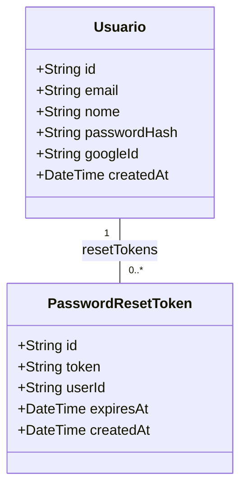

# Habilitar Recuperação de Senha e Envio SMTP para Contas Google

## Requirements
- Permitir que usuários que criaram conta via Google OAuth (que possuem `passwordHash` como `null` no banco de dados) utilizem o fluxo de "esqueci minha senha" para definir uma senha local convencional.
- Enviar de fato um e-mail de redefinição de senha real contendo o link com token utilizando conexões seguras SMTP.

## Entities

## Approach
1. **Remoção da restrição de senha pré-existente**:
   - Ajustar o fluxo no serviço de autenticação para pular a checagem de senha cadastrada na geração do token.
   - Retornar silenciosamente em caso de e-mail não cadastrado para prevenir a enumeração de contas.
2. **Integração Real de Envio de E-mail**:
   - Desenvolver um serviço específico para envio de e-mails via Nodemailer utilizando credenciais SMTP Zoho armazenadas no arquivo de configurações de ambiente.
   - O e-mail de recuperação deve ter cabeçalho adequado, assunto claro e um link para o frontend apontando para a rota de redefinição de senha contendo o token como parâmetro.

## Structure
### Dependencies
1. O controlador de autenticação depende do serviço de autenticação.
2. O serviço de autenticação depende do serviço Prisma (para persistência) e do serviço de e-mail (para disparos de SMTP).
3. O serviço de e-mail depende do pacote `nodemailer` para configurar o transporte.

### Layered Architecture
1. **Controller Layer**: O controlador de autenticação intercepta as chamadas nas rotas de recuperação e redefinição.
2. **Service Layer**: O serviço de autenticação realiza a coordenação do fluxo de negócios (pesquisa do usuário, geração do token, gravação e disparo do e-mail). O serviço de e-mail encapsula a criação do transporte de e-mails e a formatação do template HTML.
3. **Repository Layer**: O Prisma atua na leitura e gravação dos dados dos usuários e dos tokens de redefinição.

## Operations

### Instalar Dependências no Backend
1. Executar a instalação das dependências `nodemailer` e de suas tipagens `@types/nodemailer` de desenvolvimento no projeto do backend.

### Create Service - `EmailService` (`backend/src/shared/email.service.ts`)
1. Classe deve ser anotada como um serviço injetável do NestJS.
2. No construtor do serviço, instanciar o transporte do Nodemailer usando as variáveis de ambiente: host SMTP, porta SMTP, flag de conexão segura e credenciais de login.
3. Implementar o método assíncrono `enviarEmailRecuperacao` recebendo como argumentos: e-mail de destino, nome do usuário e o token gerado.
4. Dentro do método, determinar o link de redefinição combinando a URL do frontend vinda das variáveis de ambiente e o token no parâmetro da query string.
5. Definir a estrutura do e-mail em formato HTML contendo uma mensagem personalizada e um botão para redefinição.
6. Enviar a mensagem usando o transporte instanciado e logar em caso de sucesso. Se houver falha, logar a pilha de erro e relançar a exceção.

### Update Module - `AppModule` (`backend/src/app.module.ts`)
1. Registrar o novo `EmailService` na lista de provedores do módulo para que ele possa ser injetado em outros componentes do sistema.

### Update Service - `AuthService` (`backend/src/auth/auth.service.ts`)
1. Injetar o `EmailService` no construtor da classe.
2. Localizar o método `forgotPassword` que recebe o e-mail do usuário.
3. Modificar a lógica do método para remover a restrição que cancela o fluxo caso o usuário não tenha um hash de senha cadastrado. Apenas retornar sem fazer nada (silenciosamente) se o usuário não for encontrado no banco de dados.
4. Após salvar com sucesso o token gerado no banco de dados, substituir o log de simulação de e-mail pela chamada assíncrona ao método `enviarEmailRecuperacao` do `EmailService`, passando o e-mail, o nome do usuário e o token correspondente.

### Update Test - `AuthFlow Integration` (`backend/src/auth/auth.flow.spec.ts`)
1. Adicionar o `EmailService` na lista de provedores mockados do ambiente de testes unitários do Jest, contendo a simulação assíncrona da função `enviarEmailRecuperacao`.
2. Injetar o mock do `EmailService` no construtor do mock do `AuthService`.
3. Ajustar o teste de retorno silencioso do método `forgotPassword` para verificar apenas o caso de usuário inexistente no banco.
4. Adicionar um teste de integração garantindo que, para um usuário ativo sem hash de senha (usuário Google), o token de redefinição seja criado e a função `enviarEmailRecuperacao` do serviço de e-mail seja invocada com os parâmetros corretos.

## Norms
1. **Design de Serviços**: Manter o desacoplamento criando um serviço de e-mail separado de utilitários gerais.
2. **Segurança de Credentials**: Jamais expor credenciais em código ou logs. Carregar configurações sempre a partir de variáveis de ambiente.
3. **Mocks Rígidos**: Mocks de serviços externos como SMTP devem ser implementados em todos os testes unitários para evitar disparos acidentais ou chamadas de rede externas.

## Safeguards
1. **Tratamento de Exceções**: Em caso de falha física de disparo no SMTP, capturar a exceção e relançar uma exceção de servidor (como erro interno de servidor) com uma mensagem descritiva para que a API retorne um erro apropriado ao cliente.
2. **Enumeração de Contas**: Preservar o retorno de sucesso silencioso no endpoint de recuperação para usuários que não existem no banco de dados.
3. **Conexões Seguras**: Se a porta SMTP informada for a 465, a flag de conexão segura do transporte deve ser configurada como verdadeira para garantir TLS adequado.
