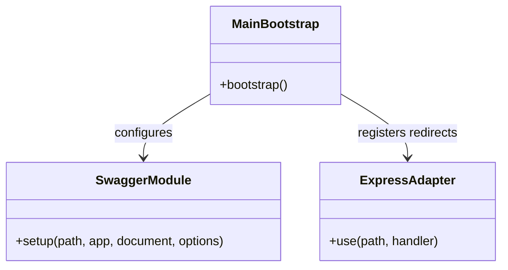

# Fix Swagger UI 404 Errors on Vercel

## Requirements
Resolve the 404 (Not Found) errors for Swagger UI static assets (JS, CSS, favicons) when the NestJS application is deployed to Vercel Serverless Functions, ensuring the API documentation is fully accessible and styled correctly in the production environment.

## Entities

## Approach
1. Technical Implementation:
   - **Middleware Redirection**: Vercel Serverless Functions do not natively serve static assets from `node_modules` where `@nestjs/swagger` expects them. While `customJs` and `customCssUrl` are configured, the default HTML template still attempts to fetch local assets, resulting in 404s. 
   - **Solution**: Intercept the static asset requests directly in the Express application within `main.ts` and redirect them (HTTP 302) to a reliable CDN (like cdnjs) before Swagger's default static file server attempts to handle them.
   - **Key Design Decisions**: Redirection via middleware is chosen over modifying the build process to copy static files, as it requires no changes to the deployment pipeline and guarantees the hardcoded default script tags will resolve successfully via the CDN.

2. Integration Pattern:
   - Register the redirection middleware using `app.use()` or the underlying Express HTTP adapter before calling `SwaggerModule.setup()`.

## Structure

### Dependencies
1. `main.ts` configures `SwaggerModule`
2. `main.ts` accesses the underlying `Express` instance to add route handlers for static assets

### Layered Architecture
1. Application Bootstrap Layer (`main.ts`): Responsible for configuring global middleware, CORS, and the Swagger documentation UI.

## Operations

### Update Configuration - main.ts
1. Responsibility: Intercept Swagger UI static asset requests and redirect them to a CDN.
2. Methods:
   - `bootstrap()`: void
     - Logic:
       - Before `SwaggerModule.setup(...)`, define a constant for the CDN base URL (e.g., `https://cdnjs.cloudflare.com/ajax/libs/swagger-ui/4.15.5`).
       - Add Express middleware to intercept specific asset routes.
       - Use `app.getHttpAdapter().get('/api-docs/swagger-ui-bundle.js', (req, res) => res.redirect(...))` to redirect to the CDN version.
       - Repeat the redirection for:
         - `/api-docs/swagger-ui-standalone-preset.js`
         - `/api-docs/swagger-ui.css`
         - `/api-docs/favicon-32x32.png` (redirect to a valid favicon or a CDN equivalent)
         - `/api-docs/favicon-16x16.png`
       - Ensure the `customCssUrl` and `customJs` in `SwaggerModule.setup` remain, as they help with proper initialization.

## Norms
1. Dependency Injection: Use the NestJS `INestApplication` instance (`app`) to access the HTTP adapter cleanly (`app.getHttpAdapter().get(...)`).
2. Best Practices: Hardcode the CDN version to match the expected Swagger UI version used by the current `@nestjs/swagger` package (v4.15.5) to avoid version mismatch glitches.

## Safeguards
1. Functional Constraints: The API Documentation must render fully without any 404 console errors in production.
2. Integration Constraints: The redirection must only affect the specific `/api-docs/...` static assets and must not interfere with the `/api-docs` JSON endpoint or other application routes.
3. Security Constraints: Ensure that CORS configurations remain unaffected and the API documentation is securely accessible as intended.
4. Technical Constraints: Do not modify `vercel.json` or build scripts to copy `node_modules` assets, maintaining a zero-config deployment approach.
