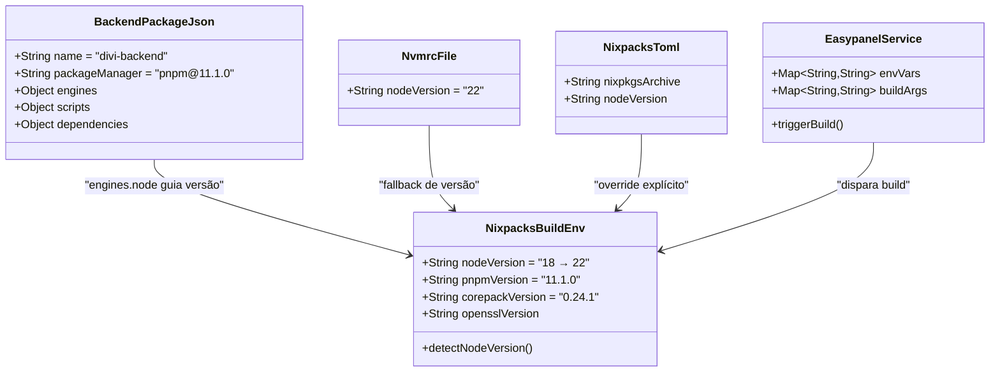

# Fix Deploy Nixpacks: Incompatibilidade Node.js 18 / pnpm 11

## Requirements

Corrigir a falha de build do backend NestJS no pipeline Easypanel/Nixpacks causada pela incompatibilidade entre Node.js 18 (provisionado pelo Nixpacks) e pnpm 11.1.0 (declarado em `packageManager`), que é pure ESM e exige Node.js >= 22. O deploy deve completar com sucesso sem intervenção manual, mantendo compatibilidade com o ambiente de desenvolvimento local.

## Entities



## Approach

1. **Configuração Declarativa de Versão Node**:
   - Adicionar campo `engines.node` no `backend/package.json` com `">=22.0.0"` para que o Nixpacks provisione Node.js 22 LTS automaticamente
   - Criar `backend/.nvmrc` com `22` como mecanismo de fallback e para alinhar dev local
   - Essa abordagem é code-as-config: a versão fica versionada no repo, não depende de config externa no Easypanel

2. **Estratégia de Camadas de Fallback**:
   - Camada 1: `engines` no `package.json` (padrão npm/Nixpacks)
   - Camada 2: `.nvmrc` (padrão nvm/Nixpacks)
   - Camada 3: Variável de ambiente `NIXPACKS_NODE_VERSION` no Easypanel (último recurso, fora do repo)
   - Se camada 1 não funcionar (Nixpacks não interpretar range), tentar valor exato `"22"` antes de escalar para camadas superiores

3. **Compatibilidade de Corepack**:
   - Manter corepack@0.24.1 inicialmente — testar se resolve com Node 22
   - Se persistir erro de assinatura ou download do pnpm 11, escalar para corepack@latest
   - O Nixpacks já executa `npm install -g corepack@0.24.1 && corepack enable` no Dockerfile gerado

4. **Sem Alteração de Dependências**:
   - NestJS 10, Prisma 5, bcryptjs, google-auth-library — todos compatíveis com Node 22
   - O `pnpm-lock.yaml` do backend permanece inalterado
   - O `postinstall` (`prisma generate`) funciona sem acesso ao DB

## Structure

### Arquivos Modificados
1. `backend/package.json` — adicionar campo `engines`
2. `backend/.nvmrc` — criar novo arquivo (fallback)

### Dependências do Build Pipeline
1. Easypanel dispara build Nixpacks apontando para `backend/`
2. Nixpacks lê `backend/package.json` → detecta `engines.node >= 22` → provisiona `nodejs_22`
3. Nixpacks instala `corepack@0.24.1` → `corepack enable`
4. Corepack lê `packageManager: pnpm@11.1.0` → baixa pnpm 11.1.0
5. pnpm 11.1.0 roda sobre Node.js 22 → `pnpm i --frozen-lockfile` sucede
6. `postinstall: prisma generate` gera o Prisma Client
7. `nest build` compila TypeScript para `dist/`
8. Container inicia com `pnpm run start` → `node dist/src/main`

### Fluxo de Verificação
1. Build local: `pnpm --filter divi-backend run build` (já funciona, Node >= 22 local)
2. Build Easypanel: Push para origin/master → Easypanel auto-deploys → verificar logs
3. Validação funcional: POST `/api/auth/google` com credential Google válido

## Operations

### Modificar backend/package.json — Adicionar engines
1. Responsabilidade: Declarar versão mínima de Node.js para o Nixpacks provisionar corretamente
2. Alteração:
   - Adicionar campo `"engines"` após o campo `"packageManager"`
   - Valor: `{ "node": ">=22.0.0" }`
3. Localização: `backend/package.json`, após linha 5 (`"packageManager": "pnpm@11.1.0"`)
4. Conteúdo exato a inserir:
   ```json
   "engines": {
     "node": ">=22.0.0"
   },
   ```
5. Constraints:
   - NÃO alterar nenhuma outra linha do arquivo
   - NÃO modificar o campo `packageManager`
   - NÃO adicionar `engines` no root `package.json` (já tem `>=24.0.0`, irrelevante para backend deploy)

### Criar backend/.nvmrc — Fallback de versão Node
1. Responsabilidade: Mecanismo de fallback para ferramentas que não leem `engines` (nvm, Nixpacks fallback)
2. Conteúdo do arquivo:
   ```
   22
   ```
3. Localização: `backend/.nvmrc` (novo arquivo)
4. Constraints:
   - Arquivo deve conter apenas o número da versão major, sem `v` prefix
   - Sem trailing newline além da última linha

### Verificar Build — Teste local de compilação
1. Responsabilidade: Confirmar que o backend compila sem erros com Node >= 22
2. Comando: `pnpm --filter divi-backend run build`
3. Critério de sucesso: Exit code 0, sem erros de TypeScript ou Prisma
4. Se falhar:
   - Verificar se `prisma generate` completou (presença de `node_modules/.prisma/client`)
   - Verificar erros de tipo com `tsc --noEmit` no diretório backend

### Verificar Deploy — Push e monitoramento Easypanel
1. Responsabilidade: Confirmar que o Nixpacks agora provisiona Node 22+ e o build Docker completa
2. Passos:
   - Commit e push para `origin/master`
   - Monitorar logs do Easypanel/Nixpacks
   - Verificar que o step `setup` mostra `nodejs_22` em vez de `nodejs_18`
   - Verificar que `pnpm i --frozen-lockfile` completa sem erro
   - Verificar que `nest build` completa sem erro
   - Verificar que o container inicia e responde em `/api`
3. Se Nixpacks ignorar `engines` e continuar com Node 18:
   - Fallback 1: Mudar `engines.node` para valor exato `"22"` (sem range)
   - Fallback 2: Configurar `NIXPACKS_NODE_VERSION=22` como env var no Easypanel
   - Fallback 3: Criar `backend/nixpacks.toml` com `[phases.setup]` e `nixPkgs = ["nodejs_22"]`

## Norms

1. **Versionamento de Runtime**:
   - Sempre declarar `engines.node` no `package.json` de cada package deployável independentemente
   - Manter `.nvmrc` como fallback para tooling que não lê `engines`
   - A versão no `engines` deve ser um range mínimo (`>=22.0.0`), não versão exata, para flexibilidade do Nixpacks

2. **Compatibilidade pnpm/Node**:
   - pnpm 9.x: Node >= 16
   - pnpm 10.x: Node >= 18
   - pnpm 11.x: Node >= 22 (pure ESM)
   - Sempre verificar compatibilidade ao atualizar `packageManager`

3. **Pipeline Nixpacks**:
   - Preferir configuração declarativa no código (`engines`, `.nvmrc`) sobre configuração no painel (env vars Easypanel)
   - Testar build localmente antes de push: `pnpm --filter divi-backend run build`
   - Se precisar de versão Node específica (patch), usar `nixpacks.toml` com `nixpkgsArchive`

4. **Secrets no Build**:
   - Variáveis sensíveis (JWT_SECRET, SMTP_PASS) devem ser injetadas em runtime, não build-time
   - O Nixpacks/Easypanel passa como `ARG` → `ENV`, o que expõe em layers Docker — aceitar como limitação conhecida do pipeline ou migrar para Dockerfile custom

5. **Documentação de Deploy**:
   - Documentar requisitos de runtime no README do backend
   - Manter consistência entre `engines`, `.nvmrc`, e versão real do Node no dev local

## Safeguards

1. **Funcional**: O backend deve compilar (`nest build`) e iniciar (`node dist/src/main`) sem erros com Node.js 22 LTS
2. **Compatibilidade**: Todas as dependências atuais (NestJS 10, Prisma 5, bcryptjs 3.x, google-auth-library 10.x, socket.io 4.x) devem funcionar sem alteração em Node 22
3. **Build Determinístico**: `pnpm i --frozen-lockfile` deve completar sem alterar o lockfile — garantir que `pnpm-lock.yaml` do backend está sincronizado
4. **Postinstall**: `prisma generate` deve completar sem acesso ao banco de dados (usa apenas `schema.prisma`)
5. **Sem Regressão**: Nenhuma dependência, script, ou configuração existente do `package.json` deve ser alterada — apenas adição do campo `engines`
6. **Runtime Start**: O container Docker deve iniciar via `pnpm run start` → `nest start` e responder em `/api` com HTTP 200
7. **Google OAuth**: O endpoint `/api/auth/google` deve funcionar pós-deploy com `GOOGLE_CLIENT_ID` configurado como env var
8. **Fallback Documentado**: Se `engines` não funcionar no Nixpacks, existem 3 caminhos de fallback documentados (valor exato, env var, nixpacks.toml) — nenhum requer mudança de dependências
9. **Segurança (warning conhecida)**: O warning `SecretsUsedInArgOrEnv` para `JWT_SECRET` é limitação aceita do pipeline Nixpacks — não é bloqueante para este fix
